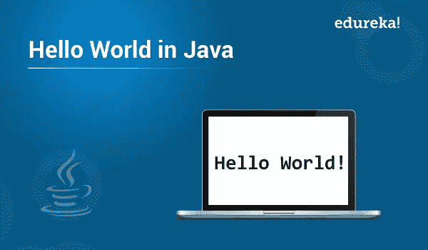

# Java 的 Hello World 程序

> 原文：<https://medium.com/edureka/hello-world-program-in-java-e59c47ab0827?source=collection_archive---------7----------------------->



任何 Java 程序员学习编写的第一个程序是 Java 的 Hello World 程序。但是很多时候我们错过了基本语法的本质。通过这篇文章，我将深入了解 Java 中 Hello World 程序的细节。

以下是本文涵盖的主题:

*   Java 的 Hello World 程序
*   语法分析
*   编译程序
*   执行程序

让我们开始吧。

# Java 的 Hello World 程序

在我们进入细节之前，让我们先从编码开始，看看一个基本的 basic Hello World 程序是如何编码的。

```
public class HelloWorldDemo {
    public static void main(String[] args) {
        System.out.println( "Hello World!" );
        System.exit( 0 ); //success
    }
}
```

既然您已经完成了编码，现在让我们深入分析程序的语法。

# 语法分析

**第 1 行:公共类 HelloWorldDemo {**

这一行使用关键字 class 来声明一个名为 HelloWorldDemo 的新类。因为 Java 是面向对象编程(OOP)语言，所以整个类定义，包括它的所有成员，都必须包含在左花括号{和右花括号}之间。此外，它使用 public 关键字来指定该类在包外部的可访问性。

**第 2 行:public static void main(String[]args){**

这一行声明了一个名为 main(String[])的方法。它被称为 **main** 方法，充当 Java 编译器开始执行程序的入口点。换句话说，每当在 Java 中执行任何程序时，main 方法都是第一个被调用的函数。然后从 main 方法调用应用程序中的其他函数。在标准的 Java 应用程序中，一个 main 方法是强制触发执行的。

现在让我们把这一整行分解开来，分析每个单词:

***public*** :指定可见性的访问修饰符。它允许 JVM 从任何地方执行该方法。

***static*** :这是一个帮助任何类成员成为静态的关键字。main 方法是静态的，因为不需要创建对象来调用 Java 中的静态方法。因此，JVM 可以调用它，而不必创建有助于节省内存的对象。

***void*** :表示方法的返回类型。因为 Java main 方法不返回任何值，所以它的返回类型被声明为 void。

***main()***:JVM 中已经配置好的方法的名称。

***String[]*** :表示 Java main 方法可以接受 [String array](https://www.edureka.co/blog/string-array-in-java/) 类型的单行实参。这也称为 java 命令行参数。下面我列出了一些有效的 java main 方法签名:

*   公共静态 void main(String[] args)
*   公共静态 void main(String []args)
*   公共静态 void main(String args[])
*   公共静态 void main(String… args)
*   静态公共 void main(String[] args)
*   公共静态最终 void main(String[] args)
*   最终公共静态 void main(String[] args)

**第 3 行:System.out.println( "Hello World！");**

***系统* :** 它是 java.lang 包中预定义的类，保存了各种有用的方法和变量。

***out*** *:* 是 PrintStream 类型的静态成员字段。

***println:*** 它是 PrintStream 类的一个方法，用于打印传递给标准控制台的参数和一个换行符。也可以用 print()方法代替 println()。

**第 4 行:system . exit(0)；**

java.lang. **系统**。 **exit** ()方法用于通过终止当前正在执行的 Java 虚拟机来退出当前程序。该方法将状态代码作为输入，它通常是非零值。它指示任何异常终止发生的情况。

*   *退出(0):* 用于表示成功终止。
*   *退出(1)或退出(-1)或任何非零值:*用于表示终止不成功。

这就是程序语法的全部内容。现在让我们看看如何在 Java 程序中编译 Hello World。

# 编译程序

现在你需要做的是在你的文本编辑器中输入这个程序，用你在程序中用过的类名保存它。在我的情况下，我会将其保存为 HelloWorldDemo.java。

下一步是，转到控制台窗口，导航到保存程序的目录。

现在为了编译程序，请键入下面的命令:

1

`javac HelloWorldDemo.java`

注意:Java 是区分大小写的，因此要确保以正确的格式输入文件名。

如果成功执行，该命令将生成一个 HelloWorldDemo.class 文件，该文件将独立于机器并具有可移植性。

现在您已经成功编译了程序，让我们尝试用 Java 执行 Hello World 程序并获得输出。

# 执行程序

为了在命令行上执行您的 hello world Java 程序，您只需键入以下代码:

`java HelloWorldDemo`

瞧啊。你已经成功地执行了你的第一个 Java 程序。

如果您使用的是 IDE，您可以跳过所有这些麻烦，只需按下 IDE 中的 execute 按钮，用 Java 程序编译并执行您的 Hello World。

如果你想查看更多关于人工智能、Python、道德黑客等市场最热门技术的文章，你可以参考 Edureka 的官方网站。

请留意本系列中解释 Java 其他各方面的其他文章。

> *1。* [*面向对象编程*](/edureka/object-oriented-programming-b29cfd50eca0)
> 
> *2。*[*Java 中的继承*](/edureka/inheritance-in-java-f638d3ed559e)
> 
> *3。*[*Java 中的多态性*](/edureka/polymorphism-in-java-9559e3641b9b)
> 
> *4。*[*Java 中的抽象*](/edureka/java-abstraction-d2d790c09037)
> 
> *5。* [*Java 字符串*](/edureka/java-string-68e5d0ca331f)
> 
> *6。* [*Java 数组*](/edureka/java-array-tutorial-50299ef85e5)
> 
> *7。* [*Java 收藏*](/edureka/java-collections-6d50b013aef8)
> 
> *8。* [*Java 线程*](/edureka/java-thread-bfb08e4eb691)
> 
> *9。*[*Java servlet 简介*](/edureka/java-servlets-62f583d69c7e)
> 
> *10。* [*Servlet 和 JSP 教程*](/edureka/servlet-and-jsp-tutorial-ef2e2ab9ee2a)
> 
> *11。*[*Java 中的异常处理*](/edureka/java-exception-handling-7bd07435508c)
> 
> *12。* [*Java 教程*](/edureka/java-tutorial-bbdd28a2acd7)
> 
> *13。* [*Java 面试题*](/edureka/java-interview-questions-1d59b9c53973)
> 
> *14。* [*Java 程序*](/edureka/java-programs-1e3220df2e76)
> 
> *15。*[*kot Lin vs Java*](/edureka/kotlin-vs-java-4f8653f38c04)
> 
> *16。* [*依赖注入使用 Spring Boot*](/edureka/what-is-dependency-injection-5006b53af782)
> 
> *17。* [*堪比 Java 中的*](/edureka/comparable-in-java-e9cfa7be7ff7)
> 
> 18。 [*十大 Java 框架*](/edureka/java-frameworks-5d52f3211f39)
> 
> 19。 [*Java 反射 API*](/edureka/java-reflection-api-d38f3f5513fc)
> 
> *二十。*[*Java 中的 30 大模式*](/edureka/pattern-programs-in-java-f33186c711c8)
> 
> *21。* [*核心 Java 秘籍*](/edureka/java-cheat-sheet-3ad4d174012c)
> 
> 22。[*Java 中的套接字编程*](/edureka/socket-programming-in-java-f09b82facd0)
> 
> *23。* [*Java OOP 备忘单*](/edureka/java-oop-cheat-sheet-9c6ebb5e1175)
> 
> *二十四。*[*Java 中的注释*](/edureka/annotations-in-java-9847d531d2bb)
> 
> *25。*[*Java 中的库管理系统项目*](/edureka/library-management-system-project-in-java-b003acba7f17)
> 
> *26。*[*Java 中的树*](/edureka/java-binary-tree-caede8dfada5)
> 
> *27。*[*Java 中的机器学习*](/edureka/machine-learning-in-java-db872998f368)
> 
> *28。* [*顶级数据结构&Java 中的算法*](/edureka/data-structures-algorithms-in-java-d27e915db1c5)
> 
> *29。* [*Java 开发者技能*](/edureka/java-developer-skills-83983e3d3b92)
> 
> *三十。* [*前 55 名 Servlet 面试问题*](/edureka/servlet-interview-questions-266b8fbb4b2d)
> 
> *31。*[](/edureka/java-exception-handling-7bd07435508c)*[*顶级 Java 项目*](/edureka/java-projects-db51097281e3)*
> 
> **32。* [*Java 字符串备忘单*](/edureka/java-string-cheat-sheet-9a91a6b46540)*
> 
> **33。*[*Java 中的嵌套类*](/edureka/nested-classes-java-f1987805e7e3)*
> 
> **34。* [*Java 集合面试问答*](/edureka/java-collections-interview-questions-162c5d7ef078)*
> 
> **35。*[*Java 中如何处理死锁？*](/edureka/deadlock-in-java-5d1e4f0338d5)*
> 
> *36。 [*你需要知道的 Java 收藏 50 强面试问题*](/edureka/java-collections-interview-questions-6d20f552773e)*
> 
> *37。[*Java 中的字符串池是什么概念？*](/edureka/java-string-pool-5b5b3b327bdf)*
> 
> **38。*[*C、C++和 Java 有什么区别？*](/edureka/difference-between-c-cpp-and-java-625c4e91fb95)*
> 
> **39。*[*Java 中的回文——如何检查一个数字或字符串？*](/edureka/palindrome-in-java-5d116eb8755a)*
> 
> *40。 [*你需要知道的顶级 MVC 面试问答*](/edureka/mvc-interview-questions-cd568f6d7c2e)*
> 
> **41。*[*Java 编程语言十大应用*](/edureka/applications-of-java-11e64f9588b0)*
> 
> *42。[*Java 中的死锁*](/edureka/deadlock-in-java-5d1e4f0338d5)*
> 
> **43。*[*Java 中的平方和平方根*](/edureka/java-sqrt-method-59354a700571)*
> 
> **44。*[*Java 中的类型转换*](/edureka/type-casting-in-java-ac4cd7e0bbe1)*
> 
> **45。*[*Java 中的运算符及其类型*](/edureka/operators-in-java-fd05a7445c0a)*
> 
> **46。*[*Java 中的析构函数*](/edureka/destructor-in-java-21cc46ed48fc)*
> 
> **47。*[*Java 中的二分搜索法*](/edureka/binary-search-in-java-cf40e927a8d3)*
> 
> **48。*[*Java 中的 MVC 架构*](/edureka/mvc-architecture-in-java-a85952ae2684)*
> 
> **49。* [*冬眠面试问答*](/edureka/hibernate-interview-questions-78b45ec5cce8)*

**原载于 2019 年 8 月 7 日*[*https://www.edureka.co*](https://www.edureka.co/blog/hello-world-program-in-java/)*。**