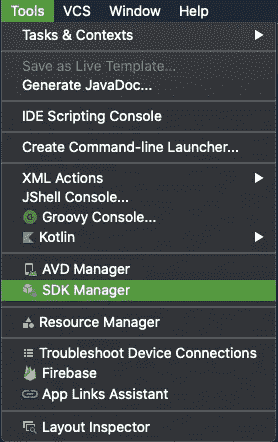
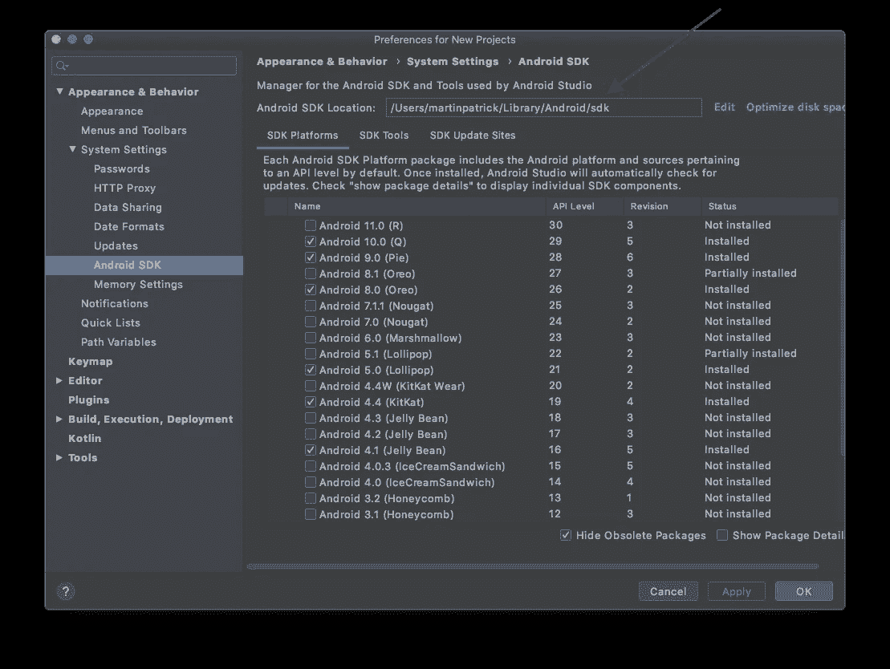
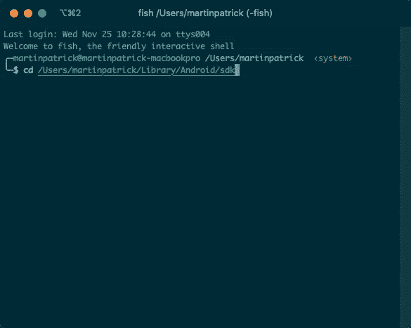
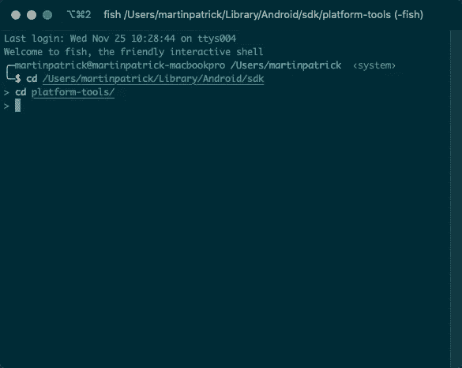
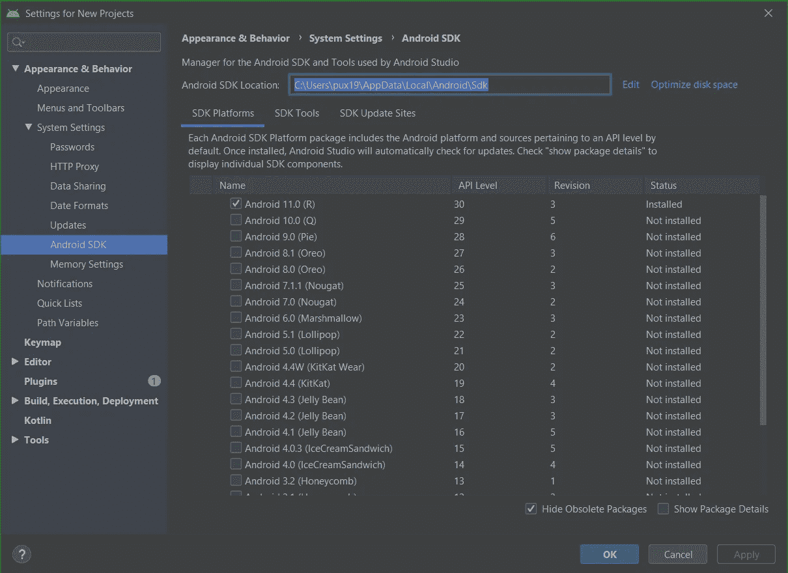
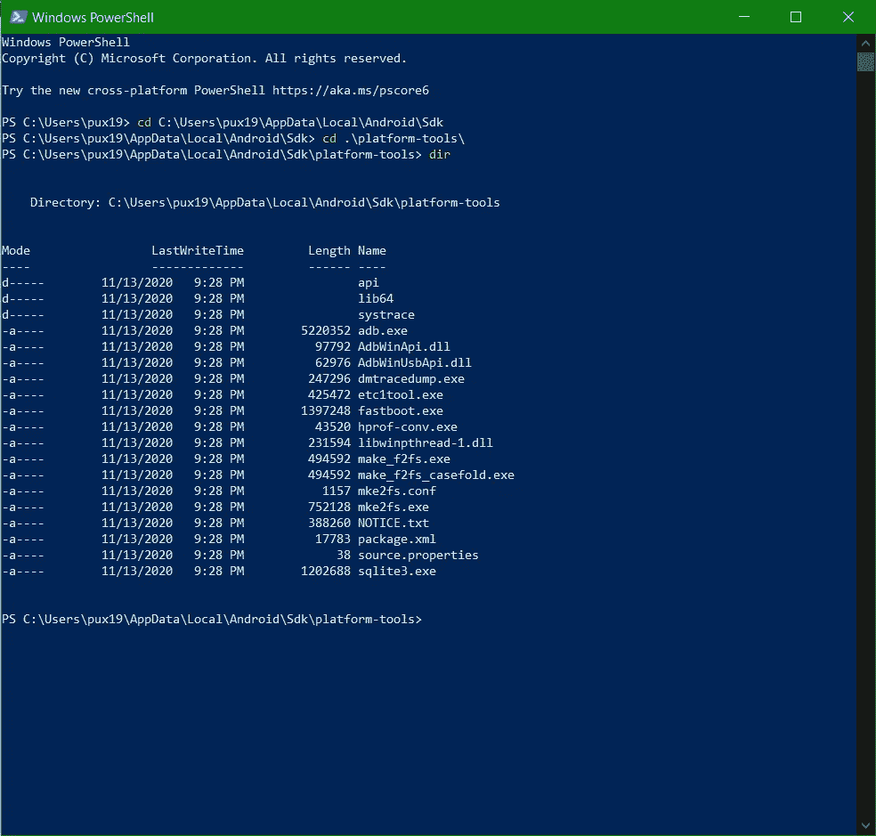
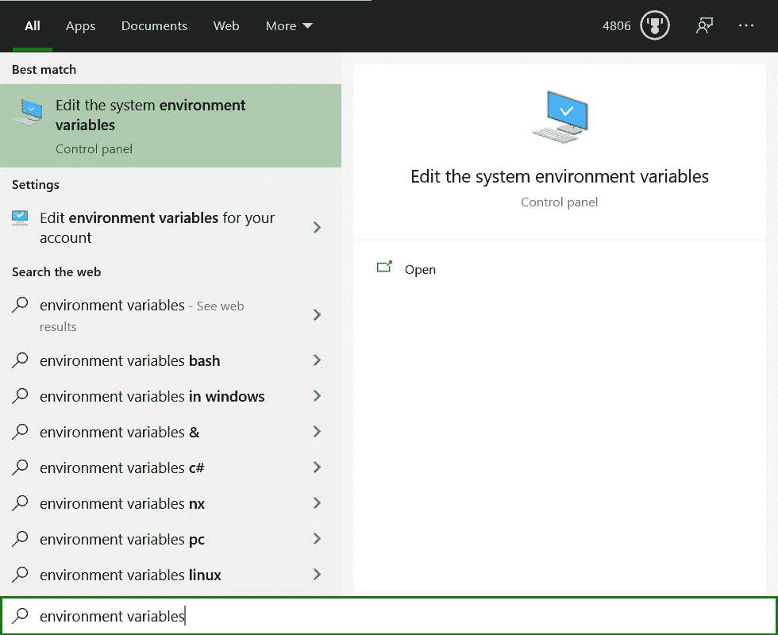
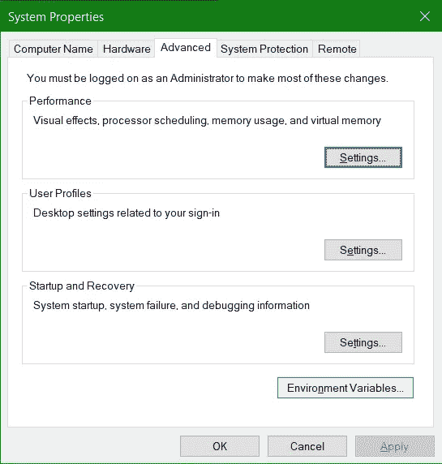
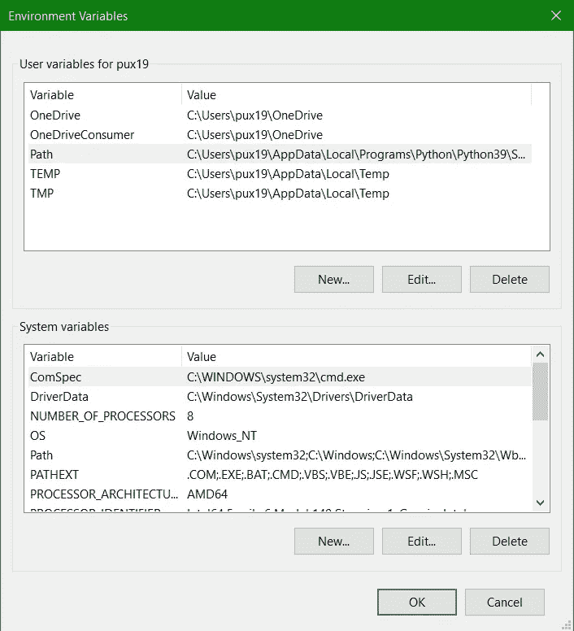
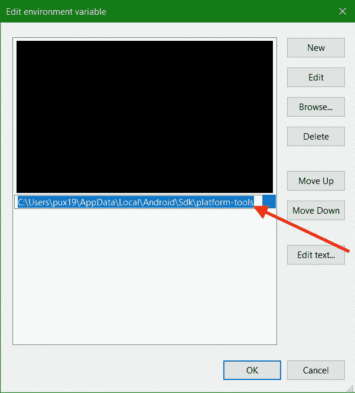

# 救命，找不到亚行！

> 原文：<https://medium.com/androiddevelopers/help-adb-is-not-found-93e9ed8a67ee?source=collection_archive---------0----------------------->


所以你已经下载了 [Android Studio](https://developer.android.com/studio/) 并安装了 SDK。最终你可能会遇到一个教程，告诉你键入`adb`，也许是在 Firebase 中启用[调试模式。事情就是这样发生的:](https://firebase.google.com/docs/analytics/debugview#android)

```
command not found: adb
```

或者:

```
adb : The term 'adb' is not recognized as the name of a cmdlet, function, script file, or operable program.
```

如果你的第一反应是搜索“如何安装 adb”，你很可能会得到一些关于通过操作系统的软件包管理器安装 ADB 或从手机定制网站下载随机 zip 文件的说明。但这不是必要的！`adb`附带由 Android Studio 安装的 Android SDK，通过几个手动步骤，您可以确保始终使用与您的 IDE 相同的最新工具！

# 亚行是怎么回事？

`adb`代表“Android 调试桥”，这是一个命令行实用程序，是 Android 的调试多工具。通常，当你在`platform-tools`下安装 Android SDK 时，它是通过 Android Studio 安装的，但这需要你的操作系统进行一些设置才能知道在那里查看。

首先打开 Android Studio，从菜单中导航到“工具> SDK 管理器”。



Tools > SDK Manager in Android Studio

在窗口的顶部，您可以看到 IDE 安装 Android SDK 的路径。



现在打开你的终端，输入`cd`，粘贴到这个路径。这可以在 Windows、MacOS 和 Linux 上运行，但是在 Windows 上，您可能需要按`shift+insert`才能粘贴到终端:



下一种类型`cd platform-tools`:



然后输入`ls`(或者在 Windows 上输入`dir`)。根据您的操作系统，您应该会看到`adb`或`adb.exe`。从这里您可以键入`./adb`并看到一些程序输出。

你现在可以运行`adb`，但是我从来没有发现一个教程是以“将你的 SDK 路径，cd 复制到 platform-tools 中，并在`adb`前输入`./`开始的。”为了获得许多 Android 开发者喜欢的体验，你必须更新你的`PATH`环境变量。这在每个操作系统上会有所不同，我将在下面列出 MacOS 和 Windows。在 Linux 上，这些步骤可能会有所不同，但是 MacOS 指令在某些情况下会起作用。

## MacOS 配置

MacOS(和 Linux)用户通常将使用`zsh`或`bash`作为他们的 shell。要临时将`platform-tools`目录添加到您的`PATH`中，请键入:

```
PATH="<path from the SDK manager>/platform-tools:$PATH"
```

所以在我上面的例子中，这变成了:

```
PATH="/Users/martinpatrick/Library/Android/sdk/platform-tools:$PATH"
```

现在，无论何时你在这个终端窗口输入`adb`，你都可以执行`adb`命令。但是你怎么让它粘在一起呢？

由于 Android Studio 倾向于在您的用户目录中安装 Android SDK，您将需要为您的用户编辑`PATH`。由于它是一个命令行实用程序，您只需要为您的终端更新它(相对于 Mac GUI 应用程序)。为此，您需要编辑主目录中的`.profile`文件(如果该文件不存在，`.bash_rc`将获得类似的结果)。默认情况下，此文件将被隐藏，因此您可能看不到它。在您喜欢的文本编辑器中打开此文件:

```
nano ~/.profile
```

把这个加到底部:

```
export ANDROID_SDK_ROOT="<your Android SDK path>"export PATH="$ANDROID_SDK_ROOT/platform-tools:$PATH"
```

在我的机器上变成了:

```
export ANDROID_SDK_ROOT="/Users/martinpatrick/Library/Android/sdk"export PATH="$ANDROID_SDK_ROOT/platform-tools:$PATH"
```

为`ANDROID_SDK_ROOT`添加额外的定义是不必要的，但它可能对一些更复杂的高级用户工具也有帮助，比如 Cocos 2D 命令行实用程序。

这样，打开一个新的终端窗口并输入`adb`。如果你做的一切都正确，你会得到一个帮助页面，列出`adb`的用法。

## Windows 配置

Windows 略有不同，我将完全在 Power Shell 中工作。和以前一样，我可以使用 SDK 管理器找到我的安装位置:



我可以更改目录来找到我的平台工具:



现在，要更新 PowerShell 中的路径，您应该键入:

```
$env:PATH += ";<your Android SDK directory>\platform-tools"
```

所以在我的案例中:

```
$env:PATH += ";C:\Users\pux19\AppData\Local\Android\Sdk\platform-tools"
```

为了在多个终端窗口中保持这个`PATH`变量(如果您愿意，也可以在普通的`cmd.exe`提示符中)，我们可以在 GUI 实用程序中为用户设置这个变量。

更改此设置的最简单方法是单击 Windows 菜单，搜索“编辑系统环境变量”(我通常搜索“环境变量”):



然后点击“环境变量”



双击“用户变量”部分中的“路径”



然后点击一个新的单元格并粘贴到您的`platform-tools`目录的路径中:



在我的情况下，这是`C:\Users\pux19\AppData\Local\Android\Sdk\platform-tools`

一旦你在所有打开的窗口上点击“确定”,当你键入`adb`时，新的终端窗口将会响应。微软通常建议注销并再次登录来保存这些信息，但这并不是绝对必要的，除非您需要在 GUI 应用程序中使用它。

# 包裹

有了它，你可以从命令行自由地管理和调试你的手机、平板电脑，甚至机顶盒。另请注意，一些工具通常会附带自己的 SDK 安装。同样的步骤，加上一些小的修改，可以让任何 Android SDK 成为你的“默认”。只要记住在你的`PATH`中一次只有一个，如果你决定卸载开发工具——甚至是 Android Studio，你将不得不手动更新这个路径。