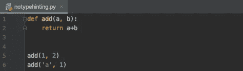
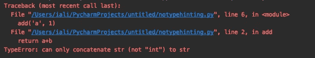
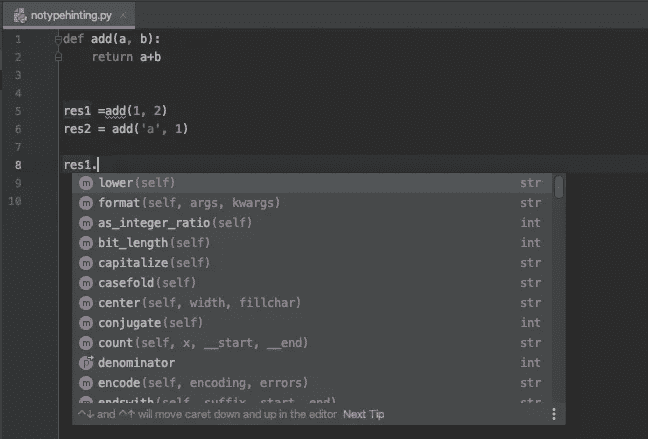
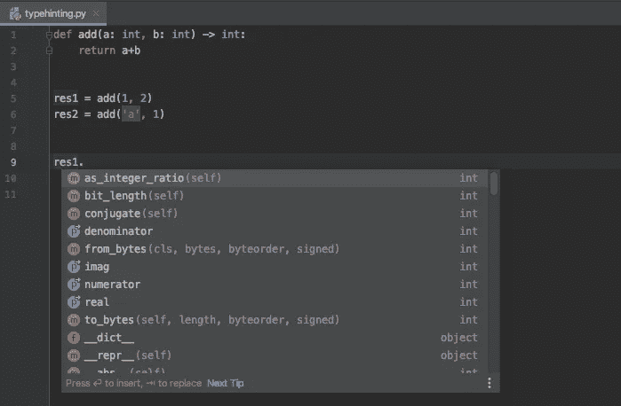

# 通过类型提示您的代码，帮助您的 IDE 帮助您的 python 项目减少错误，提高可读性

> 原文：<https://medium.com/quick-code/help-your-ide-to-in-turn-help-your-python-project-be-less-buggy-and-more-readable-by-type-hinting-3c65d377d053?source=collection_archive---------0----------------------->

## 充分利用 IDE 的智能感知和静态分析

Photo by [Sean Lim](https://unsplash.com/@seanlimm) on [Unsplash](https://unsplash.com/s/photos/traffic-light?utm_source=unsplash&utm_medium=referral&utm_content=creditCopyText)

虽然 Python 是一门伟大的日常语言，它在每个领域都有一席之地，无论是金融、数据科学、Web 开发还是 it 基础设施；它在大规模项目中的使用通常是有限的，给出的众所周知的原因是它的动态类型特性，这会使代码不可读，并且很难判断在任何给定的地方发生了什么

因为在大型项目中，读代码比写代码更频繁。

> “的确，花在阅读和写作上的时间比远远超过 10 比 1。作为编写新代码工作的一部分，我们不断地阅读旧代码。…[因此，]让它易于阅读会让它更易于书写。”
> 
> ― **罗伯特·c·马丁，** [**干净代码:敏捷软件工艺手册**](https://www.goodreads.com/work/quotes/3779106)

这在不同的方面造成了问题。首先，需要大量的文档，并且需要维护这些文档，以便其他开发人员能够阅读和理解您的代码(没有一个开发人员喜欢这样)。第二，集成开发环境在发现类型问题方面没有太大的帮助，很多 bug 会在运行时被发现。最后，因为在开发过程中没有发现这些错误的能力，所以需要大量的测试代码，这也是大多数开发人员不喜欢的。

因此，在本文中，我将通过一个例子来展示代码中的简单类型注释如何极大地增加您使用 ide 的体验，并通过比较添加类型注释之前和之后的代码，帮助您找到那些通常在 Python 运行时发现的错误。我将使用 Pycharm 作为我的 IDE。

## 没有类型提示

假设我们想写一个简单的加法函数，将两个整数相加

no type warning

我们在第 5 行中第一次使用 add 函数是像预期的那样将两个整数相加，但是当我们试图将一个整数加到字符串' a '时，第二次使用是不正确的。这给了我们以下运行时错误

runtime error

不幸的是，我们的重量级 IDE 在这种情况下无能为力，没有给我们任何警告。

智能感知也不是很有用

not so useful intellisense either

由于 IDE 不确定函数返回的类型，它建议我们对整数使用字符串方法，这太可怕了！

## 使用类型提示

现在让我们在代码中添加类型提示

type warning

在第 6 行第二次使用 add 函数时，我们可以立即看到 Pycharm 发出的警告，告诉我该函数需要一个整数，但却得到了一个字符串。现在，我不必运行代码来修复这个错误，并且可以在运行之前修复它。

让我们看看智能感知现在是如何工作的

a useful intellisense

它只展示了可以在整数上使用的方法，现在更加简洁明了。

## 最后的想法

不知道你有什么感觉，但我觉得我们不仅更早地发现了不正确的用法问题和更有用的 intellisense，而且代码也更加清晰可读。

开发人员将不会被迫如此勤奋地记录代码，并且不再需要编写大量不必要的测试来捕捉这样的错误，并且焦点可以转移到增加实际业务价值和发现有用错误的测试上

我用了一个非常简单的例子来说明类型提示在您的项目中是多么有用，但是在这个小项目中，它的强大之处可能不是那么明显，但是想象一下，您正在处理一个巨大的项目，其中有数百个 python 文件分散在不同的包中，并且使用各种复杂的数据结构和用户定义的对象。让 IDE 警告我们对象的不正确使用，并提供一个简洁明了的智能感知，可以极大地提高 python 在大型项目中的应用。

## 资源

> https://www . goodreads . com/quotes/835238-的确，阅读与写作所花时间的比率是
> 
> https://www.jetbrains.com/pycharm/
> 
> 【https://www.python.org/about/apps/ 