# 用草图帮助设计师坚持设计体系

> 原文：<https://medium.com/walmartglobaltech/helping-designers-adhere-to-a-design-system-with-sketch-a14db5215096?source=collection_archive---------1----------------------->

在位于本顿维尔的沃尔玛实验室，我们的内部设计团队为商场、配送中心和公司办公室的员工(沃尔玛对员工的称呼)创建应用程序。我们设计从可穿戴设备到桌面系统的一切产品，我们用户的环境从明亮的办公室到仓库。为了帮助我们的员工在多种数字工具之间快速移动，我们基于谷歌的材料设计创建了一个共享互动和视觉模式的系统。我们的设计系统是建立在 Sketch 上的，这篇文章分享了我们管理这种语言的经验。

Check out how we design for our employees in Google’s new *Centered* video series. Video credit: Google Design.

# 从哪里开始

如果你是一个需要创建和管理一个库来帮助其他人遵守设计系统的设计师，请继续阅读。我们发现以下内容有助于我们设计全美超过 100 万员工使用的数字工具

在企业环境中，设计一致性可能是一个挑战，尤其是在不同的受众和不同的使用环境中。正确地记忆和使用所有的规格可能是压倒性的和费时的。设计师，即使是经验丰富的设计师，也可能不得不不断参考设计规范。这在已经很紧张的设计周期中消耗了宝贵的时间。

> 答案？在设计师的设计工具中，将设计系统带给他们。

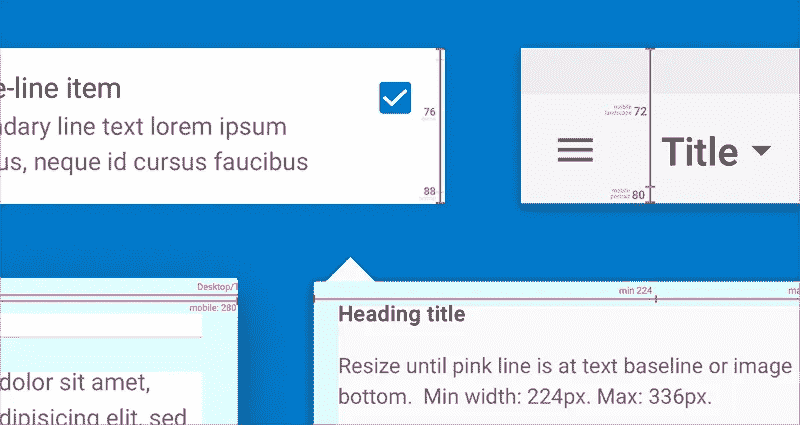

Image credit: Walmart.

我们的设计系统库——内部称为 Ignite——是在 Sketch 中构建的。我们选择了 Sketch，这样设计人员就不必担心是否符合设计系统，相反，他们可以专注于设计理想的体验。借助该工具，我们的设计人员可以更加准确、高效、一致地工作。它还使设计者能够从库中创建可重用的模式，在库更新时继承更新。

一些关键特性包括:

*   设计系统中每个组件的可配置符号
*   作为嵌套符号的准则，解决填充和字体处理问题
*   具有响应文本长度的其他元素的自适应文本
*   能够添加自定义颜色、字体和头像，而无需修改符号库

# 嵌套设计规格

**草图不是设计系统**。，但它是我们首选的工具之一。如果管理得当，Sketch 可以帮助设计师无缝地遵循规则和指导方针。我们将设计系统规格嵌套在每个符号中，带给设计师。设计师可以更多地关注流程，而不是记住规则。

Example of a horizontal guide and padding nested in a tab symbol. Image credit: Walmart.

## 垂直导轨

参考线可以显示垂直调整符号大小的位置。在下面的示例中，工具栏的高度在横向和纵向模式下会发生变化。这项技术对于将组件高度从正常布局调整到密集布局非常有用。

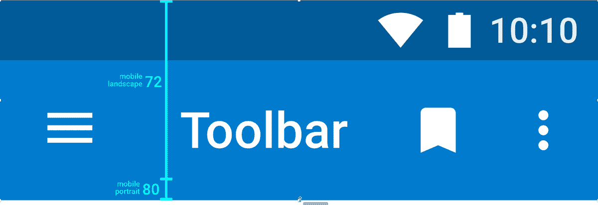

Example of a vertical guide in a toolbar symbol. Image credit: Walmart

## 文本基线指南

文本基线帮助设计者改变符号的高度以匹配文本高度。设计者改变符号高度，直到基线位于最后一行文本的基线，不需要测量。

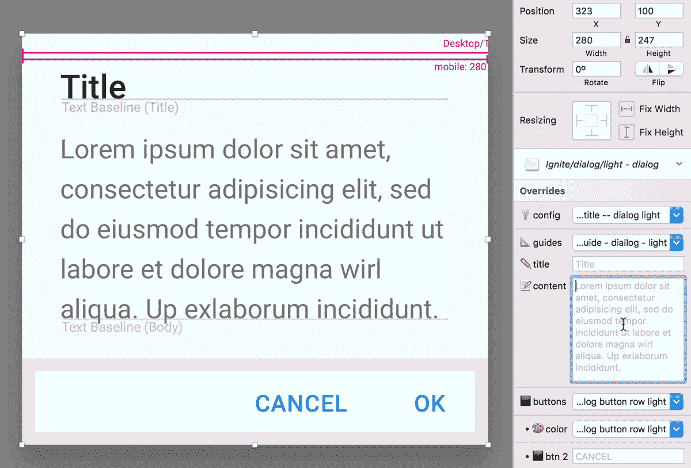

Text baseline guides are extensively used to help designers resize symbols to fit text. Image credit: Walmart.

# 适应性文本

我们的设计师将真实的文本和信息插入到他们的作品中，我们的文本和符号中的元素对相邻文本的长度做出响应。符号会随着文本长度的变化而移动，以保持填充。符号中设置了文本装饰和填充，使设计人员可以更专注于内容。

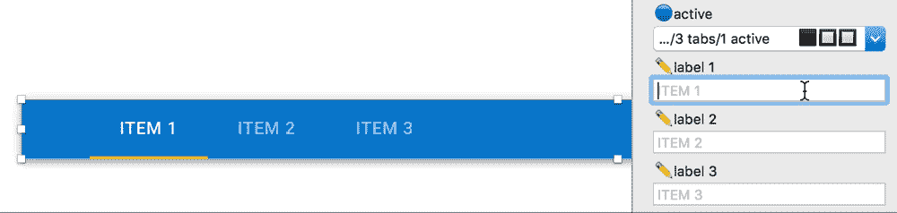

Tabs and active indicator respond to the text length. Image credit: Walmart.

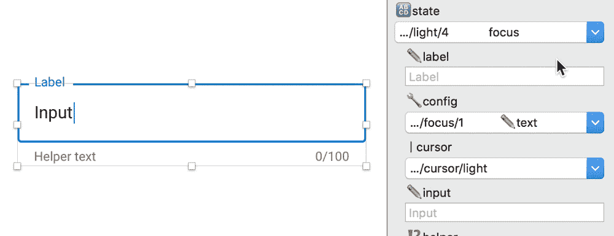

The text box border and cursor moves as the text length changes. Image credit: Walmart.

# 颜色作为一种符号

沃尔玛有多个部门和子公司，每个都有自己的颜色托盘。以前，将设计的所有颜色更新到公司的另一个领域是非常繁琐的。我们需要复制该文件，并且必须保留两份副本以备更新。

我们调色板中的每一种颜色都是一个符号，包括原色和次色，并且嵌套在任何需要颜色的地方。这大大减少了分离符号的需要，并提供了颜色灵活性。

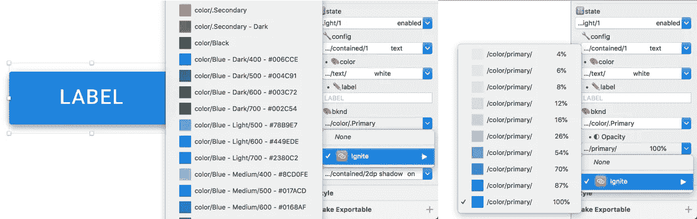

Designers can change a symbol’s color and opacity from the override menu. Image credit: Walmart.

## 即时更新所有符号的颜色

设计师可以通过更改库颜色选项来探索整个应用程序的颜色。颜色定制页面允许他们在更改主要、次要和可操作的文本颜色时实时查看结果，无需插件。使用符号颜色的符号会立即更新。可操作的文本颜色通过 Sketch 的文本样式来管理。这允许文本颜色更新，同时允许符号具有自适应文本。

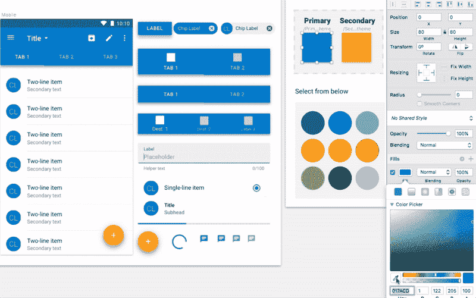

The library’s color theme is changed by modifying the primary and secondary color symbols. Image credit: Walmart .

更新也简化了。当设计人员打开使用该库的文件时，系统会提示他们更新该库。接受后，将应用新颜色。

这种技术还允许设计者创建、保存和应用自定义的颜色主题库到任何其他项目中。它还大大减少了在符号库中创建和维护的符号数量。

# 可配置符号

覆盖菜单允许将符号配置成设计系统中描述的任何状态或变化。设计师可以通过选择相关的图像、图标和颜色来进一步定制它们。

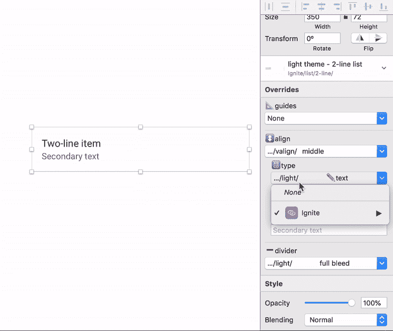

A 1-line list symbol is configured to show an avatar and selected checkbox. Image credit: Walmart.

我们通过在库中做一些额外的工作来减少不必要的覆盖菜单。例如，深色背景的符号只会显示白色版本的图标。

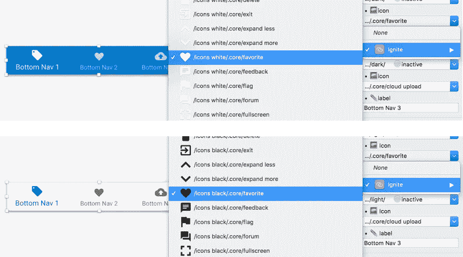

No need to select the icon color in some symbols. White-colored icons are provided for dark backgrounds, and black-colored icons for light backgrounds. Image credit: Walmart.

# 贴纸模板

使用图书馆符号，贴纸提供了常见的模式和一个混合页面，使自定义颜色，图标和头像出现在相关的图书馆符号。它还包含一个摘要页面，用于提供注释、评论以及设计中使用的主要和次要颜色

## 混合:添加自定义颜色，图标和头像

通过我们的迭代，我们发现设计师需要添加自定义图标、颜色和头像。分离符号会阻止它接收将来的更新，并且*选择图像*仅适用于该符号的单个实例。

无需修改 Ignite 库，设计人员就可以在 Ignite 符号中添加自定义图标、颜色和图像。草图使用符号尺寸填充替代菜单。标贴中提供了适当尺寸的艺术纸板。

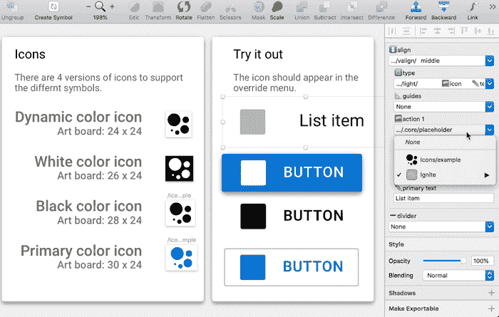

When the art boards in the sticker sheet are converted to symbols, they appear in all relevant override menus. Image credit: Walmart.

为了添加新图标，设计者将提供的图标艺术板转换成符号。该符号现在出现在任何带有 Ignite 提供的图标的覆盖菜单中。

## 符号配置示例

单个符号可以多种方式配置。标签页显示了最常见符号的各种配置。

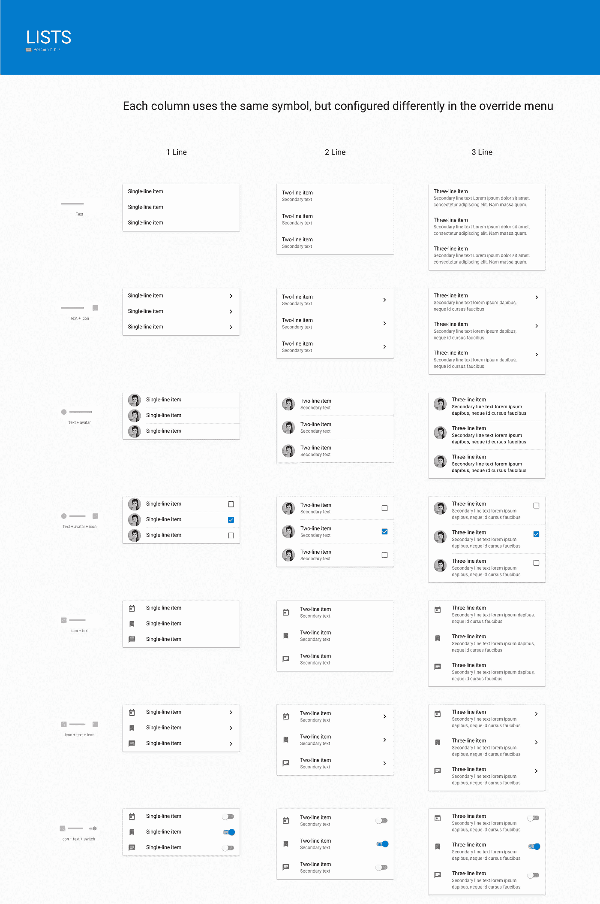

This page in the sticker sheet only contains 3 symbols, but shows the various configurations that are possible. Image credit: Walmart.

## 作为模板的贴纸

贴纸越用越脏。当从它们中复制和粘贴时，东西会被移动。我们提供了一个简单的方法来添加贴纸到草图的模板文件夹。就像在 Mac 电脑上安装应用程序一样，设计师将文件拖到文件夹中。

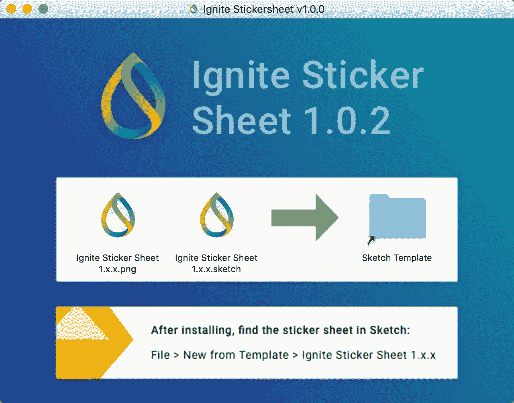

An installer is provided to easily make the sticker sheets available as a Sketch template. Image credit: Walmart.

## 根据模板新建贴纸

安装贴纸后，设计师可以从模板菜单中选择贴纸，获得一个新的副本来开始一个项目。

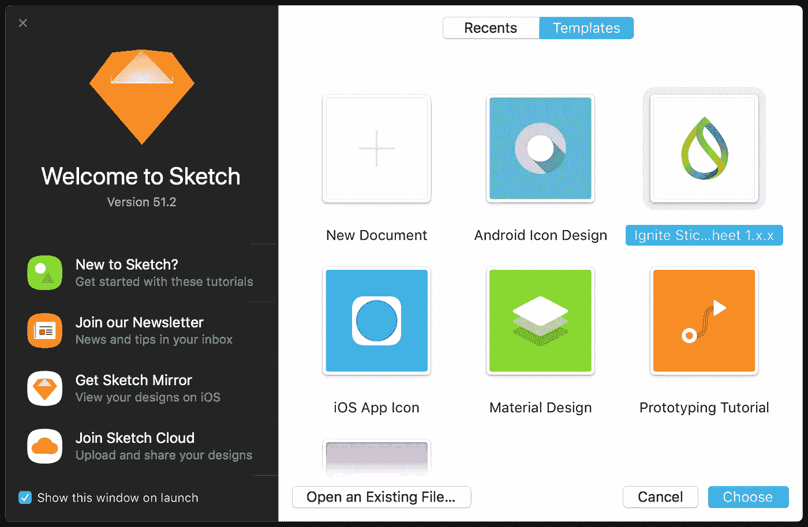

A fresh copy of the sticker sheet can be created from the Templates menu. Image credit: Walmart.

标签页使用库中的符号，但可以独立升级。这允许将新的图案添加到标签页，而无需等待库的下一版本。

# 管理和发布库

Ignite Sketch library 被视为具有发布周期、功能储备、版本和发布说明的产品。

## 版本编号

我们试图在升级时以不破坏设计的方式更新库符号。版本号告诉设计者他们当前使用的库版本的能力水平。

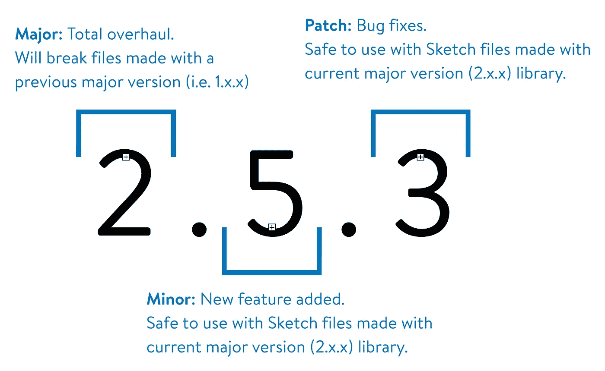

Image credit: Walmart.

版本号显示在草图库缩略图中，便于查看加载的版本。版本也可以在发行说明符号名称中找到。

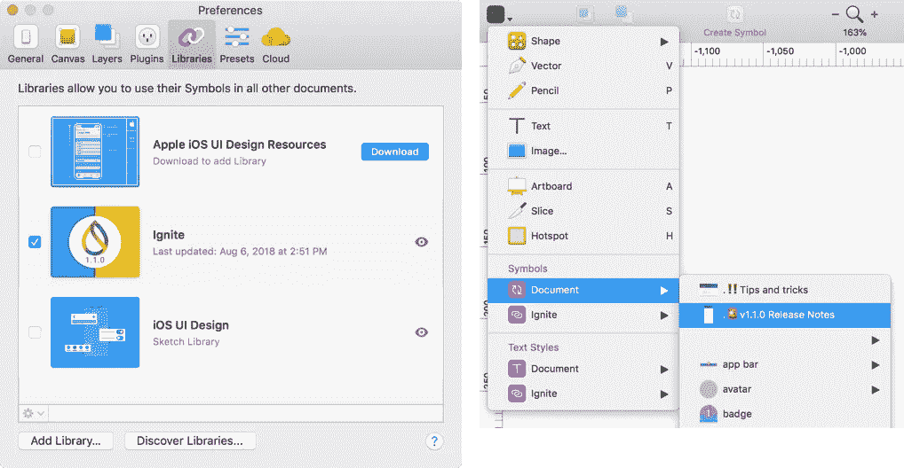

The library version number can be found in the template thumbnail in release notes symbol name.. Image credit: Walmart.

## 分配

GitHub 不仅仅是为了代码。它可以用来管理非文本文件，并提供一个简单和易于创建的产品页面。

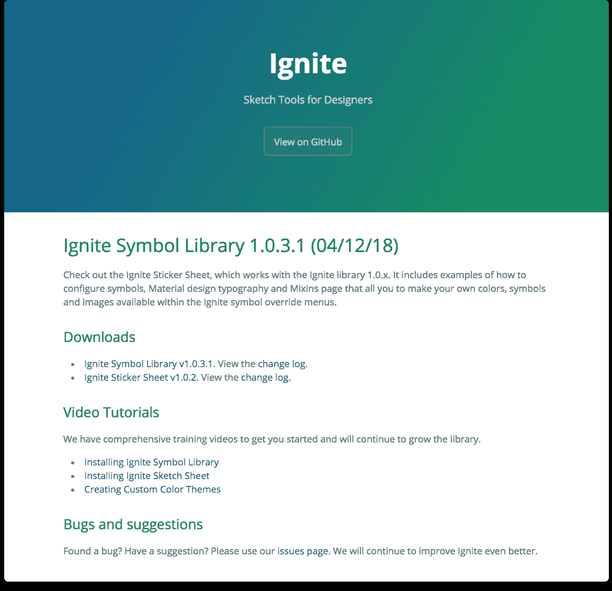

GitHub Page is used to generate the product page. Image credit: Walmart.

设计师下载一个包含最新版本和以前版本的压缩文件夹。如果设计师遇到问题，他们可以快速回滚到以前的版本。

## 发布说明

通知设计者新的特性和错误修复是很重要的。GitHub Releases 用于发布发行说明，附带库文件。库中还提供了最新的发行说明，可以从符号菜单中访问。

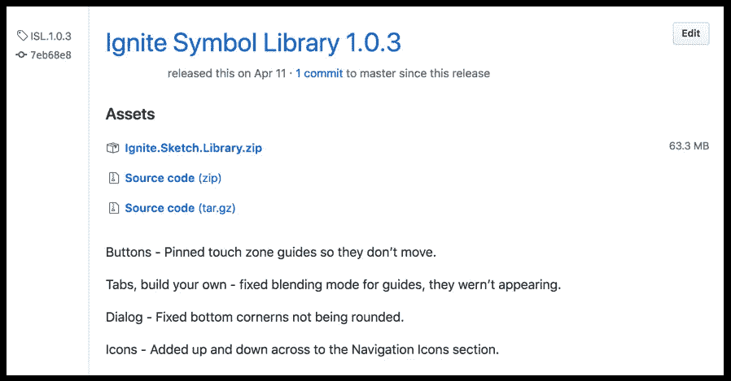

Example of release notes, using GitHub Releases. Image credit: Walmart.

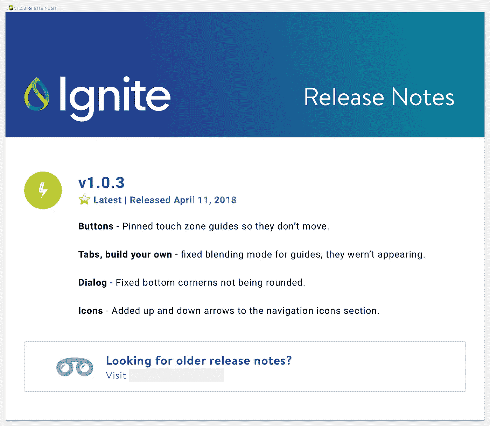

Release notes are available in the library as a symbol. Image credit: Walmart.

## 跟踪错误和功能请求

GitHub Issues 提供了一种提交 bug 和特性请求的简单方法。每个提交都是一个讨论线程，任何人都可以参与到对话中。可以添加标签、项目、里程碑和指定人员进行跟踪。

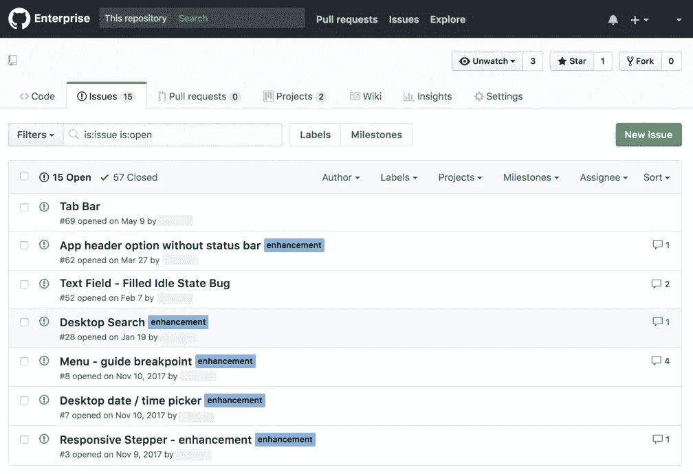

Bugs and feature requests can be tracked and discussed using GitHub Issues. Image credit: Walmart.

可以为下一个版本创建一个项目页面，并且可以通过标签添加所有相关的 bug/特性提交，这样就可以很容易地准确跟踪下一个版本的内容。

## 沟通

我们有一个专用的 Slack 频道，供设计师访问并发布新版本。对于每个版本，我们都会发布发行说明并链接到产品页面。

# 现在轮到你了

通过不断的反馈和迭代，我们努力改进库，并帮助我们的设计师更准确、高效和一致地进行设计。

如果您发现一致性困难或花费太多时间重新创建相同的组件，创建草图符号库可能是值得的。

在锁定和极度灵活的符号之间取得恰当的平衡可能是困难的。从小处着手，经常与设计师分享，快速迭代。如果库帮助设计师更一致，动作更快，你就不用卖了。设计师会要求的。