# 加快 Mendix 开发速度的 10 个技巧

> 原文：<https://medium.com/mendix/heres-10-tips-you-wish-you-knew-earlier-to-speed-up-your-mendix-development-f8152f5cb9ac?source=collection_archive---------0----------------------->

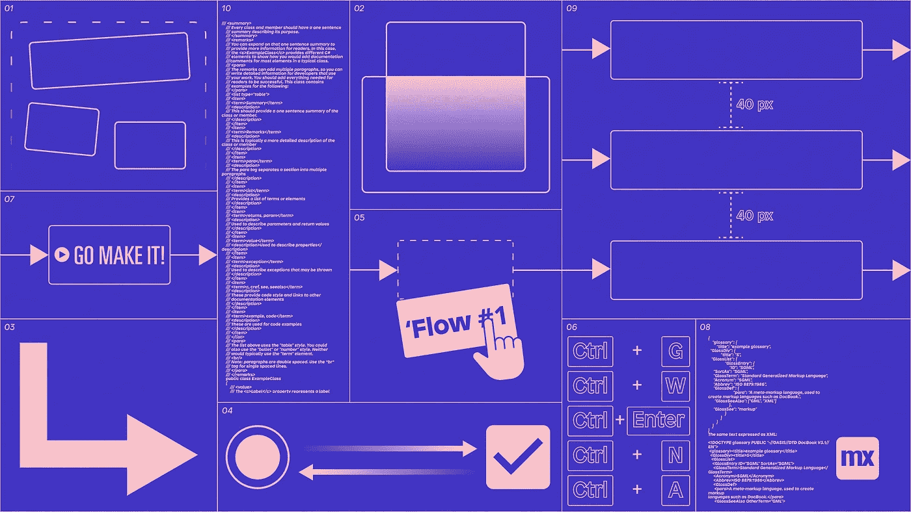

10 tips you wish you knew earlier to speed up your Mendix development

## 在 Mendix Studio Pro 中升级开发游戏的专业技巧

作为一名 Mendix 开发人员，您可能每天都在使用 Studio Pro。然而，你可以在日常工作中使用许多简单的技巧，让你的生活变得轻松一点。在这篇博文中，我将回顾一些我在 Mendix 开发期间收集的专业技巧。

# 1.使用“溶解容器”快速移除容器

有一个你不再需要的容器，但是你需要保存里面的内容？在删除之前，停止将所有项目拖出容器！只需右击容器并选择`dissolve container`即可移除容器，但保留其中的内容。

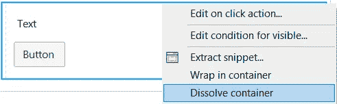

Dissolve container removes a container but preserves the container content

# 2.使用内嵌代码片段将代码片段内容返回到页面

与`dissolve container`类似，您可以右键单击一个片段，然后选择`inline snippet`，立即将所有片段内容放回页面。

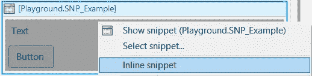

Inlining a snippet removes the snippet call and returns the snippet content to the page

# 3.快速设置微流中的返回值

我曾经通过以下方式从微流中选择要返回的实体:

*   双击结束事件
*   选择返回实体类型
*   输入要返回的变量

但是，您也可以右键单击包含变量的活动，然后按下`Set as return value`来一次完成所有这些事情！

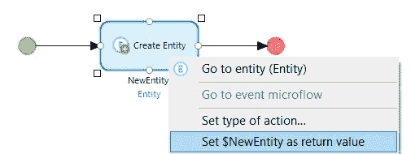

Use ‘Set as return value’ to configure the microflow return type

# 4.立即将输入小部件类型换成枚举和布尔值

正如您可能知道的，您可以为枚举和布尔使用不同类型的输入小部件。枚举属性支持下拉和单选按钮部件，布尔值支持单选按钮和复选框。您知道吗，您可以右键单击这些输入小部件，立即在两种类型的输入小部件之间切换。

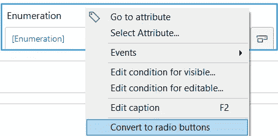

Instantly swap between radio buttons and drop down for enumeration widgets

# 5.拖放

拖放是 Studio Pro 中经常使用的一种模式。你知道你可以在更多的情况下使用它吗？

## 将流从浏览器拖到微流中

您可以将一个微流拖到一个微流的空白区域来创建一个新的调用微流活动，或者拖到一个现有的调用微流活动上，用另一个调用来替换子流调用。

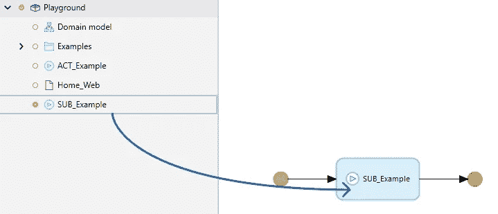

Drag a microflow into another microflow to insert or replace a microflow call action

## 将项目从浏览器拖到页面中

您可以将大多数项目从项目浏览器拖到页面中，以便立即将小部件添加到页面中。您可以将它们拖到现有的小部件或空白目标上来创建一个新的小部件。

您可以执行的拖放操作的一些示例:

*   将微流拖到按钮上，将该微流设置为按钮动作
*   将页面拖到页面视图中，以插入链接到该页面的按钮
*   将微流拖到 dataview 上，将该微流设置为数据源

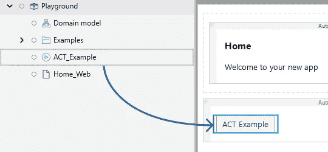

Drag an explorer item into a page to insert a button or replace a button action

> 微流必须返回一个列表，然后您才能将它们拖到 listview 上，并且它们必须返回一个对象，然后您才能将它们拖到数据视图上。

## 将连接器项目拖到数据视图中，以插入输入小部件

如果您在数据视图中进行了选择，connector 选项卡将显示该数据视图中实体的属性。您可以使用连接器将这些属性中的任何一个拖到 dataview 中，以便立即为该属性创建一个输入小部件。不再需要滚动工具箱来寻找正确的小部件，它会自动为该属性选择正确的输入小部件类型！

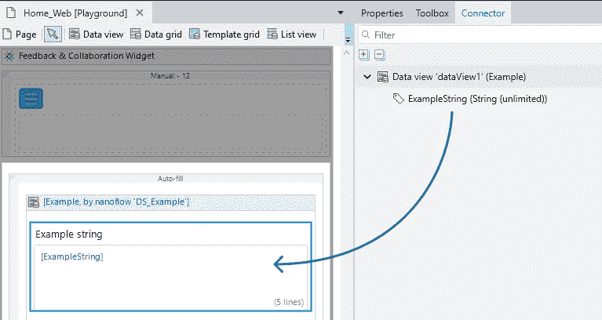

Drag a connector item into a dataview to create an input widget

# 6.快捷键

我确定你用的是 Mendix Studio Pro 提供的一些快捷键，但是你充分利用了吗？这些是我每天使用的捷径:

*   **Ctrl + Enter** 关闭当前打开的任何窗口
*   **Ctrl + G** 打开快速查找菜单
*   **Ctrl + Space** 在输入变量或 XPath 时打开自动填充选项
*   **F5** 运行您的应用
*   **F9** 查看您的应用程序
*   **Ctrl + W** 关闭任何打开的标签页
*   **Shift +鼠标滚轮**水平滚动微流

> 参考 Mendix [文档](https://docs.mendix.com/refguide/studio-pro-overview#7-shortcut-keys)查看为 Studio Pro 配置的所有快捷键

# 7.使用自定义标题选项来提高微流程的可读性

当您从另一个微流中调用子微流时，Mendix 会自动生成子微流名称显示的标题。但是，您可以通过在子微流调用中添加自定义标题来大大提高可读性。只需选择动作并按下 **Shift + F2** 即可输入自定义字幕。这样，你可以用自己的语言解释微流在做什么。

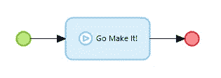

Custom captions greatly improve legibility of a microflow

# 8.将自定义设计属性添加到项目中

在“外观”选项卡中，您可以分配应用于页面内容的设计属性。选择一个设计属性会将相应的类添加到该元素中。

设计属性在项目目录的`design-properties.json`中定义。您可以将自定义设计属性添加到项目中，以允许所有团队成员轻松发现可用的自定义类。

例如，您可以通过将下面的代码添加到`design-properties.json`中，将“隐藏空”设计属性添加到所有的列表视图中。从那时起，您可以在“外观”选项卡中选择它作为设计属性。

```
"ListView": [
    {
        "name": "Hide empty",
        "type": "Toggle",
        "description": "Hides the 'no items found' in empty lists.",
        "class": "listview-hide-empty"
    }
]
```

> 设计属性除了向元素添加一个类之外什么也不做，所以要确保在样式表中有适当的样式可以应用于元素！

# 9.自动调整您的微流程

在最近的版本中，Mendix 增加了自动调整微流操作的选项。只需选择要对齐的元素，然后右键单击选择正确的选项。例如，`distribute horizontally`会自动在所有选定的动作之间添加相同的间距。

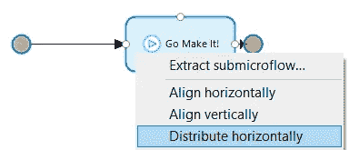

From this

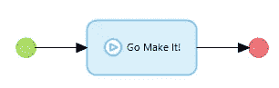

To this!

# 10.使用文档导出快速生成应用程序文档

你可能知道，Mendix 允许你在大多数地方记录应用程序的内容。您可以向域模型、实体、微流，甚至单独的微流参数添加文档。但是您知道这些类型的文档文件有一个内置的导出功能吗？只需在浏览器中右键单击您的应用并选择`Export documentation`。这将自动生成一个全面的。html 文件与您所有的项目文件！

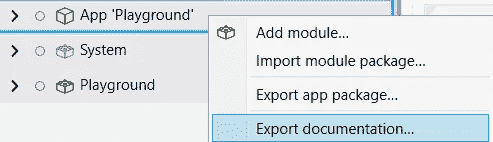

Use the export documentation feature to generate an .html file with your app’s documentation

我希望这些建议能帮助你成为一名真正的 Mendix 专业人士。如果你有什么想法，欢迎在这里分享[。记住，保持好奇！](https://www.linkedin.com/feed/update/urn:li:activity:6886996250961461248/)

## 阅读更多

 [## Studio Pro 概述- Studio Pro 9 指南| Mendix 文档

### Mendix Studio Pro 是一款用于创建、查看和编辑 Mendix 应用程序的工具。一个 Studio Pro 实例可以…

docs.mendix.com](https://docs.mendix.com/refguide/studio-pro-overview#7-shortcut-keys)  [## 实施 Mendix 最佳开发实践- Studio Pro 9 操作指南| Mendix 文档

### 在开发您的应用程序时，本文档可作为采用一致的命名和建模约定的参考

docs.mendix.com](https://docs.mendix.com/howto/general/dev-best-practices) 

*来自出版商-*

如果你喜欢这篇文章，你可以在我们的 [*媒体页面*](https://medium.com/mendix) *找到更多喜欢的。对于精彩的视频和直播会话，您可以前往*[*MxLive*](https://www.mendix.com/live/)*或我们的社区*[*Youtube PAG*](https://www.youtube.com/c/MendixCommunity/community)*e .*

*希望入门的创客，可以注册一个* [*免费账号*](https://signup.mendix.com/link/signup/?source=direct) *，通过我们的* [*学苑*](https://academy.mendix.com/link/home) *获得即时学习权限。*

有兴趣更多地参与我们的社区吗？你可以加入我们的 [*闲散社区频道*](https://join.slack.com/t/mendixcommunity/shared_invite/zt-hwhwkcxu-~59ywyjqHlUHXmrw5heqpQ) *或者想更多参与的人，看看加入我们的* [*遇见 ups*](https://developers.mendix.com/meetups/#meetupsNearYou) *。*