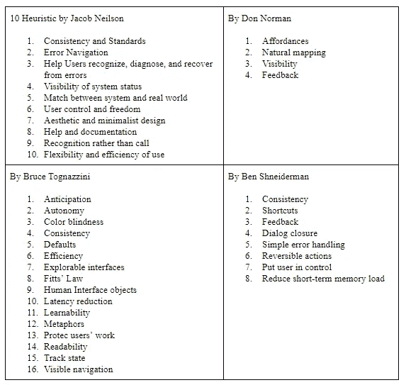

# Heuristic Evaluation

> 原文：<https://medium.easyread.co/heuristic-evaluation-9fe83025cf4?source=collection_archive---------0----------------------->

## Manfaat Heuristic Evaluation Pada Pengembangan Interface Sebuah Aplikasi

Feature image: Photo by Justin Muggleton from [envisionitagency.com](https://envisionitagency.com/)

Setelah membahas mengenai *user* *testing* pada artikel saya sebelumnya “ [**User Testing**](https://medium.com/@yohanapolinsimatupang/user-testing-8a94522e92e6) **”** , kita memahami bahwa *user* *testing* sangat membantu perancang sistem untuk memahami bagaimana kinerja dari *user interface* yang sudah dibuat melalui uji yang diberikan terhadap *user* . Nah, kali ini saya akan melanjutkan dengan pembahasan mengenai ***Heuristic Evaluation* .**

Sebelum masuk pada bahasan, mari kita memahami apa itu ***‘Heuristic’*** . ***Heuristic*** merupakan aturan atau *guiedelines* yang menguraikan prinsip-prinsip *user interface* yang efektif.

Terdapat beberapa *heuristic* yang digunakan untuk *user interface.* Berikut beberapa *heuiristic* menurut beberapa ahli :

Tabel 1\. Heuristic menurut beberapa Ahli

Sebelum membahas *heuristic evaluation* lebih dalam, kita perlu mengetahui bahwa *heuristic evaluation* tidak sama dengan *user testing* . Kedua hal ini berbeda dari segi penguji. *User testing* dilakukan oleh *user* yang berasal dari *target* pengguna nantinya, sedangkan *heuristic evaluation* berasal dari mereka yang memahami dan sudah berpengalaman dalam bidang *usability* ataupun *user interface* . Pada dasarnya kedua hal ini merupakan bagian dari pengujian, kedua proses ini dapat mengunakan desain iteratif untuk menemukan dan memperbaiki *user interface* .

# **Heuristic Evaluation**

***Heuristic*** merupakan aturan atau parameter untuk *usability,* dengan kata lain *heuristic evaluation* merupakan proses pengujian *usability* dengan mengunakan aturan *heuristic* sebagai parameter evaluasinya. *Heuristic evaluation* sangat penting dilakukan pada sebuah desain *interface* , evaluasi ini lebih baik dilakukan ketika kita sudah melakukan *user testing.* Hal tersebut dapat dikatakan efisien karena masalah atau kesalahan kecil pada *interface* sudah ditemukan saat *user testing,* maka evaluator pada *heuristic evaluation* dapat lebih fokus untuk mencari kesalahan yang sulit ditemukan.

**Berikut beberapa step yang dapat dilakukan untuk melakukan *heuristic evaluation:***

1.  Evaluator harus memeriksa *user interface* secara keseluruhan.
2.  Menilai *interface* sesuai *heuristic* .
3.  Melakukan pendataan terhadap masalah *usability* atau *heuristic* yang belum terpenuhi.

**Untuk memperoleh hasil evaluasi yang baik maka evaluator perlu melakukan beberapa hal:**

1.  Evaluasi harus dilakukan berdasarkan aturan *guidelines heuristic* , evaluasi fokus pada *usability*
2.  Tuliskan semua masalah yang ditemukan
3.  Lakukan pemeriksaan *interface* lebih dari dua kali untuk mendapatkan masalah *interface* sebanyak mungkin. Pada awal pemeriksaan tuliskan pendapat yang fasilitator rasakan saat melihat *desain interface* untuk pertama kalinya. Lalu untuk pemeriksaan selanjutnya fokuslah pada masing-masing elemen *interface* .
4.  Gunakan semua *heuristic guidelines* lainnya. Evaluator bisa menggunakan beberapa *heuristic* yang ada jangan hanya terpaku pada satu *heuristic.*

Untuk melakukan evaluasi ini diperlukan beberapa aktor yang bekerja didalamnya, seperti beberapa evaluator yang berasal dari seorang yang berpengalaman pada bidang *user interface* , perancang desain, observator.

# Tahapan Dalam Heuristic

## Tahapan Evaluasi

Ada beberapa proses yang akan dilakukan saat mengevaluasi *heuristic* dari sebuah *interface* .

**1\. Training** Pada proses ini akan dikumpulkan semua aktor yang terlibat seperti evaluator, *observatory* , dan perancang desain. Pada tahap ini perancang desain akan memberikan informasi mengenai aplikasi, *target user* , dan skenario penggunaanya.

**2\. Evaluasi** Pada proses ini, semua aktor yang bekerja melakukan tugasnya masing-masing. Evaluasi akan dilakukan oleh evaluator, setiap observator akan mencatat tingkah laku dari evaluator. Jika evaluator mengalami kesulitan, maka perancang desain berhak membantu mereka jika masalah tersebut merupakan salah satu dari masalah sulit yang telah dicacat oleh perancang. Evaluator hanya berfokus pada setiap masalah yang ditemukan bukan pada solusi yang akan dibuat untuk setiap masalah.

**3\. Pemeringkatan Masalah *(Severity Rating)*** Pada tahapan ini, semua hasil evaluasi akan dikumpulkan. Pemeringkatan masalah ini boleh dilakukan saat evaluasi mandiri ataupun saat diskusi pada akhir evaluasi. Namun ada baiknya setiap evaluator melakukan pemeringkatan pada kedua proses tersebut agar memudahkan penemuan masalah yang paling *catascrophic* atau masalah utama yang paling wajib untuk diperbaiki.

**4\. Tanya Jawab (Debriefing)** Pada tahap ini akan dibuka diskusi mengenai solusi terhadap *heuristic* yang belum terpenuhi pada *usability interface* .

## Tahapan Menulis Hasil Evaluasi

Untuk menulis hasil evaluasi yang baik, maka ada beberapa hal yang perlu diperhatikan evaluator dalam mengunakan kalimat.

**1\. Ingat Audiens** Audiens adalah *developer* , jangan gunakan bahasa yang terlalu rumit, mereka akan sulit memahaminya.

**2\. Sertakan komentar yang positif** Hal yang dilakukan memang melakukan evaluasi, namun ada baiknya evaluasi juga hal baik yang ada pada *interface* .

**3\. Gunakan bahasa yang sopan** Pada saat menulis komentar terhadap masalah *interface* gunakan bahasa yang tidak merendahkan hasil kerja *developer* . Gunakan bahasa yang positif.

**4\. Peryataan ditulis dengan spesifik**
Walaupun *developer* kurang memahami bahasa ahli *usability* maka perlu menjelaskan masalah yang ditemukan se-spesifik mungkin. Jangan mengunakan bahasa “terlalu” dan “kurang” yang tidak mejelaskan suatu hal dengan spesifik.

# **Kesimpulan**

1.  *Heuristic evaluation* tidak sama dengan *user testing*
2.  *Heuristic evaluation* dilakukan oleh ahli pada bidang *user interface* ataupun *usability*
3.  *Heuristic evaluation* memiliki empat proses penting yaitu *training* , evaluasi, pemeringkatan masalah, dan tanya jawab.
4.  *Heuristic evaluation* sangat penting dilakukan untuk sebuah aplikasi terutama pada interfacenya.

# Referensi

1.  [**Heuristic Evaluation**](https://riyanthisianturi.com/heuristic-evaluation/) **by Riyanthi**