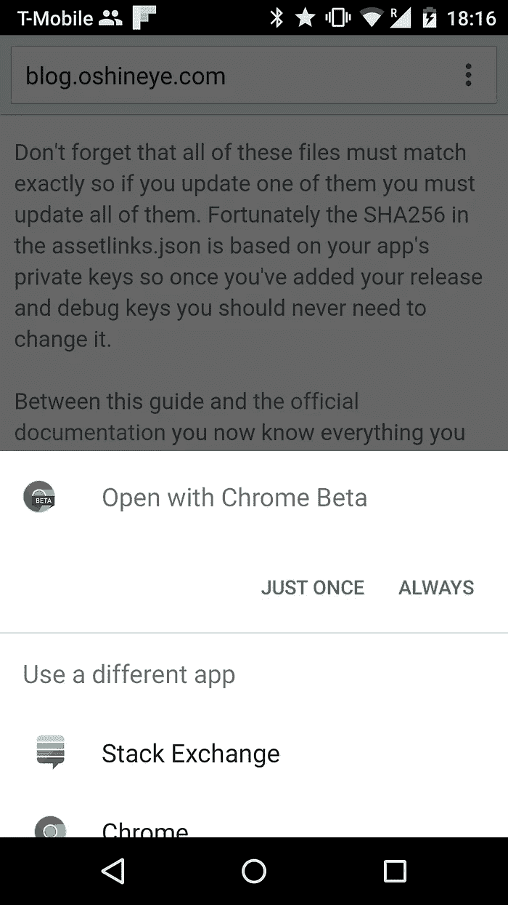

# Android 6.0 棉花糖上实现应用链接指南

> 原文：<https://medium.com/androiddevelopers/heuristic-outcomes-by-ade-oshineye-6a360cc923ad?source=collection_archive---------3----------------------->

Android Marshmallow 有一个功能，可以让那些觉得他们的应用程序体验比他们的 web 体验更好的开发者的生活变得更好。它被称为[应用链接](https://developer.android.com/training/app-links/index.html)，它确保你的应用总是处理你的域的链接，而没有你通常会看到的歧义对话框。

This is the disambiguation dialog I see when I click on a link to Stack Overflow.

该功能称为应用链接，但应用和网站之间的连接称为应用链接。而且，如果你想知道的话，这与 AppLinks.org 的脸书[计划无关。这是实现和测试该特性的简短指南。我们开始吧。](http://applinks.org/)

1.  浏览您的清单，确定您的应用程序声称能够支持的域(和子域)。
2.  添加一个 [assetlinks.json](https://developers.google.com/digital-asset-links/v1/getting-started) 文件，将你的应用(或多个应用)指向每个域或子域。如果有一个你不能控制的域或子域，那么验证过程将会失败。您可以从清单中删除主机，也可以从清单中删除[CATEGORY _ BROWSABLE CATEGORY](http://developer.android.com/reference/android/content/Intent.html#CATEGORY_BROWSABLE),因为这将产生相同效果:您的应用程序不会拦截对其他人的域或子域的请求。
3.  请确保您在支持的每个域或子域上通过 HTTPS 提供 assetlinks.json 文件。你的整个网站不一定要支持 HTTPS。在 HTTPS 上只提供 assetlinks.json 文件就足够了。
4.  确保 assetlinks.json 文件由内容类型“application/json”提供，因为它不能与任何其他内容类型一起使用。
5.  正如这里记录的您应该使用我们的调试工具来验证每个域或子域都有一个有效的 assetlinks.json 文件。这里有一个我的网站的例子。

如果一切正常，您应该会看到如下消息:

为每个域的清单中的 intents 添加一个 autoVerify 属性。

请注意，验证器不遵循重定向，因此如果您试图通过一个所有其他 URL 都重定向到的规范文件来简化它，它将不起作用。通过阅读 Christopher Orr 的这本[优秀但现在已经过时的指南，您可以找到关于安装时验证过程的更多细节。](https://chris.orr.me.uk/android-app-linking-how-it-works/)

不要忘记，所有这些文件必须完全匹配，因此，如果您更新其中一个文件，您必须更新所有文件。幸运的是，assetlinks.json 中的 SHA256 是基于你的应用程序的私钥，所以一旦你添加了你的发布和调试密钥，你就永远不需要改变它。

有了这个指南和[官方文档](https://developer.android.com/training/app-links/index.html)，你现在知道了在 Android 棉花糖上创建应用程序链接所需的一切。如果你还有任何问题，请使用标签 [android-app-linking](http://stackoverflow.com/questions/tagged/android-app-linking) 询问堆栈溢出问题。

*原载于 2015 年 9 月 30 日*[*blog.oshineye.com*](http://blog.oshineye.com/2015/09/guide-to-implementing-app-linking-on.html)*。*