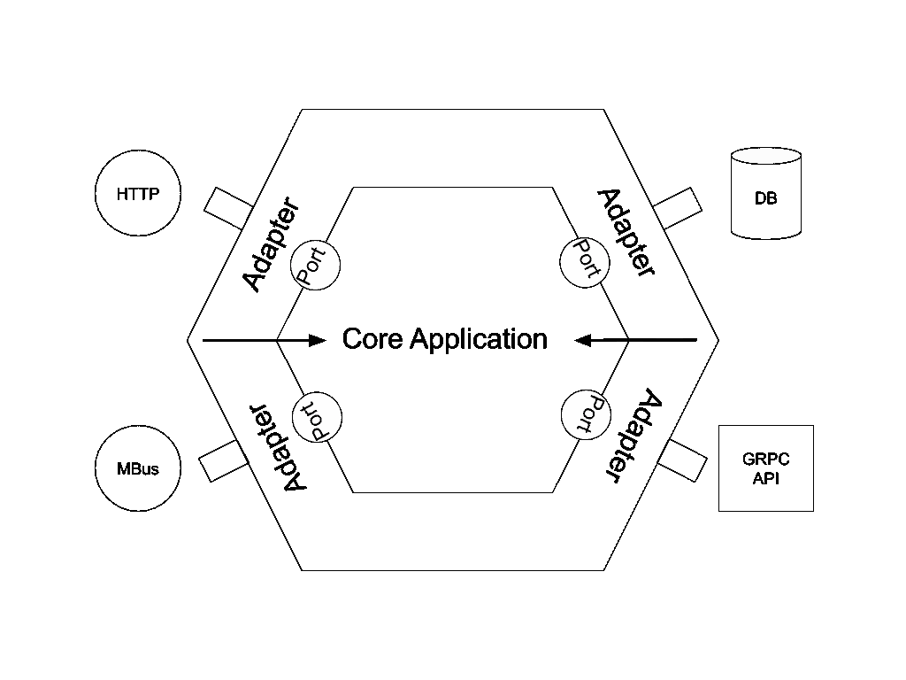
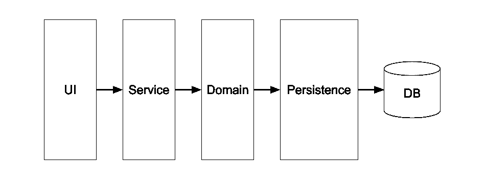
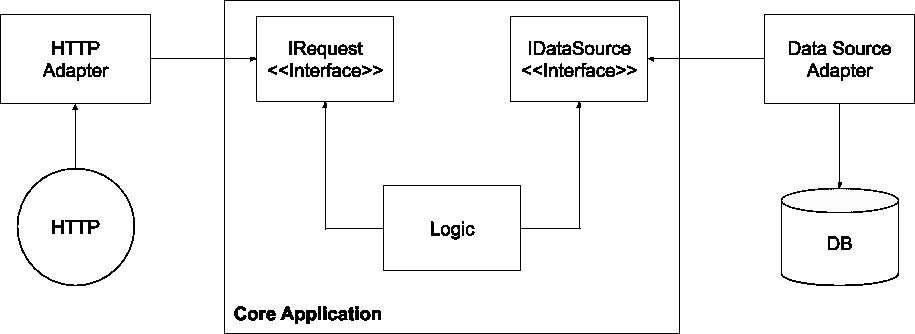

# 六角形建筑

> 原文：<https://medium.com/globant/hexagonal-architecture-aec75fc0ed64?source=collection_archive---------0----------------------->

我们中的许多人，尤其是那些从事过大型项目的人，都知道做出改变有多难。这是因为通常它会影响其他代码。这些问题不仅适用于重构，在引入特性时也是如此。这些改变需要时间和金钱。

我们可以说这是由于糟糕的设计、缺乏好的测试套件、紧张的发布时间表，甚至是团队和团队成员之间低效的协作。

显然没有完美的解决方案，但是你可以从一开始就为不同的情况做好准备。

这个架构模式通过描述一组概念和规则来展示如何解决这些问题。它引入了灵活性和构建可靠测试套件的方法。

# 背景

六边形体系结构是一种分层体系结构，它描述了常见问题的最佳实践。

这并不新鲜，它是由阿利斯泰尔·考克伯恩在 2005 年推出的，并且在过去的几年里势头越来越猛。

我们很多人都知道 Clean Architecture 和 Onion Architecture，它们是几年后由不同作者引入的变体。

六边形图形用于表示组件之间的不同示例，这与它具有 6 个边无关。其作者给出的正式名称实际上叫做端口和适配器架构。奇怪的是有一个“八角建筑”，也很有意思。

它工作得很好，特别是在大的应用程序上，但是对于短期的或者不会增长的小项目来说，它可能是一种过度的杀戮。它最适合于从许多来源获取数据和/或知道数据会变化的项目。

它不依赖于框架或协议。

更改输入和输出的影响很小，几乎不需要重写代码。

层模式和六边形模式的区别之一是 UI 组件被视为一个外部系统，可以随时交换。

它与 [DDD](https://en.wikipedia.org/wiki/Domain-driven_design) 不一样，但它们可以相互补充。

# 目的

> [*允许一个应用同样由用户、程序、自动化测试或批处理脚本驱动，并且独立于其最终运行时设备和数据库进行开发和测试。*](https://alistair.cockburn.us/hexagonal-architecture/)

根据以上所述，我们可以推断六边形架构将让您构建一个高度可维护的应用程序，减少您的技术债务，并从一开始就轻松地进行集成。

# 体系结构

六边形架构实际上很容易理解和实现。

让我们继续看一个六角形建筑的基本视觉表现。

正如我们所看到的，它被分层。您可以在内六角的边缘找到端口。

外层是与外部系统通信的适配器。

指向中心的箭头表示依赖关系。依赖性从外部到中心。这很重要，因为它声明核心应用程序不应该知道适配器如何工作的细节。这确保了业务逻辑的隔离。

在下图中，我们可以看到与 [n 层架构](https://en.wikipedia.org/wiki/Multitier_architecture)的区别，其中每一层都依赖于下面的一层。

现在让我来描述一下每个组件是什么以及它的作用。

# 港口

这些充当层之间的边界。

这些组件对于架构来说是必不可少的，您可以将它们称为接口。

当应用程序需要同一类型的多个实现时，我们使用接口。通过指定实现之间的方法，定义各层如何相互通信。

端口可以用作入站或出站接口。

这些端口确保核心应用程序独立于任何输入或输出。这也使得交换服务更容易完成。

# 适配器

适配器是特定技术、协议或系统的实现。

这些可以是输入，如在传输层，也可以是输出，如数据源。

最常见的传输层是 HTTP API，但它也可以是消息总线、队列消息、控制台命令等。

数据源是您获取数据的地方。典型的例子有数据库、REST API、文件、GraphQL API 等。

# 核心应用程序

核心应用程序是域的实体、行为和约束所在的地方。

如您所见，通过拥有一个专用于核心功能和端口使用的层，我们隔离了业务逻辑。

支持领域逻辑如[用例](https://en.wikipedia.org/wiki/Use_case)、[领域事件](https://martinfowler.com/eaaDev/DomainEvent.html)或通过普通对象的逻辑( [POJO](https://en.wikipedia.org/wiki/Plain_old_Java_object) 、 [PORO](https://dev.to/sulmanweb/plain-old-ruby-objects-poros-in-rails-fat-models-3l7f) 、 [POCO](https://en.wikipedia.org/wiki/Plain_old_CLR_object) 等。)去这里。

不要混淆域事件和系统事件，它们通常被用作框架中钩子。

因此，让我们重新绘制架构的可视化表示，使这些概念更加清晰。

正如您所看到的，适配器的箭头指向核心应用程序，在六边形表示中，依赖关系是从外部到内部的

如果数据源的接口被移除，箭头将指向另一个方向。业务逻辑不会被隔离，这使得它依赖于存储库。这种情况的一个例子是应用程序将 ORM 放在业务逻辑中。这将使它变得不可想象，如果不是不可能的话。

如果请求接口的接口被删除，箭头将仍然指向核心应用程序。那么为什么是界面呢？在我们的例子中，我们只有一个输入，但是如果我们有多个输入，业务逻辑就需要知道每个输入的细节。

还要注意，我们会违反[接口分离原则](https://en.wikipedia.org/wiki/Interface_segregation_principle)，强迫适配器依赖它不会使用的方法。

# 测试

# 港口

没有必要测试这些。接口不需要测试。

# 核心应用程序

因此这一层不依赖于外层。

这很重要，因为您可以独立于任何外部系统来测试业务逻辑。

可以详细测试这一层！

我认为强调一个好的测试的需要是很重要的，这个测试覆盖了业务逻辑的行为。

我们可以使用依赖注入、模拟或任何 T2 测试方法来替换数据源。

# 适配器

重要的是要知道你可以获得核心应用程序所需的信息。

没有必要过度测试这一部分，但重要的是知道在抛出异常时该做什么。

对于输入，建议测试整个系统。通过这种方式，您可以确保整个应用程序连接正常。换句话说，做一些[集成测试](https://en.wikipedia.org/wiki/Integration_testing)。因为我们已经彻底测试了核心应用程序和数据源，所以您可以将这类测试保持在最低限度。

# 结论

这种类型的软件架构将为您提供变更所需的灵活性。由于是独立于框架的，它给你机会去尝试更好的/新的版本，甚至在主要版本之间轻松升级。

它将让您并行处理业务逻辑、服务层和数据源。

记住不要将 ORM 包含在逻辑层中。

尽管这需要更多的工作，而且看起来像是在复制东西，但从长远来看，这将更有益。

让更好更简单的测试关注每一层的需求。

总是寻找如何以不同的方式做事，并试图不断挑战你所知道的。

# 参考

*   [https://alistair.cockburn.us/hexagonal-architecture/](https://alistair.cockburn.us/hexagonal-architecture/)
*   [https://en . Wikipedia . org/wiki/hexagon _ architecture _(软件)](https://en.wikipedia.org/wiki/Hexagonal_architecture_(software))
*   【https://fideloper.com/hexagonal-architecture 
*   [https://blog . octo . com/en/hexagon-architecture-three-principles-and-an-implementation-example/](https://blog.octo.com/en/hexagonal-architecture-three-principles-and-an-implementation-example/)
*   [https://netflixtechblog . com/ready-for-changes-with-hexagonal-architecture-b 315 EC 967749](https://netflixtechblog.com/ready-for-changes-with-hexagonal-architecture-b315ec967749)