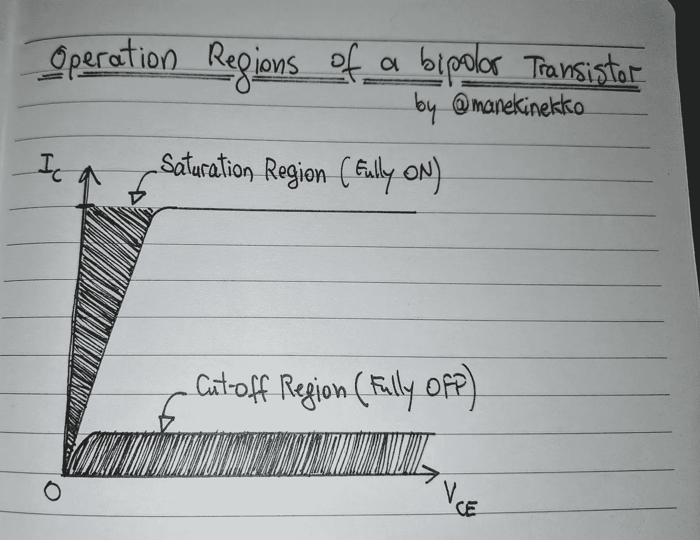

# 嘿谷歌，把我的桌子设置成站立模式！

> 原文：<https://medium.com/google-developer-experts/hey-google-set-my-desk-to-standing-mode-b21dcc40d4b5?source=collection_archive---------2----------------------->

或者如何黑掉任何电器设备，连接到谷歌助手！


你好，如果你一直在关注我最近的推文，你就会知道我有多喜欢我的新立式办公桌:[flexi spot 的 E2B](https://amzn.to/2UmHpyI)！因此，在一个深夜，我有了*过剩的创造力*，我想出了一个有趣的主意:如果我可以使用谷歌助手来控制我的桌面设置会怎么样？

所以我决定建立一个概念证明，5 个小时后…

让我向您介绍一下这个过程…

# 放弃

开始之前，有几件事需要注意:

1.  *此处提供的所有信息都是基于“原样”和“可用”的基础上提供的，您同意使用这些信息的风险完全由您自己承担。在任何情况下，我都不会以任何方式对您使用此处提供的信息和材料所导致的任何损害、损失、费用、成本或债务负责。*
2.  *我不是专业的电子工程师，但我确实有一些知识——来自大学——足以提供这个概念证明。然而，如果你知道一个更好的替代电路，请告诉我。我将非常乐意升级我的设置！*

# 高级计划

我们对该项目的计划如下:

1.  逆向工程桌面控制器，了解系统如何工作。
2.  想办法不使用桌面控制器手动**触发**控制信号。
3.  想办法让**程序化地**触发控制信号。
4.  将谷歌助手接入系统。

# #1 了解桌面控制器的工作原理

显然，如果你需要了解一个设备是如何工作的，首先要做的就是打开它(**这将使保修失效**)。此外，确保你有一个备用设备(或零件)以防事情出错(它为我做了，阅读下一部分了解更多细节！).因此，谢天谢地，我已经预料到了这种情况，并买了一个备用控制器。我要感谢 FlexiSpot 的人们，他们很好地给了我一个折扣代码！

> 顺便说一下，如果您想购买 E2 立式办公桌，您可以使用代码“rffr1”获得 20€的折扣(仅在 [Fexispot 网站](https://flexispot.com/)上有效，直到 2019 年 2 月底)！

让我们看看桌面控制器的外部，它看起来像这样:


一旦打开，内部 [PCB](https://en.wikipedia.org/wiki/Printed_circuit_board) 板显示如下设计:


以下是该 PCB 中所示每个元件的基本说明:

1.  上下按钮可让您将书桌从 70 厘米升至 120 厘米(42.1 英寸至 63 英寸)；
2.  设置模式按钮允许记忆某个高度，并将其存储到 M1、M2 或 M3 插槽中(三个可编程预设)；
3.  自动跟踪按钮用于设置坐/站计时系统，并在该站的时候提醒您；
4.  TM1650 是一个 LED 微控制器，负责左侧的 8 段显示([参见完整规格](https://os.mbed.com/components/TM1637-LED-controller-32-LEDs-max-Keyboa/))；
5.  STM8S (STM8S103F2)是主微控制器，是整个系统的大脑([见这里的数据表](https://www.st.com/resource/en/datasheet/stm8s103f2.pdf))。

现在我们需要弄清楚使用哪些命令来手动控制桌子，而不是真正使用(可以吗？)书桌控制器！

让乐趣开始吧！

## 尝试#1:逆向工程 STM8S 微控制器(TL；大卫:不要——不要——不要——不要！！)

我的第一个尝试是尝试对 STM8S 微控制器进行逆向工程，以便获得指示电机改变位置的所需信号，然后我会建模并向电机发送这些确切的信号，就好像它们来自 STM8S 本身一样。嗯，那是我的计划！

然而，当我尝试这个过程时，我设法损坏了微控制器的引脚 14(我没有使用正确的烙铁！)其作用是降低桌子(向下按钮)。诚然，即使我设法从微控制器获得所有信号，我也不能再降低桌子了——除非更换 STM8S 微控制器单元，如果我有一个备用的，我会这样做的！


所以，我不得不另想办法。实际上，有一种更简单的方法来做我正在寻找的事情。

## 尝试 2:黑掉 M1、M2 和 M3 的按钮……？咄！

原来有一种更简单的方法可以让我在不接触(或燃烧)的情况下向马达发送信号！)的 STM8S 微控制器。我只需要黑进 M1，M2 和 M3 的按钮！这些模式作为预设工作，存储桌子的特定高度，当被触发时，它们指示桌子从任何位置移动到该精确高度。


> **这种黑客方法变得更加通用，可以应用于任何有按钮输入的电子设备。**

现在，我为下一步做好了准备:找出一种模拟按钮的方法，让微控制器认为 M1、M2 或 M3 按钮中的一个被按下了。

为此，我必须建立一个电子开关电路。

# #2.手动触发控制信号

在我们自动化所有的事情之前，让我们首先尝试并手动测试我们的方法。为此，我建立了一个简单的电路，这是一个“NPN 晶体管开关电路”。这种基于晶体管的开关电路是低压 DC 设备的理想选择，这正是我们正在努力做的:记住，我们正在尝试模拟一个需要几毫安才能触发的按钮！

> [更新]一些读者问为什么不跳过开关电路，直接将桌面控制器连接到 Onion Omega2+ SoC 引脚。虽然这可行，但我希望有一个外部电路，通过允许我方便地在 fututre 中添加更多组件，例如外部传感器、按钮等，为我提供更多灵活性

## NPN 晶体管作为开关电路— 101

简单来说，晶体管开关的工作区域被称为**饱和区**和**截止区**。这意味着我们将通过在晶体管的“完全截止”(截止)和“完全导通”(饱和)区域之间来回驱动晶体管来将它用作开关。这里是一个典型双极晶体管工作区域的**非常简化的**图示:



说到这里，我们现在来看看一个典型的“NPN 晶体管开关”电路:


在本电路中，我们使用 LED 作为负载来演示开关过程。这是这样一个电路的“实现”:


很简单吧？我们的电路似乎像预期的那样工作。

现在让我们继续，将桌面控制器连接到这个电路中:


在上图中，J1、J2 和 3 是跳线，分别连接到我们焊接到桌面控制器的电线，即模式 1、模式 2 和模式 3。J0 是地，它也将连接到桌面控制器。

这是试验板上的实际电路:


注意，V1、V2 和 V3(以及不在此图中的 GND)线暂时保持松弛。

# #3.自动触发推送信号

为了自动触发欺骗 STM8S 微控制器的“按钮”信号，我们需要一个可编程的微控制器。为此，你可以使用你拥有的任何主板(Arduino，Nanode，Teensy 等…)，甚至是树莓 PI；任何带 GPIOs 的东西。

我最初使用 Arduino MEGA 2560 板来试验代码，但后来我意识到我没有 Wifi 屏蔽(这是该项目的下一部分所需要的)。作为参考，以下是 Arduino 代码:

所以我最终使用了我的一个洋葱 Omega2+ wifi 功能的 SoC ( *剧透:它可以运行 JavaScript！！！*)。


这是最终的电路。请注意，V1、V2 和 V3 线现在连接到洋葱ω2+SoC 的引脚 1、2 和 3:


这是试验板实现:


现在一切就绪，我们需要做的就是编写一个简单的程序来切换 GPIO 引脚 1、2 和 3:这将发送高达 3.3V 的高压和低至 0.4V 的低压。

基本上，当我们将引脚 1 上的输出设为高电平时，这将通过基于晶体管的开关电路提供 3.3V 电压，进而使晶体管饱和，使其闭合开关，这将充当一个按钮。然后，STM8S 将接收来自 M1 按钮的按下信号，然后相应地指示桌面电机。就是这样！

下面是说明这一点的实际 Node.js 代码:

> 我应该提到，Onion Omega2+有一个内置的 shell 命令，允许控制 GPIO 引脚。例如，如果我们需要将引脚 1 设置为高电压输出模式，我们可以运行下面的命令:`gpioctl dirout-high 1`但是我很高兴发现[是一个抽象这些操作的 NPM 模块](https://www.npmjs.com/package/omega2-gpio)。

现在，我们的代码正在按预期工作，我们将公开一个简单的 REST API，我们将使用它来触发相同的命令，但这次是通过 HTTP(这是 Google Assistant 集成所必需的):

现在，我们可以轻松地向`[http://192.168.80.84:1337/mode/1](http://192.168.80.84:1337/mode/1)` 发送 GET 请求，这将在 800 毫秒内将引脚 1 设置为高电平，然后将其设置回低电平。同样的事情也适用于`mode/2`和`mode/3`。

最后要做的一件事是安排这个脚本在引导过程中自动运行。我们通过编辑`/etc/rc.local`脚本文件(如文档中所述的[)来做到这一点:](https://docs.onion.io/omega2-docs/running-a-command-on-boot.html)

```
node /root/desk-controller-assistant-server.js &

exit 0
```

> 请注意，由于我们正在执行一个节点服务器，因此该命令会持续运行。为了让引导序列成功完成(并到达出口 0)，我们需要通过在命令末尾添加一个&符号来分叉这个过程。

在进入下一部分之前，我强烈建议你给你的设备分配一个静态 IP 地址，这将有助于谷歌助手的集成！

下面是最终的硬件设置:


# #4 连接谷歌助手

## 先决条件

确定您的 Arduino 或 Onion Omega2+可以从互联网访问。为了验证这个概念，我简单地使用了 [ngrok](https://dashboard.ngrok.com/get-started) ，它允许我将一个 web hook——从我的本地网络中的一个本地设备——暴露给外部世界——它确实是这个实验的完美工具！

**不过有一点需要注意:我使用的 Onion Omega2+只有 32MB 的内部存储空间，所以我无法在设备上安装 ngrok，而是在我的 Pixelbook 上安装了 ngrok。**

> Omega2+有一个 SD 卡插槽来扩展内部存储，我只是不想为此而烦恼！

使用 ngrok，我在 http://198.168.80.84:1337 的(omega 2+的 IP)上打开了一个 HTTP 隧道:

```
ngrok http -subdomain=wassimchegham 192.168.86.84:1337
```

一旦 ngrok 启动并运行，我终于得到了一个公开的 URL:

```
https://wassimchegham.ngrok.io/
```

现在，我可以向我的设备发送 HTTP 请求来设置所需的模式:

```
https://wassimchegham.ngrok.io/mode/1
```

> **⚠️警告** : ngrok 会把你的本地机器暴露在互联网上。如果你不用的话，请务必关机。

## 设置谷歌助手——最快的方法:IFTTT

这就是臭名昭著的 IFTTT T7 的用武之地。这是我用过的配方:

如果…


然后…


搞定了。

> 我强烈建议阅读下一部分关于将物联网设备与谷歌助手集成的推荐方法。

## 设置谷歌助手——推荐方式:智能家居应用编程接口

如果你正在建立一个与谷歌助手的*严肃的*设备集成，你将不得不建立一个智能家居行动:

> 智能家居行动依赖于 Home Graph，这是一个存储和提供关于家庭及其设备的上下文数据的数据库。例如，Home Graph 可以存储客厅的概念，其中包含来自不同制造商的多种类型的设备(灯、电视和扬声器)。这些信息被传递给 Google Assistant，以便根据适当的上下文执行用户请求。[阅读更多](https://developers.google.com/actions/smarthome/)。

创建智能家居操作需要您执行以下命令:

*   **action.devices.SYNC** :请求用户已经连接并可供使用的设备列表。
*   **action.devices.QUERY** :查询设备的当前状态。
*   **action . devices . execute:**请求在智能家居设备上执行命令。如果可用，应在响应中提供新状态。一个执行意图可以用多个命令针对多个设备。
*   **action . devices . disconnect**:当用户从 Google Assistant 取消应用账户的链接时，通知你的应用。收到断开连接意向后，您不应报告此用户设备的状态。

我不打算解释每种方法的所有实现细节。但是，我应该提到，虽然大部分代码是改编自[的智能洗衣机代码实验室](https://codelabs.developers.google.com/codelabs/smarthome-washer/#0)。因此，我强烈建议您务必遵循 codelab，了解如何部署智能设备并将其与 Google Assistant 同步的更多详细信息。

> 向 [Nick Felker](https://medium.com/u/baa42a5b27c5?source=post_page-----b21dcc40d4b5--------------------------------) 和他的团队致敬，是他们构建了这个代码实验室，为我节省了很多时间👏🏼

即使每个智能家居的操作逻辑都不同，但 99%的智能家居都共享相同的样板代码(假设他们使用 Node.js 和 Firebase):

> 要了解更多关于每种方法的作用，请前往官方文档。

关于[设备特性](https://developers.google.com/actions/smarthome/traits/) API 有一点需要注意:当注册一个新设备(即一个智能家居动作)与谷歌助手(即。主页图)，您的设备必须是受支持的设备之一([参见完整列表](https://developers.google.com/actions/smarthome/guides/))，并且必须具有受支持的特征之一([参见完整列表](https://developers.google.com/actions/smarthome/traits/))。此外，每个特征属性如模式属性([见完整列表](https://developers.google.com/actions/reference/smarthome/traits/modes))和切换属性([见完整列表](https://developers.google.com/actions/reference/smarthome/traits/toggles))也必须是支持的属性之一。因此，很明显，立式办公桌不属于上述任何一类。然后，我不得不制作主页图，认为立式办公桌是一个…开关(类型:`action.devices.types.SWITCH`)，具有开/关功能(特征:`actions.devices.traits.OnOff`)。这意味着我的桌子只能有两种状态:

*   打开:将升高桌子(模式 3)。
*   关闭:将降低桌子(模式 1)。

嗯！对于这个概念验证来说，这应该没问题。但是，如果您正在构建自己的设备集成，您可以将大量其他特性结合在一起，与您的设备功能完美匹配。

说到我们的具体代码实现，下面是完整的实现:

这里是完整的项目源代码，如果你想改善设置

[](https://github.com/manekinekko/standing-desk-assistant) [## manekinekko/站立式办公桌助理

### 在 GitHub 上创建一个帐户，为 manekinekko/站立式办公桌助理的开发做出贡献。

github.com](https://github.com/manekinekko/standing-desk-assistant) 

基本上，代码做的是:当我们向智能家居动作发送命令时，我们将每个状态存储在 Firebase 实时数据库中。然后，对于每个状态变化，我们只需通过 ngrok 将 HTTP 请求发送到我们的本地设备。这是该架构的概要图，不言自明:


> 关于智能家居 API 如何工作的更详细解释，请参考[官方文档](https://developers.google.com/actions/smarthome/)。

现在，让我们连接并使用我们的**【测试】立式工作台**设备(即。切换)到我们的谷歌助手:


> 记得从[动作控制台](https://console.actions.google.com/u/0/)部署智能家居动作的测试版本，以便在可用设备列表下找到。

为了与动作进行更自然的交互，我创建了两个例程，允许我升高和降低我的桌子，而不是打开和关闭我的桌子:


# 谢谢大家！

就是这样！我希望你喜欢读这篇文章，就像我喜欢写这篇文章和构建这个有趣的项目一样。

下次再见，保重❤️

*关注我*[*@ manekinekko*](https://twitter.com/manekinekko)*更多好玩的项目。*