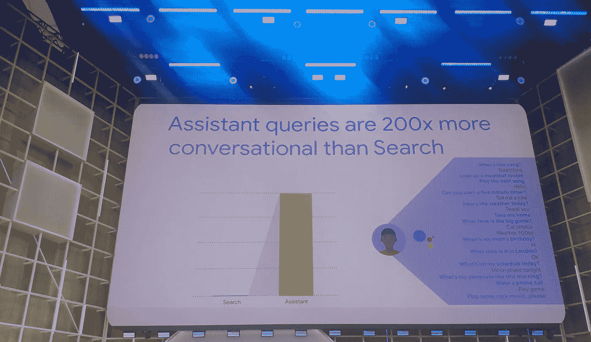

# 嘿谷歌，这个 2020 怎么样？

> 原文：<https://medium.com/google-developer-experts/hey-google-what-about-this-2020-1edcfe4b846c?source=collection_archive---------5----------------------->

在过去的几年里，谷歌助手一直在帮助世界各地的人们完成工作。语音技术正在从根本上改变我们使用设备的方式，通常是以我们意想不到的方式；如今，数百万活跃用户与他们的扬声器、汽车、电脑、电话、电视和其他设备进行对话。

在这篇文章中，我将分享我个人对 2020 年助手、语音界面和自然语言处理器的期望。开始吧！🏁

Ok Google GIF By Product Hunt

🤖🗓️ **通过你的声音做更多的事情:** 当人们和他们的谷歌助手说话时，他们也在努力做事情。来自用户的语音查询比搜索更有可能是面向行动的 40 倍，在搜索中，人们可以做诸如“发送短信”、“关灯”或“打电话”之类的事情。

对于许多任务，尤其是当你很忙或在路上时，通过语音来完成事情会容易得多，只需说一些命令，如“播放音乐或关灯”，而无需打开应用程序。即使是像创建日历邀请或设置闹钟这样的基本事情，你也不必低头看手机，只需说“创建周五晚上的约会”或“设置明天早上 6 点的闹钟”。

这些例子看起来像是小事，但它说明了是什么让语音如此独特，这项技术允许通过自然对话来完成任务和做事情，AoG 开发人员越能建立这种体验，就越能成为一个更个性化的理想助手。

🙋**更私人的助手:** 当人们开始使用语音助手时，他们经常使用非常简单的命令，但很快，人们对更复杂的对话的期望就上升了。简单的命令可以采取各种形式；例如，人们可以要求助理以数千种不同的方式设置闹钟，这意味着助理需要理解并保持对这种复杂对话的培训。

例如，在搜索引擎中，我们可以看到像“旧金山天气”或“附近的披萨”这样的短尾巴搜索，而在助手中，我们可以看到更长、更具对话性的查询，如“今天下午 6 点圣何塞的天气如何？”平均而言，用户对助手的语音查询是搜索的 200 倍。

I/O 2019

🤓**深度学习&神经网络:
有了这些新模型，为助手提供动力的人工智能将在我们的手机上本地运行。**

此外，这一突破使下一代助手能够以近乎零延迟的速度处理设备上的语音识别和实时转录，并且这种模型可以具有更高的准确性，以理解用户的要求。

🗣️🤖对话式人工智能:在更像人类的对话中，通过语音命令和文本交互与代理进行交互，这意味着 Assistant 还需要“学习”如何“理解”语言、口音、方言甚至俚语，这些服务适用于 90 多个国家。

 [## 为您带来下一代谷歌助手

### 产品副总裁，谷歌助手 2019 年 5 月 7 日发布在过去的三年里，谷歌助手已经…

www.blog.google](https://www.blog.google/products/assistant/next-generation-google-assistant-io/) 

🔐📢**继续履行对隐私的承诺:**
Google Assistant 旨在保护您的隐私和信息安全。该助手被设计成在待机模式下等待，直到它被激活，就像你说“嘿谷歌。”助手的这种待机模式，不会把你说的话发送给谷歌或其他任何人。

默认情况下，Assistant 不会存储您的音频录音，用户可以通过允许保留您的音频来决定他们是否希望让 Google 语音产品对您更有帮助，对每个人都更好。

助手团队在 CES 2020 上宣布，在助手的帮助下，使用谷歌的隐私控制从未如此简单。现在你可以只用声音提问，比如“你如何保护我的隐私信息？”或者“嘿，谷歌，你在保存我的音频数据吗？”获得最常见的隐私/安全问题的答案，并直接进入设置以更改您的首选项。此外，你可以用“嘿，谷歌，删除我这周对你说的一切”的命令从你的谷歌账户中删除你的助手活动

 [## 每天为你提供更有用的谷歌助手

### 产品副总裁，谷歌助理于 2020 年 1 月 7 日发布，可在 90 多个国家使用，谷歌…

博客.谷歌](https://blog.google/products/assistant/ces-2020-google-assistant/) 

🔊🚘⌚ **进入更多设备:** 谷歌助手已经可以在超过 10 亿台设备上使用。很快，助手将会出现在许多新的智能显示器、扬声器、电视、耳机、汽车等等。

作为家庭中最大和最常用的屏幕，电视是人们使用助手的另一个重要场所，因此他们将更新 Android TV，使制造商更容易将麦克风集成到 TVs⁠中，因此即使你的电视关闭或你找不到遥控器，你仍然可以使用助手访问媒体和娱乐，获得答案并通过语音控制电视。

在车上，助手提供了一种无需手动的方式，让您在旅途中也能完成工作。通过将谷歌助手内置到部分搭载 Android Automotive OS 的汽车和所有兼容 Android Auto 的汽车中，您可以充分利用在车内的时间，如导航、信息、通话、约会等。

📈🤖市场规模&增长率
随着助理变得更加强大，他们在个人和商业领域的效用也将增长。

市场研究公司 tractica[报告](https://www.tractica.com/newsroom/press-releases/the-virtual-digital-assistant-market-will-reach-15-8-billion-worldwide-by-2021/)称，全球虚拟数字助理的独立消费者用户将从 2015 年的 3.9 亿增长到 2021 年底的 18 亿。按照这样的预期增长，收入预计将从 2015 年的 16 亿美元增长到 2021 年的 158 亿美元。越来越多的经济领域，如酒店、医疗保健、汽车以及许多其他行业，都在寻找语音助手和语音识别模型的用途，并将在未来几年大大受益于语音人工智能。

📢 🤖**语音广告？**🤔尽管助理团队还没有宣布该平台的广告，但我在这里分享了一些公司如何开始实施语音广告的例子:互动可以从简单介绍产品或服务开始。一旦广告结束，听众可以被问及他们是否想知道更多，如果用户的回答是肯定的，他们可以收到更多关于广告背后品牌的信息。如果他们不感兴趣，他们可以说不或者跳过，广告就会结束。

📍**助手将继续发展，并将继续存在:** 该团队致力于让助手更易于使用，每天都更有帮助，并成为完成工作的最佳方式。这只是我今年对助手的期望的第一瞥。

*免责声明:观点是我个人的，与公司或他们的项目无关。每位 Google 开发者专家对他们的服务完全负责，不隶属于 Google，也不代表 Google 提供服务。客户对其使用的服务(如果有)负全责。*