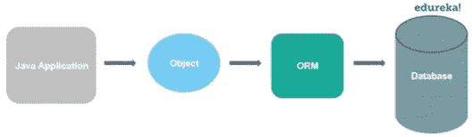

# 2021 年 50 大 Hibernate 面试问答

> 原文：<https://medium.com/edureka/hibernate-interview-questions-78b45ec5cce8?source=collection_archive---------0----------------------->


**Hibernate** 是构建 Java 应用最广泛的 ORM 工具之一。它在企业应用程序中用于数据库操作。所以，这篇关于 hibernate 面试问题的文章会帮助你在面试前复习知识。

如果你是一个新人或者有经验的人，这是一个适合你的平台，可以帮助你开始准备 Hibernate 的工作角色。

让我们先来看看 Hibernate 面试问题中最常见的问题。

为了更好地理解，我将 Hibernate 框架面试问题的其余部分分成了以下几个部分:

*   针对初学者的 Hibernate 面试问题
*   中级 Hibernate 面试问题
*   针对有经验者的 Hibernate 面试问题

我们开始吧！

# 针对初学者的 Hibernate 面试问题

## Q1。什么是 Hibernate？


*Hibernate* 是最流行的 *Java 框架*之一，它简化了 Java 应用程序与数据库交互的开发。这是一个对象关系映射(ORM)工具。Hibernate 还提供了 Java API 的参考实现。

它被称为一个框架，带有一个抽象层，也在内部处理实现。实现包括编写操作查询或建立与数据库的连接等任务。

Hibernate 开发了持久性逻辑，存储和处理数据以供长期使用。它是一个轻量级工具，最重要的是**开源**，这让它比其他框架更有优势。

## Q2。Hibernate 框架的主要优势是什么？

*   它是开源的、轻量级的。
*   Hibernate 的性能很快。
*   帮助生成数据库独立查询。
*   提供自动创建表的工具。
*   它提供查询统计和数据库状态。

## Q3。与 JDBC 相比，使用 Hibernate 有什么优势？

与 JDBC 相比，使用 Hibernate 的主要优势是:

1.  Hibernate 消除了大量附带的模板代码，代码看起来更干净，可读性更好。
2.  这个 Java 框架支持*继承*、关联和集合。这些特征实际上在 JDBC 是不存在的。
3.  HQL (Hibernate Query Language)更面向对象，更接近 Java。但是对于 JDBC，你需要编写原生的 SQL 查询。
4.  Hibernate 隐式地提供了事务管理，而在 JDBC API 中，您需要使用*提交*和*回滚*来编写事务管理代码。
5.  JDBC 抛出的 SQLException 是一个被检查的异常，所以你必须写很多 try-catch 块代码。Hibernate 封装了 JDBC 异常并抛出 *JDBCException* 或 *HibernateException* ，它们是未检查的异常，因此您不必编写代码来处理它。它具有内置的事务管理，有助于消除 try-catch 块的使用。

## Q4。什么是 ORM 工具？

它基本上是一种映射存储在数据库中的对象的技术。ORM 工具有助于简化数据创建、操作和访问。它在内部使用 Java API 与数据库进行交互。



## Q5。为什么要用 Hibernate 框架？

Hibernate 克服了其他技术的缺点，比如 T4、JDBC 和 T5。

*   它克服了 JDBC 面临的数据库依赖性。
*   数据库的改变在 JDBC 上花费了大量的工作，hibernate 成功地克服了这个问题。
*   在 JDBC 上工作时，代码可移植性不是一个选项。Hibernate 很容易处理这个问题。
*   Hibernate 加强了对象级的关系。
*   它克服了在 JDBC 上工作时强制的*异常处理部分*。
*   通过克服样板文件问题，它减少了代码长度，增加了可读性。

## Q6。Hibernate 支持哪些不同的功能？

*   Hibernate 是一个 ORM 工具。
*   Hibernate 使用 Hibernate 查询语言(HQL ),这使得它独立于数据库。
*   它支持自动 DDL 操作。
*   这个 Java 框架还有一个*自动主键生成*支持。
*   支持高速缓存。
*   在 Hibernate 的情况下，异常处理不是强制性的。

## Q7。Hibernate 支持哪些技术？

Hibernate 支持多种技术，比如:

*   XDoclet 弹簧
*   *美芬*
*   Eclipse 插件
*   *J2EE*

## Q8。什么是 HQL？

HQL 是 Hibernate 查询语言的首字母缩写。它是一种面向对象的查询语言，独立于数据库。

## Q9。Hibernate 中如何实现映射？

关联映射是 Hibernate 的关键特性之一。它支持与关系数据库模型相同的关联。它们是:

*   一对一的关联
*   多对一关联
*   多对多关联

您可以将它们映射为单向或双向关联。

## Q10。说出 Hibernate 框架的一些重要接口？

Hibernate 接口包括:

*   **会话工厂**(org . hibernate . session 工厂)
*   **会话** (org.hibernate.Session)
*   **事务** (org.hibernate.Transaction)

## Q11。Hibernate 中的一对一关联是什么？

在这种类型的映射中，您只需要为您想要在查询或域模型中导航关系的实体建模系统。您需要一个表示关联的实体属性，所以用一个 *@OneToOne* 注释对其进行注释。

## Q12。Hibernate 中的一对多关联是什么？

在这种类型的关联中，一个对象可以与多个/不同的对象相关联。谈到映射，一对多映射是使用没有任何冗余元素的集合实现的。集合中的这个*一对多*元素表示一个对象与多个对象的关系。

## Q13。Hibernate 中的多对多关联是什么？

多对多映射需要一个实体属性和一个 *@ManyToMany* 注释。它可以是单向的，也可以是双向的。在**单向**中，属性为关联建模，您可以使用它在您的域模型或 JPQL 查询中导航。注释告诉 Hibernate 映射一个多对多的关联。**双向**关系，映射允许您在两个方向上导航关联。

## Q14。如何整合 Hibernate 和 Spring？

也是当今市场上最常用的 Java 框架之一。Spring 是 JavaEE 框架，Hibernate 是最流行的 ORM 框架。这就是为什么 Spring Hibernate 组合被用在很多企业应用程序中。

下面是集成 Spring 和 Hibernate 应该遵循的步骤。

1.  添加 Hibernate-entity manager、Hibernate-core 和 Spring-ORM 依赖项。
2.  为数据库操作创建模型类和相应的 DAO 实现。DAO 类将使用由 Spring Bean 配置注入的 *SessionFactory* 。
3.  注意，您不需要使用 Hibernate 事务管理，因为您可以使用 *@Transactional 注释将它留给 Spring 声明性事务管理。*

## Q15。Hibernate 配置文件是什么意思？

*Hibernate 配置文件*主要包含特定于数据库的配置，用于初始化 *SessionFactory* 。hibernate 配置文件的一些重要部分是方言信息，因此 Hibernate 知道数据库类型和映射文件或类的详细信息。

# 中级 Hibernate 面试问题

## Q16。提到一些用于 Hibernate 映射的重要注释？

Hibernate 支持 JPA 注释。一些主要的注释是:

1.  **javax . persistence . entity:**与模型类一起使用，指定它们是实体 beans。
2.  **javax . persistence . table:**与实体 beans 一起使用，定义数据库中对应的表名。
3.  **javax . persistence . access:**用于定义访问类型、字段或属性。默认值是 field，如果您希望 Hibernate 使用 getter/setter 方法，那么您需要将其设置为一个属性。
4.  **javax.persistence.Id:** 定义实体 bean 中的主键。
5.  **javax . persistence . embedded id:**它定义了实体 bean 中的复合主键。
6.  **javax . persistence . column:**帮助定义数据库表中的列名。
7.  **javax . persistence . generated value:**它定义了用于生成主键的策略。它还与*javax . persistence . generation type*enum 结合使用。

## Q17。Hibernate 中的 Session 是什么，如何获取？

Hibernate 会话是 Java 应用层和 Hibernate 之间的接口。它用于获得与数据库的物理连接。创建的*会话*对象是轻量级的，设计为每次需要与数据库交互时实例化。这个*会话*为常量对象提供了创建、读取、更新和删除操作的方法。要获得会话，您可以使用*会话*对象执行 HQL 查询、SQL 本地查询。

## Q18。什么是 Hibernate SessionFactory？

SessionFactory 是用于获取会话对象的工厂类。SessionFactory 是一个重量级对象，因此通常在应用程序启动时创建，并保留以备后用。如果您使用多个数据库，那么您必须创建多个*会话工厂*是一个线程安全的对象，由应用程序的所有线程使用。I *SessionFactory* 对象。

## Q19。openSession 和 getCurrentSession 有什么区别？

这个 *getCurrentSession()* 方法返回绑定到上下文的会话，为了让它工作，您需要在 Hibernate 配置文件中配置它。由于这个 session 对象属于 Hibernate 的上下文，所以不关闭也没关系。一旦 *SessionFactory* 关闭，这个 session 对象也会关闭。

openSession() 方法帮助打开一个新的会话。完成所有数据库操作后，您应该关闭此会话对象。此外，您应该在多线程环境中为每个请求打开一个新的会话。

## 问题 20。Hibernate 配置文件是什么意思？

以下步骤有助于配置 ibernatefile:

1.  首先，识别具有数据库表示的 POJOs(普通旧 Java 对象)。
2.  确定 POJOs 的哪些属性需要继续。
3.  注释每个 POJOs，以便将 Java 对象映射到数据库表中的列。
4.  使用使用现有数据库的模式导出工具创建数据库模式，或者您可以创建自己的数据库模式。
5.  将 Hibernate Java 库添加到应用程序的类路径。
6.  创建一个指向数据库和映射类的 Hibernate *XML 配置文件*。
7.  在 Java 应用程序中，您可以创建一个引用 XML 配置文件的 Hibernate 配置对象。
8.  另外，从配置对象构建一个 Hibernate SessionFactory 对象。
9.  从 SessionFactoryand 中检索 Hibernate 会话对象，并记下应用程序的数据访问逻辑(创建、检索、更新和删除)。

## 问题 21。Hibernate 配置对象的关键组件是什么？

该配置提供 2 个关键组件，即:

*   *数据库连接:*这由一个或多个配置文件处理。
*   *类映射设置*:帮助创建 Java 类和数据库表之间的连接。

## 问题 22。讨论 Hibernate 中的集合

Hibernate 提供了持久保存集合的工具。一个*集合*基本上可以是一个列表、集合、映射、集合、排序集合、排序映射。java.util.List、java.util.Set、java.util.Collection 等是声明持久集合值字段的一些真实接口类型。Hibernate 根据接口的类型注入持久集合。集合实例的行为通常类似于值行为的类型。

## 问题 23。Hibernate 中的集合类型有哪些？

hibernate 中有五种集合类型用于一对多关系映射。

## 问题 24。什么是 Hibernate 模板类？

当集成 Spring 和 Hibernate 时，Spring ORM 提供了两个助手类——HibernateDaoSupport 和 HibernateTemplate。使用它们的主要原因是为了获得两样东西，来自 Hibernate 的会话和 Spring 事务管理。但是，在 Hibernate 3.0.1 中，您可以使用 session factory getCurrentSession()方法来获取当前会话。使用这个模板类的主要优势是**异常转换**，但是这可以通过使用带有服务类的 *@Repository* 注释来轻松实现。

## 问题 25。使用 Hibernate 模板有什么好处？

以下是使用这个 Hibernate 模板类的好处:

*   自动会话关闭功能。
*   与 Hibernate 会话的交互得到了简化。
*   异常处理是自动化的。

## 问题 26。Hibernate 框架中使用了哪些设计模式？

Hibernate 框架中使用了一些设计模式，即:

*   *领域模型模式:*一个领域的对象模型，包含了行为和数据。
*   *数据映射器:*映射的一层，在对象和数据库之间移动数据，同时保持数据独立于彼此和映射本身。
*   *代理模式:*用于延迟加载。
*   *工厂模式:用于*作业工厂。

## Q27。定义 Hibernate 验证器框架

数据验证被认为是任何应用程序不可或缺的一部分。此外，在处理之前，通过使用 Javascript 和服务器端代码，在表示层中使用数据验证。它发生在持久化它之前，以确保它遵循正确的格式。验证是一项跨领域的任务，所以我们应该尽量将其与业务逻辑分开。这个 Hibernate 验证器提供了 bean 验证规范的参考实现。

## 问题 28。Hibernate 中的脏检查是什么？

Hibernate 整合了*脏检查*特性，允许开发者和用户避免耗时的写操作。此脏检查功能更改或更新需要更改或更新的字段，同时保持其余字段不变。

## 问题 29。如何分享对映射描述文件的看法？

*   Hibernate 使用映射描述文件来配置功能。
*   这些文件有 ***。hbm** 扩展，方便了数据库表和 Java 类之间的映射。
*   是否使用映射描述文件这完全取决于业务实体。

**Q30。灯光对象贴图是什么意思？**

这意味着语法对使用特定设计模式的业务逻辑是隐藏的。这是 ORM 质量的一个有价值的级别，这种轻量级对象映射方法在实体非常少的应用程序中，或者在具有元数据驱动的数据模型的应用程序中是成功的。

# 针对有经验者的 Hibernate 面试问题

## Q31。Hibernate 调优是什么意思？

优化 Hibernate 应用程序的性能被称为 Hibernate tuning。

Hibernate 的性能调优策略包括:

1.  SQL 优化
2.  会话管理
3.  数据缓存

## Q32。Hibernate 中的事务管理是什么？它是如何工作的？

事务管理是 Spring 框架中的一个特性。现在，它在 Hibernate 中扮演什么角色？

事务管理是管理一组命令或语句的过程。在 hibernate 中，事务管理是由事务接口完成的。它从事务实现中维护抽象(JTA，JDBC)。事务与会话相关联，通过调用*Session . begin transaction()*进行实例化。

## **Q33。如何将 Hibernate 与 Struts2 或 Servlet web 应用程序集成？**

您可以将任何 Struts 应用程序与 Hibernate 集成。不需要额外的努力。

1.  注册一个自定义的 *ServletContextListener* 。
2.  在 *ServletContextListener* 类中，首先初始化 Hibernate 会话，将其存储在 servlet 上下文中。
3.  Action 类帮助从 servlet 上下文中获取 Hibernate 会话，并正常执行其他 Hibernate 任务。

## **Q34。持久化实体的不同状态是什么？**

它可能存在于以下三种状态之一:

*   瞬态:这与会话无关，并且在数据库中没有表示。
*   持久化:通过将瞬态实例与会话相关联，可以使其持久化。
*   分离的:如果关闭 Hibernate 会话，持久性实例将成为分离的实例。

## **Q35。如何使用 Hibernate 创建主键？**

主键是一种特殊的关系数据库表列，用于唯一标识所有表记录。在配置文件 *hbm.xml* 中指定。生成器还可以用来指定如何在数据库中创建主键。

```
<id name="ClassID" type="string" > <column name= "columnID" length="10" > <generator/> </id>
```

## **Q36。解释 Hibernate 代理以及它如何帮助延迟加载？**

*   Hibernate 使用代理对象来支持*延迟加载*。
*   当您尝试从表中加载数据时，Hibernate 不会加载所有映射的对象。
*   通过 getter 方法引用子对象后，如果链接的实体不在会话缓存中，那么代理代码将被输入数据库并加载链接的对象。
*   它使用 Java 来帮助有效地、动态地生成实体对象的子类实现。

## **Q37。如何在控制台上看到 Hibernate 生成的 SQL？**

为了在控制台上查看 SQL，您需要在 Hibernate 配置文件中添加以下内容，以便能够出于调试目的在控制台上查看 SQL:

```
<property name="show_sql">true</property>
```

## **Q38。Hibernate 中的查询缓存是什么？**

Hibernate 为查询结果集实现了一个独立的缓存区域，它与 Hibernate 二级缓存集成在一起。这也是一个可选特性，需要更多的代码步骤。

***注意:*** *这只对频繁运行相同参数的查询有用。*

## **Q39。Hibernate 中的原生 SQL 查询支持有什么好处？**

Hibernate 提供了一个通过使用对象来执行原生 SQL 查询的选项。然而，对于正常情况，这不是推荐的方法，因为您可能会失去其他好处，如关联和 Hibernate 一级缓存。

当您想要执行 Hibernate API 不支持的特定于数据库的查询时，例如查询提示或 Oracle 数据库中的 *Connect* 关键字，原生 SQL 查询就非常方便。

## **Q40。什么叫命名 SQL 查询？**

Hibernate 提供了另一个叫做命名查询的重要特性，使用它你可以在一个中心位置定义，并在代码的任何地方使用它们。

您可以为 HQL 和本机 SQL 创建命名查询。借助 JPA annotations @NamedQuery 和@NamedNativeQuery，可以在 Hibernate 映射文件中定义这些命名查询。

## **Q41。在 Hibernate 中什么时候使用 merge()和 update()。**

这是 Hibernate 面试中被问到的棘手问题之一。

*update():* 如果您确定 Hibernate 会话不包含具有相同 *id* 的持久化实例。
*merge():* 有助于在任何时候合并您的修改，而不用考虑会话的状态。

## **Q42。Hibernate 中 get()和 load()方法的区别？**

这是 Hibernate 面试中最常被问到的问题之一。get()和 load()方法的主要区别在于:

load(): 如果找不到一个传递了 ID 的对象，它将抛出一个异常。
*get():* 将返回 null。

*load():* 除非需要，否则它可以返回代理而不命中数据库。
*get():* 它总是去数据库。

所以有时候使用 *load()* 可以比 *get()* 方法更快。

## **Q43。Hibernate 中一级缓存和二级缓存的区别？**

*一级缓存*维护在会话级，而*二级缓存*维护在会话工厂级，由所有会话共享。

## **Q44。Hibernate 中 Session 和 SessionFactory 的区别？**

这是另一个常见的 Hibernate 面试问题。

*   *会话*是单线程、短命的对象。它提供一级缓存。
*   SessionFactory 是不可变的，由所有会话共享。它还会一直存在，直到 Hibernate 运行。它还提供二级缓存。

## **Q45。Hibernate 的 save()和 saveOrUpdate()方法的区别？**

尽管使用 *save()* 和*saveourupdate()*方法将对象存储到数据库中，但它们之间的关键区别在于 *save()* 只能**插入**记录，而*saveourupdate()*既可以插入记录，也可以更新记录。

## **Q46。Hibernate 中排序集合和有序集合的区别？**

*排序集合*使用 Java 的集合框架排序方法对 JVM 堆内存中的数据进行排序。*使用数据库本身的 order by 子句对有序集合*进行排序。

***注:*** *有序集合更适合小数据集，但对于大数据集，最好使用有序集合来避免*

## **Q47。休眠中的瞬时状态、持久状态和分离状态之间的区别？**

***瞬态*状态:**在 Java 程序中创建了新的对象，但是没有与任何 Hibernate 会话相关联。

***持久状态:*** 与休眠会话相关联的对象称为持久对象。而先前与 Hibernate 会话关联但当前不关联的对象称为分离对象。您可以调用 save()或 persist()方法将这些对象存储到数据库中，并使它们进入持久状态。

***分离状态*** :通过调用 update()或 saveOrUpdate()方法，可以将分离的对象重新附加到 Hibernate 会话。

## **Q48。托管关联和 Hibernate 关联的区别？**

***托管关联:*** 与容器管理持久性相关，并且是双向的。

***休眠关联:*** 这些关联是单向的。

## **Q49。Hibernate 为持久类推荐的最佳实践是什么？**

*   所有将被持久化的 Java 类都需要一个默认的构造函数。
*   为了便于在 Hibernate 和数据库中识别对象，所有的类都应该包含一个 ID。该属性映射到数据库表的主键列。
*   所有将被持久化的属性都应该被声明为私有的，并且在 JavaBean 样式中定义了 **getXXX** 和 **setXXX** 方法。
*   Hibernate 的一个核心特性是代理，它依赖于非 final 的持久类或者声明所有公共方法的接口的实现。
*   所有不扩展或实现 EJB 框架所需的一些专用类和接口的类。

## **Q50。Hibernate 框架的最佳实践是什么？**

*   总是检查主键字段的访问，如果它是在数据库层生成的，那么你不应该为此设置一个 setter。
*   默认情况下，hibernate 直接设置字段值，不使用 setters。因此，如果希望 Hibernate 使用 setters，那么要确保正确的访问被定义为@Access(value=AccessType。属性)。
*   如果访问类型是 property，请确保批注用于 getter 方法，而不是 setter 方法。避免在 filed 和 getter 方法上混合使用注释。
*   仅当使用 HQL 无法完成时，才使用原生 SQL 查询，例如使用特定于数据库的功能。
*   如果必须对集合进行排序，请使用有序列表，而不是使用集合 API 进行排序。
*   明智地使用命名查询，把它放在一个地方以便于调试。仅将它们用于常用的查询。对于特定于实体的查询，您可以将它们保存在实体 bean 本身中。
*   对于 web 应用程序，总是尝试使用 JNDI 数据源，而不是在 hibernate 中配置来创建连接。
*   避免多对多关系，使用双向一对多和多对一关系可以很容易地实现。
*   对于集合，尝试使用列表、地图和集合。避免使用 array，因为您没有得到延迟加载的好处。
*   不要将异常视为可恢复的，回滚事务并关闭会话。如果不这样做，Hibernate 不能保证内存状态准确地代表持久状态。
*   公开可用于实体 bean 的不同方法的首选 DAO 模式
*   更喜欢关联的惰性抓取

我希望这套 Hibernate 面试问题能帮助你准备面试。万事如意！

这就把我们带到了高级 Java 教程博客的结尾。我希望你发现这个博客信息丰富，增加了你的知识价值。
如果你想查看更多关于人工智能、DevOps、道德黑客等市场最热门技术的文章，你可以参考 [Edureka 的官方网站。](https://www.edureka.co/blog/?utm_source=medium&utm_medium=content-link&utm_campaign=hibernate-interview-questions)

请留意本系列中的其他文章，它们将解释 Java 的各个方面。

> *1。* [*面向对象编程*](/edureka/object-oriented-programming-b29cfd50eca0)
> 
> *2。*[*Java 中的继承*](/edureka/inheritance-in-java-f638d3ed559e)
> 
> *3。*[*Java 中的多态性*](/edureka/polymorphism-in-java-9559e3641b9b)
> 
> *4。*[*Java 中的抽象*](/edureka/java-abstraction-d2d790c09037)
> 
> *5。* [*Java 字符串*](/edureka/java-string-68e5d0ca331f)
> 
> *6。* [*Java 数组*](/edureka/java-array-tutorial-50299ef85e5)
> 
> *7。* [*Java 收藏*](/edureka/java-collections-6d50b013aef8)
> 
> *8。* [*Java 线程*](/edureka/java-thread-bfb08e4eb691)
> 
> *9。*[*Java servlet 简介*](/edureka/java-servlets-62f583d69c7e)
> 
> *10。* [*Servlet 和 JSP 教程*](/edureka/servlet-and-jsp-tutorial-ef2e2ab9ee2a)
> 
> *11。*[*Java 中的异常处理*](/edureka/java-exception-handling-7bd07435508c)
> 
> *12。* [*Java 教程*](/edureka/java-tutorial-bbdd28a2acd7)
> 
> 13。 [*Java 面试题*](/edureka/java-interview-questions-1d59b9c53973)
> 
> 14。 [*Java 程序*](/edureka/java-programs-1e3220df2e76)
> 
> *15。*[*kot Lin vs Java*](/edureka/kotlin-vs-java-4f8653f38c04)
> 
> *16。* [*依赖注入使用*](/edureka/what-is-dependency-injection-5006b53af782)
> 
> 17。 [*堪比 Java 中的*](/edureka/comparable-in-java-e9cfa7be7ff7)
> 
> 18。 [*十大 Java 框架*](/edureka/java-frameworks-5d52f3211f39)
> 
> 19。 [*Java 反射 API*](/edureka/java-reflection-api-d38f3f5513fc)
> 
> *20。*[*Java 中的前 30 个模式*](/edureka/pattern-programs-in-java-f33186c711c8)
> 
> *21。* [*核心 Java 备忘单*](/edureka/java-cheat-sheet-3ad4d174012c)
> 
> *22。*[*Java 中的套接字编程*](/edureka/socket-programming-in-java-f09b82facd0)
> 
> *23。* [*Java OOP 备忘单*](/edureka/java-oop-cheat-sheet-9c6ebb5e1175)
> 
> *24。*[*Java 中的注释*](/edureka/annotations-in-java-9847d531d2bb)
> 
> *25。*[*Java 中的库管理系统项目*](/edureka/library-management-system-project-in-java-b003acba7f17)
> 
> *26。*[*Java 中的树木*](/edureka/java-binary-tree-caede8dfada5)
> 
> *27。*[*Java 中的机器学习*](/edureka/machine-learning-in-java-db872998f368)
> 
> *28。* [*顶级数据结构&Java 中的算法*](/edureka/data-structures-algorithms-in-java-d27e915db1c5)
> 
> *29。* [*Java 开发者技能*](/edureka/java-developer-skills-83983e3d3b92)
> 
> *三十。* [*前 55 名 Servlet 面试问题*](/edureka/servlet-interview-questions-266b8fbb4b2d)
> 
> 31。 [](/edureka/java-exception-handling-7bd07435508c)[*顶级 Java 项目*](/edureka/java-projects-db51097281e3)
> 
> *32。* [*Java 字符串备忘单*](/edureka/java-string-cheat-sheet-9a91a6b46540)
> 
> *33。*[*Java 中的嵌套类*](/edureka/nested-classes-java-f1987805e7e3)
> 
> 34。 [*Java 集合面试问答*](/edureka/java-collections-interview-questions-162c5d7ef078)
> 
> 35。[*Java 中如何处理死锁？*](/edureka/deadlock-in-java-5d1e4f0338d5)
> 
> 36。 [*你需要知道的 50 个 Java 合集面试问题*](/edureka/java-collections-interview-questions-6d20f552773e)
> 
> *37。*[*Java 中的字符串池是什么概念？*](/edureka/java-string-pool-5b5b3b327bdf)
> 
> *38。*[*C、C++和 Java 有什么区别？*](/edureka/difference-between-c-cpp-and-java-625c4e91fb95)
> 
> 39。[*Java 中的回文——如何检查一个数字或字符串？*](/edureka/palindrome-in-java-5d116eb8755a)
> 
> 40。 [*你需要知道的顶级 MVC 面试问答*](/edureka/mvc-interview-questions-cd568f6d7c2e)
> 
> *41。*[*Java 编程语言的十大应用*](/edureka/applications-of-java-11e64f9588b0)
> 
> *42。*[*Java 中的死锁*](/edureka/deadlock-in-java-5d1e4f0338d5)
> 
> *43。*[*Java 中的平方和平方根*](/edureka/java-sqrt-method-59354a700571)
> 
> *44。*[*Java 中的类型转换*](/edureka/type-casting-in-java-ac4cd7e0bbe1)
> 
> *45。*[*Java 中的运算符及其类型*](/edureka/operators-in-java-fd05a7445c0a)
> 
> *46。*[*Java 中的析构函数*](/edureka/destructor-in-java-21cc46ed48fc)
> 
> *47。*[*Java 中的二分搜索法*](/edureka/binary-search-in-java-cf40e927a8d3)
> 
> *48。*[*Java 中的 MVC 架构*](/edureka/mvc-architecture-in-java-a85952ae2684)
> 
> 49。 [*冬眠面试问答*](/edureka/hibernate-interview-questions-78b45ec5cce8)

*原载于 2020 年 8 月 9 日 https://www.edureka.co*[](https://www.edureka.co/blog/interview-questions/hibernate-interview-questions/)**。**