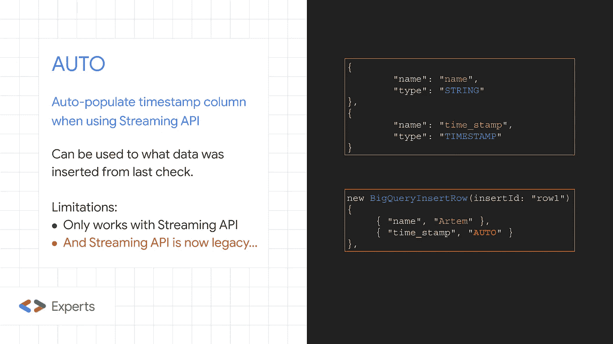
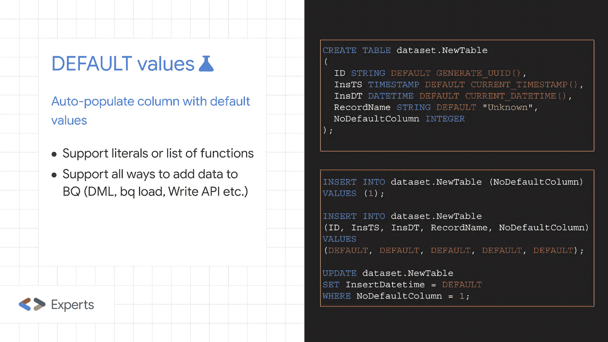
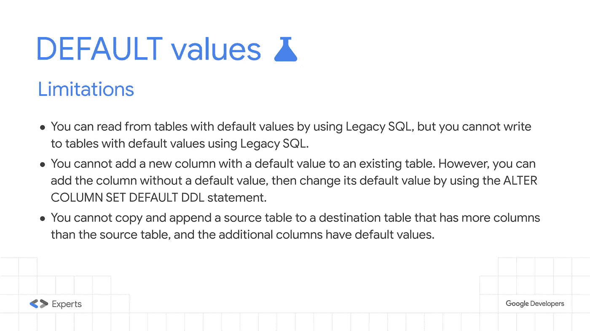
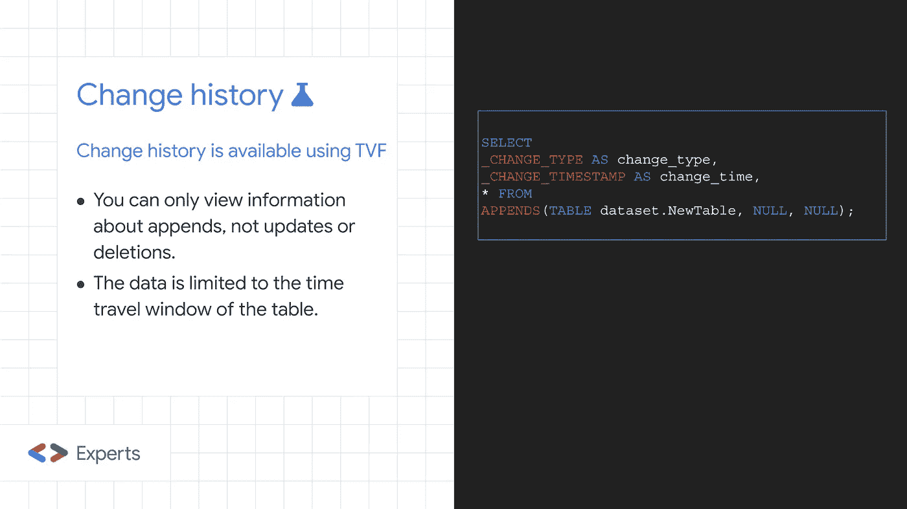

# BigQuery 的隐藏瑰宝——第 2 部分——变更跟踪

> 原文：<https://medium.com/google-developer-experts/hidden-gems-of-bigquery-part-2-change-tracking-263a6fd26b6d?source=collection_archive---------2----------------------->

前段时间，我在[谷歌云博客](https://cloud.google.com/blog/topics/developers-practitioners/hidden-gems-google-bigquery)上发布了“BigQuery 的隐藏宝石”。自从这篇文章发表以来，发生了一些变化，尤其是在变更跟踪方面。所以，是时候更新了…

在我们开始之前，这里有一个关于[多语句事务](https://cloud.google.com/bigquery/docs/reference/standard-sql/transactions)和[搜索索引](https://cloud.google.com/bigquery/docs/search-index)的快速更新——这两个特性现已正式发布，并准备在生产环境中使用！

现在到了主要部分…

在我的第一篇文章中，我讨论了检测哪些数据已经被处理以及之后添加了哪些数据的方法。处理它的一种方法是使用我最喜欢的“隐藏宝石”——自动:



然而，AUTO 的一个主要限制是它仅受流式 API 支持，并且流式 API 现在被标记为遗留 API(并且应该使用[存储写 API](https://cloud.google.com/bigquery/docs/write-api) )。我咨询了 BigQuery 团队，他们确认了 AUTO 不被 Storage Write API 支持。

然而，现在有两种新的甚至更好的方法来做到这一点！

# 默认值

有一个名为 [DEFAULT](https://cloud.google.com/bigquery/docs/default-values) values 的新特性(目前仍在预览中),它的工作方式与您预期的完全一样——您可以为一个列设置默认值(当定义一个表或稍后使用 ALTER 语句时),当添加(或更新)一条新记录时，如果没有提供该列的值，它将用指定的默认值填充。



默认特性支持文字和一组函数，包括非常重要的更改跟踪函数，如 CURRENT_DATETIME 和 CURRENT_TIMESTAMP(完整列表可在此处找到)。

这意味着该特性可以替代 AUTO 来检测何时向 BigQuery 表中添加新数据(但与 AUTO 相反，所有向 BigQuery 中插入数据的方式都支持默认值)。

如果未提供列数据或提供了值“default ”,则列数据将填充默认值。“DEFAULT”甚至可以用在 UPDATE 语句中。

这个特性有一些限制，但没有一个真正限制了它的可用性(其中一些可能会在特性正式发布时被删除)。



*关于缺省值还有更多，但是在这里重复这个特性的全部文档是没有意义的，可以在* [*这里*](https://cloud.google.com/bigquery/docs/default-values) *找到。*

# 改变历史

另一个惊人的新功能(目前仍在预览中)是[更改历史](https://cloud.google.com/bigquery/docs/change-history)。

没有比官方文件更好的描述了:

*BigQuery 更改历史允许您跟踪 BigQuery 表的更改历史。表的更改历史作为 SQL* [*表值函数(TVF)*](https://cloud.google.com/bigquery/docs/reference/standard-sql/table-functions) *公开，向您显示在指定时间范围内所做的特定类型的更改。此功能允许您处理对表所做的增量更改。*



APPENDS 函数返回包含原始表中所有列的表，外加两个附加列— _CHANGE_TIMESTAMP(可用于跟踪数据的添加时间)和 _CHANGE_TYPE(现在有点没用了，因为它只能有一个值— INSERT)。

与默认特性相反，更改历史有一个明显的限制—目前，它仅适用于追加数据(不适用于修改数据)。但是目前只支持一个值插入的 _CHANGE_TYPE 列的存在表明这种限制是暂时的，功能将在以后扩展。

另一个限制——它在一个时间旅行窗口内工作(默认情况下是 7 天),并且还有另一个[预览功能](https://cloud.google.com/bigquery/docs/time-travel#configure_the_time_travel_window)允许您更改它。

*还有更多关于变更历史的内容，但是在这里重复这个特性的全部文档是没有意义的，可以在* [*这里*](https://cloud.google.com/bigquery/docs/change-history) *找到。*

# 实验

我很想知道以下问题的答案:

*   如果一个表有两列，并且它们都有设置为 CURRENT_TIMESTAMP()的默认值，那么这两列中的值会不会相同？
*   默认设置为 CURRENT_TIMESTAMP()的列的值是否等于 APPENDS 函数中的 _CHANGE_TIMESTAMP 值？

让我们做一个简单的测试:

```
CREATE TABLE dataset.NewTable
(
  InsertTimestamp TIMESTAMP DEFAULT CURRENT_TIMESTAMP(),
  InsertTimestamp2 TIMESTAMP DEFAULT CURRENT_TIMESTAMP(),
);

INSERT INTO dataset.NewTable (InsertTimestamp, InsertTimestamp2) 
VALUES (DEFAULT, DEFAULT); 

SELECT
_CHANGE_TYPE AS change_type,
_CHANGE_TIMESTAMP AS change_time,  
* FROM 
APPENDS(TABLE dataset.NewTable, NULL, NULL);
```

这个简单的实验表明:

*   如果一个表有两列，并且这两列的默认值都设置为 CURRENT_TIMESTAMP() — **值将是相同的**。
*   默认设置为 CURRENT_TIMESTAMP()创建的值比 _CHANGE_TIMESTAMP 返回的值**小**(差异可能很大——在我的测试中，大约是 1.5 秒)。

# 摘要

BigQuery 太神奇了！感谢团队的努力，感谢谷歌员工，在我第一次发帖后，他们给我指出了那些新功能！

关于提到的功能的文档链接:

*   [汽车](https://issuetracker.google.com/issues/72080883)
*   [默认](https://cloud.google.com/bigquery/docs/default-values)值
*   [改变历史](https://cloud.google.com/bigquery/docs/change-history)
*   [改变时间旅行窗](https://cloud.google.com/bigquery/docs/time-travel#configure_the_time_travel_window)