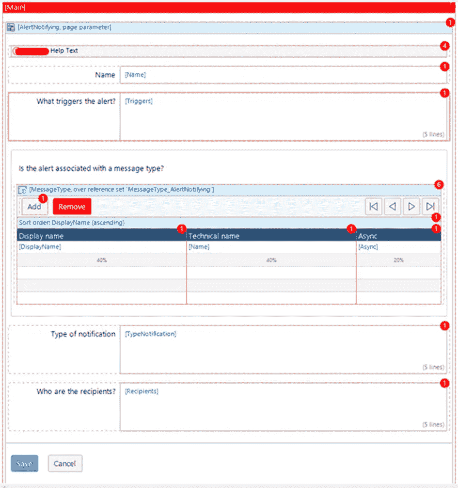

# Mendix 模型 SDK 的隐藏功能

> 原文：<https://medium.com/mendix/hidden-power-of-the-mendix-model-sdk-ebd6cbca9c7?source=collection_archive---------3----------------------->


Hidden power of the Mendix Model SDK

# 虽然 Mendix SDK 已经存在很多年了，但是你并不经常听说它。这很有可能是因为您的大部分 web 和移动应用程序开发并不需要它，并且有时可以被认为是新用户对平台的可选添加。

开始使用它通常会让平台上的新用户感到害怕，因为与它交互可能相当有技术性和挑战性。毕竟，Mendix 通常专注于低代码用户，而不是习惯于以编程方式解决问题的典型高代码用户。

简单地跨过第一个障碍- [建立你的项目开发环境](https://docs.mendix.com/apidocs-mxsdk/mxsdk/setting-up-your-development-environment)，开启一个已经准备好并等待应用的利益世界。所以，现在就跟我来，在您的应用中释放 Mendix [模型 SDK](https://docs.mendix.com/apidocs-mxsdk/mxsdk/) 的隐藏力量。

> 这些好处是什么？让我们来看看一些常见的例子:

> *自动化各种手工任务*
> 
> *在您的 Mendix 模型中自动化批量和批量更改*
> 
> *从元模型导出文档，例如模型描述和文档中的文本*
> 
> *提取模型信息到另一个框架*
> 
> *提取模型信息以分析元数据，列出您组织中的应用并进行排名*
> 
> *将遗留代码导入您的 Mendix 应用*

您可以在此阅读其他一些典型用例[。](https://docs.mendix.com/apidocs-mxsdk/mxsdk/sdk-use-cases)

在这篇博客中，我想解释并分享一个这样的用例，它对我个人有所帮助:避免了在大型 Mendix 模型上进行大量的手动操作，这是一个具有很长开发历史的应用程序，因此在 Studio Pro 中反应时间也较慢。

## **在 Mendix 中自动更改数百页**

我们的一个多租户 Mendix 应用程序有大约 8300 个微流和 1500 个页面，其中一些已经很旧了:这个项目从 Mendix v2 开始就存在了，这些年来一直在迁移，现在是 Studio Pro 8.18(此时是 LTS)。尽管项目已经被迁移和更新，但是仍然有数百个页面基于旧式的表格布局。我们的 Mendix 模型的部分技术债务多年来一直没有改变。所有新的和改变的部分都建立在有布局的页面中，没有旧的难看的表格:)

那么，为什么我们要努力实现自动化，而不是手动更改所有这些页面，并将其重新构建为新的布局样式呢？我们选择这种方法有几个原因:

1.为什么不呢？从字面上看，每一步都是相同的，在页面中一个标准且可预测的位置复制和粘贴实体的属性。这是完全自动化的，错误更少，输出也更标准化。当然，也有一些例外——你需要解决的边缘案例和情况。但是这和软件开发的许多其他方面不一样吗？

2.**手动改变每个页面是非常重复的(而且有点无聊**🤷 **)** 。你不会想让你的 Mendix 制作者厌烦这种苦差事，并在这上面花费宝贵的开发时间。

3.**交付时间:编写 SDK 脚本被认为比手动更新所有过时页面更快**。尽管我们在启动时面临一些问题，并且必须适应学习曲线，但这仍然是简单的数学问题——花费几个小时进行自动化比手动重构要快。因为这个应用程序太大了，即使在 Studio Pro 中打开一个页面也需要几秒钟。想象一下作为一个人手动完成这个过程所花费的时间。

4.**机会:试验 SDK 和解决现实世界的问题给了我们学习的机会。**一个用例，值得花时间研究自动化解决方案的 SDK API。不是每个用例都适合，有时你肯定需要一个人来做决策。

5.有趣且有教育意义:做这件事非常有趣！你需要解决一些难题，挑战一些挑战，同时学习很多新东西。即使是有经验的开发人员也会从 Mendix 的后端架构中学到很多东西，从而提高他们的架构知识。

还有很多原因，但是让我们继续这个具体的案例。在下面的示例中，您可以看到一个带有表格布局的页面上的简单数据视图。每个属性和相应标签都有一些列，每个属性都有一个新行。


要将属性迁移到新的布局页面，只需使用布局将属性复制并粘贴到页面上，并将其放置在正确的布局网格上。结果是几乎相同的页面，只是没有难看的表格，并且在页面上对齐样式可以在布局中处理得更好，而不是在页面上。



这很简单，但是您可以想象具有多个(嵌套的)数据视图和更多属性的更复杂的页面会花费更多的时间。

## **我们的脚本自动化方法**

对于这个具体的例子，我们编写了一个脚本，基本上是异步运行脚本，在一小组模块上进行测试，并将转换页面的结果提交给一个新的分支。在几次迭代中运行、验证、测试和改进脚本之后，我们有足够的信心在整个项目中运行它。这导致第一个脚本在第一个模块子集上转换了 150 多个页面。一些页面没有正确迁移，解决所有边缘场景需要大量时间，因此一些页面被排除在自动转换之外，并被手动修复。完成转换后，我们将分支合并到主线和测试中，并将其部署到生产中。

只是为了解释我们如何设置代码，下面举个例子。当然这不是所有的代码，而只是一个开始的指针。

```
import { sdkuModules } from '../vendor/mendix-sdk-utils';
import { Parser, ParserResult } from  './parser'
import { Converter } from './converter'
import { OnlineWorkingCopy, Revision } from 'mendixplatformsdk';class Processor {
    public async processForms(moduleName: string, exceptions: string[] = []): Promise<void> {
        for(let batch = 0; true; batch++) {
            if(this.state instanceof Revision) this.state = await this.state.createWorkingCopy();

let module = this.state.model().findModuleByQualifiedName(moduleName);
            if(!module) throw '[Processor] Could not find module'

            // Parse
            console.log(`[Processor] [Forms] Loading forms.`);
            let forms = await sdkuModules.pages.forms.FormProcessor.loadAll(module); // helper function to load all pages and snippets.
            console.log(`[Processor] [Forms] Processing ${forms.length} form(s).`);
            let parserResults = this.parser.parseForms(this.state, forms);

            // Convert
            let j = Math.min(this.batches[Math.min(batch, this.batches.length - 1)], parserResults.length);
            console.log(`[Processor] Processing batch [${0},${j}) of [0,${parserResults.length}).`);
            for(let parserResult of parserResults.slice(0, j)) {
                this.converter.convert(parserResult);
            }// Commit
            try {
                console.log(`[Processor] Committing changes.`)
                this.state = await this.state.commit(this.commitBranch);
            }
            catch (error) {
                console.log(`[Processor] Error committing batch to API: ${JSON.stringify(error)}.`);
                break;
            }

            // Repeat
            if(j == toConvert.length) break;
            console.log(`[Processor] Sleeping ${this.batchTimeOut} milliseconds before loading new batch.`)
            await new Promise(resolve => setTimeout(resolve, this.batchTimeOut))
        }
    }
```

## **未来工作**

这个用例教会了我们这么多，并为所有类似的批处理作业生成了一个引导脚本。因为这个应用程序有如此多的页面和微流，我们在未来做的每一个通用和重复的转换都可能会自动进行类似的微小变化，而无需对现有的批处理脚本进行重大修改。

例如，在这个特定的 Mendix 应用程序中保存了许多文档和帮助文本。我们还创建了另一个脚本，用于从 Mendix 元模型中提取所有帮助文本，并将它们导出到我们的 github 文档页面。这样，我们就不必手动复制文档并将其存储在一个地方，可以同步到多个频道。

希望这能给你一些启发，让你利用 [Mendix Model SDK](https://docs.mendix.com/apidocs-mxsdk/mxsdk/generating-code-from-the-model) 的力量自动化工作中的一些重复任务。

## 阅读更多

 [## Mendix 平台 SDK-API 和 SDK | Mendix 文档

### 在 Mendix Platform SDK 可以让您的生活变得更轻松之前，您应该了解一下 Mendix Model SDK。从…开始

docs.mendix.com](https://docs.mendix.com/apidocs-mxsdk/mxsdk/)  [## 了解 Mendix 元模型-API 和 SDK | Mendix 文档

### 如果你熟悉 Studio Pro，你会知道 Mendix 模型只是一个文档集合(微流、域…

docs.mendix.com](https://docs.mendix.com/apidocs-mxsdk/mxsdk/understanding-the-metamodel)  [## JavaScript 和 TypeScript 资源-API 和 SDK | Mendix 文档

### 作为一名使用 Mendix 平台的开发人员，您可能熟悉使用…

docs.mendix.com](https://docs.mendix.com/apidocs-mxsdk/mxsdk/javascript-typescript-resources) 

*来自出版商-*

如果你喜欢这篇文章，你可以在我们的 [*中页*](https://medium.com/mendix) *找到更多喜欢的。对于精彩的视频和直播会话，您可以前往*[*MxLive*](https://www.mendix.com/live/)*或我们的社区*[*Youtube PAG*](https://www.youtube.com/c/MendixCommunity/community)*e .*

*希望入门的创客，可以注册一个* [*免费账号*](https://signup.mendix.com/link/signup/?source=direct) *，通过我们的* [*学苑*](https://academy.mendix.com/link/home) *即时获取学习。*

有兴趣更多地参与我们的社区吗？你可以加入我们的 [*Slack 社区频道*](https://join.slack.com/t/mendixcommunity/shared_invite/zt-hwhwkcxu-~59ywyjqHlUHXmrw5heqpQ) *或者想更多参与的人，看看加入我们的*[*Meet ups*](https://developers.mendix.com/meetups/#meetupsNearYou)*。*