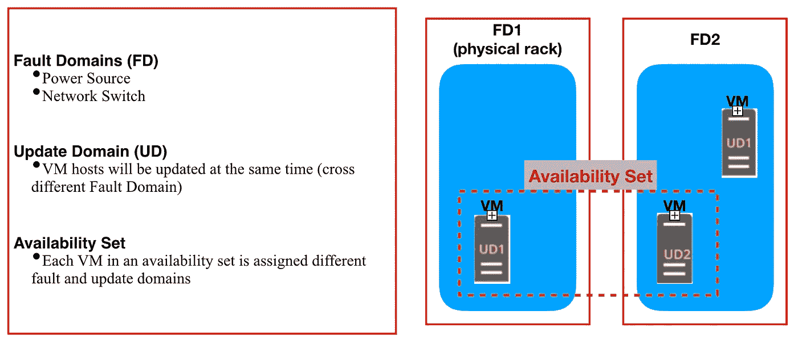
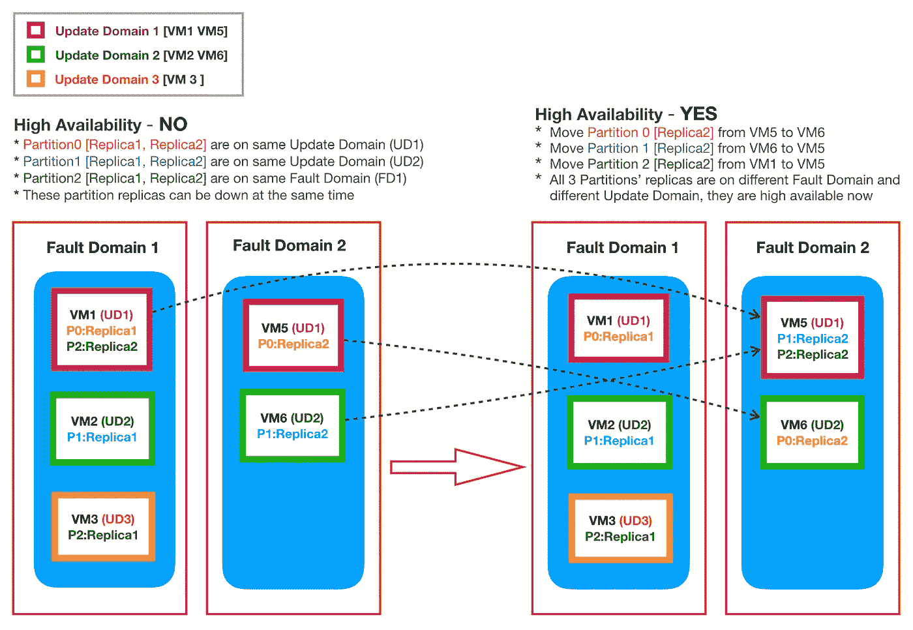
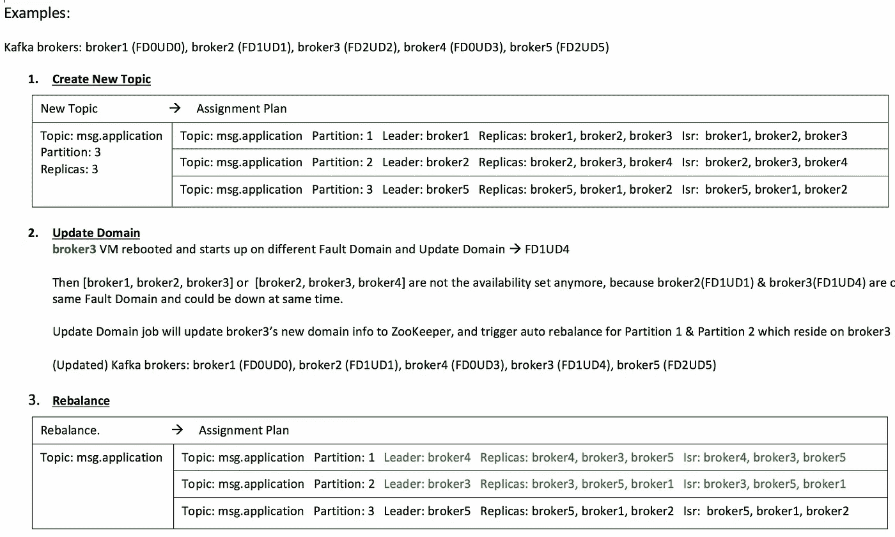
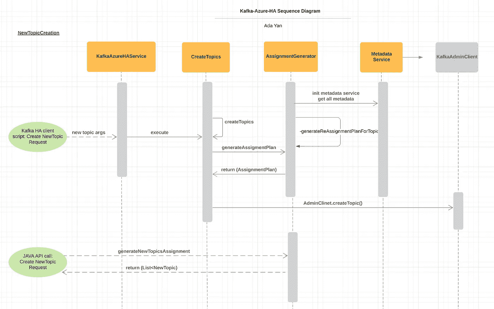
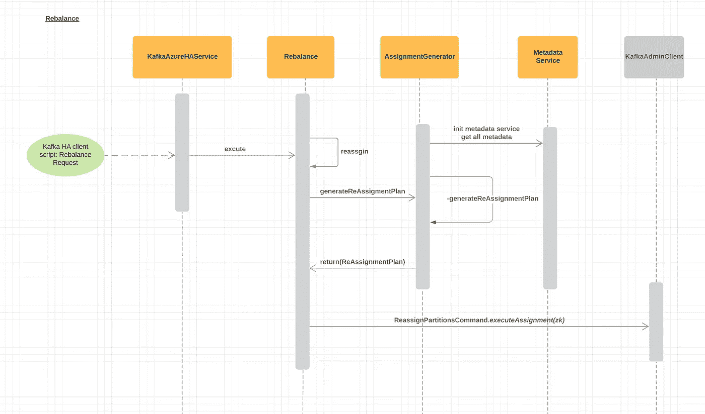
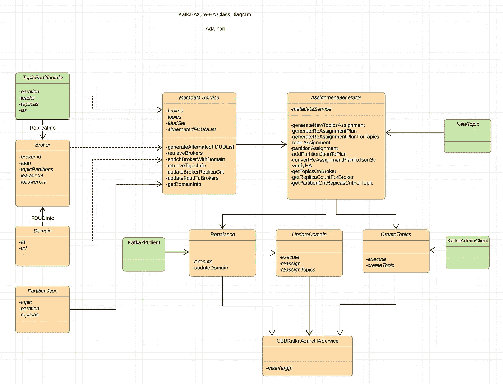

# 微软 Azure 云中的高可用性 Kafka 服务

> 原文：<https://medium.com/walmartglobaltech/high-availability-kafka-service-in-microsoft-azure-cloud-5c26f69bf4ef?source=collection_archive---------0----------------------->

Safe replicas, safe teams!

Apache Kafka 是一个分布式流平台，在大多数环境中，通过适当的配置设置可以实现高可用性。但是，如果你想在微软 Azure 中建立一个 Kafka 集群，使用其独特的容错域和更新域风格以及虚拟机的 [SLA，高可用性 Kafka 服务可能会受到损害，即使你严格遵循来自 HCC](https://azure.microsoft.com/en-us/support/legal/sla/virtual-machines/v1_8/) (Hortonworks 社区连接)的[建议。](https://community.hortonworks.com/articles/185086/ha-design-and-deployment-considerations-for-deploy.html)

# **目标**

构建一个 Kafka Azure 客户端工具，在微软 Azure 云中实现高可用性 Kafka 服务。

# **背景**

如果您可以正确管理 kafka 和主题配置，例如使用正确的副本因子实现冗余，并使用 rack awareness (kafka 0.10)在机架间传播副本，Kafka 应用程序将具有高可用性和对节点故障的弹性。但是，如果您在 Microsoft Azure Cloud 上设置 Kafka 集群，机架感知功能将会受到影响。

Microsoft Azure 上的虚拟机可能会受到一些情况的影响:计划外的硬件维护、意外停机和计划内维护。虚拟机将经历意外停机(重新启动),在某些情况下还会丢失临时驱动器。除此之外，虚拟机可以重新启动并重新定位到不同的服务器或不同的机架。为了减少一个或多个此类事件对您系统的影响，微软建议用户在一个**可用性集**中配置多个虚拟机，以实现高可用性和冗余。

什么是 [**可用性集**](https://docs.microsoft.com/en-us/azure/virtual-machines/windows/tutorial-availability-sets) ？
可用性集是数据中心内虚拟机的逻辑分组，用于提供冗余和可用性。Azure 云中的每个虚拟机都被底层 Azure 平台分配了一个**容错域**和一个**更新域**。**故障域**定义了共享公共电源和网络交换机的一组虚拟机(类似于机架的概念)。**更新域**表示可以同时重启的虚拟机组和底层物理硬件。

意识到 Azure VM 维护和意外停机可能会影响高可用性 Kafka 服务，微软在其 HDinsight 托管服务中提供了一个重新平衡工具。该工具将为现有主题分区提供重新平衡特性，但不为主题创建提供，并且不会意识到 VM(代理)域在重新启动后发生了变化。此工具只能在特定的 Microsoft 托管服务环境中使用。因此，我们需要一个独立的工具，它是通用的，任何 Kafka 实例或集群都可以访问。

# 范围和特点

我们的 Kafka Azure 客户端工具可以像 Kafka 客户端一样使用，以实现 Azure 云中的高可用性。它具有以下特点

*   在高可用性集中创建主题分区
*   重新平衡存在风险的现有分区，将它们重新分配到高可用集

它还具有以下附加功能

*   设置 cronjob 以检测虚拟机域更改，并自动触发受影响分区的重新平衡作业，重新分配分区以使它们再次高可用。
*   可用作 java API，由任何 java 程序调用以创建主题，在具有高可用性特征的 Azure 环境中重新分配主题分区。

# 例子

*答:以下示例在 2 个容错域和 3 个更新域上创建了 6 台虚拟机。本课题分为三个部分:P0，P1，P3。每个分区有 2 个副本:副本 1、副本 2*

(左)所有分区都存在高可用性风险，原因如下所述。

(右)使用 Kafka Azure 客户端工具重新平衡话题后。所有 3 个分区的副本都被重新分配给适当的代理(VM)并实现了**高可用性—副本都在不同的容错域和不同的更新域上。**

*B:这个例子解释了在代理关闭并在不同的更新域上启动后，如何重新实现高可用性，这使得驻留在这个代理上的副本的高可用性有风险。*

1.主题由 Kafka Azure 客户端工具创建，具有高可用性。

2.代理 3 关闭，并在不同的容错域和更新域上启动。从 FD2UD2 变成了 FD1UD4。分区 1 和分区 2 存在高可用性风险，因为代理 2 和代理 3 位于同一个故障域 FD1 上。更新域作业将检测代理 3 的域更改，并重新平衡代理 3 上的分区

3.代理 3 会自动触发重新平衡作业。在为分区 1 和分区 2 重新分配副本后，再次实现了高可用性。

# 技术细节

为了 1)高效地为所有分区的副本找到一组高可用性代理 2)在 Kafka 集群中公平地分布副本，实现了以下算法和逻辑来实现目标。

*   制定一个 FaultDomain/UpdateDomain 列表，从中可以按顺序获得可用性集
    ，例如 Azure 云中的 20 个虚拟机，其中有 3 个 FaultDomain 和 20 个 UpdateDomain

*   通过选择随机的起点来获得公平的副本分布。领导者和跟随者的数量将被考虑来选择复制品的领导者。
*   当代理虚拟机驻留在从随机起点开始违反顺序设置的可用性的环境中时，该工具会将计算的 FDUD 列表中的窗口切换到下一个索引。

*   在某些情况下，例如大多数代理都关闭了，或者只有 1 或 2 个容错域被利用。FDUD 列表可能导致“没有高可用集可用”。但是您仍然希望创建主题以避免数据丢失，可以使用“-force”选项来创建主题或重新分配副本。当 Kafka 集群恢复正常时，您可以触发重新平衡任务，将分区副本移回高可用性集。
*   虚拟机故障域和更新域信息将被创建并作为 ZNode 存储在 zookeeper 中。(/brokers/domains/ <brokerid>→ FD0UD0)</brokerid>

# 卡夫卡未决问题

在开发过程中，我们遇到了一些 Kafka 开放的副本重新分配功能的问题。我们对 Kafka Azure 客户端工具进行了一些改进，以解决一些未解决的问题。对于一些人来说，我们将在未来进行改进，并在 Kafka 解决他们的问题后采用新的协议。

*   [KAFKA-1792](https://issues.apache.org/jira/browse/KAFKA-1792) 改变“生成”的行为，以产生具有公平副本分配和最小重新分配数量的分配配置

重新分配分区是一项劳动密集型任务，并且[-generate]选项不会考虑当前的副本分配，也不会尝试最小化代理之间的副本移动次数。大型副本重新分配可能会影响群集性能。这是写在上面的卡夫卡公开票。

Kafka Azure 客户端工具中的改进:重新平衡功能能够将特定的代理 Id 作为参数，并且只重新分配驻留在该代理上的分区，以最小化副本移动的数量。

*   [KAFKA-5601](https://issues.apache.org/jira/browse/KAFKA-5601) 重构重新分配分区命令以使用 AdminClient

目前，重分配分区命令(由 kafka-reassign-partitions.sh 使用)直接与 ZooKeeper 对话。让它使用 AdminClient API 会更好。Kafka Azure 客户端工具也使用 ReassignPartitionsCommand 通过 ZooKeeper 重新分配副本。当这个 Kafka open ticket 解析后，我们可以相应地将其更改为使用 AdminClient API。

Kafka Azure 客户端工具中的改进:新的主题创建使用了新的 AdminClient API。

# 未来的其他改进

在为副本分配代理时，可以考虑磁盘使用情况。

自动将一些分区负载重新分配给新加入的代理，以实现更好的公平分配和负载平衡。

# 设计图

序列图

类图

# 参考

 [## 借助 Apache Kafka - Azure HDInsight 实现高可用性

### 了解如何在 Azure HDInsight 上使用 Apache Kafka 确保高可用性。了解如何重新平衡分区副本…

docs.microsoft.com](https://docs.microsoft.com/en-us/azure/hdinsight/kafka/apache-kafka-high-availability)  [## 教程 Azure 中 Windows 虚拟机的高可用性

### 在本教程中，您将学习如何使用……提高虚拟机(VM)的可用性和可靠性

docs.microsoft.com](https://docs.microsoft.com/en-us/azure/virtual-machines/windows/tutorial-availability-sets#availability-set-overview)  [## 高可用性 Kafka 服务的设计和部署考虑事项

### 文章本文的目标是涵盖高可用性 Apache Kafka 的关键设计和部署考虑事项…

community.hortonworks.com](https://community.hortonworks.com/articles/185086/ha-design-and-deployment-considerations-for-deploy.html)