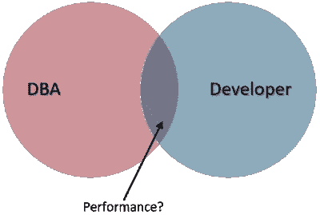

# 高性能数据平台

> 原文：<https://medium.com/version-1/high-performance-data-platforms-c3bc22e36f2?source=collection_archive---------0----------------------->

Photo by [Sigmund](https://unsplash.com/@sigmund?utm_source=unsplash&utm_medium=referral&utm_content=creditCopyText) on [Unsplash](https://unsplash.com/s/photos/data-platform?utm_source=unsplash&utm_medium=referral&utm_content=creditCopyText)

DBA 还是开发者？谁**负责**确保您的数据平台提供正确的**性能？**

大多数应用程序需要一个后端数据库来存储用户信息、配置、库存、订单、交易等。拥有**正确的设计**对你的网站、手机应用或 API 的性能有着巨大的影响。一旦你达到临界质量，在高容量的情况下，任何不良设计的影响都会被放大。

**DBA** (数据库管理员)负责平台的平稳运行，检查资源是否可用，并确保备份到位。他们经常监督许多系统，而且时间紧迫。

**开发人员** (SQL 或数据库级)设计并实现保存数据所需的结构。它们确保您可以存储和检索运行应用程序所需的任何信息。

以下哪一项是**负责绩效的？**DBA 和开发人员都必须参与其中。谁最终负责？经验显示了一个缺口，在这个缺口上这个问题没有被拥有，让它悬着。

为了解决这个问题，我们需要:

*   识别花费**太长时间的数据库操作**
*   探索**执行计划**和数据访问路径
*   检查**存储器**的性能
*   修改**索引**策略
*   **重写查询**以获得最佳性能
*   测试，**测量**，验证，**改进**

未能解决这些问题会导致**成本增加**、高能耗、**应用程序响应时间不佳**、激怒消费者、声誉受损以及 IT 同事缺乏积极性。

聘请能够**评估和补救**这些问题的专家，以提供可靠和**可预测的性能**，充分利用您现有的 IT 投资。

## 关于作者:

Jamie Steele 在 Version 1 的咨询服务部门工作。