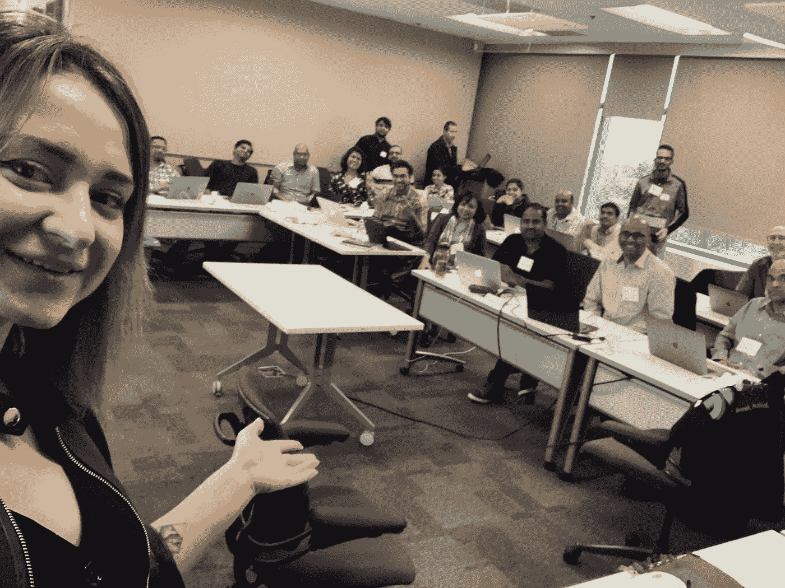
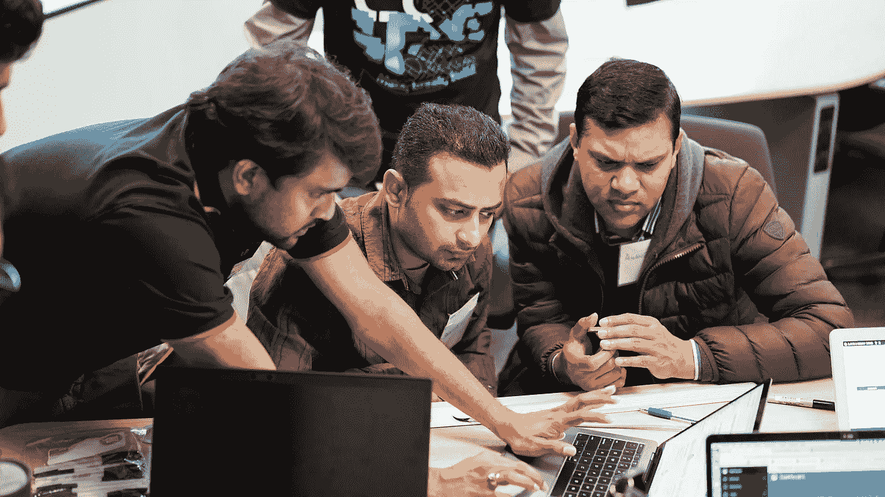
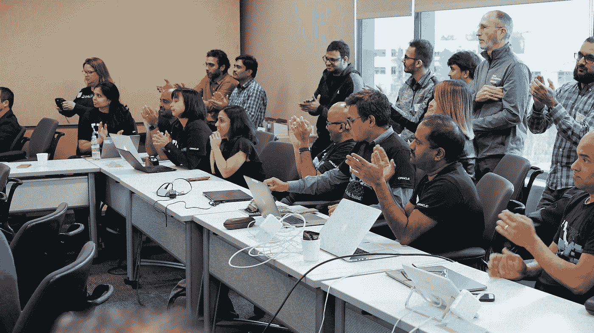

# Oracle Code Innovate @ Cisco 亮点

> 原文：<https://medium.com/oracledevs/highlights-from-oracle-code-innovate-cisco-oracle-integration-blog-67eef0c31ad8?source=collection_archive---------0----------------------->

做中学指的是美国哲学家杜威阐述的一种教育理论。没有适当相关实践的被动和理论知识是低效的。Oracle 云创新是找到满足您需求的解决方案的途径。Oracle 团队提供空间、食物、工具等资源— Oracle 云环境、由 [Oracle 云](https://cloud.oracle.com/tryit)专家组成的团队以及充满活力的态度，因此贵公司的开发人员可以协作并构建解决方案。Oracle Code Innovate 是一项类似于 sprint 的活动，在该活动中，程序员和其他人参与构建企业级解决方案。

几周前，思科举行了 Oracle Code Innovate。房间里坐满了拥有超过 10 年开发经验的思科工程师。观众渴望了解如何与 Oracle 的内部电子商务套件(也称为应用程序/应用程序或 EB-Suite/EBS)集成。EBS 由[企业资源规划](https://www.oracle.com/applications/erp/)(ERP)[客户关系管理](https://www.oracle.com/applications/customer-experience/what-is-crm.html)(CRM)[供应链管理](https://www.oracle.com/applications/supply-chain-management/) (SCM)计算机应用组成。在 Code Innovate 期间，思科工程师对实现用例很感兴趣，例如:

1.  从内部 ERP 到销售云的交易集成
2.  从 SaaS 云提取数据到本地数据库
3.  SaaS 商务活动中的 Web 服务集成
4.  主数据、历史事务数据和审计策略的数据迁移。

所有开发人员都熟悉云技术，但他们对 Oracle 云全栈工具包知之甚少。当我们宣布他们能够在短短两天内构建概念证明时，开发人员的反应是无价的。Oracle 团队从 Oracle 集成、Visual Builder Studio 和 Oracle 数据集成平台的高度概述开始了本次会议。然后，开发人员有时间组建一个团队，并提出他们想要集思广益的想法。在第一天结束时，我们有 30 名开发人员(包括六个团队，每个团队有五名成员)，他们都了解 Oracle 集成的功能。

第二天和第三天专门用来制造、打破和建设。每个团队都被指派了至少一名 Oracle 云专家，如果出现任何问题，他们可以帮助开发人员。代码创新的敏捷方法允许开发人员继续跟踪并展示结果。认为不可能在如此短的时间内取得进展的误解很快就消除了。作为证据，一个完成了从 SOAP 到 REST 的集成的开发人员在看到集成运行后开始鼓掌说，他没想到 Oracle 集成会工作得如此顺利。

最后，开发人员获得了使用 Oracle 集成的经验，这有助于他们扩展 EBS 的内部功能。解决方案允许实时了解思科业务的各个方面，确保其数据的准确性和同步性，最后但同样重要的是，提供了简化业务运营的选项。此外，在第三天的午餐后，开发人员有时间准备他们的推销，并在评委——思科项目经理和高管面前进行演示。结果超出了甲骨文和思科双方的预期。

同意为 Oracle Code Innovate 合作的公司提高了他们的创新能力。由于所有 Oracle 云工具代码都很低，使用起来很直观，因此任何员工只要得到足够的帮助，都可以在很短的时间内掌握该工具。思科、迈克菲等公司看到了参与代码创新的价值。他们确信 Oracle 云实现了其宣称的目标！