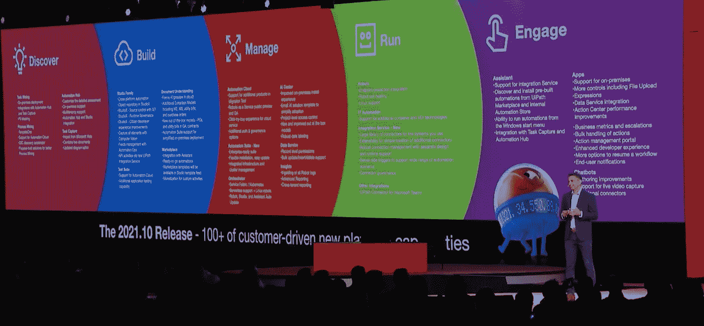
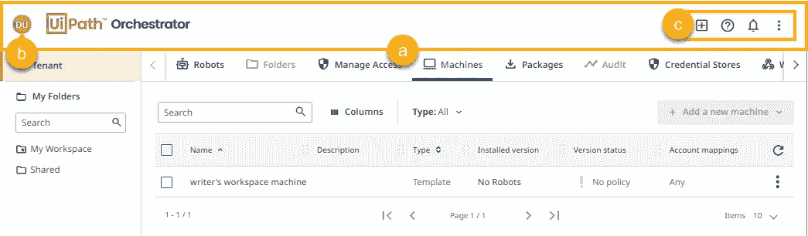
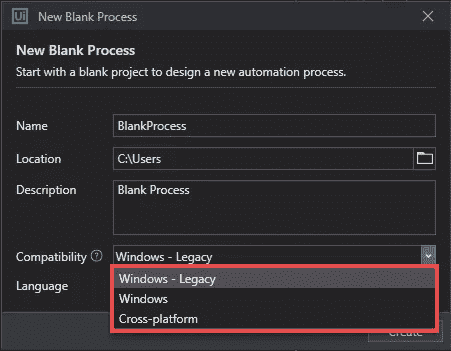

# UiPath 2021.10 和 UiPath 平台配置工具的亮点

> 原文：<https://medium.com/globant/highlights-of-uipath-2021-10-uipath-platform-configuration-tool-899033fa2ba?source=collection_archive---------1----------------------->

在 RPA 和智能自动化领域，UiPath 是一个似乎每天都在与自己竞争成为最好的平台。同样明显的是，新版本每半年发布一次，有时每季度发布一次。

我们都知道最近 UiPath 的最新版本(2021.10)。这个全新版本的 UiPath Orchestrator 有一些很酷很有用的布局更改，例如添加了一个在所有页面上都可见的页眉，这样您就可以访问以下控件:

用户菜单(b)和快捷选项(c)。

除了布局上的变化，如果我必须强调这次升级中其他令人印象深刻的功能，它们将是:

1.  ***系统管理员的新门户*** 便于平台在一个地方配置所有系统相关控制。
2.  ***无人值守机器人账户*** 允许管理员设置一个新账户*“机器人账户”*这最终消除了创建虚拟用户账户来运行无人值守自动化的需要。
3.  ***能够开发具有跨平台兼容性的机器人*** ，提供 3 个选项供您选择，即 Windows 传统、Windows 和跨平台。

4. ***带后台启动选项*** 的无人值守自动化，启用后，有助于无人值守自动化的开发，不会干扰正在运行的机器上的现有用户会话。

New Cross Platform Feature

用户可以在 UiPath Orchestrator 2021.10 发行说明中探索各种其他迷人功能。

在探索了关于 UiPath Orchestrator 2021.10 的一切之后，让我向你保证一件事，你首先会想到的是更新你的 UiPath Orchestrator 和 Studio，以充分利用新功能。

既然更新是免费的，为什么不充分利用添加的功能呢？只需花几个小时来检查您现有基础设施的健全性或就绪性，以接受更新。休息，你很好去升级。

***那不是很迷人吗？***

如果我告诉你有更有趣的事情，并且通过进一步阅读，你检查 2021.10 更新的系统准备情况的努力将大大减少，会怎么样？

***让我们看看 UiPath 平台配置工具能帮到你什么？***

UiPath 平台配置工具是一个 Powershell 脚本，可以帮助您检查 UiPath 升级和安装系统的健全性和就绪性。

***怎么下载？***

该工具与 UiPathOrchestrator.msi 安装程序捆绑在一起，默认情况下可以在 Orchestrator 安装目录*" C:\ Program Files(x86)\ ui path \ Orchestrator \ "*的 Tools 文件夹中找到。

也可以从下面的链接独立下载:

【https://download.uipath.com/UiPath. platform . configuration . tool . zip

***如果有多节点安装，在哪里运行脚本？***

如果是多节点安装，在与任何一个节点相关的机器上运行脚本就足够了。

***运行脚本的前提条件是什么？***

1.  Powershell 5.1+版本
2.  WebAdministrationModule 模块

***脚本检查什么？***

**安装前检查:**

1.  ***Asp.Net 核心* :** 检查 ASP.NET 核心 IIS 模块 v3.1.x+是否已安装且功能正常。如果不是，脚本将显示一条消息，提示您卸载并重新安装 Asp.NET 核心托管包。
2.  **CyberArk 目标:**只有在 web.config 中找到 CyberArk 时，脚本才执行检查。如果 CyberArk 没有安装在*" C:\ Program Files(x86)\ CyberArk "*文件夹下，则提示用户在 UiPath 中添加 CLIPasswordSdk.exe。Orchestrator.dll.config 文件。SecureStores . cyberark . clipasswordsdkexepath 密钥。
3.  **web.config 加密:**检查 web.config 文件是否被解密。如果加密，脚本会显示一条错误消息，你必须手动解密文件才能继续安装。升级后，Orchestrator 的大部分配置设置被移动到 UiPath.Orchestrator.dll.config。
4.  **web.config 锁定节:**检查< system.webserver >元素是否包含任何锁定节，如果检测到，您需要在 ISS 中手动解锁它们。
5.  **SQL Server 横向扩展:**检查是否使用了 SQL Server 横向扩展。系统会通知您在安装过程中启用了 Redis 横向扩展。
6.  **身份证明存储插件:**检查 Orchestrator 外部身份证明存储插件目标框架与的兼容性。NET 核心运行时。
7.  **NLog 插件:**检查 NLog 插件与。NET 核心运行时。
8.  **文件系统桶:**检查Orchestrator 桶根路径是否被添加到任何 2020.4 版本的配置文件的允许列表中。连接字符串部分需要在配置文件中可用

**安装后检查:**

1.  检查 Orchestrator 主机名、身份配置 Orchestrator Url 与 ssl 证书主题的相似性。
2.  检查 Orchestrator 存储桶的根路径是否已添加到配置文件的允许列表中。连接字符串部分需要在配置文件中可用。
3.  检查 Identity server 令牌签名证书:存在，可以验证，具有适当的密钥大小，具有可供应用程序池用户访问的私钥。
4.  查看文档页面，了解 Orchestrator 的安装后检查。

如果上述任何检查无效，脚本将输出一个错误或警告。

***平稳更新您的 Orchestrator 的一些重要提示:***

1.  完全备份您的 Orchestrator 数据库。
2.  备份您的 UiPath Orchestrator 配置文件，如 web.config ( *这通常被称为 UiPath。Orchestrator* 少数版本中的 Orchestrator.dll.config)，appSetting。Production.json *(对应 Identity 的和 webhooks* )。根据您使用的 Orchestrator 的版本，某些文件可能不可用。
3.  如果有足够的空间，拥有一切总比缺少什么好，不是吗？因此，我建议备份你所有的配置文件。
4.  备份所有 nuget 包目录。
5.  如果你使用洞察力，也要备份。

只需遵循提示，您就可以开始更新了。

***快乐自动化！！***

**参考:**

1.  UiPath 2021.10 发行说明
2.  UiPath Forun