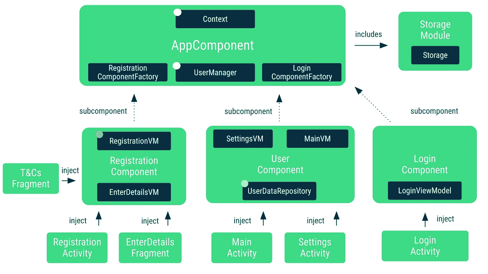

# 柄-将组件添加到层次结构中

> 原文：<https://medium.com/androiddevelopers/hilt-adding-components-to-the-hierarchy-96f207d6d92d?source=collection_archive---------0----------------------->


Illustration by [Virginia Poltrack](https://twitter.com/VPoltrack)

在刀柄组件层次的中间插入一个组件是不可能的。但是，您可以创建一个以 Hilt 组件为父级的自定义组件，并使用入口点访问其作用域类型。在本文中，我们将了解所有这些意味着什么，以及如何在 *Dagger 2 codelab* 代码中添加自定义组件。

Dagger 2 codelab 将 Dagger 添加到一个多活动应用程序中。由于用户可以登录和退出应用程序，用户信息在 Dagger 组件中处理，其寿命比 activity 组件长。



*Dagger components in the Dagger codelab app*

在上图中，注意`MainActivity`和`SettingsActivity`是如何访问范围为`UserDataRepository`的`UserComponent`的。内存中的`UserDataRepository`处理与登录用户相关的信息。当用户注销时，我们希望从内存中删除信息。

在《剑柄和匕首》中，每个组件都必须由一个知道何时需要创建或销毁该组件的对象(您可以将其视为生命周期所有者)持有。在我们的例子中，这个类是`UserManager`，它跟踪登录和注销。当用户登录时，创建一个新组件，当用户注销时，销毁该组件。通过这种方式，`MainActivity`和`SettingsActivity`可以访问组件的同一个实例，并被它注入。

该 app *除* `UserComponent`外的所有组件都可以映射到刀柄的标准组件:`AppComponent`映射到刀柄的`ApplicationComponent`，而`RegistrationComponent`和`LoginComponent`映射到`ActivityComponent`。

我们能做些什么来使`UserComponent`对剑柄更友好？我们有不同的可能性:

*   将`UserDataRepository`扩展到`ApplicationComponent`，并在用户注销时处理可空性。这就是[将你的 Dagger 应用程序移植到刀柄代码实验室](https://codelabs.developers.google.com/codelabs/android-dagger-to-hilt/#0)所做的事情。不理想，但可以在这种情况下工作。然而，它可能会在用户交换机上增加一些棘手的竞争条件。
*   制作`MainActivity`和`SettingsActivity`片段，并将`UserDataRepository`限定在使用这些片段的活动(句柄的`ActivityRetainedComponent`)范围内。这是一种“做适合框架的事情，而不是框架适合用例”的解决方案。这甚至不适用于所有情况，因为您可能需要在其他地方访问用户信息，而这些地方与广播接收器之类的活动没有联系。
*   保持导航结构不变，增加刀柄使用的`UserComponent`。

作为一个练习来学习更多关于 Hilt 的灵活性，让我们在这篇文章中讨论选项 3:添加一个组件到 Hilt 组件层次结构中。

# 刀柄设计决策

Hilt 坚持自己的组件层次结构，因为它包含了 Android 应用程序通常使用的最常见的组件。由于兼容性问题和不知道如何创建你的组件(例如使用什么`userId`)，不可能*而*在层之间*插入*一个组件(例如定制一个`ApplicationComponent`的组件 X 子组件，和`ActivityRetainedComponent`的父组件)。

可能的是*将*一个组件作为叶组件添加到层次结构中。在我们的例子中，我们可以让我们的定制组件`UserComponent`成为`ApplicationComponent`的子组件，如图所示。


*Adding a subcomponent of ApplicationComponent to the Hilt hierarchy*

> 本文中的用例包括向父级为`ApplicationComponent`的层次结构中添加一个定制组件(即`UserComponent`)。然而，正如我们将在后面看到的，你可以让你的定制组件扩展你想要的任何组件，要么是一个预定义的手柄组件，要么是你自己的其他定制组件。

*插入*和*添加*一个组件之间的主要区别在于，如果你*在层次结构中插入*一个组件，它的作用域绑定在它的子组件(层次结构中下面的组件)中是可用的，而如果你*添加*一个组件，它们就不可用。如果您创建自己的*层次结构，并与 Hilt 的层次结构平行，那么您可以让这些限定范围的绑定在层次结构中向下流动(或可用)。然而，那会使你失去`@AndroidEntryPoint`功能，你必须使用入口点来获得 Android 框架类中的依赖项。*

在我们的例子中，由于我们将*添加*一个组件到层次结构中，我们将不会有`UserDataRepository` ( `UserComponent`的作用域类型)作为`@AndroidEntryPoint`类中的绑定可用，所以我们不能将它作为任何其他作用域类型注入:

稍后我们将看到在我们的类中有哪些不同的选项来获取`UserDataRepository`的作用域实例。

# 向层次结构中添加组件

如[自定义组件文档](https://dagger.dev/hilt/custom-components)所示，您可以使用`@DefineComponent`注释声明一个组件。

我们将`UserComponent`作为`ApplicationComponent`的子组件，正如在`@DefineComponent`注释的父参数中所指定的。此外，我们创建了`@LoggedUserScope`来将类型的范围扩展到`UserComponent`。使用标注了`@DefineComponent.Builder`的构建器来创建`UserComponent`的实例，稍后您会看到，这就是`UserManager`将要使用的。

> 使用`@DefineComponent`定义一个可在应用中使用的新自定义组件。它接受父组件作为参数。新组件将扩展父组件，这意味着所有父绑定都将在新组件中可用。因为我们这篇博文的具体用例，我们使用了 Hilt 的 ApplicationComponent，但是，你可以让它扩展你想要的任何组件:它可以是一个 Hilt 组件，也可以是你已经定义的任何其他定制组件。

这样，我们就可以将类型的范围扩展到这个组件了:

```
**@LoggedUserScope**
class UserDataRepository **@Inject** constructor(...) { ... }
```

# 管理组件的生命周期

组件层次结构中范围更高的类应该负责该组件的生命周期。在我们的例子中，这个类是`UserManager`，它的作用域是`ApplicationComponent`。

由于`UserManager`需要知道如何创建`UserComponent`的实例，它应该在构造函数中接收它的构建器。因为`UserComponent`是`ApplicationComponent`的子组件，所以构建器可以作为绑定在那里使用。

# 访问作用域绑定

您可以使用入口点访问`UserComponent`的作用域绑定。对于我们的例子，我们可以创建一个公开`UserDataRepository`的入口点:

```
**@InstallIn(UserComponent::class)** @EntryPoint
interface UserComponentEntryPoint {
  fun userDataRepository(): UserDataRepository
}
```

您可以通过使用`UserComponent`的实例来访问这个入口点:

# 警告

到目前为止，我们看到的代码有一些注意事项:

*   定制组件中的作用域类型并不沿着 Hilt 组件层次结构向下流动。这就是为什么你需要使用入口点，并且你不能把它作为另一个类的依赖，除非你使用 [AssistedInject](https://github.com/square/AssistedInject) ，如这个[例子](https://github.com/manuelvicnt/android-dagger-to-hilt/pull/1)所示。
*   这不是一个完整的登录/用户解决方案，因为这种设置在用户显式登录和注销应用程序时有效。如果你的应用程序允许在同一个屏幕上切换账户，那么当这种情况发生时，你需要手动重启活动/片段。或者，您可以给`UserManager`添加一个回调函数，以了解帐户何时发生了变化，从而相应地更新屏幕上的信息。

尽管不可能在 Hilt 组件层次结构的中间插入组件，但是您可以创建一个以 Hilt 组件为父组件的组件，并使用入口点访问它的作用域类型。