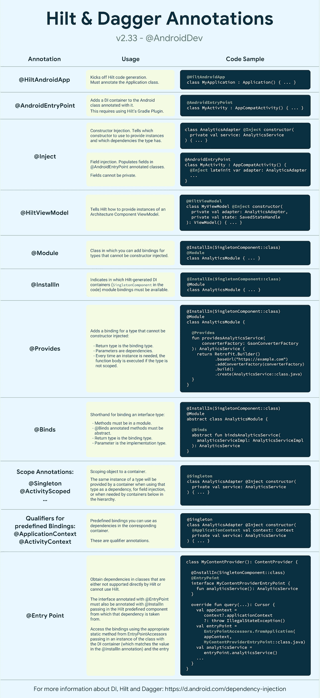

# 刀柄和匕首注释备忘单

> 原文：<https://medium.com/androiddevelopers/hilt-and-dagger-annotations-cheat-sheet-9adea070e495?source=collection_archive---------1----------------------->

Illustration by [Virginia Poltrack](https://twitter.com/VPoltrack)

通过为项目中的每个 Android 类提供容器并为你自动管理它们的生命周期*，Hilt 定义了一种**标准方式**来在你的应用程序中进行[依赖注入(DI)](https://developer.android.com/training/dependency-injection/hilt-android) 。Hilt 构建在流行的 DI 库 [Dagger](https://developer.android.com/training/dependency-injection/dagger-basics) 之上，因此受益于 Dagger 提供的编译时正确性、运行时性能、可伸缩性和 [Android Studio 支持](/androiddevelopers/dagger-navigation-support-in-android-studio-49aa5d149ec9)。*

*这个备忘单可以让你快速看到*不同的刀柄和匕首注释做什么，以及*如何使用它们。有关 DI 和刀柄的更多信息，请查看这些[指南](https://developer.android.com/training/dependency-injection/hilt-android)或阅读[文档](https://dagger.dev/hilt)。如果你喜欢循序渐进的学习方法，可以在 Android 应用 codelab 中使用 Hilt 来查看[。](https://codelabs.developers.google.com/codelabs/android-hilt)***

***[**下载 PDF 格式的备忘单**](https://developer.android.com/images/training/dependency-injection/hilt-annotations.pdf)***

******

***Hilt and Dagger annotations cheat sheet. [Download in PDF here](https://developer.android.com/images/training/dependency-injection/hilt-annotations.pdf).***