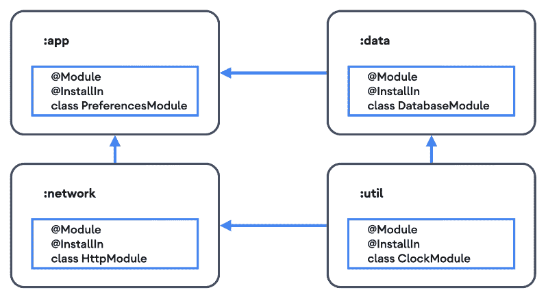
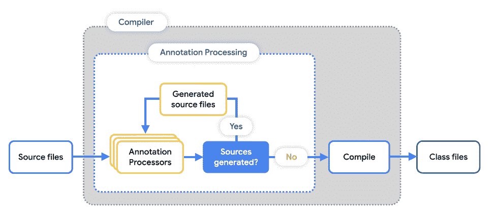

# 疯狂技能系列中的手柄扩展

> 原文：<https://medium.com/androiddevelopers/hilt-extensions-in-the-mad-skills-series-f2ed6fcba5fe?source=collection_archive---------4----------------------->

这是剑柄上疯狂技能系列的第四集！请务必查看[第 1 集](/androiddevelopers/introduction-to-hilt-in-the-mad-skills-series-40f0908f2fc0)—DI 和刀柄介绍、[第 2 集](/androiddevelopers/hilt-testing-best-practices-in-the-mad-skills-series-8186a57eee2c) —测试最佳实践，以及[第 3 集](/androiddevelopers/mad-skills-series-hilt-under-the-hood-9d89ee227059) —引擎盖下的刀柄。在这一集，我们将看看如何编写自己的刀柄扩展。

如果您喜欢以视频格式观看这些内容，请点击此处查看:

# 示例:工作管理器扩展

刀柄扩展是生成代码的库，通常通过注释处理器。生成的代码是模块或入口点，它们构成了 Hilt 的依赖注入图。

扩展的一个例子是用于 [Jetpack 的工作管理器](https://developer.android.com/training/dependency-injection/hilt-jetpack#workmanager)的集成库。WorkManager 扩展有助于减少为工作人员提供依赖关系所需的样板文件和设置。这个库由两个工件组成， *androidx.hilt:hilt-work* 和*Android x . hilt:hilt-compiler*。第一个工件包含 HiltWorker 注释以及一些运行时助手类，而第二个工件是一个注释处理器，它使用第一个工件的注释提供的信息生成模块。

使用扩展非常简单，只需用@HiltWorker 注释您的工人:

那么扩展编译器将生成一个@Module 注释类:

该模块为工作线程定义了一个可由 HiltWorkerFactory 访问的绑定。然后，WorkManager 被配置为使用工厂，支持工人的依赖注入。

# 刀柄聚合

支持扩展的一个关键机制是，Hilt 能够发现类路径中的模块和入口点。这被称为聚合，因为模块和入口点被聚合到用@HiltAndroidApp 注释的应用程序中。

得益于 Hilt 的聚合，任何用@InstallIn 生成@Module 或@EntryPoint 注释类的工具都会被 Hilt 发现，并在编译时成为 Hilt DI 图的一部分。这使得用户无需任何额外的工作就可以轻松地将扩展插件插入到刀柄中。

# 注释处理器

生成代码的一种常见方式是通过注释处理器。在将源代码转换成类文件之前，注释处理器在编译器中运行。当找到一个带有处理器声明的受支持注释之一的源时，处理器将运行。处理器可以生成可以进一步处理的代码，因此编译器会循环运行注释处理器，直到不再生成新的源代码。一旦所有回合结束，编译器就将源代码转换成类文件。

Annotation Processing Diagram

由于多轮机制，处理器可以相互作用。这很重要，因为这允许 Hilt 的注释处理器处理其他处理器生成的@Module 或@EntryPoint 类。这也意味着你的扩展可以建立在别人编写的扩展之上！

[WorkManager 扩展处理器](https://cs.android.com/androidx/platform/frameworks/support/+/androidx-main:hilt/hilt-compiler/src/main/kotlin/androidx/hilt/work/)基于用@HiltWorker 注释的类生成代码，验证注释用法，并使用 [JavaPoet](https://github.com/square/javapoet) 等库生成代码。

# 刀柄延伸部分注释

在 Hilt 的 API 中有两个重要的注释，扩展应该使用它们来正确地与 Hilt 集成。它们是@GeneratesRootInput 和@OriginatingElement。

由扩展触发代码生成的注释应该用@GeneratesRootInput 进行注释。这让 Hilt 的注释处理器知道它应该在生成组件之前等待扩展注释处理器完成。例如，@HiltWorker 注释本身是用@GeneratesRootInput 注释的:

用@Module 或@EntryPoint 以及@InstallIn 注释的生成类也应该用@OriginatingElement 注释，它的值是导致生成模块或入口点的顶级类。这是为了让 Hilt 能够识别生成的模块或入口点是否是本地测试。例如，如果一个内部类@HiltWorker 是在一个 Hilt 测试中定义的，那么这个模块的原始元素就是这个测试。

对于以下测试:

生成的模块将包含以下@OriginatingElement:

# 主意

刀柄扩展有多种可能性，下面是一些创建扩展的想法:

**项目中常用的模式。**

如果您的项目中有一个创建模块或入口点的通用模式，那么它们很可能可以通过一个柄扩展来自动化。例如，如果对于每个实现特定接口的类，必须创建一个具有多绑定绑定的模块，那么就可以创建一个扩展，只需对实现类进行注释，就可以生成多绑定模块。

**支持非标准成员注入。**

对于拥有实例化的其他框架的成员注入类型，则需要创建一个@EntryPoint。如果有多种类型需要成员注入，那么自动创建入口点的扩展会很有用。例如，通过 [ServiceLoader](https://docs.oracle.com/en/java/javase/11/docs/api/java.base/java/util/ServiceLoader.html) 发现服务实现的库负责实例化发现的服务。为了将依赖项注入到服务实现中，必须创建一个@EntryPoint。有了 Hilt 扩展，就有可能注释实现类，从而自动生成一个入口点。扩展可以进一步生成代码来使用入口点，比如一个基类，然后由服务实现扩展。这类似于@ AndroidEntryPoint 为活动创建@EntryPoint，并创建一个基类，该基类使用生成的入口点在活动中执行成员注入。

**镜像绑定**

有时，绑定需要用不同的限定符进行镜像或重新声明。当存在自定义组件时，这可能更常见。为了避免错过重新声明，可以创建一个句柄扩展来自动生成镜像其他绑定的模块。例如，考虑包含不同依赖实现的应用程序的“付费”和“免费”订阅的情况。然后，每一层都有两个不同的定制组件，这样就可以确定依赖关系的范围。当添加一个公共的非作用域绑定时，定义绑定的模块可以在它的“@InstallIn”中包含两个组件，或者可以安装在父组件中，通常是单例组件。但是当绑定被限定范围时，模块必须被复制，因为需要不同的限定符。一个扩展可以生成两个模块，避免样板代码并确保公共绑定不会丢失。

# 摘要

对 Hilt 的扩展可以进一步增强代码库中的依赖注入，因为它们可以被创作来与其他还不被 Hilt 支持的库集成。总而言之，一个扩展通常由两部分组成。一个包含扩展注释的运行时工件，以及一个代码生成器，通常是一个注释处理器，它生成@Module 或@EntryPoint。扩展的运行时方面可能有额外的助手类，它们使用在生成的模块或入口点中声明的绑定。代码生成器也可能生成与扩展相关的附加代码，也就是说，它们不需要专门生成模块和入口点。

扩展必须使用两个注释才能正确地与 Hilt 交互:

*   @GeneratesRootInput 放在扩展注释中。
*   @OriginatingElement 通过扩展放在生成的模块或入口点中。

最后，对于一个简单扩展的示例项目，它展示了本文中提到的概念，您可以查看一下 [hilt-install-binding](https://www.github.com/danysantiago/hilt-install-binding) 项目:

 [## GitHub-dany Santiago/hilt-安装-绑定

### 在 GitHub 上创建一个帐户，为 dany Santiago/hilt-install-binding 开发做贡献。

www.github.com](https://www.github.com/danysantiago/hilt-install-binding) 

剑柄狂技能系列到此为止！你可以观看这个 [Youtube 播放列表](https://goo.gle/hilt-mad)中的所有剧集。谢谢大家！