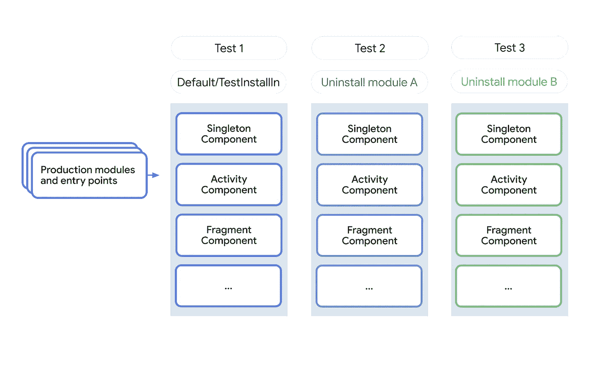
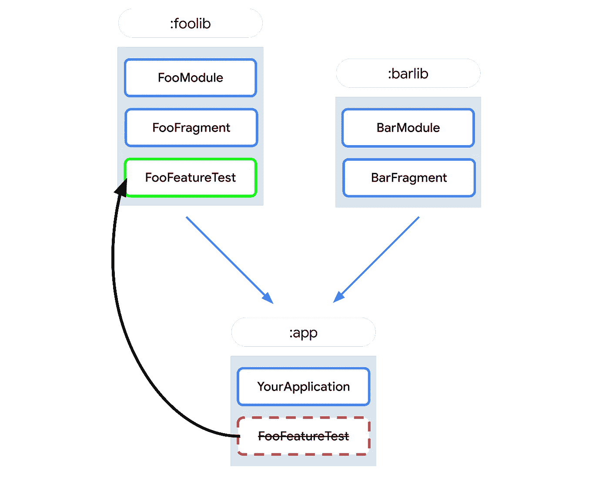

# MAD 技能系列中的刀柄测试最佳实践

> 原文：<https://medium.com/androiddevelopers/hilt-testing-best-practices-in-the-mad-skills-series-8186a57eee2c?source=collection_archive---------0----------------------->

## 剑柄狂技能系列第二集

这是下一篇关于[剑柄](https://dagger.dev/hilt/)的狂技能文章！这一次我们将关注如何用 Hilt 编写测试，以及一些需要注意的最佳实践。

如果您喜欢以视频格式观看这些内容，请点击此处查看:

# 刀柄测试理念

因为 Hilt 是一个更加固执己见的框架，所以 Hilt 测试 API 的构建都有特定的目标。了解 Hilt 进行测试的方法将使 API 更容易使用和理解。你可以在这里阅读更多关于测试哲学的深度[。](https://dagger.dev/hilt/testing-philosophy)

Hilt 中测试 API 的核心目标之一是避免在测试中不必要的使用伪造品或模仿品，尽可能多地使用真实对象。真实的对象将增加测试覆盖率，并且比假的或模仿的对象更能经受住时间的变化。当真实对象正在执行 IO 等昂贵的任务时，Fakes 或 mocks 是有用的，但它们经常被过度使用来掩盖其他问题，在这些问题中，没有任何概念上不能在测试中完成的事情。

其中一个问题是在测试中使用没有刀柄的匕首会很麻烦。为测试设置 Dagger 组件可能需要大量的工作和样板文件，但是不使用 Dagger 而只是手动实例化对象会导致过度使用 mocks。让我们来看看这是为什么。

# 手动实例化(无柄测试)

为了了解为什么在测试中手动实例化对象会导致过度使用 mocks，让我们看一个例子。

下面，我们测试了一个有一些依赖关系的`EventManager`类。因为我们不想为这个简单的测试设置 Dagger 组件，所以我们只是手动实例化该对象。

起初这似乎很简单，因为我们只是像 Dagger 一样调用构造函数，但是当我们需要弄清楚如何获得我们的`DataModel`和`ErrorHandler`的实例时，问题就出现了。

我们也可以实例化这些类，但是如果这些类也有依赖关系，那么这可能会变得非常复杂。我们可能会在实际测试之前调用很多构造函数。另一个问题是所有这些构造函数调用会使测试变得脆弱。这里对构造函数的任何更改都可能会破坏测试，即使它们不会破坏生产中的任何东西。不应该做的改变，比如对`@Inject`构造函数中的参数重新排序，或者用`@Inject`构造函数在类上添加一个依赖项，会破坏测试，并且更新起来很痛苦。

所以为了避免这种情况，许多人经常嘲笑依赖关系`DataModel`和`ErrorHandler`。这是一个问题，因为引入这些模拟并不是为了避免测试中任何昂贵的东西，而是为了处理测试设置样板文件。

# 用刀柄测试

有了 Hilt，Dagger 组件就为您设置好了，因此您可以避免手动实例化，并避免在测试中设置 Dagger 的样板文件。有关完整的测试文档，请参见此处的[和](https://dagger.dev/hilt/testing)。

在测试中设置 Hilt 需要您:

1.  用`[@HiltAndroidTest](https://dagger.dev/api/latest/dagger/hilt/android/testing/HiltAndroidTest.html)`注释你的测试
2.  添加测试规则`[HiltAndroidRule](https://dagger.dev/api/latest/dagger/hilt/android/testing/HiltAndroidRule.html)`
3.  为你的`Application`类使用`[HiltTestApplication](https://dagger.dev/api/latest/dagger/hilt/android/testing/HiltTestApplication.html)`

对于第三步，如何使用`HiltTestApplication`将取决于测试的类型，因此请参见此处的机器人电气测试[和此处](https://dagger.dev/hilt/robolectric-testing)的仪器测试[的说明。](https://dagger.dev/hilt/instrumentation-testing)

设置完成后，您现在可以向测试中添加`@Inject`字段来访问绑定。这些字段将在您调用`HiltAndroidRule`上的`inject()`后设置，因此您可能希望在您的设置方法中这样做。

需要注意的一点是，注入的对象必须来自`[SingletonComponent](https://dagger.dev/hilt/components)`。如果您需要来自`[ActivityComponent](https://dagger.dev/hilt/components)`或`[FragmentComponent](https://dagger.dev/hilt/components)`的东西，您将需要使用常规的 Android 测试 API 来创建一个活动或片段，并从中获取依赖。

之后，你就可以写你的测试了，因为你的注入字段，在这里是我们的`EventManager`类，将会像在产品中一样由 Dagger 构造。没有必要担心来自管理依赖关系的任何样板文件！

# TestInstallIn

当您需要替换测试中的依赖项时，例如当真实对象做了一些昂贵的事情，比如调用服务器，您可以使用`[TestInstallIn](https://dagger.dev/hilt/testing#testinstallin)`来进行更改。

虽然你不能直接替换 Hilt 中的单个绑定，但是`TestInstallIn`允许你替换模块。`TestInstallIn`的工作方式与`InstallIn`类似，除了它还允许您指定应该替换的模块。被替换的模块不会被 Hilt 使用，取而代之的是添加到`TestInstallIn`模块中的任何绑定都会被使用。类似于`InstallIn`模块，`TestInstallIn`模块将应用于所有依赖于它们的测试(例如 Gradle 模块中的所有测试)。

# 卸载模块

当您只想在单次测试中进行替换时，您可以使用`[UninstallModules](https://dagger.dev/hilt/testing#uninstall-modules)`。`UninstallModules`直接放在测试上，允许你指定哪些模块是 Hilt 不应该使用的。

在测试中，您可以直接使用`[@BindValue](https://dagger.dev/hilt/testing#bind-value)`或者通过定义嵌套模块来添加绑定。

# 测试安装与卸载模块

所以你可能想知道，你应该使用哪一个？以下是两者的快速对比:

**测试安装程序**

*   全球适用
*   更简单的配置
*   更有利于构建速度

**卸载模块**

*   仅单一测试
*   更大的灵活性
*   构建速度更差

一般来说，我们建议从`TestInstallIn`开始，因为它对构建速度更好。当您确实需要单独的配置时，仍可使用`UninstallModules`,但建议您谨慎使用，仅在特别需要时使用。

# 为什么 TestInstallIn/UninstallModules 会影响构建速度

对于用于测试的每一组不同的模块，Hilt 必须创建一组新的组件。这些组件最终会变得非常大，尤其是如果您依赖于生产代码中的许多模块。

Components are generated for each different set of modules.

**`**UninstallModules**`**的每一次使用都会添加一组需要构建的新组件，这可以根据您的测试数量快速增加。**另一方面，由于`TestInstallIn`是全局适用的，所以它属于可共享的默认组件集，可以在多个测试中重用。如果你可以改变一个测试，使它不必使用`UninstallModules`，那么你就可以节省一组正在构建的组件。**

**有时候测试需要使用`UninstallModules`,这没关系！请注意权衡，尽可能默认使用`TestInstallIn`。**

# **测试依赖关系**

**降低测试构建速度的另一个方法是处理另一个轴，减少被拉进测试的模块和入口点。这是每次使用`UninstallModules`都会增加的部分。有时，您的测试可能依赖于您的所有产品代码，而实际上它只测试代码的很小一部分。因为 Hilt 不能在编译时告诉你将要在运行时测试什么，所以 Hilt 必须构建一个组件，它拥有通过你的 deps 可以找到的每个模块和入口点。这可能是一个很大的数目，可能会导致非常大的 Dagger 组件，从而增加你的构建时间。**

**如果您能够减少这些依赖性，那么`UninstallModules`的每一次新的使用可能不会那么昂贵，这可能会在配置您的测试时给您更多的灵活性。**

**你可以这样做的一个方法是组织你的 Gradle 模块，这样你的很多测试不在主应用程序 Gradle 模块中，而是在单独的库 Gradle 模块中，以减少依赖性。**

****

**Organize tests into library Gradle modules when possible.**

# **组织手柄模块**

**要记住的一件事也将帮助你写测试，那就是考虑你如何组织你的刀柄模块。非常大的 Dagger 模块有很多绑定是很常见的，但是对于 Hilt，拥有做很多事情的大模块可能会使测试更加困难，因为你必须替换整个模块，而不是单独的绑定。**

**在 Hilt 中制作模块时，尽量让它们有一个单一的用途，甚至可能只有一个公共绑定。这有助于可读性，如果需要的话，在测试中更容易替换它们。**

# **更多资源**

**应用这些实践并了解更多的权衡将有望帮助您更轻松地用 Hilt 编写测试。对于其中的一些权衡，您选择哪种方式来做事将在很大程度上取决于您的应用程序、测试和构建系统目前是如何设置的。**

**关于使用 Hilt 测试的更多信息，你可以在这里查看完整的文档。这里还有一个测试指南[和更多的例子。](https://developer.android.com/training/dependency-injection/hilt-testing)**

**这就是剑柄测试，但请留意更多疯狂的技能集即将到来！**