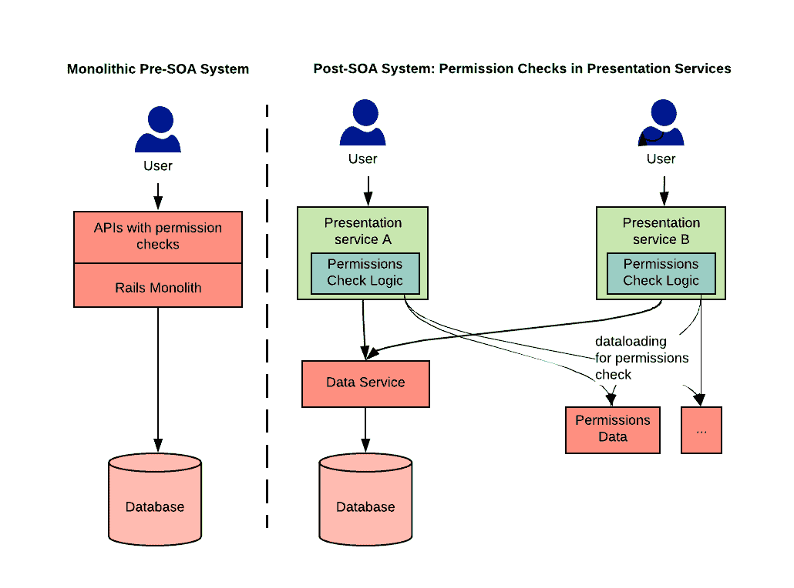
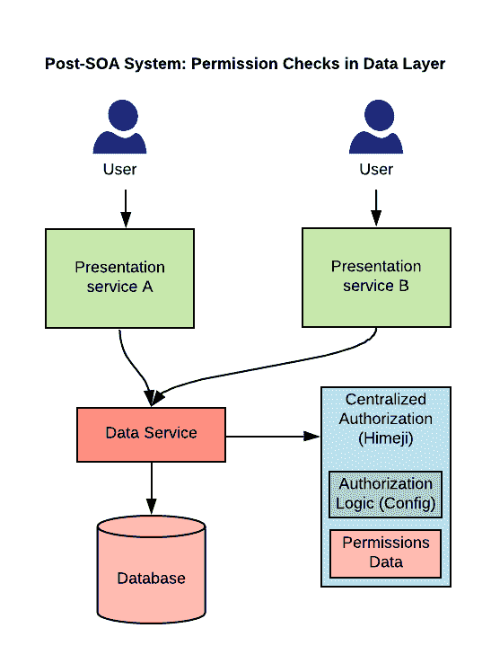
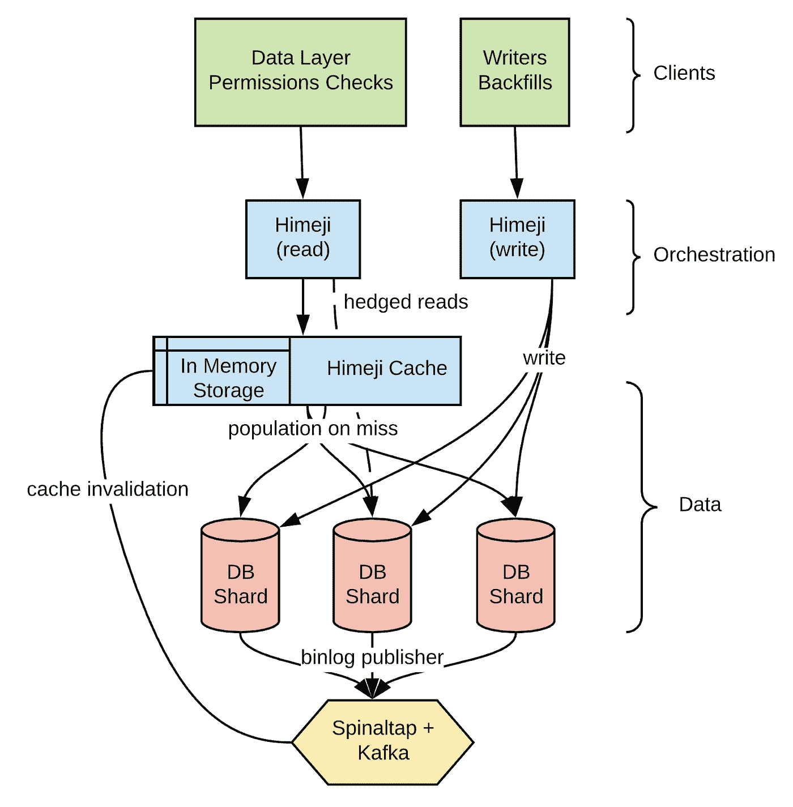

# 姬路一个可扩展的 Airbnb 授权中心系统

> 原文：<https://medium.com/airbnb-engineering/himeji-a-scalable-centralized-system-for-authorization-at-airbnb-341664924574?source=collection_archive---------1----------------------->

由[阿兰·姚](https://www.linkedin.com/in/alanyao)、[迪帕克·帕瓦尔](https://www.linkedin.com/in/pawardipak/)、[布莱尔·吴](https://www.linkedin.com/in/yujia-wu/)和[阿布舍克·帕尔马](https://www.linkedin.com/in/abhishek-parmar-924b529a/)


# 问题是

在过去的几年里，Airbnb 工程从单一的 Ruby on Rails 架构转向了面向服务的架构。在我们的 Rails 架构中，每个资源都有一个 API 来访问底层数据。这些 API 有授权检查来保护敏感数据。因为只有一种方法可以访问资源的数据，所以管理这些检查很容易。在向 SOA 过渡的过程中，我们转向了分层架构，其中有包装数据库的数据服务和来自多个数据服务的表示服务。将许可检查从 monolith 转移到 SOA 的最初方法是将这些检查转移到表示服务。然而，这导致了几个问题:

1.  **重复且难以管理的授权检查:**提供对相同底层数据的访问的多个表示服务通常具有重复的授权检查代码。在某些情况下，这些检查变得不同步并且难以管理。
2.  **扇出到多个服务:**大多数授权检查都需要调用其他服务。这很慢，负载难以维持，并且影响了整体性能和可靠性。



Early authorization checks

# 解决方案



Himeji-based authorization checks

为了解决这些问题，我们做了两项改变:

1.  我们将授权检查转移到了数据服务，而不是只在表示服务中执行授权检查。这帮助我们减少了重复和不一致的检查问题。
2.  我们创建了**姬路**，一个基于[桑给巴尔](https://research.google/pubs/pub48190/)的集中授权系统，从数据层调用。它存储许可数据，并作为事实的中心来源执行检查。我们不是在读取时散开，而是在资源发生变化时写入所有权限数据。考虑到我们繁重的读取工作负载，我们在写入而不是读取时扇出。

# 应用程序接口

姬路为数据服务公开了一个检查 API 来执行授权检查。API 签名如下:

```
// Can the principal do relation on entity?
boolean check(entity, relation, principal)
```

权限检查如下所示，即“用户 123 可以写清单 10 的描述吗？":

```
check(entity: “LISTING : 10 : DESCRIPTION”, 
      relation: WRITE, 
      principal: User(123))
```

姬路将此解释为“用户 123 是可以写入清单 10 的描述的用户集合中的一员吗？".

# 储存；储备

与桑给巴尔岛相似，姬米吉岛的基本存储单位是形式为`entity # relation @ principal`的**元组**。

*   一个**实体**就是三重`(entity type : entity id : entity part)`；这来自于自然语言的方法:`LISTING : 10 : DESCRIPTION` →列表 10 的描述。
*   **实体 id** 是真理数据源中的对应 id。
*   **实体类型**定义应用的数据权限。示例:`LISTING`、`RESERVATION`、`USER`
*   **实体零件**是可选组件。示例:`DESCRIPTION`、`PRICING`、`WIFI_INFO`
*   **关系**描述关系，像`OWNER`、`READ`或`WRITE`一样，但可以是特定于用例的；一些示例包括用于保留主机的`HOST`和用于拒绝访问列表的`DENY_VIEW`。
*   **主体**或者是类似`User(123)`的认证用户身份，或者是类似`Reference(LISTING:15)`的另一个实体。

# 配置

如果我们必须为所检查的每个确切权限编写一个元组，那么数据量和反规范化将呈指数级增长。例如，我们必须同时写`LISTING : 10 # WRITE @ User(123)`和`LISTING : 10 # READ @ User(123)`以便列表所有者能够读写。

基于桑给巴尔配置，我们使用基于 YAML 的配置语言，该语言允许通过集合代数解析权限检查，允许开发人员将检查映射到集合操作:

```
LISTING:
  '#WRITE':
    union:
      - '#WRITE'
      - '#OWNER'
  '#READ':
    union:
      - '#READ'
      - '#WRITE'
```

假设用户 123 是清单 10 的所有者。那么数据库将会有元组`LISTING : 10 # OWNER @ User(123)`。

当我们请求`check(entity: "LISTING : 10", relation: WRITE, userId: 123)`时，姬路解译为`LISTING # READ`为`READ` & `WRITE`的并集，而传递性的`LISTING # WRITE`为`WRITE` & `OWNER`的并集。因此，它将从其数据库中获取以下内容，以及属于`LISTING # WRITE`集合的任何匹配:

```
Query LISTING : 10 # WRITE @ User(123) => Empty
Query LISTING : 10 # OWNER @ User(123) => Match User(123)
```

因此，例如，用户 123 只需要让`LISTING : 10 # OWNER @ User(123)`在`LISTING : 10 # WRITE`集合中。

# 参考

我们观察到，Airbnb 上的实体由于它们的存在而频繁地向其他实体授予访问权限。例如，预订的客人可以访问列表的位置，以及列表的其他信息。我们用元组来表示这个用例，其中主体是对实体的引用，即`LISTING : $id # RESERVATION @ Reference(RESERVATION : $reservationId)`。这允许我们表达这样的概念，即在列表的“预订”集合中的预订的“客人”集合中的用户在`LISTING : LOCATION # READ`集合中，从而最小化需要存储的数据量:

```
LISTING:
  LOCATION:
    '#READ':
      union:
        - #OWNER
        - LISTING : $id # RESERVATION @ 
          Reference(RESERVATION : $reservationId # GUEST)
```

这种方法与 Zanzibar 的不同之处在于，这种元组在主体中不包含关系(即`Reference(RESERVATION:$id # GUEST)`)。被引用实体后面的关系是静态的，从配置中检索。以清单示例为例，然后对照其他用例进行检查，我们发现通常会在多个关系后面跟随一个引用。在我们的产品中，两个实体类型之间使用的关系集没有变化；集合中的变更意味着产品变更，适用于所有实体类型。如果两个实体类型(即`Reference(RESERVATION:$id # GUEST)`、`Reference(RESERVATION:$id # COTRAVELLER)`、 `Reference(RESERVATION:$id # BOOKER)`、…)之间的关系集具有大小`M`，则为这些实体类型中的每一个写一个元组会导致`N*M`个元组。通过将关系拉入配置，我们将存储数据的大小减少到`N`。

在读取执行时，假设数据库中存储了以下元组:

```
LISTING : 10 # OWNER @ User(123)
LISTING : 10 # RESERVATION @ Reference(RESERVATION : 500)
RESERVATION : 500 # GUEST @ User(456)
```

现在，如果一个客户发送这样的请求:

```
check(LISTING : 10 : LOCATION # READ, User(456))
```

然后，根据配置，姬路基于来自请求的信息和上述配置发出第一次数据库提取:

```
Query LISTING : 10 # RESERVATION => Match Reference(RESERVATION:500)
Query LISTING : 10 # OWNER @ User(456) => Empty
```

姬路随后将发出第二个 DB 获取，替换为找到的预订的 id，其中匹配指示用户 456 在允许读取清单 10 的位置的用户集合中。

```
Query RESERVATION : 500 # GUEST @ User(456) => Match User(456)
```

# 架构和性能



Himeji Architecture

姬路分三层:

*   **编排层**接收来自客户端的请求，负责根据配置逻辑发布数据获取，并解析结果。编排层通过一致的哈希路由到缓存层。
*   被分片和复制的**缓存层**(每个 AZ 每个分片一个实例)，负责在未命中时过滤内存和删除数据库中的负载。通过一致的散列法，每个碎片被分配一组数据。我们的目标是缓存命中率达到 98%左右。
*   **数据层**，由逻辑上分片的数据库组成。

相对于桑给巴尔岛的设置，我们对姬路所做的最重要的改变是:

1.  将请求编排层与缓存层分开，这样就可以更容易地更新编排层，而无需重新启动缓存。
2.  基于[发布的来自数据库](/airbnb-engineering/capturing-data-evolution-in-a-service-oriented-architecture-72f7c643ee6f)的突变，使缓存碎片无效。
3.  使用 Amazon [Aurora](https://aws.amazon.com/rds/aurora/?aurora-whats-new.sort-by=item.additionalFields.postDateTime&aurora-whats-new.sort-order=desc) 进行数据库存储，作为我们[云之旅](/airbnb-engineering/our-journey-towards-cloud-efficiency-9c02ba04ade8)的一部分，这与桑给巴尔岛使用 Spanner 不同。

我们在可用性方面实施了与桑给巴尔相同的可靠性(对冲、分层缓存)和减载功能。

姬路已在生产中提供检查服务约一年，其吞吐量已从 2020 年 3 月的 0 增长到 2021 年 3 月的 **85 万** **实体/秒**，同时保持了去年的可用性和延迟目标:

```
Availability  99.9990%
P50 Latency   1.8 ms
P95 Latency   7   ms
P99 Latency   12  ms
```

# 工具作业

为了缩短集成时间并推动开发人员采用，我们构建了一些工具，例如:

*   **基于配置的回填:**将现有权限检查迁移到姬路需要我们回填现有实体的权限元组。我们构建了一个基于 Apache Airflow 和 Apache Spark 的通用解决方案，而不是每个数据服务所有者构建自己的回填流程。服务所有者只需提供一个小的配置，该配置指示他们的元组应该如何从他们的数据库导出中形成。
*   **自动代码生成:**为了让入职更容易，我们提供了脚本来自动生成 Java 和 Scala 代码。
*   **胖客户端:**我们提供了一个胖 http 客户端，具有日志记录、指标和迁移展示控件。
*   **用于调试和一次性任务的 UI 工具:**调查一次性权限问题可能会变得繁琐，并且需要检查系统中写入的权限数据，因此我们构建了一个 UI 来分析数据并修复权限问题。

# 结论

基于[桑给巴尔](https://www.usenix.org/system/files/atc19-pang.pdf)的姬路授权系统，统一了 Airbnb 的授权数据和逻辑。在引入它之前，跨不相交的逻辑片段维护一致性和性能是困难的。姬路用具有灵活逻辑配置的简单数据模型来集中所有产品和数据授权。姬路扩展了桑给巴尔的可扩展性和性能属性，并通过其高命中率分层分布式缓存降低了延迟。所有这些共同导致姬路一秒钟存储数百亿个关系和服务近百万个实体授权，同时保持低延迟和高可用性。

# 承认

姬路之所以成为可能，得益于 Airbnb 团队许多成员的贡献。我们感谢该团队的前任和现任成员——Max、Alex Rosenblatt、Jefferson Lee、Divya Gupta、Clare Liu、Li、Leelakrishna Nukala、Karen Kim、Gary Leung、Ryan Flood、Tony Tran 和 Gurer Kiratli。此外，还要感谢我们现任和前任管理层对这项工作的大力支持——Anish Das Sarma、Vijaya Kaza、Jason Sobel、Bipin Suresh、Marc Blanchou、Raymie Stata 和 Aristotle Balogh。

这项工作以及许多令人兴奋的事情总是在 Airbnb 发生。如果你想加入我们，请查看我们的 Airbnb 招聘页面。

# 商标属性

“Rails”和“Ruby on Rails”是 David Heinemeier Hansson 的注册商标。

Apache Kafka、Apache Airflow、Apache Spark 和 Apache 是 Apache Software Foundation 在美国和/或其他国家的注册商标或商标。

AWS 和 Amazon Aurora 是 Amazon.com 公司或其附属公司在美国和/或其他国家的商标。

Java 是 Oracle 和/或其附属公司的注册商标。

所有商标都是其各自所有者的财产。这些的任何使用仅用于识别目的，并不意味着赞助或认可。