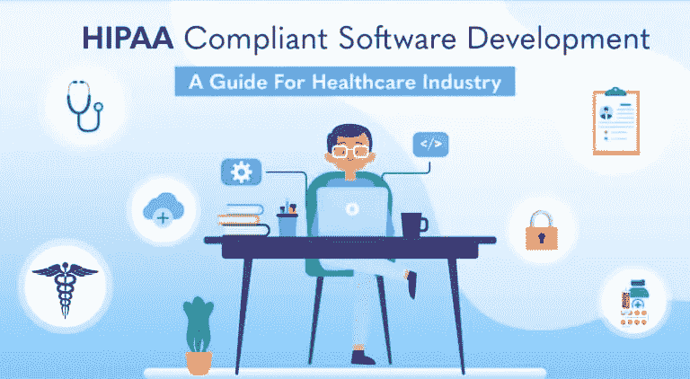

# HIPAA 兼容软件——医疗保健行业指南

> 原文：<https://medium.com/quick-code/hipaa-compliant-software-a-guide-for-healthcare-industry-41b2429024d4?source=collection_archive---------2----------------------->

就重要性和受欢迎程度而言，医疗保健行业是一个正在发生变化且充满挑战的行业。医疗保健 IT 解决方案和服务几乎必须立即实施，以简化流程并充分利用生成的数据。

这些医疗保健系统需要关注患者、医生、管理者、临床医生、保险提供商等。需要。网络和手机现在正成为医疗保健利益相关者的臂膀。

IT 解决方案在医疗保健行业必不可少的一些主要原因是降低成本和集成系统的需求不断增长，投资回报率最大化，人口老龄化，以及对计算机化流程输入的需求。

随着技术使用的增加，将现实与基于技术的解决方案联系起来的任务变得越来越困难，维护安全性也成为一个问题。

最重要的是，面向医疗保健行业的[软件开发](https://www.spec-india.com/services/custom-software-development)需要遵循医疗公司和政府官员制定的严格规则和条例。

在这种时候，一项强调医疗保健行业安全性的法案应运而生— **健康保险流通与责任法案(HIPAA)。**医疗 IT 解决方案应该符合 HIPAA 提出的法规，因此在整合医疗机构方面，它是整个行业不可或缺的重要组成部分。

下面是一个快照，它告诉我们为什么必须通过一组集中的规则(如 HIPAA)进行严格的监控:

*Image Source:* [*hipaajournal.com*](https://www.hipaajournal.com/2019-healthcare-data-breach-report/)

> 2009 年至 2019 年期间，发生了 3，054 起医疗保健数据泄露事件，涉及 500 多份记录。这些违规行为导致了 230，954，151 份医疗保健记录的丢失、被盗、暴露或非法泄露。这相当于超过 69.78%的美国人口。2019 年，医疗保健数据泄露的报告率为每天 1.4 起。

# HIPAA —简介

> HIPAA 的创建主要是为了实现医疗保健信息流的现代化，规定如何保护医疗保健和医疗保健保险行业维护的个人身份信息免遭欺诈和盗窃，并解决医疗保健保险范围的限制— [维基百科](https://en.wikipedia.org/wiki/Health_Insurance_Portability_and_Accountability_Act)

HIPAA 由第 104 届美国国会制定，于 1996 年由比尔·克林顿总统签署，也称为肯尼迪-卡塞鲍姆法案，旨在简化管理，保护健康信息的隐私，电子记录的安全性和保险的便携性。

它使用户能够无缝、真诚、安全、满意地利用医疗保健 It 解决方案，而不会对隐私造成任何损害，并且信息完全安全。

对于任何符合 HIPAA 的医疗保健软件，必须有一个框架来为相关人员提供指导，以确保按照 HIPAA 规则和法规完成整个合规流程。该软件帮助合规负责人执行 HIPAA 规范，并确保所有法规都得到遵守。

*如果你不遵守 HIPAA 规范，或者出现数据泄露，或者出现网络攻击或泄露隐私信息，就会发生这种情况:* ***你可能会被重罚，每次违规每个用户大约 100 美元到 5 万美元不等。而且，有更多的用户，很难想象会有多少罚款？***

# 根据 HIPAA 被视为 PHI 的 PHI 和密钥标识符

受保护健康信息(PHI)是 HIPAA 的一个非常重要的方面。PHI 讨论了有关患者医疗保健的安全信息，这些信息可用于提供医疗服务、治疗或诊断。

它可以包括患者和医生之间交互的医疗保健病历、账单数据以及以不同方式存储的患者的保险数据。

根据 HIPAA 规则，PHI 不仅讨论过去和现在的信息，还讨论未来的医疗记录和数据。它包括任何形式的医疗数据—物理的、电子的或支持语音的。PHI 可以是健康记录、实验室结果、医疗文件、健康历史、医疗账单等形式。

PHI 讨论与个人相关的任何健康信息记录，包括 18 个标识符中的一个或多个。如果这些标识符不存在或被篡改，则信息批次不会验证为 HIPAA 规则格式的一部分。

# 实施 HIPAA 时，以下关键标识符是 PHI:

*   全名或姓氏
*   年份以外的日期
*   电话号码
*   地理标识符
*   传真号码
*   社会安全号码
*   电子邮件地址
*   账号
*   Web URLs
*   医疗记录号码
*   证书编号/许可证详细信息
*   车辆标识符，序列号，车牌
*   健康保险受益人数
*   设备标识符和序列号
*   国际电脑互联网地址
*   正面照片
*   生物识别——视网膜扫描、指纹
*   任何独特的识别特征、数字或代码

# 符合 HIPAA 的软件开发的关键特性

对于任何符合 HIPAA 的医疗保健 IT 解决方案/应用程序，以下是需要确保/遵循的一些关键功能/步骤:

*   **丢弃 PHI 信息**

一旦使用了 PHI 数据，就有必要将其丢弃，以免将来被任何怀有恶意的人滥用。原封不动地保存如此重要的信息可能会导致灾难。

*   **网络/设备和加密的安全性**

由于它包括跨各种网络的大量数据传输，因此必须在 SSL / TLS 技术中嵌入严格的加密规则，以确保信息的完全隐私。甚至正在使用的设备的安全性也同样重要。必须对医疗保健应用实施加密完整设备等功能。便携式设备必须受到严格监控，因为它们可能导致数据泄露。

*   **彻底的审计控制机制**

仅仅适当地维护 PHI 数据是不够的。我们需要的是一种适当的审计控制机制，能够持续观察和管理这些数据在哪里被使用，处于什么状态。这对于发现数据威胁或侵犯数据隐私的可能性非常重要。这可以通过拥有维护 PHI 数据的所有数据的日志文件来实现。

*   **必须正确处理文件**

由于大多数医疗保健软件解决方案都要处理利益相关者(主要是患者)的文档，因此系统必须按照 HIPAA 合规性的要求正确处理文档。文档需要在严格的安全控制下以简单而全面的方式进行管理，并具有最高的准确性。

*   **用户认证和访问控制**

符合 HIPAA 的应用程序需要集成 PIN 码、卡、生物识别等现代方法的准确用户身份验证。用户必须有相关的访问控制，包括那些特别意味着管理员的权利，遵守 HIPAA 规则和条例。

*   **安全备份和恢复机制**

无论哪里有太多的数据，安全和准确的备份机制都是必不可少的。特别是当它是 PHI 数据时，必须有一种安全的方法来处理自然灾害、损坏的信息、服务器崩溃和许多这样的灾难。而且，即使发生了任何这样的灾难，也必须有严格的恢复计划，该计划必须与发生的灾难相适应。

*   **维护与业务联系人的关系**

任何处理医疗保健和遵守 HIPAA 的软件解决方案都必须包括处理其业务联系。该解决方案必须管理与业务同事相关联的业务流程。

# HIPAA 合规的主要优势

**为什么 HIPAA 合规性如此重要？**

**实施这些标准后，医疗保健单位享受到了哪些好处？**

**看一看:**

*   使所有流程保持法律平衡，遵守 HIPAA 的一系列法规
*   减轻医院当局保护数据的负担，确保数据安全并提供最佳方式
*   加快利益相关者之间顺畅沟通的速度
*   主动保护敏感数据，包括患者信息
*   赚取利润，减少成本增加，从而增加收入
*   防止对病人的任何歧视
*   给所有相关人员带来安全感，增加保护患者隐私信息的方法
*   向相关利益方灌输坚持原则和适应正确方式的意识
*   提高员工保护 PHI 的意识，从而增强其重要性
*   帮助医疗机构获得良好的反馈，在评估时进行评分，并正确处理 PHI 数据
*   使医疗保健流程顺畅、安全，并帮助他们严格遵守法律
*   保护用户身份验证，记录法律信息，生成各种报告
*   在很大程度上赢得了患者的信任，因为患者确信系统符合规则
*   根据风险承担者的角色为其提供基于角色的安全性
*   通过安全系统提供强大的密码控制
*   越来越紧密地保护物理和系统安全

# 要防止的常见 HIPAA 违规

避免这些违反 HIPAA 的行为，让您的医疗机构免于进一步混乱:

*   不保护移动设备或它们被盗是一个很大的风险，因为最大的信息是在这些医疗保健系统发明之后
*   如果不遵守安全协议，患者信息不得泄露给其他患者/管理人员
*   将纸质病历遗忘在不必要的地方被证明是危险的，因为任何人都可以在没有任何安全协议的情况下阅读它

# HIPAA 合规软件清单

在任何医疗保健 IT 解决方案中实施 HIPAA 标准时，最好检查某些清单项目的合规性，它们是:

## 与 HIPAA 相关的某些限制

*   实施 HIPAA 会增加相关的管理成本和要求
*   违反这些规范是一件代价高昂的事情
*   由于罚款，在数据披露方面透明度变得困难
*   由于违反规则的严格性，病人有时要忍受等待或得不到信息的痛苦
*   在遵守 HIPAA 规范的同时，计费结构变得复杂
*   遵循规章制度有时会导致严格的数据共享平台

## GDPR 和 HIPAA 相比如何？

今天，GDPR 是一个非常常见的术语，非常流行，需求量很大。什么是 GDPR？

[GDPR(一般数据保护法规)](https://www.spec-india.com/company/gdpr)是数据保护和隐私法，强制组织保护欧盟(欧洲公民)的个人数据，让个人对其个人数据拥有更多控制权。

**但是，这听起来是 HIPAA 标准的同义词吗？**

由于 GDPR 还谈到了数据隐私、保护和信息安全，它经常与 HIPAA 规范混淆。下面是两者的对比:

GDPR 和 HIPAA 都是针对数据安全性和隐私保护的一套独立的规则和法规。

但是，两者的主要区别在于关注的领域。GDPR 关注欧盟的隐私数据。

除了 PHI 之外，GDPR 还关注敏感的个人信息，因此比 HIPAA 有更广阔的视角。

HIPAA 只关注医疗保健行业的 PHI。

两者是相似的，但是有他们自己的特点和领域。

**临别赠言**

这篇文章深入分析了 HIPAA 标准如何影响医疗保健行业，并提供了一个更好的版本，一个更安全、稳定、值得信赖的环境。实施 HIPAA 无疑给了医疗保健单位一个推动力，并使医疗保健软件解决方案更易于实施和有效使用。

**注** : [这篇文章之前发表在 SPEC INDIA 的博客](https://www.spec-india.com/blog/hipaa-compliant-software-development)