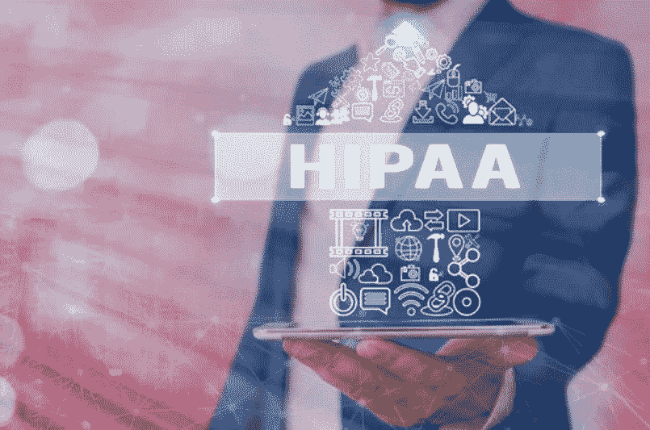
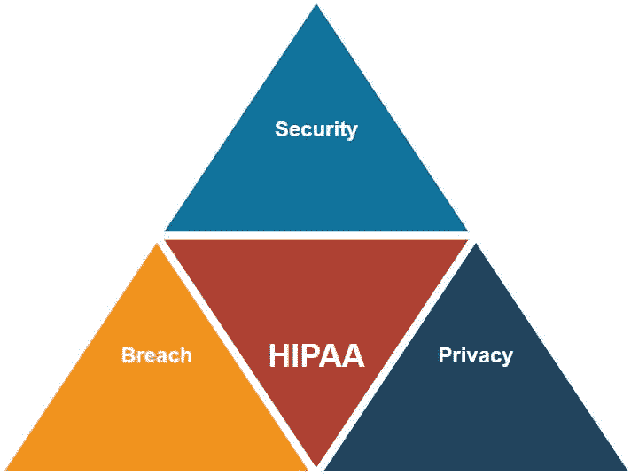

# HIPAA 法规合规性

> 原文：<https://medium.com/globant/hipaa-regulatory-compliance-17c9a8f907b1?source=collection_archive---------2----------------------->

HIPAA 合规指南

# 介绍

下面的文章详细介绍了符合 HIPAA 的所有域和审计控制。欲了解更多关于该合规标准的信息，请前往 ***民权办公室*** ( [OCR](https://www.hhs.gov/ocr/index.html) )。

虽然电子方法使我们能够提供更高的效率和移动性，但它们也增加了医疗数据的安全风险。这些新风险使得 HIPAA 合规性比以往任何时候都更加重要。本指南可以帮助您通过控制评估 HIPAA 合规性。

下面显示的每个控件都与一个或多个定义相关联。然而，在控件和项目之间没有精确的匹配，所以您应该将它内在化并适应您的需求。

# HIPAA 合规性的定义

> HIPAA 是一套联邦监管标准，概述了美国受保护健康信息的使用和披露。HIPAA 合规性由卫生与公众服务部(HHS)监管，强制执行机构是公民权利办公室(OCR)。
> 
> HIPAA 合规性是一种活的文化，医疗保健组织必须在其各自的业务中实施，以保护受保护健康信息的隐私、安全性和完整性。

# 谁必须遵守 HIPAA？

相关实体及其业务伙伴必须遵守 HIPAA 规则。受保实体是传输受保护健康信息 [(PHI)](https://www.hhs.gov/answers/hipaa/what-is-phi/index.html) 和电子受保护健康信息 [ePHI](https://www.hhs.gov/hipaa/for-professionals/security/laws-regulations/index.html#:~:text=The%20Security%20Rule%20protects%20a,%22%20(e%2DPHI).) 的任何实体。

*   以电子方式传输健康信息的提供者。
*   卫生保健处理中心。
*   使用个人可识别健康信息的实体。

# **HIPAA 合规规则**

HIPAA 通过建立三条规则来保护患者健康信息。这些规则要求相关实体维护受保护健康信息的机密性、完整性和可用性。

HIPAA Compliance Rules

这三条规则是:

*   ***安全规则*** 规定了必须用于保护电子健康信息的机密性、完整性和可用性的数据安全措施。
*   ***隐私条例*** 设定了使用和披露受保护健康信息的标准。
*   ***违约通知规则*** 要求相关实体通知受影响的个人无担保 PHI 违约。

# 开始符合 HIPAA 标准

HSS 监察长办公室**(**)[**【OIG】**](https://www.oig.dhs.gov/)**)**确定了有效合规的七大要素。这些要素是:

*   *书面政策、程序和标准的实施。*
*   *指定合规官及合规委员会。*
*   *培训活动。*
*   *建立有效的沟通渠道。*
*   *进行内部审计和监控。*
*   *通过广为宣传的纪律指引来执行标准。*
*   *对发现的违规行为及时做出反应并采取纠正措施。*

这些是 HIPAA 合规计划必须涵盖的最基本的可能要求。

除了涵盖 HIPAA 中概述的所有安全和隐私标准之外，有效的合规计划还必须能够处理七个要素中的每一个。

# HIPAA 合规核对表

遵守 HIPAA 意味着涵盖多个领域，这可能是一项非同寻常的工作。为了帮助您开始，我们创建了一份简要的 HIPAA 要求清单。

## **分配安全责任**

指定一名信息安全官员负责制定、实施和实施安全标准的程序和政策。该人员可能与 HIPAA 隐私官相同。

## **制定政策和程序**

各实体必须制定管理实践和系统，以确保符合 HIPAA 合规标准。员工必须参加持续的安全意识培训计划。该标准还包括安全提醒和密码管理。

## **实施物理技术保障**

该实体必须确保与 PHI 相关的所有数据的安全。这包括开发:

*   ***技术保障*** 如:限制授权人员只能访问 ePHI，要求授权人员使用唯一身份识别方法(MFA)验证身份，监控软硬件访问日志是否有异常活动，使用强加密，指定紧急访问流程等。
*   ***物理保障*** 比如对谁可以物理访问设施的限制，对访问工作站和电子媒体的限制，以及处置或移动工作站和电子媒体的程序。

## **设计灾难恢复计划**

为可能威胁 ePHI 的机密性、完整性和可用性的可预见事件制定应急计划，并针对每种类型的事件测试该计划。

## **执行 HIPAA 年度风险评估**

风险分析应该是一个持续的过程，在这个过程中，应该定期检查日志以跟踪数据访问和检测事件。

为了遵守这一要求，建议进行年度审计，以查明安全标准实施中的问题。该审核应涵盖所有管理、物理和技术安全措施。

## **实施商业伙伴协议**

每当第三方需要访问任何 PHI 以提供服务时，双方必须签订业务合作协议(BAA ),以限制所提供信息的使用或披露。

## **报告数据泄露**

符合 HIPAA 的实体必须制定程序，概述在发生数据违规时要采取的措施。

## **调查违规行为并实施纠正措施**

如果发生安全违规，必须进行彻底调查，并且必须制定和实施纠正计划来纠正问题并使您回到合规状态。

## I **实施最佳实践**

考虑到“安全法规的灵活性”，没有放之四海而皆准的 HIPAA IT 合规性清单。然而，一些框架汇编了最佳实践列表，以帮助 IT 部门满足 HIPAA 要求。这些有助于确保您的部门掌握最新的合规标准。

## **记录一切**

未能保存所有 HIPAA 合规性问题的大量文档可能会导致公司无法遵守审计要求。

# 结论

如果你想遵守 HIPAA，你来对地方了。本文将提供一个实用的概述，介绍您需要做些什么来开始您的法规遵从性之旅。

HIPAA 合规性是一个持续的过程，因此定期审查您的政策和程序至关重要。对于不熟悉 HIPAA 的组织，我们建议使用上面的清单作为起点。但是请记住，该法律的范围很广，因此您需要根据自己的具体需求来调整合规工作。

对于已经遵从法规的组织来说，保持法规遵从性需要与不断变化的环境保持同步。经常审查您的流程并更新您的政策和程序，以满足 HIPAA 要求。

最后，建议咨询合规专家，以确保您采取所有必要的步骤来实现和保持合规。

# 参考

 [## HIPAA 主页

### 健康信息隐私

www.hhs.gov](https://www.hhs.gov/hipaa/index.html)  [## HIPAA 安全规则摘要

### 这是安全条例的一个组成部分，包括安全条例、安全条例和安全条例...

www.hhs.gov](https://www.hhs.gov/hipaa/for-professionals/security/laws-regulations/index.html)  [## 安全建议

### 主条目:ACM 安全建议,国家注册选民数据库:准确性研究,隐私...

www.nist.gov](https://www.nist.gov/itl/voting/security-best-practices)  [## HIPAA 合规性 - Amazon Web Services (AWS)

### 越来越多的医疗保健提供商、付款人和 IT 专业人员正在使用 AWS 基于公用事业的云服务-我...。

aws.amazon.com](https://aws.amazon.com/compliance/hipaa-compliance/)