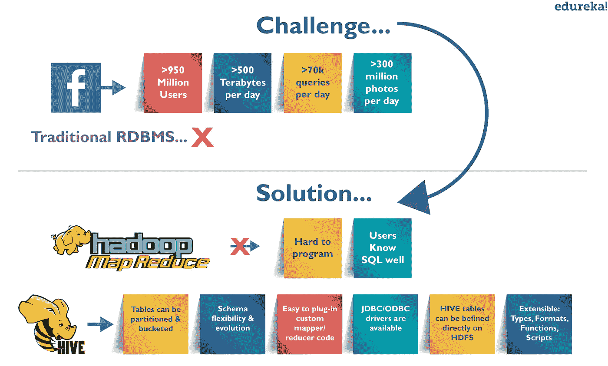
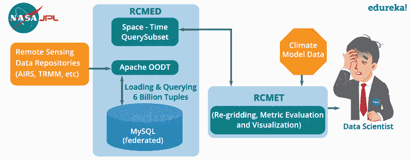
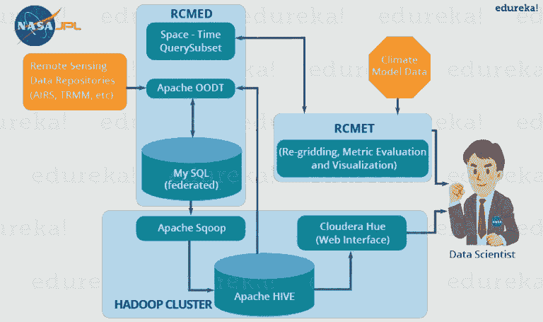
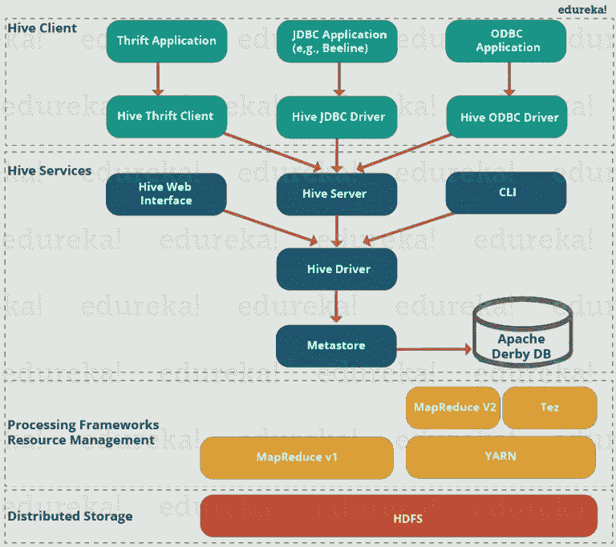
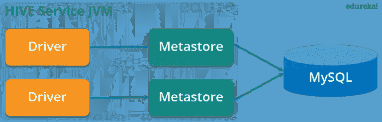
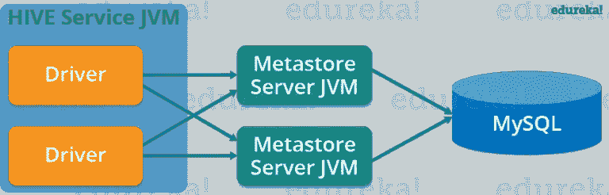
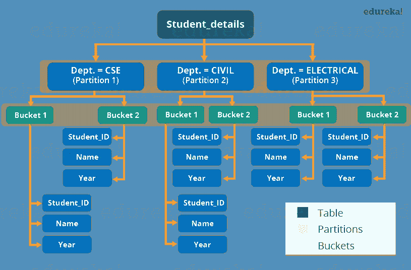

# NASA 如何使用 Hive 来解决他们的数据存储和处理问题？

> 原文：<https://medium.com/edureka/hive-tutorial-b980dfaae765?source=collection_archive---------2----------------------->

Hive Tutorial - Edureka

# 介绍

在这篇 Hive 教程博客中，我们将深入讨论 Apache Hive。Apache Hive 是 ***Hadoop 生态*** 中的数据仓库工具，提供类似 SQL 的语言，用于查询和分析 ***大数据*** 。开发 Hive 的动机是为 SQL 开发人员提供无摩擦的学习途径。Hive 不仅是非编程背景的人的救星，它还减少了花很长时间写 ***MapReduce*** 程序的程序员的工作。在这篇 Apache Hive 教程博客中，我将讨论:

> 1.什么是 Hive？
> 
> 2.阿帕奇蜂房的故事——从脸书到阿帕奇
> 
> 3.Apache Hive 的优势
> 
> 4.阿帕奇蜂房——NASA 案例研究
> 
> 5.阿帕奇蜂房架构
> 
> 6.Metastore 配置
> 
> 7.Hive 数据模型

# 什么是 Hive？

Apache Hive 是建立在 ***Hadoop*** 之上的数据仓库系统，用于分析结构化和半结构化数据。Hive 抽象了 Hadoop MapReduce 的复杂性。基本上，它提供了一种机制来将结构投射到数据上，并执行用 HQL (Hive Query Language)编写的类似于 SQL 语句的查询。在内部，这些查询或 HQL 被 Hive 编译器转换为 map reduce 作业。因此，您不需要担心编写复杂的 MapReduce 程序来使用 Hadoop 处理您的数据。它面向熟悉 SQL 的用户。Apache Hive 支持数据定义语言(DDL)、数据操作语言(DML)和用户定义函数(UDF)

> **SQL+Hadoop MapReduce = hive QL**

# 蜂巢的故事——从脸书到阿帕奇

*Facebook use case - Hive Tutorial*

## 脸书面临的挑战:数据呈指数级增长

在 2008 年之前，脸书的所有数据处理基础设施都是围绕基于商业 RDBMS 的数据仓库而构建的。这些基础设施足以满足当时脸书的需求。但是，随着数据开始快速增长，管理和处理这个庞大的数据集成为一个巨大的挑战。根据脸书的一篇文章，数据从 2007 年的 15 TB 数据集扩展到 2009 年的 2 PB 数据。此外，许多脸书产品涉及数据分析，如观众洞察、脸书词典、脸书广告等。因此，他们需要一个可扩展且经济的解决方案来应对这个问题，因此开始使用 Hadoop 框架。

# Hadoop 民主化— MapReduce

但是，随着数据的增长，Map-Reduce 代码的复杂性也成比例地增长。因此，培训没有编程背景的人编写 MapReduce 程序变得很困难。此外，为了执行简单的分析，必须编写一百行 MapReduce 代码。因为，SQL 被包括脸书在内的工程师和分析师广泛使用，因此，将 SQL 放在 Hadoop 之上似乎是让具有 SQL 背景的用户访问 Hadoop 的一种逻辑方式。

因此，SQL 满足大多数分析需求的能力和 Hadoop 的可扩展性催生了 **Apache Hive** ，它允许对*中的数据执行类似 SQL 的查询。后来，Hive 项目在 2008 年 8 月由脸书开源，并作为今天的 Apache Hive 免费提供。*

*现在，让我们来看看使 Hive 如此受欢迎的特性或优点。*

# *蜂巢的优势*

*   *对于没有编程背景的人很有用，因为它消除了编写复杂 MapReduce 程序的需要。*
*   ***可扩展**和**可扩展**应对不断增长的数据量和种类，而不影响系统的性能。*
*   *它是一个高效的 ETL(提取、转换、加载)工具。*
*   *Hive 通过公开其**节俭服务器**，支持任何用 Java、PHP、Python、C++或 Ruby 编写的客户端应用。(您可以使用这些嵌入 SQL 的客户端语言来访问 DB2 等数据库。).*
*   *由于 Hive 的元数据信息存储在 RDBMS 中，它大大减少了在查询执行期间执行语义检查的时间。*

# *在哪里使用 Apache Hive？*

*Apache Hive 同时利用了 SQL 数据库系统和***Hadoop—MapReduce***框架。因此，它被大量的公司使用。它主要用于数据仓库，您可以在其中执行不需要实时处理的分析和数据挖掘。可以使用 Apache Hive 的一些字段如下:*

*   *数据库*
*   *特别分析*

*正如人们所说，你不能只用一只手鼓掌，也就是说，你不能用一种工具解决所有问题。因此，您可以将 Hive 与其他工具结合使用，以便在许多其他领域使用它。例如，Tableau 与 Apache Hive 一起可以用于数据可视化，Apache Tez 与 Hive 的集成将为您提供实时处理能力等。
在这篇 Apache Hive 教程博客中，让我们来看看 NASA 的一个案例研究，从中您将了解 Hive 如何解决 NASA 科学家在评估气候模型时面临的问题。*

# *NASA 案例研究*

*气候模型是基于影响地球气候的各种因素的气候系统的数学表示。基本上，它描述了各种气候驱动因素的相互作用，如海洋、太阳、大气等。提供对气候系统动态的洞察。它通过基于影响气候的因素模拟气候变化来预测气候条件。美国航天局喷气推进实验室开发了区域气候模型评估系统(RCMES ),用于对照各种外部储存库中的遥感数据分析和评估气候输出模型。*

*RCMES(区域气候模型评估系统)有两个组成部分:*

## *区域气候模式评估数据库:*

*这是一个可扩展的云数据库，使用 Apache OODT 提取器、Apache Tika 等提取器加载与气候相关的遥感数据和再分析数据。最后，将数据转换为(纬度、经度、时间、数值、高度)形式的数据点模型，并存储到 ***MySQL*** 数据库中。客户端可以通过执行空间/时间查询来检索 RCMED 中的数据。这种查询的描述现在与我们无关。*

## *区域气候模型评估工具包:*

*它使用户能够将 RCMED 中的参考数据与从其他来源获取的气候模型输出数据进行比较，以进行不同类型的分析和评估。你可以参考下图来理解 RCMES 的架构。*

**

*The architecture of RCMES - Hive Tutorial*

*根据气候模型评估所需的不同参数，RCMED 中的参考数据来自卫星遥感。例如——AIRS(大气红外探测器)提供地面气温、温度和位势等参数，TRMM(热带降雨测量任务)提供月降雨量等。*

## *NASA 使用 MySQL 数据库系统面临的问题:*

*   *在用 60 亿元组的形式(纬度、经度、时间、数据点值、高度)加载 MySQL 数据库后，系统崩溃了，如上图所示。*
*   *即使将整个表分成更小的子集，系统在处理数据时也会产生巨大的开销。*

*因此，他们需要一个可扩展的解决方案，能够使用类似 SQL 的查询功能存储和处理如此大量的数据。最后，他们决定使用 Apache Hive 来克服上述问题。*

# *Apache Hive 如何解决问题？*

*现在，让我们看看，是哪些特性说服了 NASA 的 JPL 团队将 Apache Hive 作为其解决方案策略的一个组成部分:*

*   *因为 Apache Hive 运行在 Hadoop 之上，所以它是可伸缩的，并且可以以分布式和并行的方式处理数据。*
*   *它提供了类似于 SQL 的 Hive 查询语言，因此很容易学习。*

# *配置单元的部署:*

*下图说明了与 Apache Hive 集成的 RCMES 架构师:*

**

**RCMES Architecture with Apache Hive - Hive Tutorial**

*上图显示了 RCMES 中 apache hive 的部署。NASA 团队在部署 Apache Hive 时采取了以下步骤:*

*   *他们使用 Cloudera 和 Apache Hadoop 安装了 Hive，如上图所示。*
*   *他们使用 *Apache Sqoop* 从 MySQL 数据库中获取数据。*
*   *实现 Apache OODT 包装器是为了在 Hive 上执行查询，并将数据检索回 RCMET。*

# *Hive 的初始基准测试观察:*

*   *最初，他们将 25 亿个数据点加载到一个表中，并执行计数查询。例如，*Hive>*select count(data point _ id)from data point。统计所有记录需要 5-6 分钟(68 亿条记录需要 15-17 分钟)。*
*   *reduce 阶段很快，但是 map 阶段占用了总处理时间的 95%。他们使用六个( **4x 四核**)系统和 **24 GB 内存**(大约。)在每个系统中。*
*   *即使在添加了更多机器、更改了 HDFS 块大小(64 MB、128 MB、256 MB)以及更改了许多其他配置变量(io.sort.factor、io.sort.mb)之后，他们在减少完成计数的时间方面也没有取得多大成功。*

# *蜂巢社区成员的意见:*

*最后，Hive 社区的成员前来救援，并提供各种见解来解决他们当前 Hive 实现的问题:*

*   *他们提到，根据 NameNode 上的网络容量和工作负载，HDFS 读取速度大约为 **60 MB/s** ，而本地磁盘的读取速度大约为 **1GB/s** 。*
*   *成员们建议在他们当前的系统中需要 **16 个映射器**来匹配本地非 Hadoop 任务的 I/O 性能。*
*   *他们还建议减少每个映射器的**分割大小**，以增加映射器的数量，从而提供更多的并行性。*
*   *最后，社区成员告诉他们**使用 count (1)** 而不是引用 **count (datapoint_id)** 。这是因为在 count (1)的情况下，没有引用列，因此在执行计数时不会发生解压缩和反序列化。*

*最后，通过考虑蜂箱社区成员提出的所有建议，美国宇航局能够按照他们的期望调整他们的蜂箱集群。因此，他们能够使用上述系统配置在 15 秒内查询数十亿行。*

# *Hive 架构及其组件*

*下图描述了配置单元的体系结构以及将查询提交到配置单元并最终使用 MapReduce 框架进行处理的流程:*

**

*Hive Architecture - Hive Tutorial*

*如上图所示，配置单元体系结构可以分为以下几个部分:*

*   *Hive 客户端: Hive 支持用 Java、C++、Python 等多种语言编写的应用程序。使用 JDBC，节俭和 ODBC 驱动程序。因此，人们总是可以用自己选择的语言编写 hive 客户端应用程序。*
*   ***Hive 服务:** Apache Hive 提供各种服务，如 CLI、Web 界面等。执行查询。*
*   ***处理框架和资源管理:**在内部，Hive 使用 Hadoop MapReduce 框架作为事实上的引擎来执行查询。 ***Hadoop MapReduce 框架*** 本身是一个独立的主题，因此，这里不做讨论。*
*   ***分布式存储:**由于 Hive 安装在 Hadoop 之上，它使用底层的 HDFS 作为分布式存储。*

*现在，让我们探索一下 Hive 架构中的前两个主要组件:*

## *1.配置单元客户端:*

*Apache Hive 支持不同类型的客户端应用程序在 Hive 上执行查询。这些客户端可以分为三种类型:*

*   ****Thrift 客户端:*** 由于 Hive server 是基于 Apache Thrift 的，所以它可以服务于所有支持 Thrift 的编程语言的请求。*
*   ****JDBC 客户端:*** Hive 允许 Java 应用程序使用 org . Apache . Hadoop . Hive . JDBC . Hive driver 类中定义的 JDBC 驱动程序连接到它*
*   ****ODBC 客户端:***Hive ODBC 驱动程序允许支持 ODBC 协议的应用程序连接到 Hive。(与 JDBC 驱动程序一样，ODBC 驱动程序使用 Thrift 与 Hive 服务器通信。)*

## *2.配置单元服务:*

*Hive 提供了许多服务，如上图所示。让我们来看看它们中的每一个:*

*   ***Hive CLI(命令行界面):**这是 Hive 提供的默认 shell，您可以在其中直接执行 Hive 查询和命令。*
*   ***Apache Hive Web 界面:**除了命令行界面，Hive 还提供了一个基于 Web 的 GUI，用于执行 Hive 查询和命令。*
*   ***Hive Server:** Hive server 建立在 Apache Thrift 之上，因此也被称为 Thrift Server，它允许不同的客户端向 Hive 提交请求并检索最终结果。*
*   ***Apache Hive 驱动:**负责接收客户端通过 CLI、web UI、Thrift、ODBC 或 JDBC 接口提交的查询。然后，驱动程序将查询传递给编译器，在 metastore 中的模式的帮助下，进行解析、类型检查和语义分析。在下一步中，以 map-reduce 任务和 HDFS 任务的 DAG(有向无环图)的形式生成优化的逻辑计划。最后，执行引擎使用 Hadoop 按照依赖关系的顺序执行这些任务。*
*   ***Metastore:** 您可以将 Metastore 视为存储所有配置单元元数据信息的中央存储库。Hive 元数据包括各种类型的信息，如表和分区的结构，以及列、列类型、序列化程序和反序列化程序，这是对 HDFS 中的数据进行读/写操作所必需的。*metastore 由两个基本单元组成:**

> *提供对其他配置单元服务的 metastore 访问的服务。*
> 
> *元数据的磁盘存储，独立于 HDFS 存储。*

*现在，让我们在本 Hive 教程的下一节中理解实现 Hive metastore 的不同方式。*

# *Metastore 配置*

*Metastore 使用 RDBMS 和称为 Data Nucleus 的开源 ORM(对象关系模型)层存储元数据信息，该层将对象表示转换为关系模式，反之亦然。选择 RDBMS 而不是 HDFS 的原因是为了实现低延迟。我们可以在以下三种配置中实现 metastore:*

## *1.嵌入式 Metastore:*

**

*Embedded Metastore - Hive Tutorial*

*缺省情况下，metastore 服务和 Hive 服务运行在同一个 JVM 中，使用嵌入式 Derby 数据库实例，元数据存储在本地磁盘中。这称为嵌入式 metastore 配置。在这种情况下，一次只有一个用户可以连接到 metastore 数据库。如果您启动配置单元驱动程序的第二个实例，您将得到一个错误。这对于单元测试来说是好的，但是对于实际的解决方案来说却不是。*

## *2.本地 Metastore:*

**

*Local Metastore - Hive Tutorial*

*此配置允许我们拥有多个配置单元会话，即多个用户可以同时使用 metastore 数据库。这可以通过使用任何 JDBC 兼容的数据库来实现，如 MySQL，它运行在单独的 JVM 或不同的机器上，而不是运行在如上所示的相同 JVM 中的 Hive 服务和 metastore 服务的机器上。一般来说，最流行的选择是将 MySQL 服务器实现为 metastore 数据库。*

## *3.远程 Metastore:*

**

*Remote Metastore*

*在远程 metastore 配置中，metastore 服务运行在自己单独的 JVM 上，而不是在配置单元服务 JVM 中。其他进程使用节俭网络 API 与 metastore 服务器通信。在这种情况下，您可以拥有一个或多个 metastore 服务器来提供更高的可用性。使用远程 metastore 的主要优点是，您不需要与每个 Hive 用户共享 JDBC 登录凭据来访问 metastore 数据库。*

# *数据模型*

*Hive 中的数据可以在粒度级别上分为三种类型:*

*   *桌子*
*   *划分*
*   *水桶*

## *表格:*

*Hive 中的表与关系数据库中的表相同。您可以对它们执行筛选、投影、连接和联合操作。Hive 中有两种类型的表:*

## *1.托管表:*

****命令:****

**创建表<TABLE _ name>(column 1 data _ type，column 2 data _ type)；**

**将路径<HDFS _ 文件 _ 位置>中的数据加载到表格托管 _ 表格中；**

*顾名思义(托管表)，Hive 负责管理一个托管表的数据。换句话说，我所说的“Hive 管理数据”的意思是，如果您将数据从位于 HDFS 的文件加载到 Hive *管理的表*中，并对其发出 DROP 命令，该表及其元数据将被删除。因此，属于被删除的 *managed_table* 的数据不再存在于 HDFS 的任何地方，您也无法以任何方式检索它。基本上，当您发出 LOAD 命令时，您正在将数据从 HDFS 文件位置移动到 Hive warehouse 目录。*

> ****注意:*** 仓库目录的默认路径设置为/user/hive/warehouse。配置单元表的数据驻留在仓库目录 **/** 表名(HDFS)中。还可以在 hive-site.xml 中的 hive.metastore.warehouse.dir 配置参数中指定仓库目录的路径。*

## *2.外部表格:*

****命令:****

**创建外部表<TABLE _ name>(column 1 data _ type，column 2 data _ type)LOCATION '<TABLE _ hive _ LOCATION>'；**

**将路径'<HDFS _ 文件 _ 位置>中的数据加载到表<表 _ 名称>中；**

*对于一个*外部表*，Hive 不负责管理数据。在这种情况下，当您发出 LOAD 命令时，Hive 将数据移动到它的仓库目录中。然后，Hive 为外部表创建元数据信息。现在，如果您在*外部表*上发出 DROP 命令，只有关于外部表的元数据信息会被删除。因此，您仍然可以使用 HDFS 命令从仓库目录中检索外部表的数据。*

# *分区:*

****命令:****

**创建由(partition1 data_type，partition2 data_type，…)分区的表 table_name (column1 data_type，column2 data_type)。);**

*Hive 将表组织成分区，以便根据列或分区键将相似类型的数据分组在一起。每个表可以有一个或多个分区键来标识特定的分区。这允许我们对数据切片进行更快的查询。*

****注意:*** 记住，创建分区时最常犯的错误是将现有的列名指定为分区列。在这样做的时候，您会收到一个错误——“语义分析中的错误:分区列中的列重复”。*

*让我们通过一个例子来理解分区，在这个例子中，我有一个表 student_details，包含某个工程学院的学生信息，如 student_id、姓名、院系、年份等。现在，如果我基于部门列执行分区，属于某个特定部门的所有学生的信息将一起存储在该分区中。从物理上讲，分区只不过是表目录中的一个子目录。*

*假设我们的 student_details 表中有三个部门的数据——CSE、ECE 和 Civil。因此，每个部门总共有三个分区，如下图所示。而且，对于每个部门，我们将把关于该部门的所有数据放在 Hive 表目录下的一个单独的子目录中。例如，所有关于 CSE 部门的学生数据都将存储在 user/hive/warehouse/student _ details/dept . = CSE 中。因此，关于 CSE 学生的查询只需查看 CSE 分区中的数据。这使得分区非常有用，因为它通过只扫描与**相关的**分区数据而不是整个数据集来减少查询延迟。事实上，在现实世界的实现中，您将处理数百 TB 的数据。因此，想象一下，为某个查询扫描如此大量的数据，而你扫描的 **95%** 的数据与你的查询不相关。*

*我建议你浏览一下关于[***Hive commands***](https://www.edureka.co/blog/hive-commands-with-examples?utm_source=medium&utm_medium=content-link&utm_campaign=hive-tutorial)的博客，在那里你会找到实现分区的不同方法和例子。*

**

*Hive Partitions Buckets - Hive Tutorial*

# *桶:*

****命令:****

**创建由(partition1 data_type，partition2 data_type，…)分区的表 table_name。)按(column_name1，column_name2，…)分类，按(column_name [ASC|DESC]，…)]排序到 num_buckets 桶中；**

*现在，您可以根据表中某一列的散列函数，将每个分区或未分区表分成多个桶。实际上，每个桶只是分区目录或表目录(未分区表)中的一个文件。因此，如果您选择将分区划分为 n 个存储桶，那么您的每个分区目录中将有 n 个文件。例如，您可以看到上面的图像，其中我们将每个分区分成两个桶。因此，每个分区，比如说 CSE，将有两个文件，每个文件将存储 CSE 学生的数据。*

## *Hive 如何将行分布到桶中？*

*嗯，Hive 通过使用公式来确定一行的桶号:**hash _ function(bucket ing _ column)modulo(num _ of _ buckets)**。这里，hash_function 依赖于列数据类型。例如，如果您基于某个列(比如 INT 数据类型的 user_id)对表进行分桶，那么 hash_function 将是—**hash _ function(user _ id**)**= user _ id 的整数值**。并且，假设您已经创建了两个桶，那么 Hive 将通过计算:(user_id 的值)modulo (2)来确定每个分区中进入桶 1 的行。因此，在这种情况下，user_id 以偶数数字结尾的行将驻留在与每个分区对应的同一个存储桶中。其他数据类型的 hash_function 计算起来有点复杂，事实上，对于一个字符串，它甚至是人类无法识别的。*

> ***注意:**如果你用的是 Apache Hive 0.x 或者 1.x，你要发出命令—set Hive . enforce . bucket ing = true；在你的母舰终端上。这将允许您在使用 cluster by 子句对列进行分桶时拥有正确数量的 reducer。如果您没有这样做，您可能会发现在您的表目录中生成的文件的数量不等于存储桶的数量。或者，您也可以使用 set mapred . reduce . task = num _ bucket 将缩减器的数量设置为桶的数量。*

## *为什么我们需要水桶？*

*对分区执行分桶有两个主要原因:*

*   ****map side join*** 要求属于唯一连接键的数据出现在同一个分区中。但是那些分区键不同于 join 的情况呢？因此，在这些情况下，您可以通过使用连接键对表进行分桶来执行映射端连接。*
*   *分桶使采样过程更有效，因此，允许我们减少查询时间。*

*我想在这里结束这个蜂巢教程博客。我很确定在阅读完这篇 Hive 教程博客后，您会意识到 Apache Hive 的简单性。既然你们已经学习了所有的 Hive 基础知识，现在是时候来体验一下 Apache Hive 了。*

*如果你想查看更多关于人工智能、Python、道德黑客等市场最热门技术的文章，你可以参考 Edureka 的官方网站。*

*请留意本系列中解释大数据其他各方面的其他文章。*

> *1. [Hadoop 教程](/edureka/hadoop-tutorial-24c48fbf62f6)*
> 
> *2.[大数据教程](/edureka/big-data-tutorial-b664da0bb0c8)*
> 
> *3.[养猪教程](/edureka/pig-tutorial-2baab2f0a5b0)*
> 
> *4.[地图缩小教程](/edureka/mapreduce-tutorial-3d9535ddbe7c)*
> 
> *5.[h 基础教程](/edureka/hbase-tutorial-bdc36ab32dc0)*
> 
> *6. [HDFS 教程](/edureka/hdfs-tutorial-f8c4af1c8fde)*
> 
> *7. [Hadoop 3](/edureka/hadoop-3-35e7fec607a)*
> 
> *8. [Sqoop 教程](/edureka/apache-sqoop-tutorial-431ed0af69ee)*
> 
> *9.[水槽教程](/edureka/apache-flume-tutorial-6f7150210c76)*
> 
> *10. [Oozie 教程](/edureka/apache-oozie-tutorial-d8f7bbbe1591)*
> 
> *11. [Hadoop 生态系统](/edureka/hadoop-ecosystem-2a5fb6740177)*
> 
> *12.[HQL 顶级配置单元命令及示例](/edureka/hive-commands-b70045a5693a)*
> 
> *13. [Hadoop 集群搭配亚马逊 EMR？](/edureka/create-hadoop-cluster-with-amazon-emr-f4ce8de30fd)*
> 
> *14.[大数据工程师简历](/edureka/big-data-engineer-resume-7bc165fc8d9d)*
> 
> *15. [Hadoop 开发人员-工作趋势和薪水](/edureka/hadoop-developer-cc3afc54962c)*
> 
> *16. [Hadoop 面试问题](/edureka/hadoop-interview-questions-55b8e547dd5c)*

**原载于 2016 年 12 月 5 日*[*www.edureka.co*](https://www.edureka.co/blog/hive-tutorial)*。**