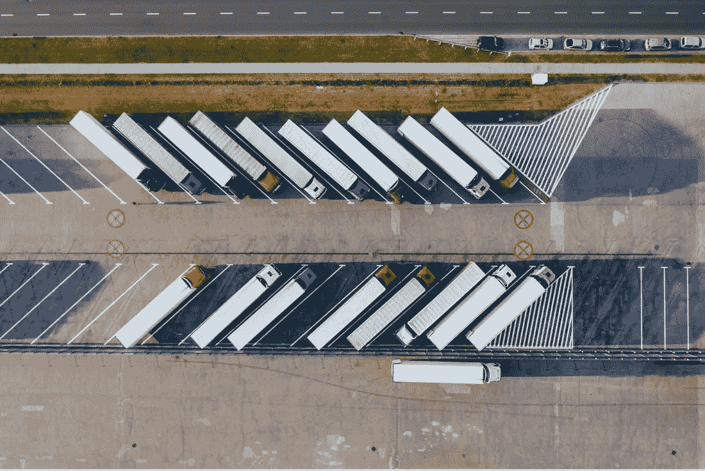
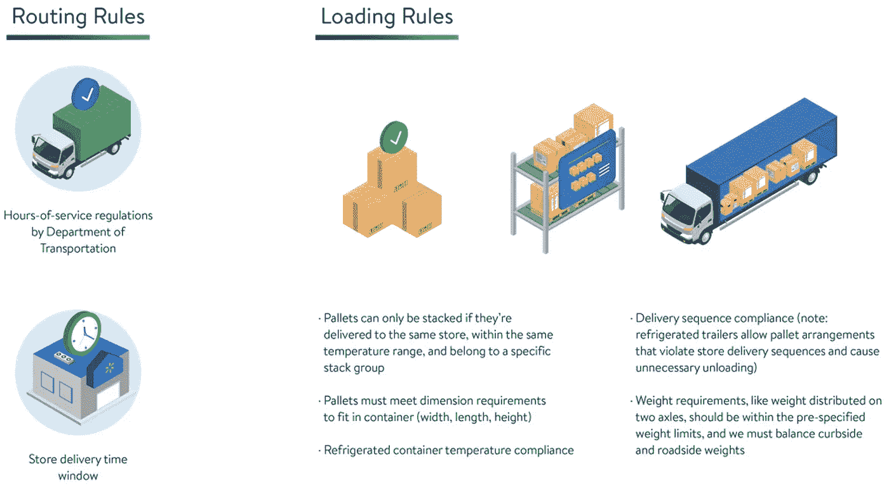
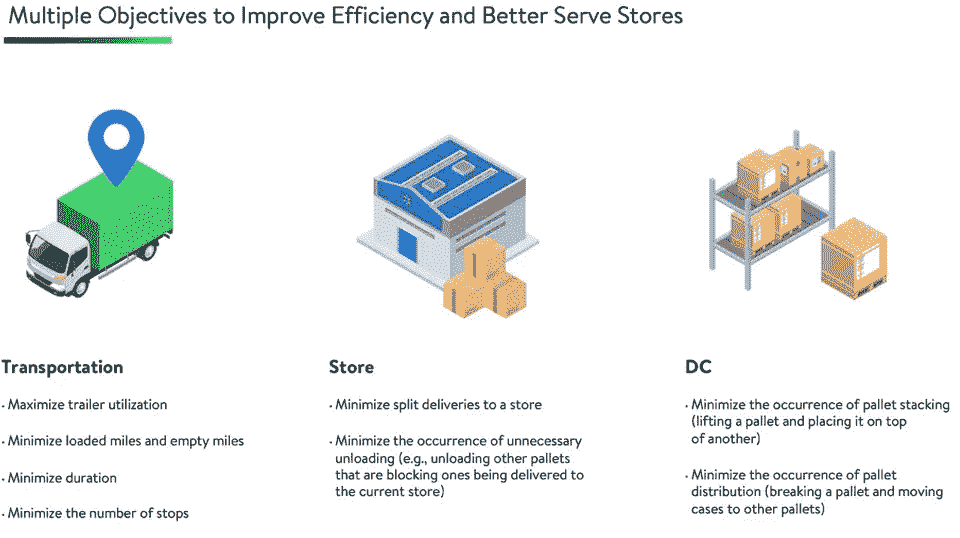
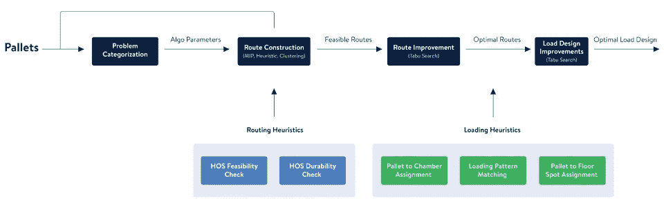

# 整体解决中英里杂货配送的车辆路径和集装箱装载问题

> 原文：<https://medium.com/walmartglobaltech/holistically-solving-vehicle-routing-and-container-loading-problems-for-middle-mile-grocery-935b9957d850?source=collection_archive---------3----------------------->

作者:黄静、付敏刚和刘明辉

Photo credit: [marcinjozwiak](https://pixabay.com/photos/topdown-drone-import-export-4405895/)

# **问题**

在沃尔玛，我们的中间一英里包括从配送中心(DC)向商店运送商品的所有渠道。它负责每天从 40 多个配送中心向 5，000 多家商店运送 100，000 多个杂货托盘。我们一直在分析运输这些商品的最有效和最经济的方式。由于补货频率高，而补货量低，为每个商店建立一个专用的货车托盘很有挑战性。我们需要将运送到多家商店的托盘整合到一辆卡车上，同时考虑快速运输商品和减少空载里程的最佳路线。

此外，与其他交付渠道(例如，最后一英里交付)相比，我们必须考虑中间一英里交付如何适应大量的法规和限制。

车辆路线和拖车装载问题得到了广泛的研究，但是我们发现普通的解决方案存在不足，因为:

*   布线和装载必须同时解决**、**，而顺序解决是漫长且难以实现的
*   卡车路线(中/长途)需要考虑交通部(DOT)制定的司机工作时间规定
*   易腐物品在最多有三个车厢的冷藏拖车内的放置必须优化并符合许多规则

简而言之，我们有更大的机会来优化从分拨中心向商店运送物品以及用托盘装载拖车的方式，从而提高效率。利用我们对零售技术的了解，我们决定自己解决这些问题。

# **我们需要什么**

一旦 DC 杂货店收到要送到商店的订单，它的仓库管理系统就会将订单转换成虚拟货盘。每个虚拟货盘都包括建造一个 40x48 英寸的木质框架的计划，该框架可以装载多箱货物。中英里递送优化系统将这些虚拟货盘作为输入，并产生一组具有最有效装载计划(即货盘应如何在每辆拖车中排列)的时间表和一组将这些货盘运送到指定商店的最佳路线。

由于服务时间的规定，我们确定输出路线不仅应该包含送货顺序，还应该包含详细的司机活动，如何时休息和中途停留。当生成拖车装载计划以及路线时，它通常包含行、列、每个货盘的方向、隔板的位置、每个车厢的温度设置以及空货盘。

从路由的角度来看，商店订单应该在商店交付窗口内交付。为了获得理想的路线安排方案，需要在路线上增加回程，以提高路线的效率。从装载角度来看，优化器应该在满足所有约束的同时优化拖车利用率。

中英里配送优化的主要目标是找到最佳路线和负载，实现最高效的运营，并更好地满足商店需求。

# **我们的解决方案**

我们建立了一个基于禁忌搜索的框架，利用邻域搜索和启发式算法一次性解决了布线和装载问题。我们的解决方案分析问题特征，以在各种启发式和混合整数规划模型中找到最佳算法来解决不同的用例。然后，它使用选定的算法构建可行的初始路由。然后，禁忌搜索算法扫描一个非常大的解空间，以找到可能的最佳解。

路线解决方案不仅包含每条交货路线上发生的详细活动，而且还指定哪些托盘属于每条交货路线以及移动这些托盘所需的拖车。一旦确定了最佳路线，我们将提供装载设计改进，以优化每辆拖车中托盘的排列，从而实现最佳重量平衡。

我们开发了许多创新的试探法来减少有问题的维度和运行时间，从而提高了解决方案的质量。在我们“秘方”的帮助下，我们的解决方案优于行业领先公司提供的其他解决方案。它为干货交付节省了 1%的成本，为易腐货物交付节省了 3–4%的成本。除了解决方案质量方面的改进，系统运行时间为 15 分钟，显著低于第三方产品提供的运行时间。

# **它到底是如何工作的？**

我们的解决方案亮点之一是快速检测路线和装载解决方案的可行性。这对优化和计算时间至关重要。在我们提出的框架中，路径改进(通常是求解车辆路径问题)是禁忌搜索应用的最关键步骤。由于许多小时服务规则和各种装载规则，中间英里解决方案的可行性检查比寻找传统的车辆路线问题更复杂。这就是为什么我们开发了创新的路由和装载试探法来减少可行性检查的计算时间。

例如，让我们考虑一个装载可行性检查。不同于传统的 3D 装箱设计问题，我们从不同的角度解决了这个问题。我们首先将堆叠构造分离出来作为预处理，以帮助我们将 3D 装载问题转化为 2D 问题。在构建堆栈后，我们使用一种算法来确定拖车上的地板点，而不是对堆栈进行排序来逐个确定它们的位置和方向。地板点可以被视为具有固定位置和方向的堆栈的虚拟“占位符”。因为这一步，我们不必考虑在哪里放置每个单独的堆栈；我们需要知道的是容器中可以放多少叠。接下来，我们的算法利用一组现有的装载模式(如宽度、长度、旋转和混合)来缩小可能的地板点配置。这意味着，当地板点被放置在拖车内，托盘被合并成垛时，我们可以将这些特定的垛分配给每个地板点。

我们介绍的另一个关键思想是通过主动订单分割来提高优化。这与被动订单拆分形成对比，在被动订单拆分中，当一个集装箱装不下一家商店的订单时，我们必须将其拆分。这种想法背后的动机是，我们可以通过主动拆分一家商店的订单来更好地整合来自其他商店的订单，即使它不必拆分以适合一个集装箱。我们设计了多种算法来确定活动拆分，例如基于存储位置的启发式算法和用于订单到路线模板分配的混合整数规划。这种想法可以增加停靠站的总数，但它通过提高拖车利用率和减少路线数量和行驶里程来降低成本。此外，路由改进算法可以有效地识别和避免冗余的活动分裂，将它们合并成一条路由。

我们的解决方案的其他亮点包括基于不必要的卸载订购装载模式的能力，在遵守 DOT 规则的同时最大限度地减少等待时间，在服务时间内推广设计以轻松适应不断变化的运输规则，等等。

除了从算法角度不断增强之外，高效的实现也是关键。通过代码优化，尤其是禁忌搜索部分，我们不仅能够在解决方案空间中搜索更多内容以实现更好的优化，还能通过显著减少系统运行时间来加快开发过程。

# **下一步是什么**

沃尔玛目前正在为我们的 DC 杂货网络推出解决方案。它刚刚于 2022 年 7 月在 40 多个杂货配送中心上线。此外，我们正在探索利用这一框架的其他机会，并继续改善我们的中里程交付。

该解决方案已被证明是足够灵活和可扩展的，以适应其他网络中潜在使用的额外业务规则，如逆向物流和 GM 网络。我们已经成功利用这一框架解决了通过船只向阿拉斯加和夏威夷的商店运送冷冻和干货的问题。当前算法也有许多改进，如并行化和集成各种算法。这个新框架允许我们尝试各种算法，并不断提高其有效性。

最后，完全拥有我们自己的中里程交付解决方案框架使我们能够进一步将路线和装载考虑整合到上游补给系统中。如果我们在下订单时考虑运输和装载成本，那么运输系统在执行商店订单时可能会更有效率。例如，来自特定位置的商店订单与来自附近商店的订单相结合时，更有可能装满一卡车货物。沃尔玛目前正在研究路线和装载优化，该优化与补货计划深度集成，以使用自适应学习算法生成最佳商店订单并最小化运输成本。

不断推进我们的中里程交付系统将有助于为我们的员工和客户提供无缝体验。成为沃尔玛的一员是一个激动人心的时刻！

**确认**

该解决方案框架已作为 Load Planner(沃尔玛外向交付和拖车规划系统)的核心优化程序实施，并推广到沃尔玛杂货网络。我们要感谢以下团队，他们为实现这一目标发挥了重要作用:由 Travis Johnson、Shwetal Mokashi、Joe Hendricks、Ankush Bhargava 和 Xiao 领导的产品团队；由 Parvez Musani、Sai Kumar 和 Ranjith Moola 领导的工程团队；以及我们的数据科学团队成员孙(Ou Sun)、阿迪蒂亚·斯里尼瓦桑(Aditya Srinivasan)、、、费雷敦·阿德贝什(Fereydoun Adbesh)、聂和丹尼尔·祖尼加·瓦兹奎。