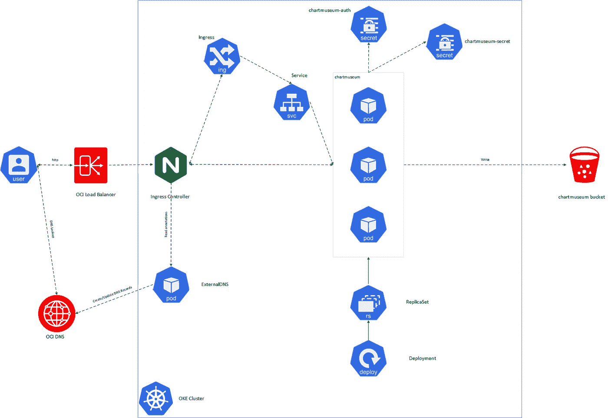
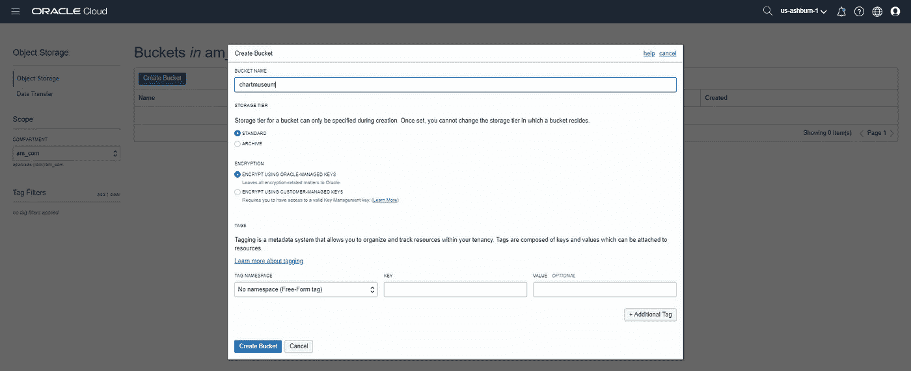
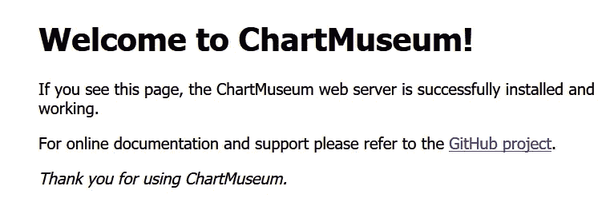
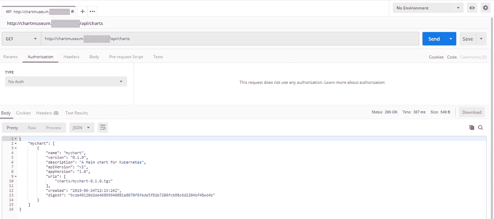
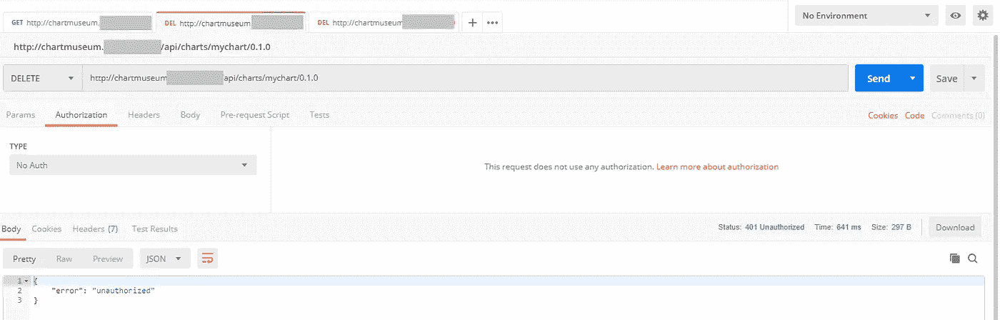
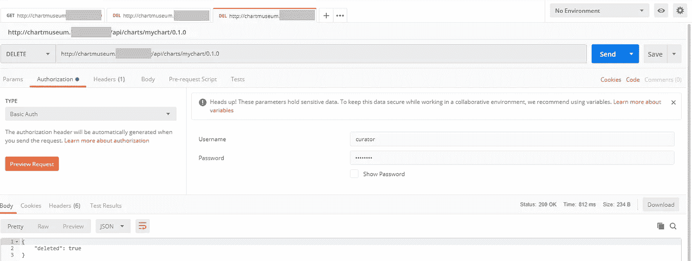
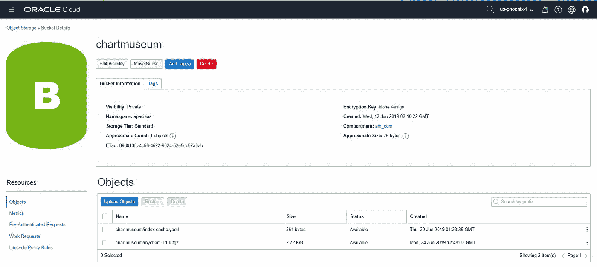
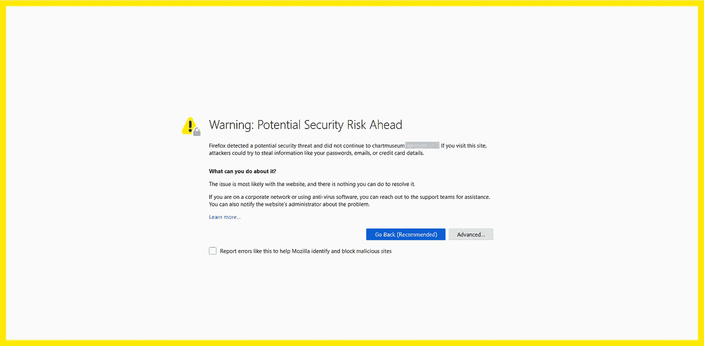
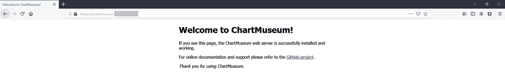

# 在 OCI 托管一个私人赫尔姆储存库，拥有海图博物馆和 OCI 物品储存库

> 原文：<https://medium.com/oracledevs/hosting-a-private-helm-repository-on-oci-with-chartmuseum-and-oci-object-storage-d4a649328760?source=collection_archive---------0----------------------->

在[之前的一篇文章](/oracledevs/extending-terraform-oke-with-a-helm-chart-a51ae0df29d4?source=friends_link&sk=176c642cf12cd45cd016d890a665dc16)中，我们在 Oracle 容器引擎(OKE)中部署了一个舵图(Redis ),这个舵图是从稳定的存储库中提取的。默认情况下，[稳定](https://github.com/helm/charts/tree/master/stable)回购托管于【https://kubernetes-charts.storage.googleapis.com】的/。我们也可以手动添加[孵化器](https://github.com/helm/charts/tree/master/incubator)库，如果我们想:

```
helm repo add incubator https://kubernetes-charts-incubator.storage.googleapis.com/
"incubator" has been added to your repositories
```

这些存储库中的容器映像也是公开可用的，例如 redis 的默认映像是 [Dockerhub](https://hub.docker.com/) 上 bitnami 的容器 redis 存储库中的 [bitnami/redis](https://hub.docker.com/r/bitnami/redis) 。

我们已经描述了如何在 [OCIR](https://cloud.oracle.com/containers/registry) 上[私有](/@lmukadam/build-a-springboot-application-using-wercker-push-a-docker-image-to-ocir-and-deploy-to-oke-596f62554eae?source=friends_link&sk=a52f0d9be1dd983a1bdb80b2cf6b537d)托管容器映像。如果我们想对我们的舵图表做同样的事情呢？

幸运的是，这也有一个解决方案。向前迈进一步 [chartmuseum](https://chartmuseum.com/) ，一个开源的 Helm Chart Repository 服务器，支持各种云存储后端，包括 [OCI 对象存储](https://docs.cloud.oracle.com/iaas/Content/Object/Concepts/objectstorageoverview.htm)。

假设:

您正在使用 [terraform-oci-oke](https://github.com/oracle-terraform-modules/terraform-oci-oke) 项目来供应您的 oke 集群。详见[本帖](/oracledevs/provisioning-oracle-container-engine-oke-using-terraform-41542fd15d1c?source=friends_link&sk=efe4c6c36c22bc14c7e9bbff6b343ffb)。下面是我们将要构建的架构:



Deploying chartmuseum on OCI

## 安装 nginx-控制器

首先，按照[这个帖子](/oracledevs/changing-load-balancer-shape-in-oracle-container-engine-oke-and-updating-dns-with-external-dns-7064f15cf600?source=friends_link&sk=3f539e6f43c3e973492ede35877d15d8)安装[外部 DNS](https://github.com/kubernetes-incubator/external-dns) 。

然后，让我们安装[nginx-控制器](https://kubernetes.github.io/ingress-nginx/):

```
helm install --name nginxcontroller stable/nginx-ingress \
--set controller.name=controller \
--set defaultBackend.enabled=true \
--set defaultBackend.name=defaultbackend \
--set rbac.create=true \
--set controller.service.annotations."external-dns\.alpha\.kubernetes\.io/hostname"=chartmuseum.acme.com
```

用您的首选主机名替换 chartmuseum.acme.com。稍后我们将使用它来访问 chartmuseum。

验证是否已创建 OCI 负载平衡器，以及是否已在 DNS 区域中插入 DNS“A”记录。

## 创建 OCI 存储桶

在 OCI 控制台中，导航到对象存储并创建一个名为“chartmuseum”的存储桶:



chartmuseum bucket

## 部署图表博物馆

我们希望有一个稳定的或孵化器回购类似的体验，即匿名获取但受保护的 POST 请求，我们将使用基本的 Auth 进行身份验证。

让我们首先创建一个密码来保存基本的 Auth 用户名和密码:

```
kubectl create secret generic chartmuseum-auth --from-literal=user=curator --from-literal=pass=password
```

您还需要创建第二个秘密，以允许 chartmuseum 与 OCI API 进行通信。

暂时将您的 api 密钥复制到 bastion。如果您有 kubectl 并且可以在本地访问 kubeconfig，那么您也可以在本地完成这项工作。

创建文件“配置”:

```
[DEFAULT]                                                                                                                                                             
user=<USER_OCID>                                                                                    
fingerprint=<API_KEY_FINGERPRINT>
key_file=/home/chartmuseum/.oci/oci.key                                                                                                                               
tenancy=<TENANCY_OCID>
region=<REGION>
```

输入您的用户和租赁 OCIDs、api 密钥指纹和区域值。key_file 值必须是“/home/chartmuseum/”。oci/oci.key "。

接下来，创建秘密:

```
kubectl create secret generic chartmuseum-secret --from-file=config="/path/to/config" --from-file=key_file="/path/to/apikey.pem"
```

替换为配置文件和私有 api 密钥的适当绝对或相对路径。

接下来，下载 chartmuseum 值文件:

```
curl -o values.yaml [https://raw.githubusercontent.com/helm/charts/master/stable/chartmuseum/values.yaml](https://raw.githubusercontent.com/helm/charts/master/stable/chartmuseum/values.yaml)
```

编辑 values.yaml 文件并替换参数，如下所示:

```
env:
  open:
    STORAGE: oracle
    STORAGE_ORACLE_COMPARTMENTID:<COMPARTMENT_OCID>
    STORAGE_ORACLE_BUCKET: chartmuseum
    STORAGE_ORACLE_PREFIX: chartmuseum
    DISABLE_API: false
    AUTH_ANONYMOUS_GET: true
    AUTH_REALM: chartmuseumexistingSecret: chartmuseum-auth
existingSecretMappings:
  BASIC_AUTH_USER: user
  BASIC_AUTH_PASS: passingress:
  enabled: true
  labels:
    dns: "ocidns"annotations:
    kubernetes.io/ingress.class: nginxhosts:
   - name: chartmuseum.acme.com
     path: /
     tls: falseoracle:
  secret:
    enabled: true
    name: chartmuseum-secret
    config: config
    key_file: key_file
```

我们现在可以安装 chartmuseum:

```
helm install --name=chartmuseum -f values.yaml stable/chartmuseum
```

等待 pod 运行:

```
kubectl get pods -wNAME                                                            READY   STATUS    RESTARTS   AGE                                                                      
chartmuseum-chartmuseum-748c8dbbd8-7nctc                        1/1     Running   0          5m20s
```

验证入口是否已创建:

```
kubectl get ingNAME                      HOSTS                       ADDRESS   PORTS   AGE                                                                                           
chartmuseum-chartmuseum   chartmuseum.acme.com             80      7m9s
```

它映射到地图博物馆服务:

```
k describe ing chartmuseum-chartmuseum                                                                                                     
Name:             chartmuseum-chartmuseum                                                                                                                             
Namespace:        default                                                                                                                                             
Address:                                                                                                                                                              
Default backend:  default-http-backend:80 ()                                                                                                                    
Rules:                                                                                                                                                                
  Host                       Path  Backends                                                                                                                           
  ----                       ----  --------                                                                                                                           
  chartmuseum.acme.com                                                                                                                                           
                             /   **chartmuseum-chartmuseum**:8080 ()                                                                                                
Annotations:                                                                                                                                                          
  kubernetes.io/ingress.class:  nginx                                                                                                                                 
Events:                                                                                                                                                               
  Type    Reason  Age    From                      Message                                                                                                            
  ----    ------  ----   ----                      -------                                                                                                            
  Normal  CREATE  6m20s  nginx-ingress-controller  Ingress default/chartmuseum-chartmuseum                                                                            
  Normal  UPDATE  5m31s  nginx-ingress-controller  Ingress default/chartmuseum-chartmuseum
```

最后，你可以用你的浏览器来验证是否可以公开到达 chart museum:[http://chartmuseum.acme.com](http://chartmuseum.acme.com)



Chartmuseum

## 将图表推至图表博物馆

安装舵推插件:

```
helm plugin install [https://github.com/chartmuseum/helm-push](https://github.com/chartmuseum/helm-push)
```

接下来，添加回购:

```
helm repo add --username curator --password password cm [http://chartmuseum.acme.com/](http://chartmuseum.indophile.org/)
```

让我们首先创建一个可用于测试的基本图表:

```
helm create mycharthelm package mychart
Successfully packaged chart and saved it to: /home/opc/chart/mychart-0.1.0.tgz
```

现在，我们可以推出图表:

```
helm push mychart cmPushing mychart-0.1.0.tgz to cm...                                                                                                                                    
Done.
```

如果我们搜索 mychart，我们只会找到本地副本:

```
helm search mychart                                                                                                                              
NAME            CHART VERSION   APP VERSION     DESCRIPTION                                                                                                           
local/mychart   0.1.0           1.0             A Helm chart for Kubernetes
```

让我们做一个回购更新:

```
helm repo update cm                                                                                                                              
Hang tight while we grab the latest from your chart repositories...                                                                                                   
...Skip local chart repository                                                                                                                                        
...Successfully got an update from the "cm" chart repository                                                                                                          
...Successfully got an update from the "stable" chart repository                                                                                                      
Update Complete. ⎈ Happy Helming!⎈
```

和一个新的搜索:

```
helm search mychart                                                                                                                              
NAME            CHART VERSION   APP VERSION     DESCRIPTION                                                                                                           
**cm/mychart      0.1.0           1.0             A Helm chart for Kubernetes**                                                                                           
local/mychart   0.1.0           1.0             A Helm chart for Kubernetes
```

新图表出现。

## 测试认证

我们可以删除 repo 并在没有用户名和密码的情况下再次添加它。不过我们会用 Postman 和 chartmuseum 的 API 来测试。这是我们想要的行为:

获取:不需要验证
发布:需要验证
删除:需要验证



GET (without authentication)

您可以看到，我们能够使用 get 而无需身份验证来获取图表列表。

但是，未经验证的删除或发布会失败:



Unauthorized chart deletion

但是，当我们输入凭据时，图表删除成功:



Successful chart deletion

如果我们现在检查 OCI 对象存储，我们可以在那里看到我们的图表:



## 让我们加密

现在我们的 chartmuseum 已经启动并运行，我们还希望通过加密流量来确保其使用安全。我们将使用[Let’s Encrypt](https://letsencrypt.org/)和[证书管理器](https://github.com/jetstack/cert-manager)，这是一个插件，用于自动管理和发行来自各种发行来源的 TLS 证书。

您可以按照[指南](https://docs.cert-manager.io/en/latest/getting-started/install/kubernetes.html)安装 cert-manager 或继续阅读。

首先，创建 CustomResourceDefinitions，这是证书管理器的命名空间，并禁用命名空间上的资源验证:

```
kubectl apply -f [https://raw.githubusercontent.com/jetstack/cert-manager/release-0.8/deploy/manifests/00-crds.yaml](https://raw.githubusercontent.com/jetstack/cert-manager/release-0.8/deploy/manifests/00-crds.yaml)kubectl create namespace cert-managerkubectl label namespace cert-manager certmanager.k8s.io/disable-validation=true
```

添加 Jetpack Helm 回购并更新:

```
helm repo add jetstack [https://charts.jetstack.io](https://charts.jetstack.io)
helm repo update jetstack
```

使用证书管理器的操舵图安装证书管理器:

```
helm install --name cert-manager --namespace cert-manager \
--version v0.8.1 jetstack/cert-manager
```

验证安装:

```
kubectl get pods --namespace cert-manager                                                                                                                                    
NAME                                       READY   STATUS    RESTARTS   AGE                                                                                                                   
cert-manager-776cd4f499-98vsh              1/1     Running   0          3h14m                                                                                                                 
cert-manager-cainjector-744b987848-pkk5s   1/1     Running   0          3h14m                                                                                                                 
cert-manager-webhook-645c7c4f5f-4mbjd      1/1     Running   0          3h14m
```

通过创建一个 test-resources.yaml 来测试 webhook 的工作原理

```
apiVersion: v1
kind: Namespace
metadata:
  name: cert-manager-test
---
apiVersion: certmanager.k8s.io/v1alpha1
kind: Issuer
metadata:
  name: test-selfsigned
  namespace: cert-manager-test
spec:
  selfSigned: {}
---
apiVersion: certmanager.k8s.io/v1alpha1
kind: Certificate
metadata:
  name: selfsigned-cert
  namespace: cert-manager-test
spec:
  commonName: example.com
  secretName: selfsigned-cert-tls
  issuerRef:
    name: test-selfsigned
```

并创建测试资源:

```
kubectl create -f test-resources.yaml
```

检查新创建的证书的状态:

```
kubectl describe certificate -n cert-manager-testName:         selfsigned-cert                                                                                                                                                                 
Namespace:    cert-manager-test                                                                                                                                                               
Labels:                                                                                                                                                                                 
Annotations:                                                                                                                                                                            
API Version:  certmanager.k8s.io/v1alpha1                                                                                                                                                     
Kind:         Certificate                                                                                                                                                                     
Metadata:                                                                                                                                                                                     
  Creation Timestamp:  2019-06-25T00:45:25Z                                                                                                                                                   
  Generation:          1                                                                                                                                                                      
  Resource Version:    116448                                                                                                                                                                 
  Self Link:           /apis/certmanager.k8s.io/v1alpha1/namespaces/cert-manager-test/certificates/selfsigned-cert                                                                            
  UID:                 8576413b-96e2-11e9-b5fc-0a580aed39b8                                                                                                                                   
Spec:                                                                                                                                                                                         
  Common Name:  example.com                                                                                                                                                                   
  Issuer Ref:                                                                                                                                                                                 
    Name:       test-selfsigned                                                                                                                                                               
  Secret Name:  selfsigned-cert-tls                                                                                                                                                           
Status:                                                                                                                                                                                       
  Conditions:                                                                                                                                                                                 
    Last Transition Time:  2019-06-25T00:45:26Z                                                                                                                                               
    Message:               Certificate is up to date and has not expired                                                                                                                      
    Reason:                Ready                                                                                                                                                              
    Status:                True                                                                                                                                                               
    Type:                  Ready                                                                                                                                                              
  Not After:               2019-09-23T00:45:26Z                                                                                                                                               
Events:
```

您可以在测试之后删除测试资源:

```
kubectl delete -f test-resources.yaml
```

## 配置“让我们加密发行者”

您可以按照[快速入门指南](https://docs.cert-manager.io/en/latest/tutorials/acme/quick-start/index.html)将 cert-manager 与 Nginx 一起使用，以供参考。

让我们从创建临时发行者开始，方法是创建一个临时发行者。yaml:

```
apiVersion: certmanager.k8s.io/v1alpha1                                                                                                                                                       
kind: Issuer                                                                                                                                                                                  
metadata:                                                                                                                                                                                     
  name: cm-staging                                                                                                                                                                            
spec:                                                                                                                                                                                         
  acme:                                                                                                                                                                                       
  # The ACME server URL                                                                                                                                                                       
    server: https://acme-staging-v02.api.letsencrypt.org/directory                                                                                                                            
    # Email address used for ACME registration                                                                                                                                                
    email: your_email_address                                                                                                                                                             
    # Name of a secret used to store the ACME account private key                                                                                                                             
    privateKeySecretRef:                                                                                                                                                                      
      name: cm-staging                                                                                                                                                                        
    # Enable the HTTP-01 challenge provider                                                                                                                                                   
    http01: {}
```

替换上面的电子邮件地址。

创建分段发行者:

```
kubectl create -f staging-issuer.yaml                                                                                                                                    
issuer.certmanager.k8s.io/cm-staging created
```

重复上述步骤，但对于生产，则通过创建一个生产发行者. yaml:

```
apiVersion: certmanager.k8s.io/v1alpha1                                                                                                                                                       
kind: Issuer                                                                                                                                                                                  
metadata:                                                                                                                                                                                     
  name: cm-prod                                                                                                                                                                               
spec:                                                                                                                                                                                         
  acme:                                                                                                                                                                                       
  # The ACME server URL                                                                                                                                                                       
    server: https://acme-v02.api.letsencrypt.org/directory                                                                                                                                    
    # Email address used for ACME registration                                                                                                                                                
    email: your_email_address                                                                                                                                                             
    # Name of a secret used to store the ACME account private key                                                                                                                             
    privateKeySecretRef:                                                                                                                                                                      
      name: cm-prod                                                                                                                                                                           
    # Enable the HTTP-01 challenge provider                                                                                                                                                   
    http01: {}
```

如上所述，请确保提供电子邮件地址并创建发行者:

```
kubectl create -f production-issuer.yaml
```

检查暂存发行者的状态:

```
kubectl describe issuer cm-stagingName:         cm-staging                                                                                                                                                                      
Namespace:    default                                                                                                                                                                         
Labels:                                                                                                                                                                                 
Annotations:                                                                                                                                                                            
API Version:  certmanager.k8s.io/v1alpha1                                                                                                                                                     
Kind:         Issuer                                                                                                                                                                          
Metadata:                                                                                                                                                                                     
  Creation Timestamp:  2019-06-25T03:28:16Z                                                                                                                                                   
  Generation:          1                                                                                                                                                                      
  Resource Version:    143856                                                                                                                                                                 
  Self Link:           /apis/certmanager.k8s.io/v1alpha1/namespaces/default/issuers/cm-staging                                                                                                
  UID:                 452908da-96f9-11e9-b5fc-0a580aed39b8                                                                                                                                   
Spec:                                                                                                                                                                                         
  Acme:                                                                                                                                                                                       
    Email:  your_email_address                                                                                                                                                            
    Http 01:                                                                                                                                                                                  
    Private Key Secret Ref:                                                                                                                                                                   
      Name:  cm-staging                                                                                                                                                                       
    Server:  https://acme-staging-v02.api.letsencrypt.org/directory                                                                                                                           
Status:                                                                                                                                                                                       
  Acme:                                                                                                                                                                                       
    Uri:  https://acme-staging-v02.api.letsencrypt.org/acme/acct/9718789                                                                                                                      
  Conditions:                                                                                                                                                                                 
    **Last Transition Time:  2019-06-25T03:28:17Z                                                                                                                                               
    Message:               The ACME account was registered with the ACME server                                                                                                               
    Reason:                ACMEAccountRegistered                                                                                                                                              
    Status:                True                                                                                                                                                               
    Type:                  Ready  **                                                                                                                                                            
Events:
```

## 在 chartmuseum 上启用 TLS

为 chartmuseum 编辑你的 values.yaml 文件，并寻找入口部分。附加配置以粗体突出显示:

```
annotations:                                                                                                                                                                                
    kubernetes.io/ingress.class: nginx                                                                                                                                                        
 **kubernetes.io/tls-acme: "true"                                                                                                                                                            
    certmanager.k8s.io/issuer: "cm-staging"                                                                                                                                                      
    certmanager.k8s.io/acme-challenge-type: http01**                                                                                                                                                                                              
## Chartmuseum Ingress hostnames                                                                                                                                                              
## Must be provided if Ingress is enabled                                                                                                                                                     
##                                                                                                                                                                                            
  hosts:                                                                                                                                                                                      
    - name: chartmuseum.acme.com                                                                                                                                                         
      path: /                                                                                                                                                                                 
 **tls: true                                                                                                                                                                               
      tlsSecret: cm-tls**
```

升级舵轮图:

```
helm upgrade chartmuseum stable/chartmuseum -f values.yamlRelease "chartmuseum" has been upgraded. Happy Helming!
```

Cert-manager 将阅读注释并创建证书:

```
kubectl get certificate                                                                                                                                            
NAME        READY   SECRET      AGE                                                                                                                                                           
cm-tls      True    cm-tls      45m
```

快速看一下证书的峰值:

```
kubectl describe certificate cm-tlsName:         cm-tls                                                                                                                                                                                               
Namespace:    default                                                                                                                                                                                              
Labels:       app=chartmuseum                                                                                                                                                                                      
              chart=chartmuseum-2.3.1                                                                                                                                                                              
              dns=ocidns                                                                                                                                                                                           
              heritage=Tiller                                                                                                                                                                                      
              release=chartmuseum                                                                                                                                                                                  
Annotations:                                                                                                                                                                                                 
API Version:  certmanager.k8s.io/v1alpha1                                                                                                                                                                          
Kind:         Certificate                                                                                                                                                                                          
Metadata:                                                                                                                                                                                                          
  Creation Timestamp:  2019-06-25T03:33:47Z                                                                                                                                                                        
  Generation:          1                                                                                                                                                                                           
  Owner References:                                                                                                                                                                                                
    API Version:           extensions/v1beta1                                                                                                                                                                      
    Block Owner Deletion:  true                                                                                                                                                                                    
    Controller:            true                                                                                                                                                                                    
    Kind:                  Ingress                                                                                                                                                                                 
    Name:                  chartmuseum-chartmuseum                                                                                                                                                                 
    UID:                   d5a9cee1-9673-11e9-a790-0a580aed1020                                                                                                                                                    
  Resource Version:        152567                                                                                                                                                                                  
  Self Link:               /apis/certmanager.k8s.io/v1alpha1/namespaces/default/certificates/cm-tls                                                                                                                
  UID:                     0ac806f6-96fa-11e9-8836-0a580aed4b3e                                                                                                                                                    
Spec:                                                                                                                                                                                                              
  Acme:                                                                                                                                                                                                            
    Config:                                                                                                                                                                                                        
      Domains:                                                                                                                                                                                                     
        chartmuseum.acme.com                                                                                                                                                                                  
      Http 01:                                                                                                                                                                                                     
        Ingress Class:  nginx                                                                                                                                                                                      
  Dns Names:                                                                                                                                                                                                       
    chartmuseum.acme.com                                                                                                                                                                                      
  Issuer Ref:                                                                                                                                                                                                      
    Kind:       Issuer                                                                                                                                                                                             
    Name:       cm-staging                                                                                                                                                                                         
  Secret Name:  cm-tls                                                                                                                                                                                             
Status:                                                                                                                                                                                                            
  Conditions:                                                                                                                                                                                                      
    Last Transition Time:  2019-06-25T04:19:27Z                                                                                                                                                                    
    Message:               Certificate is up to date and has not expired                                                                                                                                           
    Reason:                Ready                                                                                                                                                                                   
    Status:                True                                                                                                                                                                                    
    Type:                  Ready                                                                                                                                                                                   
  Not After:               2019-09-23T03:19:27Z                                                                                                                                                                    
Events:                                                                                                                                                                                                            
  Type    Reason              Age                  From          Message                                                                                                                                           
  ----    ------              ----                 ----          -------                                                                                                                                           
  Normal  Cleanup             44m                  cert-manager  Deleting old Order resource "cm-tls-3817114402"                                                                                                   
  Normal  OrderCreated        43m (x2 over 44m)    cert-manager  Created Order resource "cm-tls-3433596774"                                                                                                        
  Normal  OrderComplete       43m                  cert-manager  Order "cm-tls-3433596774" completed successfully                                                                                                  
  Normal  Cleanup             2m21s                cert-manager  Deleting old Order resource "cm-tls-3433596774"                                                                                                   
  Normal  Generated           2m14s (x3 over 47m)  cert-manager  Generated new private key                                                                                                                         
  Normal  GenerateSelfSigned  2m14s (x3 over 47m)  cert-manager  Generated temporary self signed certificate                                                                                                       
  Normal  OrderCreated        2m14s (x3 over 47m)  cert-manager  **Created Order resource "cm-tls-3817114402"                                                                                                        
  Normal  OrderComplete       2m13s (x2 over 47m)  cert-manager  Order "cm-tls-3817114402" completed successfully                                                                                                  
  Normal  CertIssued          2m13s (x3 over 47m)  cert-manager  Certificate issued successfully**
```

一旦完成，cert-manager 将基于入口资源中使用的秘密创建具有证书细节的秘密。您也可以使用 description 命令查看一些详细信息:

```
kubectl describe secret cm-tls                                                                                                                                                                
Name:         cm-tls                                                                                                                                                                                               
Namespace:    default                                                                                                                                                                                              
Labels:       certmanager.k8s.io/certificate-name=cm-tls                                                                                                                                                           
Annotations:  certmanager.k8s.io/alt-names: chartmuseum.acme.com                                                                                                                                              
              certmanager.k8s.io/common-name: chartmuseum.acme.com                                                                                                                                            
              certmanager.k8s.io/ip-sans:                                                                                                                                                                          
              certmanager.k8s.io/issuer-kind: Issuer                                                                                                                                                               
              certmanager.k8s.io/issuer-name: cm-staging                                                                                                                                                           

Type:  kubernetes.io/tls                                                                                                                                                                                           

Data                                                                                                                                                                                                               
====                                                                                                                                                                                                               
ca.crt:   0 bytes                                                                                                                                                                                                  
tls.crt:  3578 bytes                                                                                                                                                                                               
tls.key:  1679 bytes
```

如果现在访问 chartmuseum，您将看到一条警告:



如果你忽略了这个警告，继续前进，你将能够访问 chartmuseum，除了现在你将通过 https 访问它。浏览器还会警告您，它已将一个例外添加到此网站。

再次编辑 chartmuseum 的 values.yaml，这次将发行者注释更改为 cm-prod:

```
certmanager.k8s.io/issuer: "cm-prod"
```

再次运行掌舵升级:

```
helm upgrade chartmuseum stable/chartmuseum -f values.yamlRelease "chartmuseum" has been upgraded. Happy Helming!
```

并删除该秘密:

```
kubectl delete secret cm-tls
```

这将导致证书管理器获取新证书。您可以验证这一点:

```
kubectl describe certificate cm-tls
.
.
.**Normal  Generated           33s (x4 over 61m)  cert-manager  Generated new private key                                                                                                                           
  Normal  GenerateSelfSigned  33s (x4 over 61m)  cert-manager  Generated temporary self signed certificate                                                                                                         
  Normal  OrderCreated        33s (x4 over 58m)  cert-manager  Created Order resource "cm-tls-3433596774"                                                                                                          
  Normal  CertIssued          31s (x5 over 61m)  cert-manager  Certificate issued successfully                                                                                                                     
  Normal  OrderComplete       31s (x3 over 57m)  cert-manager  Order "cm-tls-3433596774" completed successfully**
```

如果现在访问 chartmuseum，则可以使用 https 访问它，并且不会出现安全警告/异常的提示。



## 结论

[Chartmuseum](https://chartmuseum.com/) 通过多种方式增强您的 CI/CD 功能:

*   主持你的掌舵图私下和安全
*   与您的 CI/CD 部署工具链和管道集成
*   通过[多租户功能](https://chartmuseum.com/docs/#multitenancy)支持多个团队和组织
*   使用各种存储功能，包括本地文件系统、Oracle 对象存储、OpenStack 对象存储等。

如果你想在你的 Kubernetes 集群之外运行它，比如在一个虚拟机上，你可以遵循[这个指南](/jsonlovesyaml/setup-instructions-chartmuseum-kubeapps-oracle-object-storage-with-oracle-kubernetes-engine-3306d9c005cc)来代替。

我希望你觉得这是有用的。

参考资料:

图表博物馆文件:【https://chartmuseum.com/docs/ 

Chartmuseum helm 包文档:[https://github . com/helm/charts/tree/master/stable/chart museum](https://github.com/helm/charts/tree/master/stable/chartmuseum)

Cert-Manager 安装指南:[https://docs . cert-Manager . io/en/latest/getting-started/install/kubernetes . html](https://docs.cert-manager.io/en/latest/getting-started/install/kubernetes.html)

具有 Nginx 入口的证书管理器:[https://docs . cert-Manager . io/en/latest/tutorials/acme/quick-start/index . html](https://docs.cert-manager.io/en/latest/tutorials/acme/quick-start/index.html)