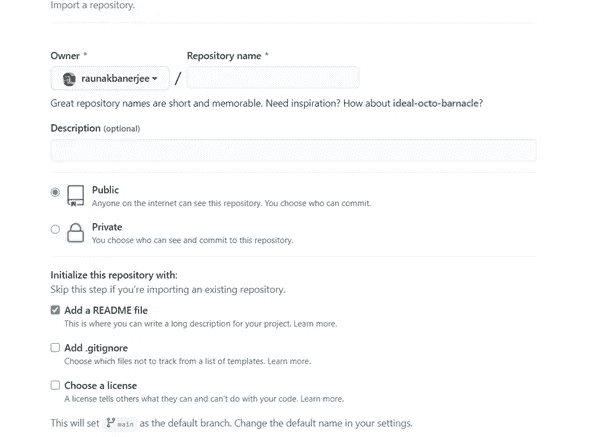

# 在 Github 页面上托管您的网页

> 原文：<https://medium.com/quick-code/hosting-your-webpage-on-github-pages-44036bd0db9?source=collection_archive---------3----------------------->

嘿。我是偌纳克，一名工科学生。我最近开始学习 Javascript，一直在构建一些小项目，并希望托管它们。你有 Heroku 和其他工具，但我认为设置它们需要一点时间。Github 页面对于托管小型静态网站来说非常酷，在我看来，初学者应该尝试一下，因为它们给了你命名 url 的选项，而且设置起来非常容易。

以下是你如何建立一个 Github 页面。

首先，设置你的 Github 账户。

现在，转到存储库部分并创建一个新的。

这是您单击创建新存储库时屏幕的外观

给出一个存储库名称(我将这个演示文件命名为 hello ),并添加一个自述文件。“自述文件”将帮助您对项目进行描述。

接下来，在创建回购之后，您需要更改分支机构的名称。看看你页面的左上方，你会看到这张照片。

默认情况下，我的分支名称命名为 main。

点击 main 旁边的下拉菜单，写下 **gh-pages** ，并添加另一个分支。但是这样做是不够的，因为现在你有两个分支，主页和主页。

See that two branches are presenet.Make sure you set gh-pages as your primary branch.

您希望将分行名称 gh-pages 设置为您的主要分行。所以现在去设置，在左边，点击分支。点击分支后，您会看到类似这样的内容。

通过点击右边的相似铅笔按钮改变主要的棕色，写下 gh-pages 并更新。

现在你可以走了。您已经创建了自己的个性化 Github 页面。

要查看您的 github 域名，请点击设置，它位于下图所示照片的右侧。

现在向下滚动到 Github 页面部分

在这里，您可以找到您的项目将被托管的 url。

这也是非常重要的。当你在添加文件部分添加 html 文件时，确保 HTML 文件被命名为 index.html 的**，否则将需要做额外的修改。**

这一点非常重要。

干杯

偌纳克。

推特:【https://twitter.com/itsraunak_ 

github:[https://github.com/raunakbanerjee](https://github.com/raunakbanerjee)