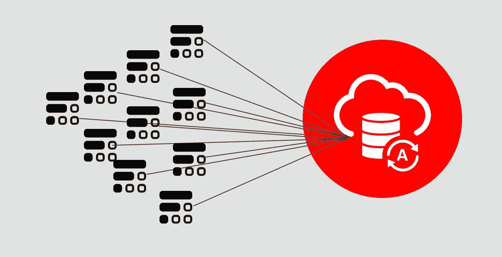
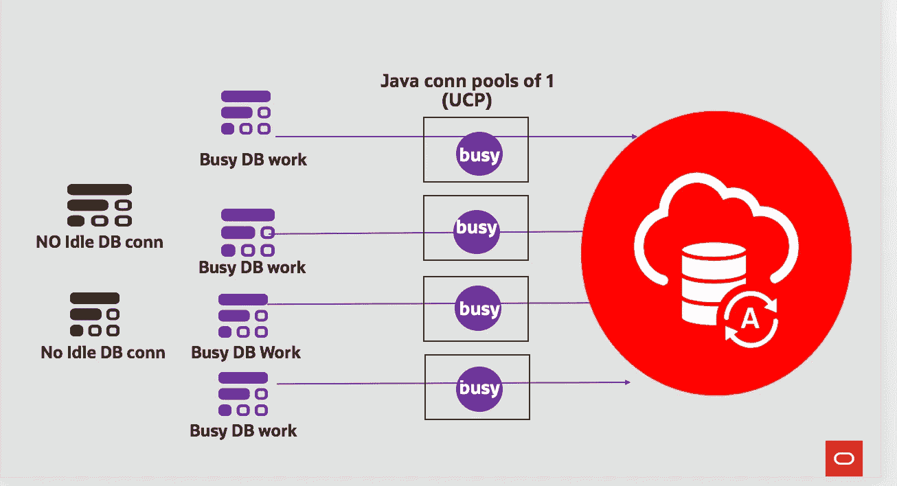
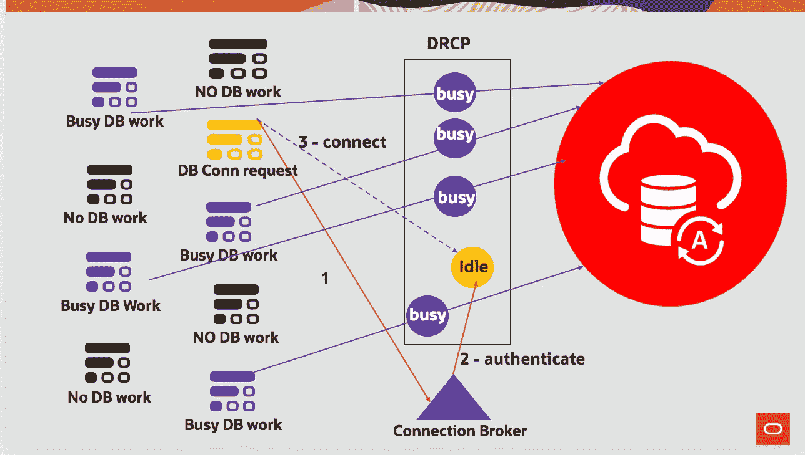

# 无服务器功能的热数据库连接

> 原文：<https://medium.com/oracledevs/hot-database-connections-for-serverless-functions-9f9e8a681df6?source=collection_archive---------1----------------------->

Illustration: Oracle Function instances connecting to an Autonomous Database (ATP-S) instance

# 序言—要解决的问题

启动新的无服务器容器——也称为冷启动——需要一到几秒钟(时间因平台而异)；为了消除这种成本/延迟，无服务器框架在一段时间内保持已经启动的容器温暖(持续时间因提供商而异)。

无服务器功能可以访问数据库。尽管成本比启动新的无服务器容器要低，但数据库连接的创建和拆除可能要花费几十甚至几百毫秒，这取决于您的 DBMS 环境。这个问题随着无服务器功能而加剧，无服务器功能是短命的，并且不能在每次调用时都负担这样的成本。要解决的第一个问题是避免连接创建和断开。

另一个需要解决的问题是，由于连接不能跨容器进行池化/共享，面对固定数量的数据库连接，自动伸缩和高并发性(即成千上万的并发无服务器函数调用)的影响。

本文中的讨论、解决方案和最佳实践基于 Java，但适用于您的无服务器基础设施支持的所有语言(例如 Oracle Functions 支持 Java、Go、Node.js、Python 和 Ruby)。

# 避免连接创建/拆除

重用现有的连接只需要几毫秒的时间，但是，无服务器功能的每个实例都在一个单独的容器中运行，只有一个数据库连接，因此，这些连接不能在容器之间共享。

幸运的是，在函数调用结束后，无服务器容器会保留几分钟；此外，无服务器编程模型允许重用在每次调用时调用的入口方法 *handleRequest()* 之外声明的执行上下文和状态。

Class states declared outside of the handleRequest() method.

我们可以在类构造函数中缓存单个数据库连接(即大小为 1 的池),只要容器还在，下次调用就可以重用。

A conn cache **per** container

Setting up a UCP pool of size 1, in the class constructor, outside of the handleRequest() method

我的 *adb-ucp* 函数的完整 Java 代码改编自 Todd Sharp 关于“ *Oracle 函数—连接到 ATP 数据库”的[帖子](https://blogs.oracle.com/developers/oracle-functions-connecting-to-an-atp-database-revisited)。*

The complete Serverless function Java code.

Todd 的帖子包含了配置、部署和调用 Oracle 函数和 ATP-S 数据库的所有步骤(这里不再重复),包括连接字符串、云凭证等等。我已经用对 *ALL_TABLE (* 一个字典表)的查询替换了对 *EMPLOYEES* 表的查询，从而消除了在运行示例之前创建表的需要。我将应用程序和函数都命名为“adb-ucp ”,并测量了从池中检索一个连接的时间，即 *getConnection()* 方法调用。
以下命令允许您部署和调用该功能:

Deploying and invoking adb-ucp

由于无服务器功能仅显示返回的数据，要查看日志和打印输出，您需要订阅日志服务，如 [Oracle 云基础架构日志服务](https://blogs.oracle.com/cloud-infrastructure/announcing-limited-availability-of-oracle-cloud-infrastructure-logging-service)或 [PaperTrail](https://www.papertrail.com/) 。

在每个容器中设置一个大小为 1 的池可以避免连接的创建和拆除，但是这会导致函数实例和数据库会话之间的一对一映射；一些非活动/热功能甚至可能占用数据库连接。这种解决方案适用于小规模部署，但最终会在大规模部署中导致等待或异常，在大规模部署中，并发活动或热功能实例的数量大于可用数据库会话的有限数量。

# 支持自动扩展/高并发性

正如在序言中所指出的，在每个容器中设置一个专用连接的池防止了跨容器的池化/共享连接；容器和 RDBMS 会话之间的这种一对一映射将不会也不能支持具有无服务器功能的高并发性的大规模部署。这里的假设是，并非所有这些功能都同时进行数据库访问，当不再需要时，它们会放弃连接——否则，这将使共享失败。

存在几种解决方案，包括代理连接服务器，如 Oracle 的 CMAN-TDM(流量定向器模式下的连接管理器，该功能目前不是云服务)和 MySQL 路由器；还有 RDBMS 端的连接池，比如 Oracle 的数据库常驻连接池(DRCP)。

这些解决方案都具有跨中间层和容器池化数据库会话的能力。

## 无服务器功能和数据库驻留连接池

ATP-S 默认启用 DRCP。客户端、中间层和容器“连接”到连接代理，该代理按需分配空闲的数据库会话。在将请求者与空闲数据库会话相关联时，连接代理不停留在循环中；关闭的连接将返回到池中。

DRCP — Sharing connection across containers

ATP-S 数据库提供开箱即用的 5 种服务配置文件:*高、中、*和*低*用于报告或批量*；用于 OLTP 的 tp* 和*t 紧急*。这些 *tnsnames.ora* 别名或入口点类似于 JNDI 名称，隐藏/虚拟化了数据库服务的细节。

让我们通过上面一对一映射中使用的同一个 Oracle 函数来配置和使用 DRCP 的步骤。

Aliases of my tnsnames.ora generated for my ATP-S database (named OFunctions)

1.  下载云客户端凭证(参见 Todd 的[帖子](https://blogs.oracle.com/developers/oracle-functions-connecting-to-an-atp-database-revisited)中的步骤 1 " *下载 ATP 钱包*)并将它们解压缩到本地文件夹中
2.  编辑 *tnsnames.ora* 文件，添加一个带有 DRCP 引用的新别名(或者，您可以修改 5 个原始别名中的一个)。在我的测试中，我已经创建了一个名为*of functions _ TP urgent-DRCP*的新条目，方法是复制*of unations _ TP urgent*描述，并向 *CONNECT_DATA* 部分添加“*(SERVER = POOLED)”*，然后保存 tnsnames.ora 文件。

New alias for using DRCP and tpurgent

3.上传 wallet(如果已经上传，则再次上传)，包括更新的 tnsnames.ora，如中所述。步骤#2 " *在 Todd 的[帖子](https://blogs.oracle.com/developers/oracle-functions-connecting-to-an-atp-database-revisited)中，将钱包上传到对象存储*中的私有存储桶。事实上，我在上一节/解决方案(添加了一个新条目)中上传钱包之前就已经做了更改，所以我不需要重新上传。

4.在函数配置中更新 DB_URL 以使用新的别名，如下所示

因为已经部署了该函数，所以对配置进行更改将获得新的 URL 和 DRCP。下一步是简单地调用上一节中的函数。您仍然在每个容器中使用大小为 1 的池，但是，这些池附加到连接代理，而不是数据库会话。与专门使用大小为 1 的池相比，DRCP 有额外的(或两个)毫秒延迟，这是通过连接代理的代价。但是，您可以在连接到同一 ATP-S 实例的所有容器之间共享数据库会话，从而保持高并发性。不像在非 DRCP 的情况下，温暖的容器保持空闲连接。

# 摘要

我已经向你介绍了序言中提到的要解决的问题的解决方案:(I)避免在每次函数调用时创建和拆除连接；以及(ii)面对有限数量的数据库会话维持高并发性。

很明显，容器生命周期中的第一个数据库连接请求将会付出更高的代价，但是随后的调用会得到免费的午餐，或者几乎是免费的午餐！！。