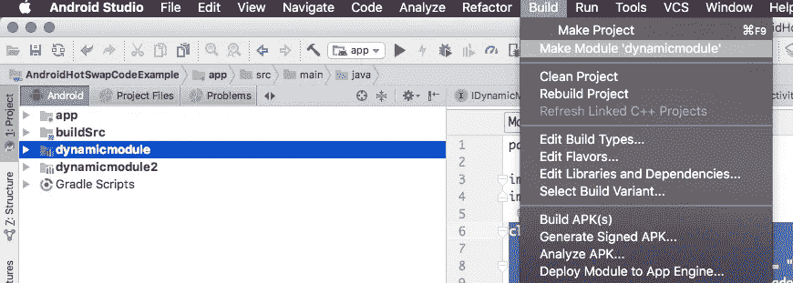

# Android 中的热插拔代码

> 原文：<https://medium.com/quick-code/hot-swapping-code-in-android-3043ccf6dd9b?source=collection_archive---------3----------------------->

我最近一直在寻找静默更新正在运行的 Android 应用程序的方法。

我发现的一个选项是使用类加载器在运行时加载字节码。这实际上并不太难，我将与你分享一个简单的方法来做到这一点。

你可以在这里找到一个例子:[github.com/davethomas11/AndroidHotSwapCodeExample](https://github.com/davethomas11/AndroidHotSwapCodeExample)

在 Android 平台上，我们可以利用一个特定的类加载器来加载编译好的 Dalvik 字节码， [DexClassLoader](https://developer.android.com/reference/dalvik/system/DexClassLoader.html) 。

您可以使用这个类加载编译过的 Dalvik 字节码。给它一个 dex 文件的路径，并调用 loadClass 在运行时检索您的实现。

# 示例代码

我们在动态加载代码时会遇到的一个问题是，我们如何在主应用程序的代码中引用它？

我推荐使用通用接口编程。

在这个例子中，我为一个类创建了一个简单的接口，它有一个返回字符串的方法。然后可以在运行时确定该接口的实现。

我已经在我的项目中创建了一个新的 Android 应用程序和两个 Android 库模块。这三个模块的源代码中都包含了这个接口。

重要说明，主 Android 应用程序在其 build.gradle 中不包含对这两个库的引用，所以这两个模块都没有编译到主应用程序的字节码中。

在主应用程序中，我创建了一个类来加载该接口的实现。

这个 ModuleLoader 类获取包含 dex 字节码的 dex 文件的路径，并加载它的 IDynamicModule 接口的实现。

> **更新:**我注意到我最初的实现可以在新设备上工作，但是在旧设备上由于空指针而崩溃。DexClassLoader 文档说不再需要缓存目录，但是如果为缓存目录传递 null，它将在旧的 SDK 上崩溃。

注意；这个文件不能是 Java 字节码，它必须是 Dalvik 字节码。您可以使用以下 dx 命令从 Java jar 轻松创建一个 dex 文件:

—

每个库项目都包含 IDynamicModule 的实现。为了将这些库构建到 Dalvik 字节码中，我使用了以下工作流程；

*   我在 AndroidStudio 的项目选项卡的 Android 视图中点击了模块，并从文件菜单中选择了构建->生成模块选项。

这将导致在 build/outputs/aar/文件夹中创建一个 aar 文件

遗憾的是，aar 文件不包含 Dalvik 字节码。其中包含的 classes.jar 文件是 Java 字节码。需要进一步的处理来获得您需要的 dex 文件。

解压缩 aar 文件，并找到文件 classes.jar。对 jar 文件运行 dx 命令以获得 dx 文件。通过[最佳科尔多瓦教程](https://blog.coursesity.com/best-apache-cordova-tutorials/)在线学习科尔多瓦，以便在 android 开发中更高效地工作。

> 注意:dx 命令可以在{ ANDROID _ HOME }/build-tools/{您的构建工具版本}/的构建工具文件夹中找到

为了简化这个过程，我在 build.gradle 中为每个 dynamicmodules 添加了构建任务，并将生成的 dex 文件复制到 app 模块的 asset 文件夹中。

跑步。/grad Lew dynamicmodule:copydex toApp 将构建第一个 dynamic module 并对其进行索引，然后将其复制到 app 模块的 assets 文件夹中。

在真正的热插拔情况下，您应该从服务器下载 dex 文件。

> 旁注:
> 
> 创建 dex 的过程可以在[https://github . com/davethomas 11/androidhotswapcode example/blob/master/buildSrc/src/main/groovy/extractdextask . groovy](https://github.com/davethomas11/AndroidHotSwapCodeExample/blob/master/buildSrc/src/main/groovy/ExtractDexTask.groovy)中找到
> 
> 这是我添加到 buildSrc 中的一个自定义任务，它使我的项目中的所有 build.gradle 文件都可以使用它。

在 MainActivity 示例中，从 assets 文件夹加载模块是简单的:

dex 文件需要首先从资产复制到应用程序的数据目录中，然后该文件路径可以与 ModuleLoader 一起使用。

看看 github.com/davethomas11/AndroidHotSwapCodeExample 的[并尝试一下。](https://github.com/davethomas11/AndroidHotSwapCodeExample)

重要注意事项:

*   安全性:如果您从服务器下载 dex 文件，请确保您包含校验和，以便任何 dex 文件都不能加载到您的应用程序中，并且只接受来自可信来源的代码。
*   内存和效率:当您完成一个实现或者升级到一个新版本时，请确保您注意取消所有线程对您的类加载器的引用。当您实例化的 DexClassLoader 超出范围并且没有对它的引用时，动态加载的类将被垃圾收集。
*   架构:用非常简单的单入口点保持包装接口的简单，使实现更加灵活。
*   Android 资源:因为你正在加载的只是 Dalvik 字节码，请注意，你不能在你的动态模块中包含任何字符串、布局或类似的资产，并且必须使用替代方法来动态加载这类数据。