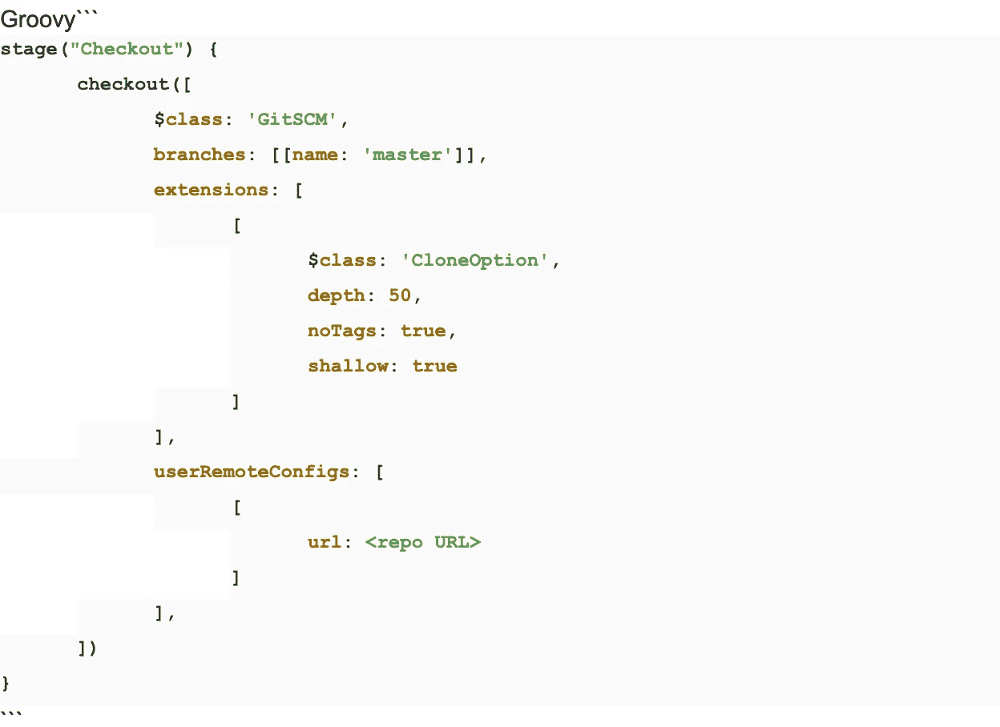

# 一行代码的改变如何将我们的克隆时间减少了 99%

> 原文：<https://medium.com/pinterest-engineering/how-a-one-line-change-decreased-our-build-times-by-99-b98453265370?source=collection_archive---------0----------------------->

Urvashi Reddy |工程生产力团队软件工程师
亚当·贝瑞|工程生产力团队技术负责人
Rui Li |工程生产力团队软件工程师

*Pinterest 的工程生产力团队遇到了一个小小的变化，这个变化对减少管道建设时间产生了巨大影响。我们发现在 git 获取过程中设置 refspec 选项减少了 99%的克隆步骤。*

Pinterest 的工程生产力团队负责为公司构建和部署软件的工程师提供支持。我们的团队维护着许多基础设施服务，并经常进行大规模的工作——将 Pinterest [的所有软件迁移到 Bazel](/pinterest-engineering/developing-fast-reliable-ios-builds-at-pinterest-part-one-cb1810407b92) ,创建一个名为 [Hermez](https://www.youtube.com/watch?v=KkKSoQBp2oQ) 的持续交付平台，并维护[每天提交几百次的](/pinterest-engineering/building-a-python-monorepo-for-fast-reliable-development-be763781f67) monorepos，等等。

我们所有更大的努力都是为了让 Pinterest 的软件开发和交付成为一种快速而轻松的体验。最近，我们意识到小细节也能对这一目标产生巨大影响。我们发现了一个被忽略的 Git 选项，它显著减少了我们持续集成管道中的构建时间。为了理解这个小小的变化如何产生如此大的影响，我们需要分享一些关于我们 monorepos 和我们管道的信息。

# **债券和管道**

我们在 Pinterest 有六个主要的仓库:Pinboard、Optimus、Cosmos、Magnus、iOS 和 Android。每一个都是一个 monorepo，包含大量特定于语言的服务。Pinboard 的历史和公司一样悠久，是最大的 monorepo。Pinboard 有超过 350K 个提交，完全克隆时大小为 20GB。

克隆具有大量代码和历史的 monorepos 是耗时的，并且我们需要在我们的持续集成管道中整天频繁地这样做。单就 Pinboard 而言，我们在工作日就完成了超过 6 万次的 git 提取。我们的大多数 Jenkins 管道配置脚本(用 Groovy 编写)都是从一个“Checkout”阶段开始的，在这个阶段，我们克隆了后面阶段将要构建和测试的存储库。典型的“结帐”阶段是这样的:



如果我们直接使用 Git CLI，它将转换为:


```

即使我们告诉 Git 做一个浅层克隆，不要获取任何标签，并获取最后 50 次提交，我们仍然没有尽可能快地运行这个操作。这是因为我们没有设置 refspec 选项。注意，由于没有在管道配置脚本中设置它，我们告诉 g it 获取所有 ref specs:**+refs/heads/*:refs/remotes/origin/*。**在插接板的情况下，该操作将获取超过 2，500 个分支。

通过简单地添加 refspec 选项并指定我们关心的 refs(在我们的例子中是 master ),我们可以将 refs 限制到我们关心的分支，从而节省大量时间。下面是我们的管道代码:


这个简单的一行代码的改变将我们的克隆时间减少了 99%,并因此显著减少了我们的构建时间。克隆我们最大的回购，从 40 分钟到 30 秒。这表明有时我们小小的努力也能产生巨大的影响。

# **学习**

像大多数开发人员生产力团队一样，我们从事对我们的日常体验有很大影响的大型服务。然而，有时一行代码的修改会带来巨大的不同。我们的工作就是要理解这一点。

如果你热衷于提高开发人员的生产力，请加入我们的团队！我们正在招聘工程生产力团队中的工程人员。

*要在 Pinterest 上了解更多工程知识，请查看我们的* [*工程博客*](https://medium.com/pinterest-engineering) *，并访问我们的*[*Pinterest Labs*](https://labs.pinterest.com/)*网站。要查看和申请空缺职位，请访问我们的* [*招聘*](https://www.pinterestcareers.com/homepage) *页面。*