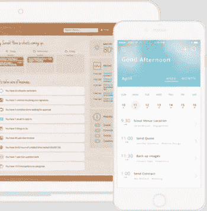
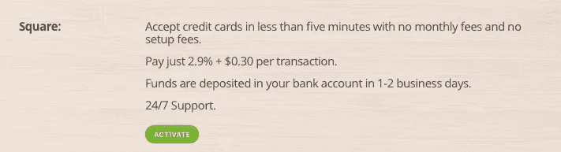

# Square 开发商如何帮助小企业主戴上他们最喜欢的帽子

> 原文：<https://medium.com/square-corner-blog/how-a-square-developer-is-helping-small-business-owners-wear-their-favorite-hat-991108c9d99e?source=collection_archive---------1----------------------->

## 我们将重点介绍一系列 Square 开发者，他们在将 Build With Square(API)集成到他们的平台后，成功地发展了他们的业务。

> 注意，我们已经行动了！如果您想继续了解 Square 的最新技术内容，请访问我们在 https://developer.squareup.com/blog[的新家](https://developer.squareup.com/blog)

**灵感**

这一切都是从多诺万·杰纳斯的妻子艾莉森决定追求她真正热爱的摄影开始的。当她在 2011 年开始摄影业务时，业务立即起飞。问题是，尽管她是一名出色的摄影师，但她没有管理企业运营方面的经验。出于需要，她开始身兼数职——管理会计、客户、发票等等。操作很快成为一种负担，使她偏离了最初的目的，以及她最喜欢做的事情:拍摄人们生活的美丽照片。

当多诺万看到他的妻子花费数小时处理文书工作、发票、记账和许多其他令人头疼的问题，同时为每项任务使用不同的应用程序时，他意识到有一个尚未开发的业务需求等待解决。如果他可以开发一个应用程序，帮助小企业主在一个中心位置管理业务的运营方面，这样他们就可以专注于他们喜欢和擅长的事情，会怎么样？

这就是现在的使命:创造一个世界，让任何有激情、有想法、有抱负的人都不会因为经营自己的企业而受到阻碍。

**入门**

17hats friendly user interface

Donovan 花了几年时间来构建该产品的第一个迭代，它于 3 年前发布。自那以后，17hats 经历了令人印象深刻的增长，每月增加数千名新客户。

17hats 之所以成功，是因为它们提供了对任何小企业主都有价值的好处:节省无数时间、轻松增加客户、快速获得回报。

17hats 应用程序的一个关键要素是，它帮助客户更快地获得付款——平均来说，不到三天。这听起来可能微不足道，但有时企业主在要求及时付款时会犹豫不决，现金流在经营小企业时至关重要。17hats 处理物流，因此他们可以立即看到自己辛苦赚来的现金，而不必手动向客户发送多封催款电子邮件。

**与 Square 的 API 集成**

17hats 增强其支付功能的一个转折点是 Square 发布了对其 API 的访问，使独立开发者能够将 Square 的支付解决方案集成到自己的应用程序中。

当多诺万和他的团队通过《黑客新闻》了解到 Square 的支付 API 时，他说他们的第一反应是:“感谢上帝！他们终于开放了他们的 API。”

多诺万补充说:“Square 有一个很棒的品牌，我们的很多客户都想使用 Square 进行在线支付。”因此，整合使他们能够解锁一组新的客户，这些客户已经在他们的商店中使用 Square，并且不想通过 17hats 使用另一家支付提供商。

对于 Donovan 的客户来说，必须将他们的银行信息输入在线系统可能会很可怕——用户很难对新的支付系统产生信任。但是因为 Square 作为一个安全、可靠的品牌在全国享有可信的声誉，它使得 17hats 的工作变得更加容易，并让他们的客户感到满意。

**顾客的想法**

当 Square 团队讨论与 17hats 的集成时，Donovan 告诉我们花了一周的时间来实现它，又花了一周的时间将它带给一个真实的客户。“Square 的平台使用起来非常简单。平台在技术上做得很好，易于集成，超级可靠；我们没有看到任何问题；最重要的是，API 调用的响应时间很快，”Donovan 说。

Choosing Square for payment processing is easy!

他们的商家的反馈是积极的，他们对实施感到兴奋。连接到 Square 很容易:商家只需打开 17hats 应用程序，选择 Square 作为他们的支付提供商，设置 Square 帐户，并完成 OAuth 连接。就这么简单——他们可以在几分钟内开始接受信用卡支付。

**光明的未来**

17hats 为小企业主打造了一个非常有用的产品，Square 很高兴能通过简化他们产品的一个关键方面来帮助他们成长。他们向顾客提供越来越多的服务，前景一片光明。[十七]向非常成功的整合致敬！

点击这里了解更多关于 17hats [的信息，点击这里](https://www.17hats.com/)了解 Square 的平台[。](https://squareup.com/developers)