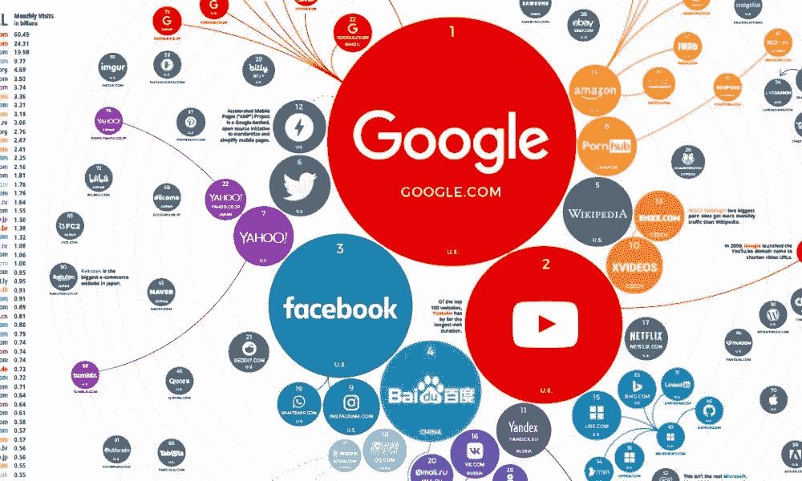

# 网站如何运作:给傻瓜的一个主意

> 原文：<https://medium.com/quick-code/how-a-website-works-an-idea-for-dummies-ab6e97ca2ab7?source=collection_archive---------0----------------------->

## 非技术人员理解网站开发过程的抽象概念。

Source : Visual capitalist

在过去的 13 天里，我一直在为自己创建一个博客。我说的是自托管网站。如果你们有兴趣，请查看这里的****(目前还没有帖子)**。******