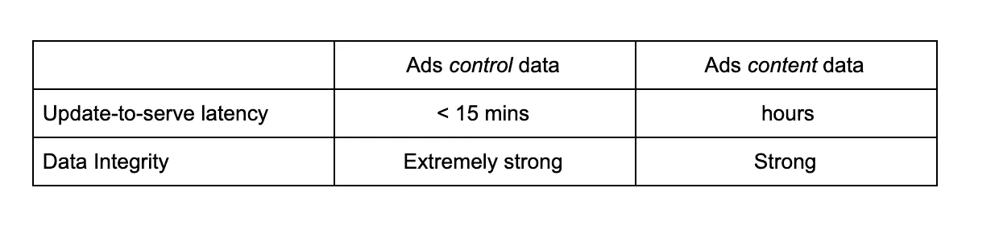
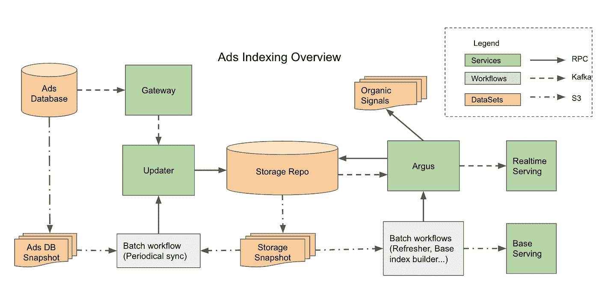

# Pinterest 的广告索引是如何工作的

> 原文：<https://medium.com/pinterest-engineering/how-ads-indexing-works-at-pinterest-99b4796f289f?source=collection_archive---------0----------------------->

胡成成|广告索引工程经理

# 介绍

广告索引是一个数据处理管道，为 Pinterest 的广告交付栈构建可服务的广告文档，包括广告定位、检索、排名和拍卖。管道通过大量数据连接的繁重计算过程，将原始格式的广告活动转换为可服务格式。这是广告交付栈中的一个关键组件，因为广告交付中使用的所有数据都必须通过这个管道。广告文档的新鲜度和质量对 Pinner 和合作伙伴的体验有直接影响。随着 Pinterest 广告业务在过去几年中快速增长，迫切需要扩大索引的规模，同时降低 E2E 索引延迟，这是传统的批量索引构建器无法满足的。因此，我们受 Google 的 web 索引系统" [Caffeine](https://googleblog.blogspot.com/2010/06/our-new-search-index-caffeine.htm) "的启发，构建了一个可扩展的增量索引系统，实现了**秒**级索引 E2E 延迟，规模可达 **100M+** 文档。

# 系统需求

广告索引系统是为广告索引业务需求定制的。让我们通过基本的广告索引知识来理解这个系统的要求。

广告索引管道处理的所有数据分为两类:*广告控制*和*广告内容*数据。广告*控制*数据是由广告客户设置的广告元数据，用于广告定位、拍卖竞价等。Ads *内容*数据由各种信号组成，我们使用这些信号来了解 Ads Pin，以优化 ads 交付性能。这里我们列出了每个类别中的几个代表:

Ads *控制*数据

*   目标规格
*   预算
*   出价
*   创新型

广告*内容*数据

*   图像签名
*   个人兴趣(圈子)
*   文本注释
*   视觉嵌入
*   实绩资料法

不同的数据源在数据新鲜度和完整性方面可能有不同的 SLA。这里我们列出了两个目录的一般准则:

对于广告*控制*数据，我们需要低延迟和绝对的数据正确性，因为数据的新鲜度直接影响广告客户的体验，数据正确性是获得广告客户信任的关键。另一方面，Ads *内容*数据具有相对宽松的 SLA ondata 新鲜度，因为许多上游数据源的数据更新频率较低。但是，他们仍然需要强大的数据正确性，因为低质量的数据可能会导致严重的广告交付性能问题。为了满足这些需求，我们将 ads 索引系统设计为实时增量和批处理管道的组合。以下是每个管道的主要职责。

实时增量流水线

*   支持数据处理的分布式事务，保证大规模并发处理时的数据一致性
*   支持广告上基于推送的通知*控制*数据更改，以实现秒级更新服务 E2E 延迟
*   拥有两个高优先级和中优先级的逻辑管道

批量流水线要求

*   通过定期刷新基于拉取的数据，使广告内容数据上的广告索引保持最新。
*   实现广告控制和内容数据的最终一致性，因为它涵盖了实时管道中任何可能的消息丢失或流程故障
*   将一个逻辑流水线作为低优先级

此外，这种增量和基础相结合的索引系统提供了更好的管道可用性。如果实时管道阻塞，服务索引将回落到由批处理管道生成的基本索引。如果批处理流水线失败一次，实时服务索引仍然可以覆盖自前一个批处理索引以来的所有增量更新。作为权衡，在服务时，两个索引之间有额外的合并逻辑。

# 高级系统介绍

图 1:带有数据流的广告索引系统概述

上图描述了高级 ads 索引系统，其中突出显示的组件是四个核心组件，分别是**网关**、**更新器**、**存储报告**和 **Argus** 。

1.  **Gateway** 是一个轻量级的流程框架。它负责将来自上游来源的不同更新事件转换为 ads 索引更新程序格式，然后通过 Kafka 或 direct RPC 将它们发送到更新程序。
2.  **Updater** 是数据摄取组件，它从网关接收更新并将它们写入存储报告。
3.  **存储回购**在 ad 文档流程生命周期中保留所有数据，包括原始更新、中间数据和最终可维护文档。存储回购需要支持一些关键功能:1)跨行和跨表交易，2)向 Argus 发送列级更改通知。
4.  **Argus** 是通知触发的数据处理服务。在收到来自 Repo 的数据更改事件通知后，Argus 工作人员会从 data repo 中读取所有相关数据，并执行一个计算量很大的过程来生成最终的可服务文档。可服务的文档与交易检查一起被写回到 Repo，并被发布到实时服务。

这四个元件相互连接，但处于充分隔离状态。Gateway、Updater 和 Argus 之间有事件队列，允许每个组件以自己的速度进行处理。Gateway、Updater 和 Argus 都是无状态服务，易于扩展和缩减。Updater 和 Argus 都有高、中和低优先级的三个集群实例。所有四个组件都可以有自己的发布时间表，因为它们的交互 API 是向后兼容的。

此外，系统中还有一些批处理工作流作为实时增量处理的补充。它们从数据库转储中获取输入，以触发对 Updater 和 Argus 的操作，或者构建用于服务的基本索引输出。我们将在下面描述每个工作流程的更多细节。

# 履行

## 门

我们基于 Kafka Stream 构建了这个轻量级的无状态流服务，因为它对“至少一次处理”提供了很好的支持。主要的上游是来自 ads 数据库的 mysql binlog。由于 mysql binlog 只包含每个表每个事务的增量变化，我们需要通过再次查询 ads 数据库来具体化它。它还提供了一条从广告数据库到服务的捷径，跳过了一些轻量级服务文档(如预算更新)的大量索引过程。例如，如果活动预算更新，Gateway 将通过 Kafka 直接将此更改推送到实时预算控制服务。

## 更新程序

Updater 是一个基于 Kafka stream 的轻量级数据摄取服务。它基本上跟踪 Kafka 主题，从消息中提取结构化数据，并将其写入具有事务保护的存储 Repo。对于版本化数据，它还会在更新前进行版本检查，以在处理无序的上游事件时保持数据更新顺序。除了从 Kafka 更新之外，Updater 还从批处理的 RPC 中获取更新，用于回填目的。

## 存储回购

Storage Repo 是一个列式键值存储，为 Updater 和 Argus 提供跨表事务操作。它还会将列级别更改通知推送到 Argus。因为 ads 索引管道需要支持完整的批量索引构建，所以存储回购还需要与常见的大数据工作流(如快照转储、MapReduce 作业等)很好地集成。因此，我们选择了 [Apache Omid](https://developer.yahoo.com/blogs/129089878751/) & HBase 作为存储报告的事务性 nosql 数据库。Omid 是 HBase 之上的交易管理服务，其灵感来自于 Google 的 Percolator。在 Percolator 中，更改通知存储在一个 bigtable 列中，工作人员不断地扫描分区范围来提取更改通知。因为 HBase 无法承受繁重的扫描操作，所以我们将更改通知服务构建为 HBase 代理，它将 HBase WAL 转换为更改通知，并将其发布到 Kafka 进行数据处理。

## 百眼巨人(希腊神话中的一个形象)

Argus 是一种服务，可监控存储库中的更改，以进一步处理更改的数据。它建立在 Kafka consumer 的基础上，具有存储回购的数据 API。它跟踪来自存储库的更改通知，并根据事件类型运行各种处理程序。每个处理器读取存储中不同行和表的多个列，通过数据连接或富集生成派生数据对象，在单个事务中将它们写回存储 Repo。我们在 Argus 内部构建了 ads 处理器来完成以下工作:

*   广告处理程序包含生成最终可服务广告文档的所有广告业务逻辑。
*   广告处理器从外部数据源提取一些广告*内容*数据以丰富数据。处理程序中有一个内存缓存层来提高效率
*   广告处理程序可以选择通过 Kafka 向服务发布最终的可服务文档

## 批处理工作流程

该系统中运行了一些批处理工作流，以确保数据的完整性。因为我们已经有了实时增量流程管道，所以批处理工作流主要用于补偿增量管道，并且它们在数据流程上共享相同的执行二进制。以下是系统中运行的工作流列表

*   **基本索引构建器工作流**:它们每隔几个小时运行一次，以生成基本索引
*   **数据同步工作流程**:1)Ads 数据库和存储 Repo 之间的数据同步保证了 Ads 控制数据的数据一致性。2)存储库中不同表之间的数据同步，检查存储库中数据的一致性。
*   **刷新工作流程**:定期运行，将所有 ads 文档标记为最新更新，以触发重新处理，刷新所有拉式信号。
*   **GC 工作流**:它们不经常运行以删除非常旧的非活动 ad 文档，这样存储回购就不会无限增长而影响其性能。

## 下游服务

主要的下游消费者是 Ads [Manas](/pinterest-engineering/manas-a-high-performing-customized-search-system-cf189f6ca40f) cluster(倒排索引)和 Ads[Scorpion](/pinterest-engineering/building-a-dynamic-and-responsive-pinterest-7d410e99f0a9)key-value store(正向索引)。两者都采用 delta 架构服务，采取基本索引和实时逐文档更新。基本索引通过 S3 发布，而实时文件更新则通过 Kafka 广播公司进行。

## 系统可见性

最终的广告可服务文档包含 100 多个广告*控件*和*内容*字段，许多工程师通过添加新字段或修改现有字段积极地为广告索引做出贡献。该平台需要为工程师提供良好的 E2E 可视化，以提高他们的开发速度。因此，我们在广告索引系统中提供了以下功能:

*   **集成测试和开发运行** : Gateway、Updater 和 Argus 都提供了相同的 RPC 接口，对应于它们的 Kafka 消息摄取接口。该设置简化了这些组件上集成测试的开发运行。每个组件都有其开发运行前/后比较报告，供开发人员了解其代码更改对 ads 索引的影响
*   **代码发布**:每个服务都有自己的发布周期。但我们为持续部署设置了 E2E 中转管道。
*   **Presubmit 集成测试** : Argus 处理器拥有最复杂的应用逻辑，并且有更多的工程师在其代码库中工作，因此我们在 Argus 处理器上设置了 Presubmit 集成测试
*   **调试 UI** :存储 Repo 保存所有中间数据和附加调试信息。我们为开发人员构建了一个基于网络的用户界面，方便他们访问这些信息
*   **历史记录**:除了 HBase 版本控制之外，我们还会定期将 HBase 表快照到数据仓库中以获得历史记录

在实践中，广告索引团队经常参与各种广告投放调试单，比如为什么我的广告活动没有支出。拥有上述可见性特征可以让工程师快速定位根本原因。

# 系统监控

Ads 索引系统是 ads 交付服务中最关键的组件之一，因此我们在两个主要方面构建了对其系统健康的全面监控:1)数据新鲜度，2)数据覆盖率。以下是我们仪表板中的关键指标。

*   **增量管道健康**:每个文档的 E2E 延迟、按阶段的延迟分解、流程吞吐量、关于 ads 增量管道中丢弃消息数量的每日报告等。
*   **基础管道健康**:基础索引陈旧、索引数据量变化、基础索引中关键字段的覆盖等。
*   **数据一致性:**各同步工作流上报的未同步文档数。

# 生产结果

Ads 索引系统已经在生产中平稳运行了一年多。混合系统不仅在大部分时间提供秒级的 E2E 延迟，而且保证了系统的高可用性和数据完整性。在这里，我们从制作结果中挑选了几个亮点

*   Ads 控制数据更新到服务 p90 延迟在 99.9%的时间内小于 60 秒
*   Ads 在 100%的时间内控制数据更新到服务的最大延迟小于 24 小时
*   增量管道中每日丢弃的一位数消息数

Ads 索引系统对处理生产中的各种异常具有很高的弹性。通过简单的手动操作，it 可以非常快速地从事件中恢复，以确保数据的新鲜性和完整性。以下是一些常见的生产问题。

*   **Ads 实时管道堵塞**:这种问题通常是由上游更新的巨大峰值引起的。在这种情况下，我们可以选择关闭从增量管道到实时服务的数据发布，这样就不会被淹没。管道依靠同步工作流来更新基本索引。Gateway 和 Update 都被设置为丢弃陈旧的消息，以快速清除 Kafka 中缓冲的消息，以便广告实时管道可以在高峰过去后快速赶上。
*   **版本**引入了不正确的数据:这通常出现在试运行与生产监控、基本索引工作流中的数据覆盖检查或生产中的性能下降中。我们可以暂时关闭实时服务并将基本索引回滚到一个好的版本。为了清理存储报告中被污染的数据，我们可以触发刷新工作流来重新处理所有文档。如果我们知道只有部分数据被污染，我们可以刷新选择性文档以缩短恢复时间。
*   **数据质量/覆盖率下降**:这通常始于外部拉式数据源，并在基本索引工作流的覆盖率检查中被发现。我们可以回滚外部数据源，并通过刷新工作流回填数据。因为回填是通过低优先级管道进行的，所以它不会影响高优先级和中优先级管道来减缓对来自关键数据源的更新的处理。

# 简短的技术讨论

在从头构建 ads 索引系统以完全满足生产成熟度的所有业务需求的整个过程中，我们做出了一些设计决策，以平衡系统灵活性、可扩展性、稳定性以及实施难度。

**通过远程存储的数据连接与通过本地存储的多流连接** : Ads 索引涉及更新通知时的许多数据连接操作，因为 Ads 文档丰富需要在几个键上连接数据，如 adID、pinID、imageSignatureID、advertiserID 等。我们选择通过事务从远程存储中获取数据来进行数据连接，而不是从本地状态进行多流连接。通过这样做，系统为分布式数据处理应用提供了更大的灵活性，因为它们不需要选择数据分区键来避免竞争情况。作为折衷，它为数据提取支付了额外的往返费用。但是由于 ads 索引处理器的计算量很大，所以往返成本只占整个基础设施成本的很小一部分。

**解耦服务 Vs 合并服务**:在设计阶段，我们确实考虑过合并服务以减少 ads 索引系统中的组件，这是系统隔离和简单性之间的一种折衷。网关和更新器可以合并以节省一个消息跃点。然而，我们选择将它们分开，因为 Gateway 是一个流处理服务，而 Updater 更多地是数据摄取服务。现在 Gateway 和 Updater 有着完全不同的发展道路。Gateway 成为一些其他用例的流行轻量级流媒体框架，而 Updater 开始摄取广告*内容*更新，因为它们不需要信号具体化为广告*控制*数据。Updater 和 Argus 可以合并，因为它们都建立在 Kafka 消费者的基础上，并与存储回购进行交互。我们选择将它们作为独立的服务，因为它们在性能优化方面有着完全不同的方向；Updater 是一个重量很轻的数据提取器和接收器，而 Argus 是一个重量很大的计算组件。

**系统可伸缩性:**在 ads 索引系统中有一个可伸缩性瓶颈，因为 Omid 依赖于集中式事务管理器来进行时间戳分配和冲突解决。为了解决这个可伸缩性限制，我们在 Pinterest 定制了 Omid 来提高其吞吐量，以获得更好的可伸缩性，但其实现细节超出了本技术博客的范围。

# 下一步是什么

ads 索引系统自最初推出以来已经有所发展。我们一直专注于提高系统稳定性和可见性。此外，一些核心组件被其他应用程序采用，因为它们从一开始就被设计为独立运行。例如，Gateway 被广泛用作广告重定向和广告商体验中的轻量级流框架。展望未来，我们计划专注于提高系统可用性，以进一步提高以下领域的开发速度:

*   为开发人员构建一个集中的基于配置的组件，以便在一个地方管理通过 ads 索引系统的数据流。现在，开发人员必须在多个地方进行配置，以便在不同的数据模式中挑选信号/字段。我们还计划构建一个基于 configs 的辅助可视化工具，以便开发人员轻松浏览现有信号及其相关性，进行数据探索。
*   通过与探测型测试框架集成来增强管道健康监控，因为当前的数据健康主要依赖于聚合数据视图。垂直功能开发人员很难利用聚合指标进行监控，他们必须运行专门的离线集成测试或数据分析报告来监控缩小的数据段的健康状况。探测框架可以允许开发人员在生产中对特定类型的文档进行实时验证测试。

***鸣谢****:Pinterest 的多位工程师共同致力于构建 ads 索引系统，包括、、Sreshta Vijayaraghavan、Xu、、Kapil Bajaj、、刘明思、刘明健、Susan Liu 和徐昂。非常感谢张、Sam Meder、Chiyoung Seo、、Zack Drach、Liquan Pei 和整个 Ads Infra 团队对设计的讨论。我们还要感谢我们的同行团队提供的支持——存储&缓存、日志、搜索基础设施、服务系统、Ads SRE、开发工具等。*

> 我们正在建造世界上第一个视觉发现引擎。全球超过 3.2 亿人使用 Pinterest 来梦想、计划和准备他们在生活中想做的事情。来加入我们吧！

# 参考

1.  [Manas:高性能定制搜索系统](/pinterest-engineering/manas-a-high-performing-customized-search-system-cf189f6ca40f)
2.  [构建动态响应的 Pinterest](/pinterest-engineering/building-a-dynamic-and-responsive-pinterest-7d410e99f0a9)
3.  [咖啡因:谷歌的网络搜索索引](https://googleblog.blogspot.com/2010/06/our-new-search-index-caffeine.html)
4.  [使用分布式事务和通知的大规模增量处理](https://storage.googleapis.com/pub-tools-public-publication-data/pdf/36726.pdf)
5.  [介绍 Omid—Apache h base 的事务处理](https://developer.yahoo.com/blogs/129089878751/)