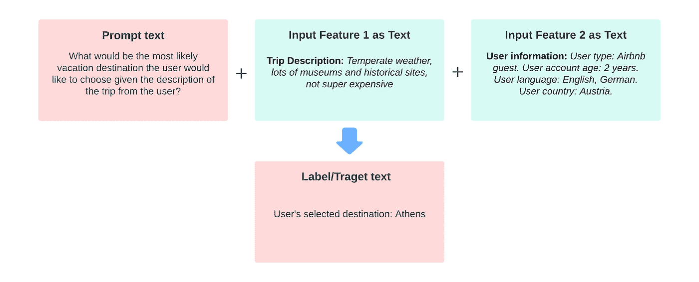
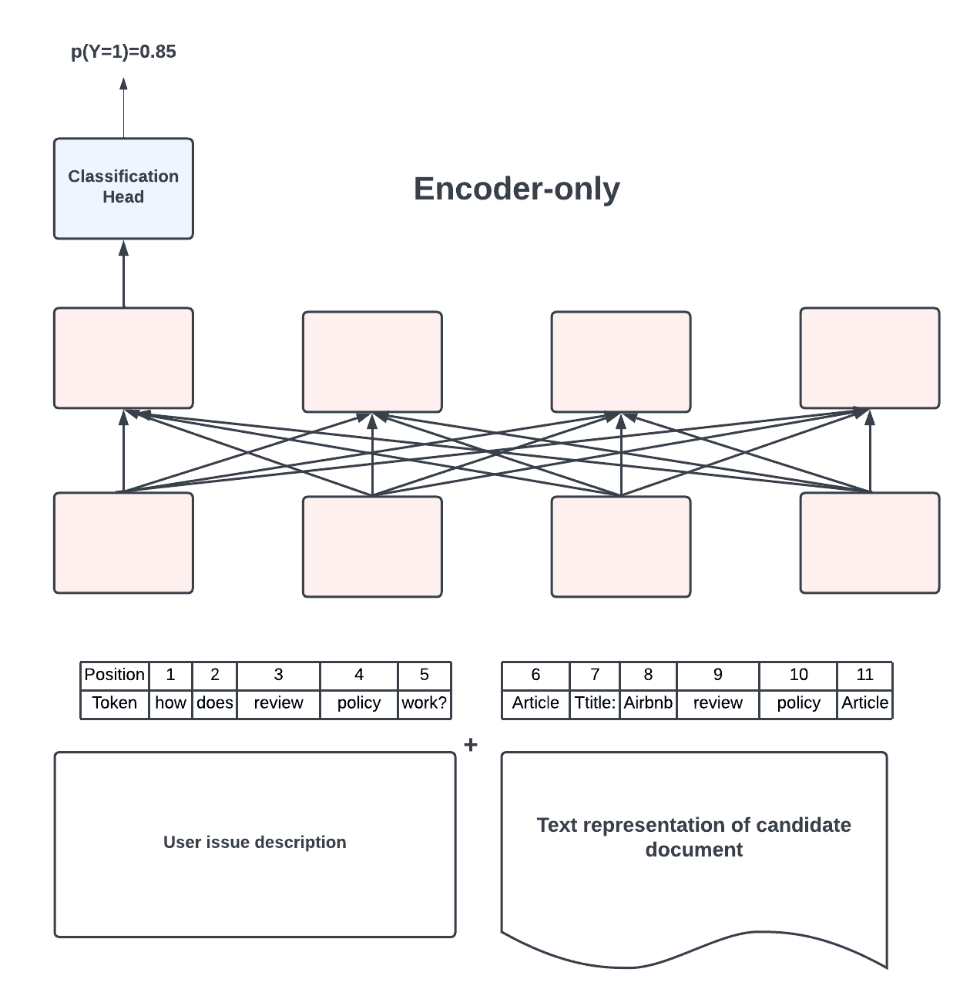
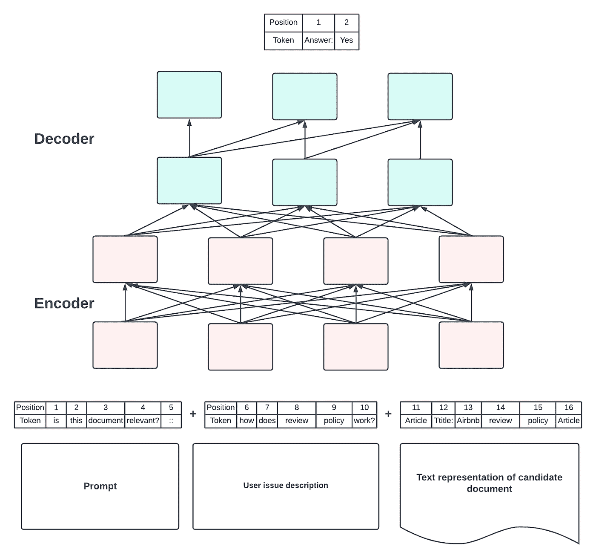
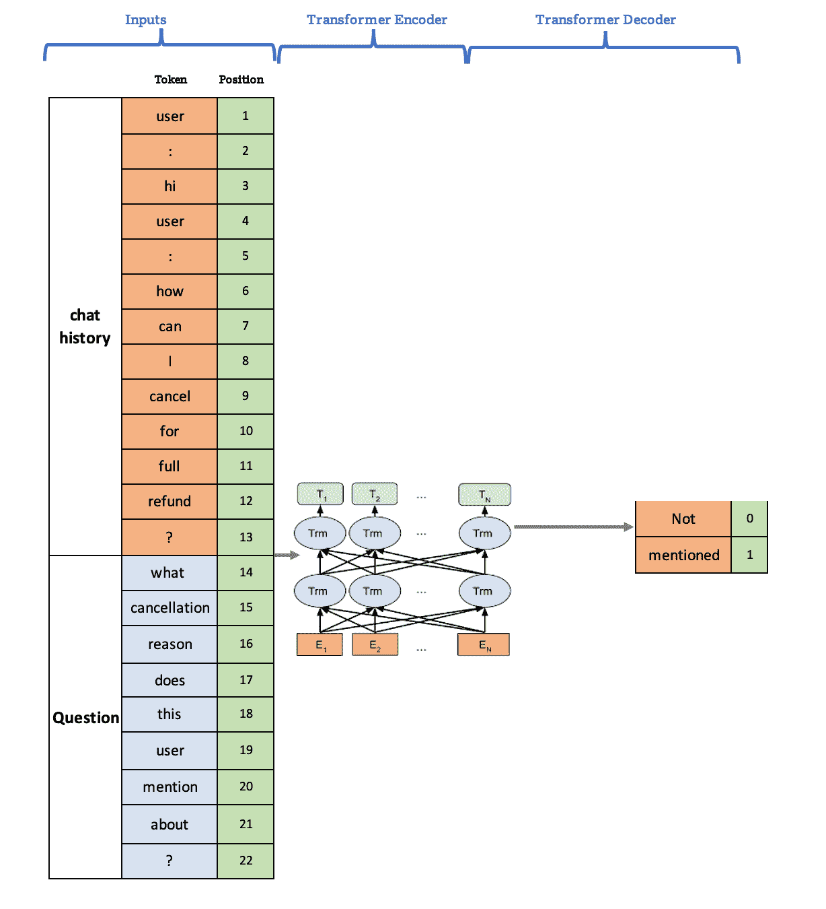

# 人工智能文本生成模型如何重塑 Airbnb 的客户支持

> 原文：<https://medium.com/airbnb-engineering/how-ai-text-generation-models-are-reshaping-customer-support-at-airbnb-a851db0b4fa3?source=collection_archive---------1----------------------->

**利用文本生成模型构建更有效、可扩展的客户支持产品。**

[李剑锋](https://www.linkedin.com/in/gavin-li-64354117/)、[米娅赵](https://www.linkedin.com/in/mia-zhao-964a9213/)和[赵振宇](https://www.linkedin.com/in/zhenyu-zhao-30b8632a/)

现代人工智能(AI)发展最快的领域之一是 [AI 文本生成模型](https://huggingface.co/tasks/text-generation)。顾名思义，这些模型生成自然语言。以前，大多数工业自然语言处理(NLP)模型是分类器，或者在机器学习(ML)文献中可以称为判别模型。然而，近年来，基于大规模语言模型的生成模型正迅速获得牵引力，并从根本上改变 ML 问题的表述方式。生成模型现在可以通过大规模的预训练获得一些领域知识，然后产生高质量的文本——例如回答问题或解释一段内容。

在 Airbnb，我们在我们的社区支持(CS)产品中对人工智能文本生成模型进行了大量投资，这实现了许多新的功能和用例。本文将详细讨论其中的三个用例。然而，首先让我们来谈谈文本生成模型的一些有益特征，这些特征使它非常适合我们的产品。

# 关于文本生成模型

在像 Airbnb 客户支持这样的大规模工业应用中应用人工智能模型并不是一个容易的挑战。现实生活中的应用程序有许多长尾情况，可能很难扩展，并且标记训练数据通常会变得很昂贵。文本生成模型有几个特点可以应对这些挑战，并使这个选项特别有价值。

# 编码知识

第一个吸引人的特性是将领域知识编码到语言模型中的能力。如 [Petroni et al. (2019)](https://arxiv.org/abs/1909.01066) 所示，我们可以通过大规模的预训练和迁移学习对领域知识进行编码。在传统的 ML 范例中，输入非常重要。模型只是一个从输入到输出的转换函数。模型训练主要集中于准备输入、特征工程和训练标签。而对于生成模型，关键是知识编码。我们能在多大程度上设计预培训和培训，以将高质量的知识编码到模型中，以及我们能在多大程度上设计提示来归纳这些知识，这要重要得多。这从根本上改变了我们解决分类、排名、候选代等传统问题的方式。

在过去的几年里，我们积累了大量的记录，记录了我们的人工代理为 Airbnb 的客人和主人提供帮助的情况。然后，我们使用这些数据来设计大规模的预培训和培训，以编码有关解决用户出行问题的知识。在推理时，我们设计了直接基于编码的人类知识生成答案的提示输入。与传统的分类范例相比，这种方法产生了明显更好的结果。A/B 测试显示了显著的业务指标改进以及更好的用户体验。

# 无监督学习

我们发现的文本生成模型的第二个吸引人的特点是它的“无人监督”特性。像 Airbnb 这样的大型行业用例，往往拥有大量的用户数据。如何挖掘有用的信息和知识来训练模型成为一个挑战。首先，人工标注大量数据的成本非常高，极大地限制了我们可以使用的训练数据规模。第二，设计好的标签指南和用户问题和意图的全面标签分类法是具有挑战性的，因为现实生活中的问题通常具有长尾分布和许多微妙的角落案例。依靠人工来穷尽所有可能的用户意图定义是不可行的。

文本生成模型的无监督性质允许我们在不大量标记数据的情况下训练模型。在预训练中，为了学习如何预测目标标签，模型被迫首先获得关于问题分类的一定理解。本质上，模型在内部为我们做了一些数据标签设计。这解决了涉及意图分类设计和标记成本时的可伸缩性问题，因此开辟了许多新的机会。当我们在这篇文章的后面深入到用例时，我们会看到一些这样的例子。

# 更加自然和高效的语言模型

最后，文本生成模型超越了 ML 问题公式的传统界限。在过去的几年中，研究人员已经意识到自动编码模型中的额外密集层可能是不自然的、适得其反的和限制性的。事实上，所有典型的机器学习任务和问题表述都可以被视为语言建模的单一统一问题的不同表现形式。分类可以被格式化为一种语言模型，其中输出文本是类的文字字符串表示。

为了使语言模型的统一更加有效，引入了一个新的但是重要的角色:提示。提示是一段简短的文本指令，它通知模型手头的任务，并设置输出的格式和内容的期望。除了提示之外，额外的自然语言注释或提示也非常有利于进一步将 ML 问题作为语言生成任务来处理。已经证明，结合提示可以显著提高各种任务的语言模型的质量。下图说明了通用创成式建模的高质量输入文本的结构。

Figure 1.1 An example of the prompt and input feature design of our text generation model

现在，让我们深入探讨文本生成模型在 Airbnb 社区支持产品中的几种应用方式。我们将探索三个用例——内容推荐、实时代理协助和聊天机器人转述。

# 内容推荐模型

我们的内容推荐工作流为 Airbnb 的帮助中心搜索和我们的[帮助机器人](/airbnb-engineering/using-chatbots-to-provide-faster-covid-19-community-support-567c97c5c1c9)中的支持内容推荐提供动力，利用积分排名来确定用户收到的文档的顺序，如图 2.1 所示。这种逐点排序器以标题、摘要和关键字的形式接受两段输入的文本表示——当前用户的问题描述和候选文档。然后，它计算描述和文档之间的相关性分数，用于排名。在 2022 年之前，这种点式排名器已经使用 XLMRoBERTa 实现，但是我们将很快看到为什么我们切换到 MT5 模型。

Figure 2.1 How we utilized encoder-only architecture with an arbitrary classification head to perform pointwise document ranking

根据引入提示的设计决策，我们将经典的二进制分类问题转化为基于提示的语言生成问题。输入仍然来自问题描述和候选文档的文本表示。然而，我们通过在描述前添加一个提示，告知模型我们期望一个二元答案，即“是”或“否”，来判断文档是否有助于解决问题。我们还添加了注释，为输入文本各部分的预期角色提供额外的提示，如下图所示。为了实现个性化，我们用用户及其预订信息的文本表示扩展了问题描述输入。

Figure 2.2\. How we leveraged an encoder-decoder architecture with a natural language output to serve as a pointwise ranker

我们针对上述任务对 MT5 模型进行了微调。为了评估生成分类器的质量，我们使用从相同分布中采样的生产流量数据作为训练数据。如下表所示，生成模型在支持文档排名的关键绩效指标方面有显著改进。

Table 2.1 Airbnb Support Content Recommendation

此外，我们还在一个在线 A/B 实验中测试了生成模型，将该模型集成到 Airbnb 的帮助中心，该中心拥有数百万活跃用户。成功的实验结果导致了相同的结论——与基于分类的基线模型相比，生成模型推荐具有显著更高相关性的文档。

# “实时代理助手”模型

为代理配备正确的上下文知识和强大的工具可以为我们的客户带来更好的体验。因此，我们为我们的代理提供及时的指导，指导他们始终如一地找到正确的答案，并帮助他们有效地解决用户问题。

例如，通过代理与用户的对话，显示建议的模板来帮助代理解决问题。为了确保我们的建议在 CS 策略中得到执行，建议模板由 API 检查和模型意图检查的组合来控制。该模型需要回答一些问题来捕捉用户意图，例如:

*   这是关于取消的信息吗？
*   这位用户提到了什么取消原因？
*   这个用户是因为 COVID 生病而取消吗？
*   这个用户是不是不小心预定了？

Figure 3.1 AI-generated recommendation template

为了支持许多细粒度的意图检查，我们开发了一个智能问答(QA)模型，旨在帮助回答所有相关的问题。这个 QA 模型是使用上面提到的生成模型架构开发的。我们连接多轮用户代理对话，利用聊天历史作为输入文本，然后在服务时询问我们关心的提示。

提示自然与我们要求人类注释的相同问题相一致。稍微不同的提示会导致不同的答案，如下所示。基于模型的答案，相关的模板被推荐给代理。

Table 3.1 Prompt design for mastermind QA model

Figure 2.2 Mastermind QA model architecture

我们利用了 t5-base 和 various 等主干模型，并对各种训练数据集组合进行了实验，包括基于注释的数据和基于日志的数据以及附加的后处理。注记数据集通常具有更高的精度、更低的覆盖率和更一致的噪声，而测井数据集具有更低的精度、更高的事例覆盖率和更多的随机噪声。我们发现将这两个数据集结合在一起会产生最佳性能。

Table 3.2 Experiment results for mastermind QA model

由于参数的大小很大，我们利用一个名为 [DeepSpeed](https://github.com/microsoft/DeepSpeed) 的库，使用多个 GPU 核心来训练生成模型。DeepSpeed 有助于将训练过程从数周缩短到数天。也就是说，超参数调整通常需要更长时间。因此，需要使用较小的数据集进行实验，以获得参数设置的更好方向。在生产中，与真实 CS 大使的在线测试显示了大幅度的参与度提高。

# 聊天机器人中的复述模型

准确的意图检测、空位填充和有效的解决方案不足以构建一个成功的 AI 聊天机器人。用户经常选择不使用聊天机器人，不管 ML 模型有多好。用户希望快速解决问题，因此他们不断尝试评估机器人是否理解他们的问题，以及它是否会比人类代理更快地解决问题。建立一个复述模型，首先重新措辞用户描述的问题，可以给用户一些信心，并确认机器人的理解是正确的。这显著提高了我们的 bot 的参与率。下面是一个聊天机器人自动解释用户描述的例子。

Figure 4.1 An actual example of the chatbot paraphrasing a user’s description of a payment issue

这种解释用户问题的方法经常被人工客户支持代理使用。最常见的模式是“我知道你…”。例如，如果用户询问他们是否可以免费取消预订，代理将回复:“我理解您想要取消，并想知道我们是否可以全额退款。”我们构建了一个简单的模板来提取代理回复以该关键短语开头的所有对话。因为我们有多年的代理-用户沟通数据，这个简单的启发式给了我们几百万个免费的训练标签。

我们测试了流行的序列间变压器模型骨干如[巴特](https://arxiv.org/abs/1910.13461)、[飞马](https://doi.org/10.48550/ARXIV.1912.08777)、 [T5](http://arxiv.org/abs/1910.10683) 等，以及自回归模型如 [GPT2](https://doi.org/10.48550/ARXIV.1907.05774) 等。对于我们的使用案例，T5 型号产生了最佳性能。

正如黄等人(2020) 所发现的，文本生成模型最常见的一个问题是，它倾向于生成平淡、通用、无信息的回复。这也是我们面临的主要挑战。

例如，对于许多不同的输入，模型输出相同的回复:“我知道您的预订有一些问题。”虽然这是正确的，但是太普通了，没有用。

我们尝试了几种不同的解决方案。首先，我们尝试建立一个反向模型来预测 *P(源|目标)*，如[张等人(2020)](https://arxiv.org/abs/1911.00536) 所介绍的，并使用它作为一个重新排序模型来过滤掉过于一般化的结果。其次，我们尝试使用一些基于规则或基于模型的过滤器。

最后，我们发现最佳解决方案是调整训练数据。为此，我们基于来自[句子转换器](https://www.sbert.net/)的预训练相似性模型，在训练目标数据上运行文本聚类。如下表所示，训练数据包含太多一般性的无意义回复，导致模型在其输出中出现同样的情况。

Table 4.2 Top clusters in the training labels

我们标记了所有过于普通的聚类，并使用句子转换器将它们从训练数据中过滤出来。这种方法的效果明显更好，并为我们提供了一个投入生产的高质量模型。

# 结论

随着基于大规模预训练的变压器模型的快速增长，文本生成模型现在可以编码领域知识。这不仅允许他们更好地利用应用程序数据，还允许我们以无监督的方式训练模型，帮助扩展数据标签。这使得许多创新的方法能够解决构建人工智能产品中的常见挑战。正如本文详述的三个用例(内容排名、实时代理协助和聊天机器人解释)所示，文本生成模型有效地改善了我们在客户支持场景中的用户体验。我们相信文本生成模型是自然语言处理领域的一个重要的新方向。他们帮助 Airbnb 的客人和主人更迅速地解决他们的问题，并协助支持大使提高效率，更好地解决手头的问题。我们期待着继续在这一领域积极投资。

# 感谢

感谢[卫平笔](https://www.linkedin.com/in/weipingpeng/)、[、](https://www.linkedin.com/in/xin-liu-908b6b18/)、[穆昆德·纳拉西姆汉](https://www.linkedin.com/in/mukundn/)、[乔伊·张](https://www.linkedin.com/in/cmujoy/)、[蒂娜·苏](https://www.linkedin.com/in/tina-su-saratoga/)、[安迪·安武夫](https://www.linkedin.com/in/ayasutake/)对博文内容的审阅和润色以及所有很棒的建议。感谢 [Joy 张](https://www.linkedin.com/in/cmujoy/)、 [Tina Su](https://www.linkedin.com/in/tina-su-saratoga/) 、 [Andy Yasutake](https://www.linkedin.com/in/ayasutake/) 对他们的领导支持！谢谢你 [Elaine Liu](https://www.linkedin.com/in/elaineliu5/) 构建了 paraphrase 端到端产品，进行了实验，并发布了。感谢我们亲密的项目经理合作伙伴[凯西·曹](https://www.linkedin.com/in/shuangyi-cassie-cao/)和[杰瑞·洪](https://www.linkedin.com/in/jerryhong/)，感谢他们在项目经理方面的专业知识。没有他们的努力，这项工作是不可能完成的。

*有兴趣在 Airbnb 工作？查看* [*这些*](https://careers.airbnb.com/) *开放角色。*