# Airbnb 如何实现大规模的度量一致性

> 原文：<https://medium.com/airbnb-engineering/how-airbnb-achieved-metric-consistency-at-scale-f23cc53dea70?source=collection_archive---------0----------------------->

## 第一部分:介绍 Minerva——Airbnb 的度量平台

**由** : [阿米塔帕瓦](https://www.linkedin.com/in/apahwa/)，[克里斯蒂安菲格罗亚](https://www.linkedin.com/in/cristianrfr/)，[东寒张](https://www.linkedin.com/in/donghan-zhang-670990135/)，[海姆格罗斯曼](https://www.linkedin.com/in/haimgrosman/)，[约翰博德利](https://www.linkedin.com/in/john-bodley-a13327133/)，[乔纳森帕克斯](https://www.linkedin.com/in/jonathan-parks-15617820/)，[麦琪朱](https://www.linkedin.com/in/shengnan-zhu-89403124/)，[菲利普·韦斯](https://www.linkedin.com/in/philip-weiss-391021b1/)，[罗伯特张](https://www.linkedin.com/in/robert-ih-chang/)，[邵燮](https://www.linkedin.com/in/shao-xie-0b84b64/)，[西尔维亚富山【13】](https://www.linkedin.com/in/sylviatomiyama/)

Data is the voice of our users at scale. In the midst of the COVID-19 pandemic, we saw that travel with Airbnb has become hyper-local.

# 介绍

在 Airbnb，我们依靠数据为我们的关键决策提供信息。我们通过随机对照实验验证产品创意，并严格跟踪我们的业务表现，以确保我们为利益相关方实现价值最大化。为了实现这些目标，我们需要构建一个强大的数据平台来满足内部用户的端到端需求。

虽然我们之前已经分享了我们如何将数据接收到我们的数据仓库中，以及如何使用户能够使用上下文数据进行他们自己的分析，但我们还没有讨论中间层:如何正确地建模并将数据转换为准确的、可供分析的数据集。

在本帖中，我们将分享我们构建 Minerva 的旅程，Minerva 是 Airbnb 的度量平台，在整个公司被用作分析、报告和实验的单一真实来源。具体来说，我们将设置我们为什么建立它的背景，描述它的核心功能和它所实现的工具生态系统，并强调它对 Airbnb 的影响。在接下来的帖子中，我们将深入探讨 Minerva 背后的[技术，并分享我们一路走来学到的经验。通过出版这个系列，我们希望我们的读者能够欣赏像 Minerva 这样的系统的力量，并受到启发，为他们的组织创建类似的东西！](/airbnb-engineering/airbnb-metric-computation-with-minerva-part-2-9afe6695b486)

# Airbnb 的分析简史

像许多数据驱动的公司一样，Airbnb 在数据之旅的开始阶段有一个卑微的起点。大约在 2010 年，公司只有一名全职数据分析师，他的笔记本电脑实际上是公司的数据仓库。查询通常直接针对生产数据库运行，代价高昂的查询偶尔会导致严重的事件并导致 Airbnb.com 停机。尽管存在缺陷，但这个简单的解决方案多年来帮助 Airbnb 发现了许多增长机会。

随着 Airbnb 的足迹在 2010 年代初继续增长，更多的数据科学家[被带到该公司](/airbnb-engineering/at-airbnb-data-science-belongs-everywhere-917250c6beba)，数据在规模和种类方面都保持增长。就在那时，我们经历了变革的第一阶段，[升级和稳定](/airbnb-engineering/data-infrastructure-at-airbnb-8adfb34f169c)我们的数据基础设施。我们从 Chronos 转向我们自己开发的开源 Apache [Airflow](/airbnb-engineering/airflow-a-workflow-management-platform-46318b977fd8) 来进行工作流程编排，并投资构建了一组名为“core_data”的高度关键的数据表。

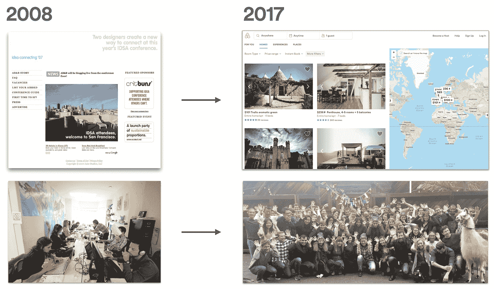

Airbnb and the data that fuels it has grown substantially over the years.

以“核心数据”为基础，Airbnb 的分析开始蓬勃发展。首先，我们通过[建立](/airbnb-engineering/experiment-reporting-framework-4e3fcd29e6c0)和[扩展](/airbnb-engineering/https-medium-com-jonathan-parks-scaling-erf-23fd17c91166) Airbnb 的实验平台，把 A/B 测试的文化带到了 Airbnb。我们建立了一个内部数据目录，[数据门户](/airbnb-engineering/democratizing-data-at-airbnb-852d76c51770)，以组织和记录我们的数据，并创建了现在开源的 Apache [超集](/airbnb-engineering/caravel-airbnb-s-data-exploration-platform-15a72aa610e5)，这样更多的用户可以独立和交互地分析数据。最后但同样重要的是，我们专注于数据教育，推出了[数据大学](/airbnb-engineering/how-airbnb-democratizes-data-science-with-data-university-3eccc71e073a)，这是一个向非数据科学家传授有用技能的计划，旨在实现 Airbnb 数据分析的民主化。

# 成长的烦恼

虽然“core_data”为 Airbnb 的数据功能带来了一些阶跃函数变化，但我们的成功也是有代价的。事实上，数据和用例的激增给数据生产者和消费者都带来了严重的成长烦恼。

首先，随着“核心数据”越来越受欢迎，越来越多的数据制作者希望将其用于分析、预测和实验。每隔一天就会在“core_data”表的基础上手动创建新表，但是无法判断是否已经存在类似的表。我们的仓库越来越复杂，数据血统变得无法跟踪。当发现并修复上游的数据问题时，无法保证修复会传播到所有下游作业。因此，数据科学家和工程师花费了无数时间来调试数据差异，救火，并经常感到徒劳和失败。

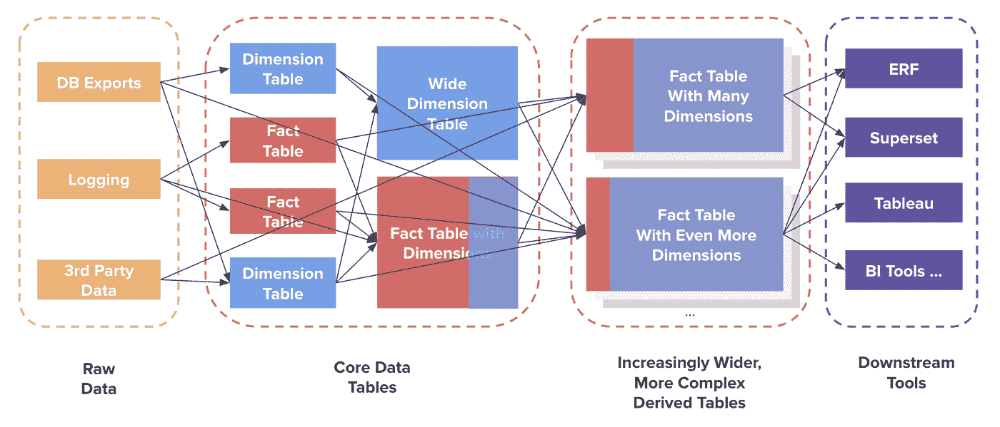

Proliferation of derived tables built on top of `core_data` caused some serious growing pains.

对于数据消费，我们听到决策者抱怨说，对于非常简单的业务问题，不同的团队报告了不同的数字，并且没有简单的方法来知道哪个数字是正确的。几年前，当我们的首席执行官 Brian 会问一些简单的问题，如前一周哪个城市的预订量最多，数据科学和金融有时会使用略有不同的表格、指标定义和业务逻辑来提供不同的答案。随着时间的推移，即使是数据科学家也开始质疑自己的数据，对数据质量的信心下降，决策者的信任度下降。

# 与密涅瓦一起克服我们成长的烦恼

随着这些痛点的恶化，Airbnb 开始了一个[多年的旅程](/airbnb-engineering/data-quality-at-airbnb-e582465f3ef7)来改造其数据仓库，目标是大幅提高公司的数据质量。作为第一步，我们的数据工程团队从头开始重建了几个关键的业务数据模型，这产生了一组经过认证的、精简的、规范化的表，这些表没有使用不必要的连接。这些经过审核的表格现在成为我们分析仓库的新基础。

然而，我们的工作几乎没有就此停止。为了将这些表转化为洞察力，我们需要能够以编程方式将它们连接在一起，以创建便于分析的数据集。我们需要能够在业务逻辑发生变化时回填数据。最后，我们需要在不同的消费工具中一致且正确地呈现数据。

这就是 Minerva——Airbnb 的公制平台——登场的时候。Minerva 将事实表和维度表作为输入，执行数据反规范化，并将聚合数据提供给下游应用程序。Minerva API 弥合了上游数据和下游消费之间的差距，使数据工程团队能够灵活地修改核心表，同时保持对各种下游消费者的支持。这个 API 在 Airbnb 的下一代数据仓库架构中起着至关重要的作用。

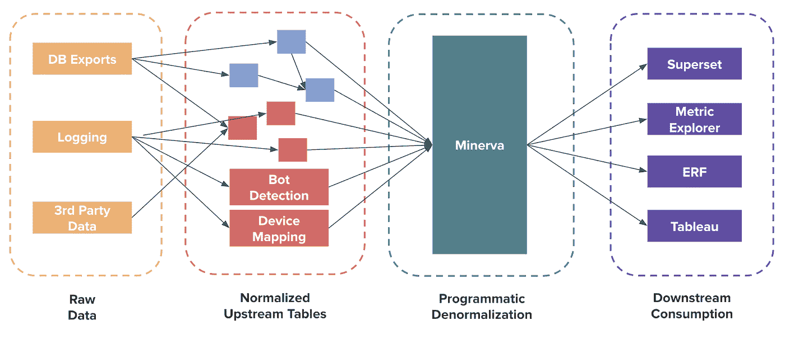

Minerva, Airbnb’s metric platform, plays a central role in Airbnb’s new data warehouse architecture.

迄今为止，我们在 Minerva 中拥有超过 12，000 个指标和 4，000 个维度，超过 200 名数据生成者跨越不同的职能部门(例如，数据、产品管理、财务、工程)和团队(例如，核心产品、信托、支付)。大多数团队现在将 Minerva 视为他们在 Airbnb 进行分析、报告和实验的首选框架。

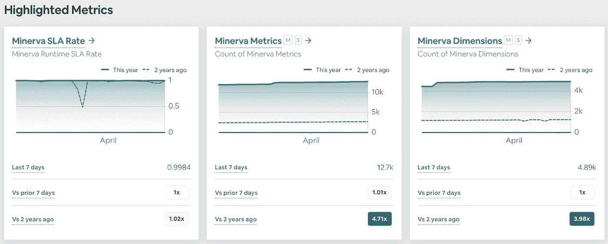

Adoption of Minerva at Airbnb has grown tremendously in the past two years.

# Minerva 中的数据生产

从基础设施的角度来看，Minerva 是建立在开源项目之上的。它使用 Airflow 进行工作流编排，使用 Apache Hive 和 Apache Spark 作为计算引擎，使用 Presto 和 Apache Druid 进行消费。从指标的创建到计算、服务、消费，以及最终的废弃，Minerva 涵盖了指标的整个生命周期。

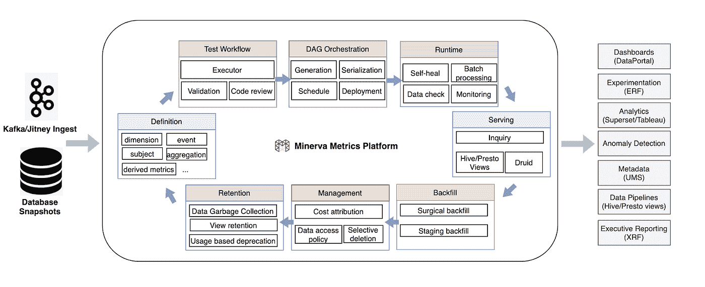

Minerva manages the entire lifecycle of metrics at Airbnb.

*   **指标定义** : Minerva 在一个集中的 Github 存储库中定义关键业务指标、维度和其他元数据，公司的任何人都可以查看和更新。
*   **经验证的工作流程**:Minerva 开发流程强制执行最佳数据工程实践，例如代码审查、静态验证和测试运行。
*   **DAG 编排:** Minerva 通过最大化数据重用和中间连接结果，高效地执行数据反规范化。
*   **计算运行时:** Minerva 有一个复杂的计算流程，可以在作业失败后自动自我修复，并有内置检查来确保数据质量。
*   **指标/元数据服务:** Minerva 提供了一个统一的数据 API，可以按需提供聚合指标和原始指标。
*   **灵活回填:**Minerva**版本控制数据定义，因此数据集的重大更改会被自动跟踪并回填。**
*   **数据管理** : Minerva 具有内置功能，例如成本归属、GDPR 选择性删除、数据访问控制和自动弃用策略。
*   **数据保留:** Minerva 建立了基于使用的保留和垃圾收集，因此昂贵但不常使用的数据集被删除。

上面提到的特性允许我们标准化指标创建、数据计算和数据交付。在下一篇文章中，我们将深入研究这些特性，并更详细地解释它们！

# Minerva 中的数据消耗

Minerva 的产品愿景是让用户“定义一次指标，随处使用”。也就是说，在 Minerva 中创建的指标应该可以在公司的仪表板工具(如[超集](/airbnb-engineering/supercharging-apache-superset-b1a2393278b))中轻松访问，在我们的 A/B 测试框架 [ERF](/airbnb-engineering/experiment-reporting-framework-4e3fcd29e6c0) 中跟踪，或者由我们的异常检测算法处理以发现业务异常，等等。在过去的几年里，我们与其他团队密切合作，创建了一个基于 Minerva 的工具生态系统。

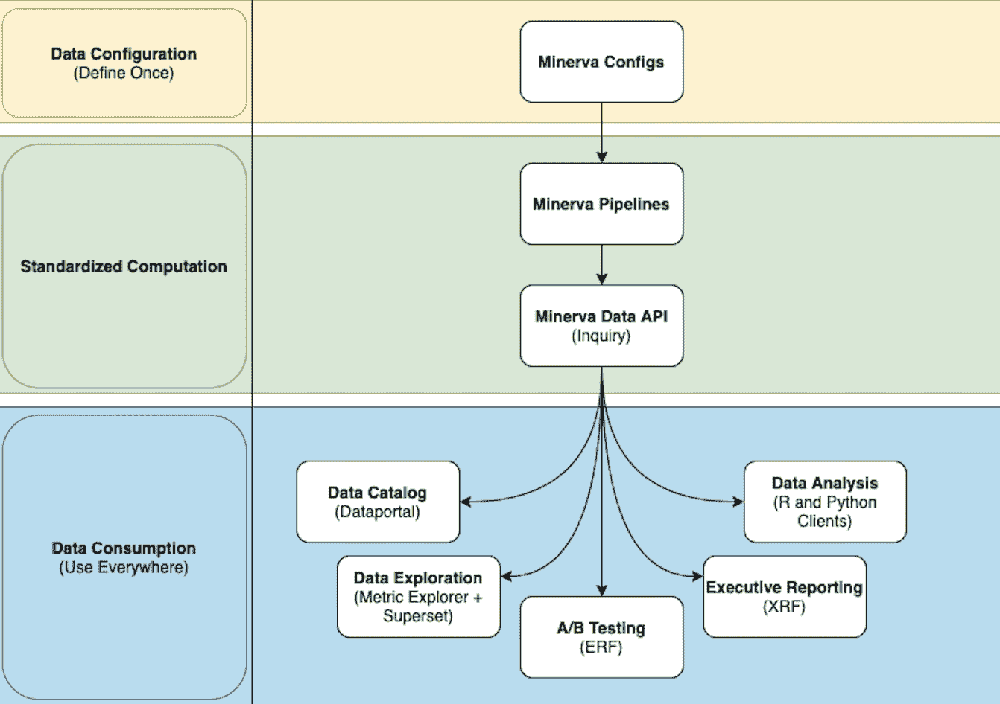

Minerva’s vision is “define once, use everywhere”.

## 数据目录

首先，我们与分析产品团队密切合作，在 Airbnb 的数据目录[数据门户](/airbnb-engineering/democratizing-data-at-airbnb-852d76c51770)中索引所有 Minerva 指标和维度。当用户与数据门户交互并搜索指标时，它会将 Minerva 指标排在搜索结果的顶部。数据门户还显示上下文信息，例如认证状态、所有权和流行度，以便用户可以衡量指标的相对重要性。对于大多数非技术用户来说，数据门户是他们进入 Minerva 指标的第一个入口点。

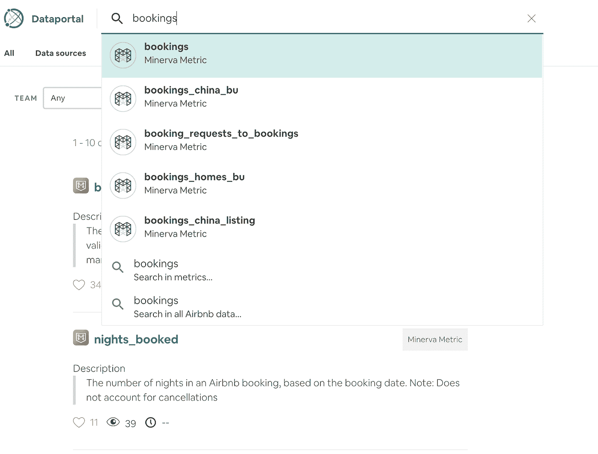

Minerva metrics are indexed and catalogued in the Dataportal UI.

## 数据探索

选择一个指标后，用户将被重定向到 Metric Explorer，Metric Explorer 是 Dataportal 的一个组件，支持开箱即用的数据浏览。在指标页面上，用户可以通过附加的切片和深入选项(如“分组依据”和“过滤”)来查看指标的趋势。那些希望深入挖掘的人可以点击超集视图来执行更高级的分析。在整个过程中，Metric Explorer 显示元数据，如指标所有者、历史登陆时间和指标描述，以丰富数据上下文。这种设计平衡了技术和非技术用户的需求，因此他们可以[无缝地就地发现数据洞察力](/airbnb-engineering/supercharging-apache-superset-b1a2393278bd)。

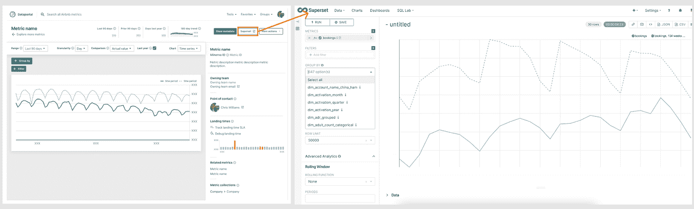

Users can investigate trends and anomalies in Metric Explorer and Superset seamlessly.

## A/B 测试

历史上，Airbnb 的实验报告框架(ERF)有自己的实验指标库，称为“指标报告”。实验者可以在实验中添加任何商业指标，并比较对照组和治疗组的结果。不幸的是，度量报告不能用于实验之外的其他用例，所以我们决定将 Minerva 与 ERF 集成，这样 A/B 测试的所有基础事件都是从 Minerva 定义和获得的。在实验和分析中使用相同的来源意味着数据科学家可以自信地理解[某些实验如何影响顶线业务指标](/airbnb-engineering/designing-experimentation-guardrails-ed6a976ec669)。

## 执行报告

自从 Airbnb 成为上市公司以来，我们已经采取了每周、每月和每季度审查 Airbnb 业务表现的做法。在这些会议中，不同职能部门的领导会面并讨论业务的当前状态。这种类型的会议需要高水平和简洁的执行报告。通常会汇总数据，分析和绘制趋势，并以运行汇总(例如，年初至今)和时间比率比较(例如，同比)的形式呈现指标变化。

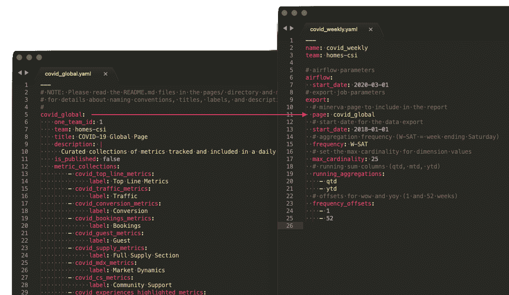

Here is an example of the reporting configuration for COVID-19 dashboard, built on top of Minerva.

为了实现这种类型的报告，我们构建了一个执行报告框架(XRF)。XRF 采用用户指定的 Minerva 指标和维度列表，并将它们转化为便于报告的聚合指标时间序列。该框架自动化了大量手动工作，并允许我们通过利用用于分析和实验的相同 Minerva 指标和维度来标准化高保真、业务关键型报告。

## 数据分析

最后，Minerva 的数据通过 Minerva 的 API 暴露给 Airbnb 的自定义 R 和 Python 客户端。这使得数据科学家可以在笔记本环境中轻松查询 Minerva 数据。重要的是，在笔记本环境中出现的数据是以与在上述工具(如超集和 Metric Explorer)中完全相同的方式计算和出现的。这为数据科学家节省了大量时间，因为他们可以根据分析的复杂性为工作挑选合适的工具。值得注意的是，这个数据 API 鼓励内部工具的轻量级原型化，这可以在以后生产并在整个公司内共享。例如，在过去的两年中，数据科学家使用这个 API 构建了一个时间序列分析工具和一个电子邮件报告框架。

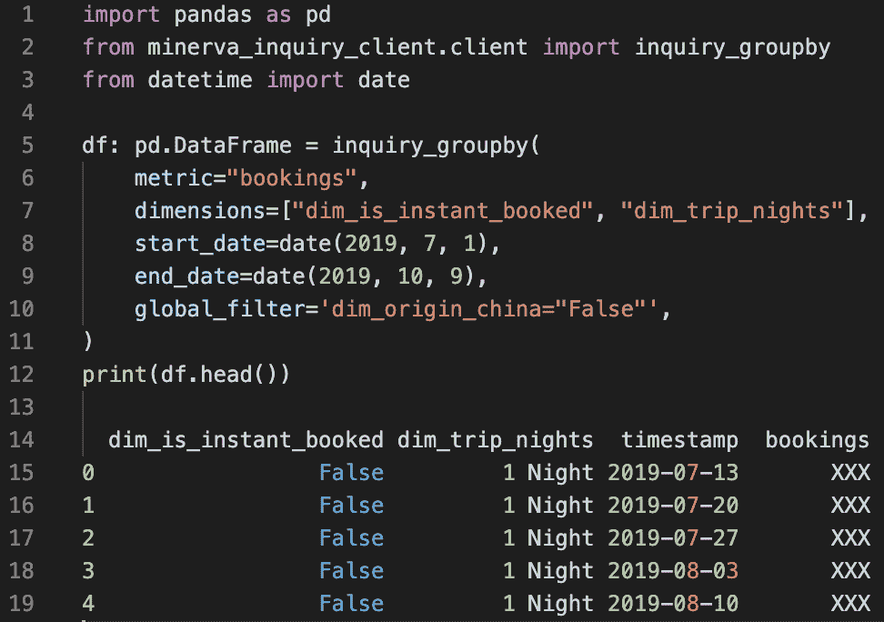

A data scientist can use our Python client to retrieve aggregated data in Minerva and conduct analyses.

# 我们如何利用 Minerva 数据应对新冠肺炎危机

随着 Minerva 成为 Airbnb 分析的核心，我们一次又一次地看到了它给 Airbnb 的数据社区带来的能力和生产力的提高。在这最后一节，我们想举一个具体的例子，说明密涅瓦在新冠肺炎危机期间是如何帮助企业的。

2020 年 3 月，全球旅行因新冠肺炎而停止。几乎在一夜之间，Airbnb 的预订量直线下降，取消量直线上升。对我们来说，这是一个可怕的时刻，它提出了许多重要的商业问题:冠状病毒如何影响我们的夜间积压？它是如何影响我们的入住率的？取消率上升的财务影响是什么？就旅行距离而言，冠状病毒是如何改变旅行需求的？我们需要快速准确地回答所有这些问题。

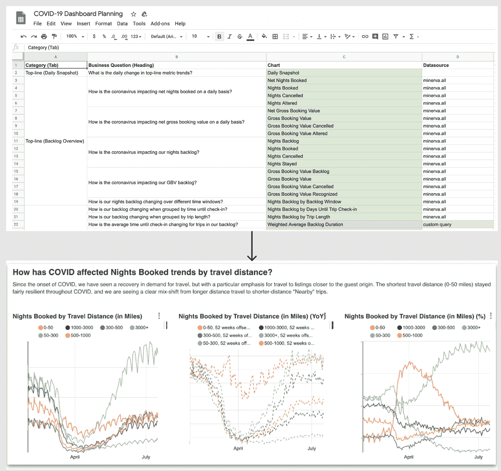

We were able to dramatically shorten the time from data curation to insight discovery and assess the impact of COVID-19 on Airbnb’s business because of Minerva!

为了应对这些涌入的问题，我们的数据科学团队收集了这些问题，并开始头脑风暴如何利用数据来回答它们。至关重要的是，由于供应、需求、财务和客户支持的许多重要业务指标和维度已经在 Minerva 中定义，我们的中央分析团队能够在不到几天的时间内构建一个执行仪表板并推出初始版本。新冠肺炎仪表板很快成为唯一权威的真相来源，并在危机中由我们的执行团队进行了密切审查。自那以来，它已经积累了超过 11，000 次浏览和 1，500 名不同的观众。毫不奇怪，新冠肺炎仪表板是 2020 年 Airbnb 上访问量最大的超集仪表板。

Minerva metrics 提供的见解也让该公司能够自信地指出快速变化的形势。例如，我们发现了市场机会，如需求转向当地旅游和长期停留。这些发现促使我们重新设计产品页面的几个重要接触点，以满足用户偏好的转变。在危机时刻，回答问题和发现真知灼见的能力比以往任何时候都更重要。由于 Minerva 中的单一真实数据来源，我们能够高效且有效地做到这一点！

# 关闭

在这篇文章中，我们简要总结了 Airbnb 分析之旅的历史，我们在过去几年中面临的成长烦恼，以及我们为什么要建立 Minerva，Airbnb 的度量基础设施。特别是，我们讲述了如何通过 Minerva 生成和消费数据。在这篇文章的最后，我们还强调了 Minerva 如何帮助 Airbnb 应对新冠肺炎危机的一个最近的例子。

在下一篇的[文章中，我们将深入探讨 Minerva 的技术架构，包括设计原则、用户开发流程以及数据计算图。在本系列的最后一篇文章中，我们将介绍 Minerva API，它是我们的一个数据抽象层，使得上面概述的所有集成成为可能。我们将通过分享我们从构建 Minerva 中学到的经验来结束这个系列，希望这些经验对其他构建类似系统的人有所帮助。](/airbnb-engineering/airbnb-metric-computation-with-minerva-part-2-9afe6695b486)

在那之前，请继续关注我们的下一篇文章！

# 感谢

密涅瓦之所以成为可能，仅仅是因为那些致力于它的人们的关心和奉献。我们还要感谢[劳伦·奇库斯](https://www.linkedin.com/in/lchircus/)、[伦·凯斯](https://www.linkedin.com/in/aaronkeys/)、[迈克·林](https://www.linkedin.com/in/michaelcl/)、[阿德里安·库恩](https://www.linkedin.com/in/adriankuhn/)、[克里希纳·布帕蒂拉朱](https://www.linkedin.com/in/krishna-bhupatiraju-1ba1a524/)、[米歇尔·托马斯](https://www.linkedin.com/in/michelleethomas/)、[埃里克·里特](https://www.linkedin.com/in/erikrit/)、[塞蕾娜·江](https://www.linkedin.com/in/serena-jiang/)、[克里斯特·旺苏帕萨特](https://www.linkedin.com/in/krist-wongsuphasawat-279b1617/)、[克里斯·威廉姆斯](https://www.linkedin.com/in/chris-williams-1bb8b936/)、[肯·陈](https://www.linkedin.com/in/kenchendesign/) [Jerry Chu](https://www.linkedin.com/in/zi-jerry-chu/) 、 [Pala Muthiah](https://www.linkedin.com/in/palanieppan-muthiah-b7088924/) 、 [Kevin Yang](https://www.linkedin.com/in/ruiqinyang/) 、 [Ellen Huynh](https://www.linkedin.com/in/ellen-huynh/) 以及其他许多与我们合作的人，他们让 Minerva 在整个公司变得更加触手可及。 最后，感谢 Bill Ulammandakh 创造了美丽的视觉效果，这样我们就可以用它作为我们的标题图像！

Apache、Apache Airflow、Apache Superset、Apache Hive、Apache Spark 和 Apache druid 是 Apache 软件基金会在美国和/或其他国家的注册商标或商标。

*Presto 是 LF Projects，LLC 的注册商标。*

*GITHUB 是 GITHUB，Inc .在美国注册的独家商标*

*所有商标均为其各自所有者的财产。这些的任何使用仅用于识别目的，并不意味着赞助或认可。*