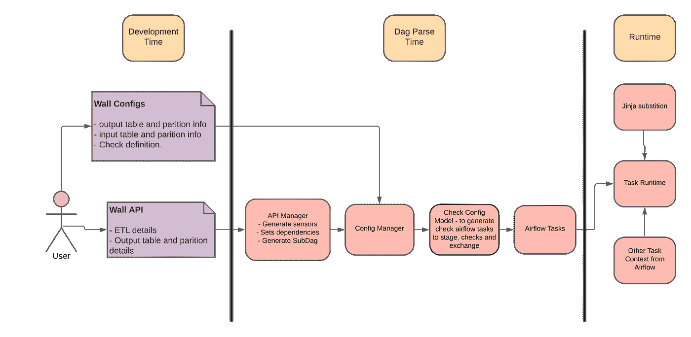
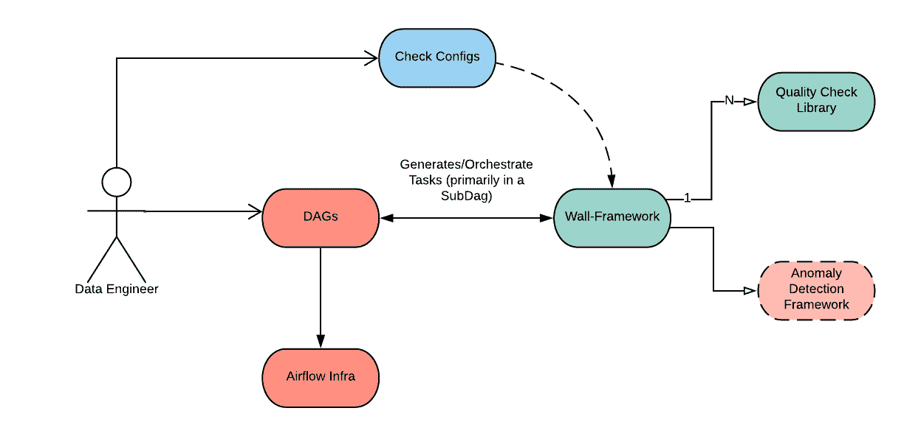
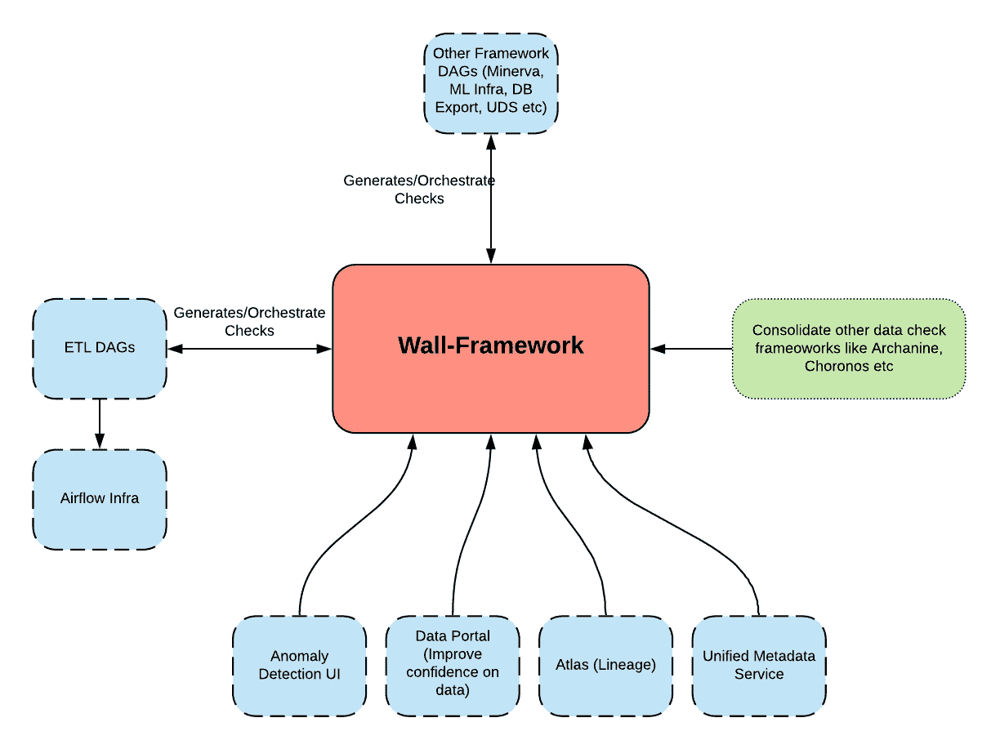

# Airbnb 如何建造“墙”来防止数据错误

> 原文：<https://medium.com/airbnb-engineering/how-airbnb-built-wall-to-prevent-data-bugs-ad1b081d6e8f?source=collection_archive---------0----------------------->

通过广泛的数据质量、准确性和异常检查赢得数据信任


正如我们的数据质量倡议[帖子](/airbnb-engineering/data-quality-at-airbnb-e582465f3ef7)中所分享的，Airbnb 已经开始了一项大规模的项目，以确保整个公司的数据可信。为了使员工能够利用数据更快地做出决策，并为业务指标监控提供更好的支持，我们引入了 [Midas](/airbnb-engineering/data-quality-at-airbnb-870d03080469) ，这是一个分析数据认证流程，可认证所有重要的指标和数据集。作为该过程的一部分，我们制定了强大的数据质量检查和异常检测强制要求，以防止数据错误在数据仓库中传播。我们还创建了指导原则，指导在数据模型认证过程中需要执行哪些特定的数据质量检查。在管道中添加数据质量检查已经成为我们数据工程工作流程中的标准做法，并帮助我们在管道中更早地检测到许多关键的数据质量问题。

在这篇博文中，我们将概述我们在添加大量数据检查(即数据质量、准确性、完整性和异常检查)以防止公司范围内的数据错误时所面临的挑战，以及这如何促使我们构建一个新的框架来轻松地大规模添加数据检查。

# 挑战

当我们第一次引入 [Midas](/airbnb-engineering/data-quality-at-airbnb-870d03080469) 分析数据认证流程时，我们就需要增加哪种数据质量检查提出了建议，但我们没有强制要求如何实施。因此，每个数据工程团队都采用了自己的方法，这带来了以下挑战:

## 1.添加数据校验的多种方法

在 Airbnb 的分析数据生态系统中，我们使用 Apache Airflow 来调度 ETL 作业或数据管道。Hive SQL、Spark SQL、Scala Spark、PySpark 和 Presto 作为不同的执行引擎被广泛使用。然而，由于团队开始在不同的执行引擎中构建类似的数据质量检查，我们遇到了其他固有的问题:

*   我们没有任何集中的方法来查看跨团队的数据检查覆盖率。
*   数据检查准则的改变将需要在整个公司的代码库中的多个地方进行改变。
*   面向未来的实施几乎不可能扩展。团队不断地重新发明轮子，并在代码库中复制代码。

## 2.多余的努力

不同的团队经常需要构建工具来满足他们自己对不同数据检查的需求。每个数据工程(DE)团队开始在竖井中构建数据检查工具。尽管这些团队中的每一个都在构建可靠的工具来满足他们各自的业务需求，但是这种方法存在一些问题，原因如下:

*   我们开始并行构建多个框架。
*   数据检查框架的维护成本变得很高，并且引入了运营开销。
*   缺少特性和缺乏灵活性/可扩展性使得这些框架很难在整个公司内重用。

## **3。复杂气流 DAG 代码**

作为 ETL 管道的一部分，每个检查都作为单独的任务添加到了 Airflow 中。气流 DAG 文件很快变得海量。这些检查的操作开销增长到难以维持的程度，原因有几个:

*   不支持阻塞和非阻塞检查。轻微的检查失败或错误警报通常会阻塞关键数据管道的 SLA。
*   ETL 逻辑和数据检查变得紧密耦合，不可重用。
*   维护变得具有操作挑战性，因为我们手动跟踪依赖关系，这也使得添加更多检查变得困难。

# 定义需求

为了解决这些工具差距，我们着手构建一个统一的数据检查框架，该框架将满足以下要求，并确保更高的可用性:

*   可扩展:Airbnb 使用的统一数据检查方法
*   配置驱动:将检查定义为 YAML 格式的文件，以加快开发速度
*   易于使用:提供简化的界面，以促进公司范围内更快的采用

# 介绍墙壁框架

Wall 是编写离线数据质量检查的铺垫。这是一个框架，旨在保护我们的分析决策免受不良数据错误的影响，并确保 Airbnb 的数据值得信赖。

Wall 框架是在 Apache Airflow 之上用 Python 编写的。用户可以通过编写一个简单的配置文件并在 DAG 中调用一个助手函数，将数据质量检查添加到他们的 Airflow DAGs 中。

*   Wall 在一个通用框架下提供了公司目前可用的大多数质量检查和异常检测机制，使数据检查更容易标准化。
*   它支持模板化的定制的基于 SQL 的业务逻辑、准确性检查和可扩展的预定义检查库。
*   墙是配置驱动的—添加检查不需要任何代码。
*   检查可以在 ETL 管道中以[阶段-检查-交换](https://airflow.apache.org/docs/apache-airflow/1.10.2/concepts.html?highlight=branch%20operator#subdags)模式使用，或者作为独立的检查使用。
*   该框架是可扩展的——任何团队都可以按照开源模型非常容易地将他们特定于团队的检查添加到 Wall 中(按照数据工程铺路团队的批准)。
*   业务用户可以轻松添加质量检查，而无需为每个检查创建任何气流 DAG 或任务。
*   Wall 负责基于 SQL 的检查和异常检测任务的创建。它还负责创建阶段和交换任务，并以分离的方式设置检查的适当依赖关系。因此，在迁移到 Wall 之后，ETL 管道得到了极大的简化，我们已经看到了能够消除超过 70%的 DAG 代码的情况。

# 墙壁建筑

根据我们的关键需求，这个框架被设计成可扩展的。它有三个主要组件— WallApiManager、WallConfigManger 和 WallConfigModel..



Wall internal architecture

## WallApiManager

Wall Api 管理器是使用 Wall 协调检查和交换的公共接口。Wall 用户仅在他们的 DAG 文件中使用它。它接受一个配置文件夹路径作为输入，并支持多种 ETL 操作，如 Spark、Hive 等。

## WallConfigManager

墙配置管理器解析并验证检查配置文件，然后调用相关的 CheckConfigModels 来生成气流任务列表。Wall 主要使用 Presto 检查来生成数据检查。

## CheckConfigModel

每个墙检查都是从 BaseCheckConfigModel 派生的一个单独的类。CheckConfigModel 类主要负责验证检查参数并为检查生成气流任务。CheckConfigModel 使框架具有可扩展性。如果现有模型不支持他们的用例，不同的团队可以添加他们自己的 CheckConfigModel。

# 关键特征

Wall framework 提供了以下关键功能来满足我们上面提到的需求。

## 灵活性

*   墙配置可以位于团队已经定义其数据管道 DAG 的同一存储库中，团队或 DAG 所有者可以决定它们的位置。团队可以为每个表使用单独的 YAML 文件，也可以为一组表使用单个 YAML 文件来定义检查。
*   每个检查配置模型都可以定义一组任意的参数，如果需要，它可以覆盖参数。相同的检查配置可以根据运行上下文进行不同的编排和运行。即作为 ETL 阶段检查交换的一部分或作为前/后检查。
*   检查属性可以是分层的(即，它可以在团队级别、文件级别、表格级别或检查级别定义)。较低级别的属性值会覆盖较高级别的值。团队可以在共享的 YAML 文件中定义他们的团队级别默认值，而不是在不同的 YAML 文件中复制相同的配置和检查。
*   在阶段检查-交换检查的情况下，用户可以指定冻结和非冻结检查。这使得 Wall 在接受新支票时更加灵活。

## 展开性

*   很容易装载一种新型的支票模型。Wall 能够支持常用的数据检查/验证机制。
*   每个检查配置模型都是相互解耦的，它可以定义自己的一组参数、验证、检查生成逻辑、预处理等。
*   检查配置模型可以由数据工程社区在数据工程铺路团队的协作下开发。

## 简单

*   易于复制粘贴，以便在不同的表或上下文中应用类似的检查。
*   检查模型很直观。
*   检查与 DAG 定义和 ETL 管道相分离，这样就可以在不更新 ETL 的情况下更新它们。
*   很容易一次测试所有的检查。

# 添加墙检查

在每一个高层次上，用户都需要编写一个 yaml 配置，并从他们的 DAG 中调用 Wall 的 API 来编排他们的 ETL 管道和数据检查。



High level diagram of how users interact with Wall.

作为添加新的数据质量检查有多容易的一个示例，让我们假设您想要向 wall_tutorials_00 DAG 中名为 foo.foo_bar 的表添加一个数据质量检查—验证分区不为空。这可以通过以下两个步骤来完成:

1.  决定添加墙检查配置的文件夹，即 projects/tutorials/DAGs/wall _ tutorials _ 00/wall _ checks。在 wall check config 文件夹中创建一个包含以下内容的检查配置文件(即 foo.foo_bar.yml ):

```
primary_table: foo.foo_bar
emails: ['[subrata.biswas@airbnb.com](mailto:subrata.biswas@airbnb.com)']
slack: ['#subu-test']
quality_checks:
   - check_model: CheckEmptyTablePartition
     name: EmptyPartitionCheck
```

更新 DAG 文件(即 wall_tutorials_00.py)以基于配置文件创建检查。

```
from datetime import datetimefrom airflow.models import DAGfrom teams.wall_framework.lib.wall_api_manager.wall_api_manager import WallApiManagerargs = {"depends_on_past": True,"wait_for_downstream": False,"start_date": datetime(2020, 4, 24),"email": ["subrata.biswas@airbnb.com",],"adhoc": True,"email_on_failure": True,"email_on_retry": False,"retries": 2,}dag = DAG("wall_tutorials_00", default_args=args)wall_api_manager = WallApiManager(config_path="projects/tutorials/dags/wall_tutorials_00/wall_checks")# Invoke Wall API to create a check for the table.wall_api_manager.create_checks_for_table(full_table_name="foo.foo_bar", task_id="my_wall_task", dag=dag)
```

**验证和测试**

现在，如果您查看 wall_tutorials_00 的任务列表，您将看到由 wall 框架创建的以下任务:

```
<Task(NamedHivePartitionSensor): ps_foo.foo_bar___gen> <Task(SubDagOperator): my_wall_task>
```

Wall 为主 DAG(即 wall_tutorials_00)中的表创建了一个 SubDagOperator 任务和一个 NamedHivePartitionSensor 任务。Wall 将所有支票封装在子 dag 中。要获得检查任务列表，您需要查看子 dag 任务，即运行 wall _ tutorials _ 00 . my _ wall _ task Dag 的 list_tasks。对于这种情况，它返回以下任务列表:

```
<Task(WallPrestoCheckOperator): EmptyPartitionCheck_foo.foo_bar> <Task(DummyOperator): group_non_blocking_checks> <Task(DummyOperator): foo.foo_bar_exchange><Task(DummyOperator): group_blocking_checks> <Task(DummyOperator): foo.foo_bar_exchange><Task(PythonOperator): validate_dependencies>
```

注意:您可能注意到 Wall 在子 DAG 中创建了几个 DummyOperator 任务和一个 PythonOperator 任务。需要维护控制流，即阻塞与非阻塞检查、依赖性、验证等。您可以忽略这些任务，并且不需要依赖这些任务，因为它们可能会在将来发生变化或被删除。

现在您可以像测试任何气流任务一样测试您的检查任务，即

```
airflow test wall_tutorials_00.my_wall_task EmptyPartitionCheck_foo.foo_bar {ds}
```

# Airbnb 的数据生态系统中的墙。

将 Wall 与 Airbnb 数据生态系统中的其他工具相集成，对于其长期成功至关重要。为了允许其他工具轻松集成，我们将“检查”阶段的结果发布为 Kafka 事件，其他工具可以订阅这些事件。下图显示了其他工具如何与 Wall 集成:



Wall in Airbnb’s data ecosystem

# 结论

Wall 确保 Airbnb 的数据质量保持高标准，并且该标准不会随着时间的推移而降低。

通过启用标准化但可扩展的数据检查，这些数据检查可以在我们的分布式数据工程组织中轻松传播，我们继续确保整个公司的数据值得信赖、可靠。因此，Airbnb 的所有关键业务和财务数据管道都在使用 Wall，我们有数百条数据管道每天都在运行数千次 Wall 检查。

如果你对这类工作感兴趣，可以看看我们的相关职位:

[高级数据工程师](https://grnh.se/706bf4e01us)

[员工数据科学家-算法、支付](https://grnh.se/a207325d1us)

还有更多在 Airbnb 的[职业生涯！](https://careers.airbnb.com/)

你也可以通过观看我们最近的 [Airbnb 技术讲座](https://fb.watch/72Oumx3pJJ/)来了解更多关于我们的*迈向高品质之旅*。

特别感谢[尼廷·库马尔](https://www.linkedin.com/in/nikuma/)、[巴拉特·兰根](https://www.linkedin.com/in/bharatrangan/)、[肯·荣格](https://www.linkedin.com/in/kenneth-jung-71495256/)、[维克托·约内斯库](https://www.linkedin.com/in/victor-ionescu-3a029b5a/)、[于斯·邱](https://www.linkedin.com/in/siyu-qiu-05b482a1/)作为主要合作伙伴，在传播本框架的同时。

*所有产品名称、标识和品牌均为其各自所有者的财产。本网站中使用的所有公司、产品和服务名称仅用于识别目的。使用这些名称、标志和品牌并不意味着认可。*