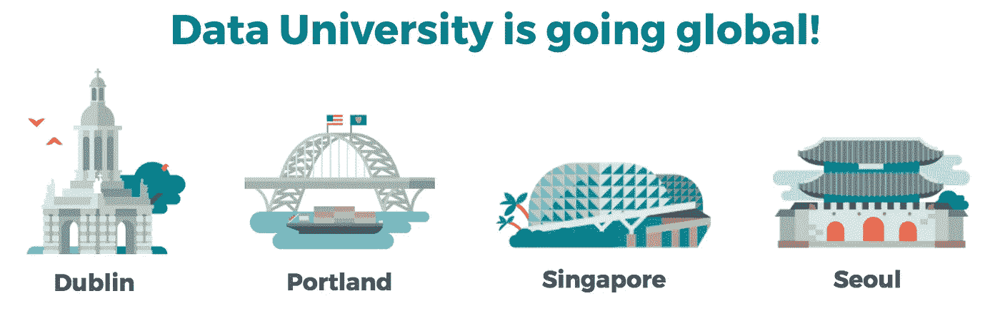

# Airbnb 如何通过数据大学使数据科学民主化

> 原文：<https://medium.com/airbnb-engineering/how-airbnb-democratizes-data-science-with-data-university-3eccc71e073a?source=collection_archive---------2----------------------->

由[杰夫·冯](https://twitter.com/jtfeng)，[埃琳·科夫曼](https://twitter.com/erincoff) & [埃琳娜·格雷瓦尔](https://twitter.com/elenatej)

# 介绍

在 Airbnb，数据对我们至关重要。我们将数据描述为大规模用户的声音。因此，数据科学扮演着解释者的角色——我们使用数据和统计数据来理解我们的用户，并将其翻译成人或机器可以理解的声音。我们利用这些定量的见解，结合定性的见解(如面对面的用户研究)，为企业和我们的主人和客人社区做出最佳决策。

为此，我们已经建立了一个世界一流的数据科学团队，规模已经扩大到近 100 人，从事从实验到数据分析、可视化到建模和机器学习的各种工作。我们还构建了[稳定、可靠和可扩展的数据基础设施](/airbnb-engineering/data-infrastructure-at-airbnb-8adfb34f169c)作为我们数据的基础，以及一套强大的数据工具，为 Airbnb 的数据科学家和知识工作者提供支持:

*   Apache Airflow(孵化)[ [博文](/airbnb-engineering/airflow-a-workflow-management-platform-46318b977fd8)|[Github](https://github.com/apache/incubator-airflow  )——数据工作流管理平台
*   Apache 超集(孵化)[ [博客文章](/airbnb-engineering/superset-scaling-data-access-and-visual-insights-at-airbnb-3ce3e9b88a7f) | [Github](https://github.com/airbnb/superset) ] —数据可视化和访问
*   ERF [ [博文](/airbnb-engineering/experiment-reporting-framework-4e3fcd29e6c0)]—A/B 测试的实验报告框架
*   数据门户[ [博客文章](/airbnb-engineering/democratizing-data-at-airbnb-852d76c51770)——数据搜索、探索和信任
*   知识报告[ [博客文章](/airbnb-engineering/scaling-knowledge-at-airbnb-875d73eff091) | [Github](https://github.com/airbnb/knowledge-repo) ] —扩展知识和见解

# 数据科学的扩展和民主化

我们的另一个基本信念是*每个*员工都应该被授权做出**基于数据的**决策。这适用于 Airbnb 组织的所有部分——从决定是否推出新产品功能到分析如何提供尽可能最好的员工体验。我们的数据科学团队坚信，我们的部分目标是让公司能够理解和使用数据。为了用数据为每个决策提供信息，不可能让每个房间都有一名数据科学家，我们需要扩展我们的技能组合。此外，我们快速的国际增长使形势变得更具挑战性。我们从 2011 年在旧金山的一个办公室扩展到今天在全球的 22 个办公室，其中许多没有数据科学。此外，我们相信人们有能力进行批判性思考，并自己理解数据，我们希望为他们提供这样做的工具。

为了应对这一挑战，我们深入思考了如何在 2016 年下半年实现数据科学的民主化，并扩大数据知情决策的规模。我们使用数据平台的每周活跃用户(Wau)指标作为代理，来衡量我们作为一个组织的“数据通知”程度。在 2016 年第三季度初，只有大约 30%的 Airbnb 员工是我们数据平台的 WAU，这明显低于我们对脸书和 Dropbox 等其他高速增长的互联网公司同行进行的基准测试。

然后，我们思考是什么阻碍了我们公司查看数据本身。

基于数据的决策所需的关键要素包括数据的可访问性、一套全面的数据工具以及用户如何利用数据和工具的知识。当我们与 Airbnb 的人交谈时，越来越明显的是，扩展数据知情决策的瓶颈实际上是用户的数据教育。我们的数据工具很好地服务于数据科学家。此外，通过 Core Data(我们产品数据的唯一真实来源)以及 [SQL Lab](/airbnb-engineering/superset-scaling-data-access-and-visual-insights-at-airbnb-3ce3e9b88a7f) (我们内置到 Superset 中的一个新的 SQL 编辑器)等努力，我们已经在使数据更易于访问方面取得了巨大进步。差距在于，我们没有任何正式的计划来让员工掌握使用我们的工具以及如何处理核心数据的知识。因此，我们决定创建数据大学。

# 我们的解决方案:数据大学

Video credit: ReadyState

*数据大学是为 Airbnb 的任何人提供的数据教育，根据角色和团队进行扩展。*我们的愿景是授权**的每一位** **员工**做出**基于数据的决策**。我们的方法是独特的，因为提供数据教育的组织通常只关注他们的技术员工。我们的方法也是有意的，因为我们相信 Airbnb 的每个人都应该并且能够利用他/她的角色中的数据来做出更好的决策。因此，我们设计了这个程序，让 Airbnb 的任何人都可以访问它并与之相关。

创建“公民数据科学家”是强大的——它不仅有助于确保决策以数据为基础，还能让人们自主做出决策。这一点很重要，因为问问题的人总是对他们试图回答的问题有最好的了解，这减少了回答问题的反馈循环。这还有一个好处，就是可以节省数据科学团队的一些时间。我们曾考虑利用 Coursera 和 Udacity 等 MOOCs 的现有资源，但我们的许多数据工具都是独一无二的，我们相信在 Airbnb 的数据背景下教育人们有巨大的价值。

# 数据大学课程

课程包括 30 多门课，涵盖一系列不同的主题。100 级系列为 Airbnb 的数据知情决策奠定了基础，旨在向每个人开放。200 级系列使人们具备使用 SQL 访问数据的应用技能，或者在 Airbnb 数据的背景下使用 Superset、Tableau 和 ERF 等工具分析和可视化数据。然后，300 级系列主要面向工程师和数据科学家。它让人们接触到机器学习等高级数据技术和编写数据管道的 Airflow 等工具。我们还涵盖了用于分析和操作数据的流行语言，如 R、Python 和 Hive。

# 数据大学教师

最初的许多课程是由 Airbnb 最资深的数据科学家 Erin Coffman 开发和教授的。然而，从那时起，我们从数据科学和工程组织中聚集了 30 多名志愿者教师(许多人如下图所示),帮助创建课程内容和授课。我们非常感谢让数据大学成为可能的所有志愿者！

# 影响:数据科学的民主化

迄今为止，数据大学在 Airbnb 取得了巨大成功。自推出以来的半年里，超过 500 名独特的人参加了至少一门课(或 Airbnb 的约 1/8)。参与度很高，因为每位参与的员工平均参加了超过 4 节课，我们总共有超过 2，100 个“座位”到目前为止，提供的每门课程都有+55 或更高的 NPS 分数。

此外，它彻底改变了 Airbnb 的数据文化，因为 Airbnb 的 45%现在是数据平台的 WAU。过去由数据科学家或分析师处理的特定数据请求现在通常由其他数据大学毕业生自助处理或处理。我们经常听到员工被赋予数据能力的轶事，从招聘员工创建 Tableau 仪表盘到产品经理编写自己的 SQL 并解释自己的实验。最近，我们开始将该计划扩展到其他办事处，包括都柏林、波特兰、新加坡和首尔。

# 展望未来

我们的团队对数据大学的初步成果感到非常鼓舞，我们将继续对内容进行迭代，并在课程广度(接下来是 300 级系列)和提供课程的地点方面扩大该计划。我们还将尝试不同的学习形式，如在线和/或流式课程。

在分享我们的经验时，我们希望激励其他组织致力于解决我们正在努力解决的同类规模和数据民主化问题，并分享经验，以便我们能够合作产生最佳实践。如果您有兴趣交换意见，或者对我们的方法有任何疑问，请[联系](mailto:data-university@airbnb.com)！

一篇相关文章出现在[科技危机](https://techcrunch.com/2017/05/24/airbnb-is-running-its-own-internal-university-to-teach-data-science/)上。

在 [airbnb.io](http://airbnb.io/) 查看我们所有的开源项目，并在 Twitter 上关注我们:[@ Airbnb data](https://twitter.com/AirbnbData)+[@ Airbnb eng](https://twitter.com/AirbnbEng)。