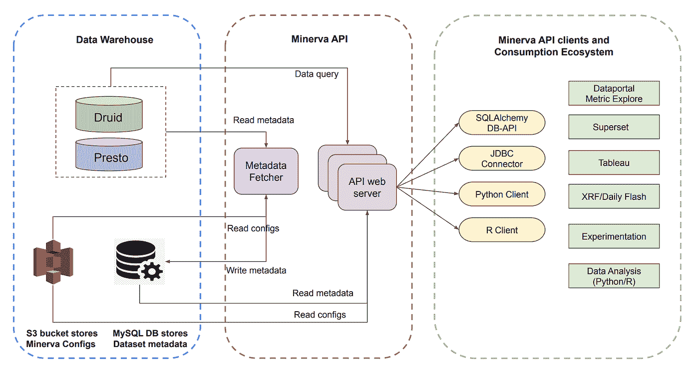

# Airbnb 如何实现大规模的一致数据消费

> 原文：<https://medium.com/airbnb-engineering/how-airbnb-enables-consistent-data-consumption-at-scale-1c0b6a8b9206?source=collection_archive---------0----------------------->

## 第三部分:构建连贯的消费体验

**通过:** [阿米塔帕瓦](https://www.linkedin.com/in/apahwa/)，[克里斯蒂安菲格罗亚](https://www.linkedin.com/in/cristianrfr/)，[东寒张](https://www.linkedin.com/in/donghan-zhang-670990135/)，[海姆格罗斯曼](https://www.linkedin.com/in/haimgrosman/)，[约翰博德利](https://www.linkedin.com/in/john-bodley-a13327133/)，[乔纳森帕克斯](https://www.linkedin.com/in/jonathan-parks-15617820/)，[刘文秀](https://www.linkedin.com/in/jialingliu1020/)，[克里希纳布帕蒂拉朱](https://www.linkedin.com/in/krishna-bhupatiraju-1ba1a524/)，[玛吉朱](https://www.linkedin.com/in/shengnan-zhu-89403124/)，[麦克林](https://www.linkedin.com/in/michaelcl/)，


# 介绍

在本系列的第一篇文章中，我们强调了 Minerva 在改变 Airbnb 分析工作方式中所扮演的角色。在[的第二篇文章](/airbnb-engineering/airbnb-metric-computation-with-minerva-part-2-9afe6695b486)中，我们深入到 Minerva 的核心计算基础设施，并解释了我们如何在数据集和团队之间实施数据一致性。在这第三篇也是最后一篇文章中，我们将重点讲述 Minerva 如何大幅简化和改善我们用户的数据消费体验。具体来说，我们将展示统一指标层(我们称之为 Minerva API)如何帮助我们为具有广泛背景和不同数据专业知识水平的用户量身打造多功能数据消费体验。

# 以度量为中心的方法

当数据消费者使用数据来构建业务问题时，他们通常会从指标和维度方面进行思考。例如，一位业务领导可能想知道长期入住(一个维度)占预订(一个指标)的百分比。要回答这个问题，她需要找到要查询的正确的一组表(where)，应用必要的连接或过滤器(how)，然后最终聚合事件(how)以得到正确的答案。

虽然许多传统的 BI 工具试图代表他们的用户抽象这项工作，但他们的大部分数据服务逻辑仍然严重依赖于用户来确定“在哪里”和“如何”。在 Airbnb，我们渴望建立更好的用户体验——在这种体验中，用户只需简单地询问指标和维度削减，就可以获得答案，而不必担心“在哪里”或“如何”。这个愿景，我们称之为“以度量为中心的方法”，被证明是一个困难的工程挑战。

## 挑战一:在哪里

在大多数传统的数据仓库中，数据被组织在表中。这意味着要回答一个查询，BI 工具需要将所讨论的指标和维度与包含相关答案的物理表相关联。但是，对于给定的指标和维度组合，可能有许多数据集可以提供答案。这些表通常具有不同程度的数据质量和正确性保证，因此选择正确的表来提供数据是很重要的。

## 挑战二:“如何做”

除了“在哪里”，负责“如何”的数据服务逻辑也有许多细微差别。首先，有不同的度量类型:*简单度量*由单个物化事件(例如，预订)组成；*过滤指标*由根据维度值过滤的简单指标组成(例如，中国的预订量)；而*衍生指标*由一个或多个非衍生指标(例如搜索到图书的比率)组成。此外，虽然许多指标是相加的(例如，预订)，但许多其他指标不是:计数差异、百分比和时间点快照不能简单地通过将单个事件相加来计算。在所有场景中，一致地正确计算这些不同的度量类型是一个巨大的挑战。

## 挑战三:与下游应用程序集成

最后，为了做出基于数据的决策，数据必须在各种各样的环境、应用程序和工具中使用。该指标越普遍、越重要，就越有可能被广泛应用于各种场合。例如，总预订价值(GBV)、预订住宿和收入是 Airbnb 最常用的指标。它们用于跟踪业务绩效，计算随机控制实验的护栏指标，并用作机器学习模型的功能。在不同的用例中提供这些指标，同时为用户提供正确使用它们的上下文信息是我们的另一个核心挑战。

## 我们的解决方案

我们通过构建 Minerva API 解决了这些挑战，这是一个度量服务层，充当上游数据模型和下游应用程序之间的接口。有了 Minerva API，任何下游应用程序都能够一致、正确地提供数据，而无需知道数据存储在哪里，也无需知道应该如何计算指标。本质上，Minerva API 通过连接“什么”和“哪里”来充当“如何”。

# Minerva API

Minerva API 由 API web 服务器、元数据提取器应用程序和几个与 [Apache 超集](https://superset.apache.org/)、 [Tableau](https://www.tableau.com/) 、 [Python](https://www.python.org/) 和 [R](https://www.r-project.org/) 集成的客户端组成。这些组件为下游应用程序提供本地 NoSQL 和 SQL 指标查询。



Minerva API serves as the interface between the consumers and the underlying datasets

## 元数据提取器:抽象“何处”

我们之前提到过，用户只需向 Minerva 请求度量和维度缩减，而不必弄清楚“在哪里”。当发出一个数据请求时，Minerva 会花费大量精力来计算应该使用它的哪个数据集来满足该请求。

在挑选最佳数据源之前，Minerva 会考虑几个因素，其中最重要的因素之一是数据完整性。这意味着任何被选择来为查询服务的数据源都应该包含给定用户的查询请求所需的所有列，并且必须覆盖查询请求所需的时间范围。

为了实现这一点，我们构建了一个名为 Metadata Fetcher 的服务，该服务每隔 15 分钟定期获取数据源元数据并将其缓存在 MySQL 数据库中。具体来说，我们定期从 S3 获取 Minerva 配置的最新副本(存储在 Thrift 二进制文件中),以获得 Druid 中每个有效 Minerva 数据源的列表。对于每个数据源，我们查询 Druid broker 以获得它的名称以及相关的度量和维度列表。此外，我们还可以从代理获得最小日期、最大日期和不同日期的计数，以确定是否有任何缺失的数据。每次获取新信息时，我们都会更新 MySQL 数据库，以维护事实的来源。有了这个元数据获取器，我们就能够在任何给定的时间使用最佳的数据源为数据请求提供服务。

## 数据 API:抽象“如何”

设想一个场景，其中用户有兴趣了解按目的地地区划分的平均每日价格(ADR)的趋势，不包括 2021 年 8 月过去 4 周的私人房间。示例查询的完整规范可能如下所示:

```
{ metric: ‘price_per_night’, groupby_dimension: ‘destination_region’, global_filter: ‘dim_room_type!=”private-room”’, aggregation_granularity: ‘W-SAT’, start_date: ‘2021–08–01’, end_date: ‘2021–09–01’, truncate_incomplete_leading_data: ‘true’, truncate_incomplete_trailing_data: ‘true’,}
```

当 Minerva 收到这样的请求时，它不仅需要知道从哪里获取数据，还需要知道如何过滤、组合和聚合数据以创建最终结果。它采用了一种策略，通过数据分析中常用的[拆分-应用-组合范式](https://www.jstatsoft.org/article/view/v040i01)来实现这一目标。


Split-Apply-Combine in action for `price_per_night` metric

## 步骤 1:将请求分割成原子度量请求

当 Minerva API 接收到如上所示的查询请求时，它做的第一件事就是通过创建一组关联的子查询，将任何派生的指标分解成我们称之为 Minerva“原子”指标的指标。如果用户查询只指定一个原子 Minerva 指标，那么第一步基本上是无操作的。

在上面的例子中，假设“每晚价格”指标是一个比率指标(派生指标的一个特例)，它包含一个分子(“总预订值”和一个分母(“预订夜数”)，Minerva API 将这个请求分成两个子请求。

## 步骤 2:应用并执行每个子查询

使用步骤 1 中确定的原子指标，Minerva 利用存储在 S3 中的指标配置来推断相关的指标表达式和元数据，以便生成子查询。让我们坚持同一个例子:Minerva 数据 API 查找“gross_booking_value_stays”的指标定义，发现它是一个 SUM 聚合，对于“nights_booked”指标也是如此。在这两个请求中，全局过滤器“dim_room_type！=“私人房间”适用于确保私人房间不包括在计算中。


The split-apply-combine paradigm in action for the ADR metric

一旦为每个原子度量生成了相关的子查询，Minerva API 最终会将查询发送给 Druid 或 Presto。它将查询分割成几个跨越较小时间范围的“片段”,然后在达到资源限制时将结果组合成一个数据帧。API 还会在根据聚合粒度汇总数据帧之前截断任何不完整的前导或尾随数据。

## 步骤 3:将原子度量结果合并到单个数据帧中

一旦 Minerva 汇总了每个原子指标的数据帧，它就会通过连接时间戳列上的数据帧将它们组合成一个数据帧。最后一步，Minerva API 执行任何必要的聚合后计算，应用排序和限制，然后以序列化的 JSON 格式将最终结果返回给客户机。

概括地说，使用 Minerva 的数据源 API 和数据 API，我们能够抽象出识别“从哪里”获取数据以及“如何”返回数据的过程。这个 API 充当 Minerva 的单一抽象层，以满足来自下游应用程序的任何请求。然而，我们的故事并没有就此结束:我们的许多工程挑战涉及如何将不同的应用程序与这个 API 集成。我们将在下一节探讨这些挑战。

# 数据消费体验

考虑到 Airbnb 中不同的数据消费者，我们开始构建适合不同角色和用例的工具。借助 Minerva API，我们构建了广泛的用户界面，提供一致、连贯的数据消费体验。正如我们在第一篇[文章](/airbnb-engineering/how-airbnb-achieved-metric-consistency-at-scale-f23cc53dea70)中简要提到的，有四个主要的集成端点，每个都支持一组不同的工具和受众:

*   **数据分析:**与 Python 和 R 集成，主要用于高级数据分析
*   **数据探索:**集成商务智能工具，如超集、[指标浏览器](/airbnb-engineering/supercharging-apache-superset-b1a2393278bd#c576)和 Tableau，专为精通数据的分析师量身定制，推动洞察
*   **报告:**与[XRF](/airbnb-engineering/how-airbnb-achieved-metric-consistency-at-scale-f23cc53dea70#efb9) (高管报告框架)集成，为希望了解企业当前状态的高管受众量身定制
*   **实验:**与[ERF](/airbnb-engineering/https-medium-com-jonathan-parks-scaling-erf-23fd17c91166) (实验报告框架)集成，为任何在 Airbnb 运行 A/B 测试的数据科学家、工程师或产品经理量身定制

当构建这些特性时，我们经常在一致性、灵活性和可访问性之间进行权衡。例如，Metric Explorer 主要是为不是数据专家的非技术用户构建的。这意味着 it 需要优化一致性和可访问性，而不是灵活性。Metric Explorer 强制执行严格的护栏，防止用户做错误的事情，很少有机会偏离“铺设的路径”。

在另一个极端，通常受到数据科学家青睐的 R 和 Python 客户机要灵活得多。用户可以完全控制如何利用客户端的 API 来执行自定义分析或可视化。在接下来的几节中，我们将解释这些消费体验是如何在幕后创建的。

## 与 Metric Explorer 集成

Metric Explorer 创建于 Airbnb，因此任何人，无论其数据专业知识水平如何，都可以利用数据做出明智的决策。由于其广泛的目标受众，Metric Explorer 优化了可访问性和数据一致性，而不是灵活性。


The Metric Explorer is great for a non-technical audience who wants to answer high-level business questions

在引擎盖下，Metric Explorer 的所有指标、维度和相关元数据都来自 Minerva 的指标库，并被摄取到 [Elasticsearch](https://www.elastic.co/elasticsearch/) 中。在用户对数据执行任何操作之前，这些元数据作为上下文方便地呈现在右边栏上。

当用户选择执行数据操作(如分组和过滤)时，Metrics Explorer 会按排名顺序显示维度，以便很少或没有业务上下文的用户可以轻松地向下钻取，而无需事先知道维度值，如上图所示。

当用户切割数据时，Minerva API 会自动确定哪个组合是有效的，并且只对存在的切割进行表面处理。在这种体验中，用户不需要知道任何关于底层物理表的信息，所讨论的指标就是来自这个物理表。

## 与 Apache 超集集成

虽然 Metrics Explorer 提供了关于指标的高级信息，但是希望更多地分割数据的更有冒险精神的用户可以在超集中这样做。Apache Superset 是 Airbnb 自助式商务智能解决方案核心的自主开发工具。鉴于超集在公司内部无处不在，我们知道我们需要提供一个与超集功能类似的 SQL 集成，以便 Minerva 被广泛采用。

虽然许多应用程序可以通过直接与 RESTful 端点对话来构建在 Minerva API 之上，但 Apache Superset 和 Tableau 等 BI 工具的客户端接口更加复杂。通常，这些 BI 工具使用 SQL(通过客户端)，而不是 HTTP 请求。这意味着 Minerva API 需要支持一个类似 SQL 的接口，该接口遵循 [OLAP](https://en.wikipedia.org/wiki/Online_analytical_processing) 类型的查询结构。为了构建这样一个接口，我们向 Minerva API 添加了一个 SQL 解析器——利用[SQL parse](https://pypi.org/project/sqlparse/v)——将 SQL 语句解析成 AST，然后验证并转换成本地 HTTP 请求。

遵循 DRY 原则，我们利用了 [Apache 方解石 Avatica](https://calcite.apache.org/avatica/) ，它定义了客户端和服务器之间的通用数据库连接 API。Minerva API 充当 Avatica HTTP 服务器，客户端或者是带有 [SQLAlchemy](https://www.sqlalchemy.org/) 方言(超集)的自定义 [Python 数据库 API](https://www.python.org/dev/peps/pep-0249/) 数据库驱动程序，或者是 Avatica 提供的 JDBC 连接器(Tableau)。

与传统的 BI 工具不同，在传统的 BI 工具中，定制的业务逻辑是在工具本身中实现的，Minerva 通过类似伪 SQL 的 AGG 度量表达式来整合和混淆所有这些逻辑。在下表中，我们比较了在传统 BI 工具中运行的查询和在超集中运行的查询:


在左边的查询中，用户不需要指定应该从哪里计算指标，也不需要指定正确的聚合函数——这些细节被 Minerva 抽象掉了。

最后，假设 Minerva 中有 12，000 个度量和 5，000 个维度，并不是所有的度量维度组合都有效。例如，活动列表可以根据主人所在的位置来剪切，但不能根据客人来自的位置来剪切(即，该客人属性对于每个预订预约可能是不同的)。我们向图表控件添加了事件侦听器，以确保只有符合条件的度量和维度组合才会出现在左侧窗格中。这种设计有助于减少认知负荷和简化数据探索过程。


Superset is metric-centric. Users can query all metrics and dimensions from a single virtual source

## 与 XRF 集成—执行报告框架

如[第一部分](/airbnb-engineering/how-airbnb-achieved-metric-consistency-at-scale-f23cc53dea70#efb9)所述，XRF 是一个框架，用于生成简洁、高保真的关键业务报告，供高管和领导团队使用。该框架通过 Minerva 配置进行配置，并完全由 Minerva API 提供支持。


XRF automates a lot of repeated manual work and allows us to standardize high fidelity business critical reports

为了管理 XRF 报告，用户首先定义报告配置，并指定所需的业务指标、维度划分和要应用的全局过滤器。此外，用户可以配置其他控件，例如是否应将指标计算为运行聚合(例如，MTD、QTD 或 YTD)，以及增长率时间比率比较的适当单位(例如，YoY、MoM 或 WoW)。一旦指定了这些设置，Minerva API 就会执行必要的聚合和最终透视来生成最终报告。

XRF 输出的数据可以通过自定义的 GoogleSheetHook 呈现在 Google sheet 中，也可以通过 Presto 连接呈现在 Tableau 中。通过利用 Minerva 中的指标定义及其聚合逻辑，我们在用户选择的表示层中实施了一致性保护。

## 与 ERF 集成—实验报告框架

与分析或报告用例不同，实验用例的独特之处在于，用于报告的指标只是一个起点。为了做出正确的因果推断，在将指标转换为可用于有效统计比较的汇总统计数据之前，必须将指标与实验分配数据相结合。

通常，Minerva 向 ERF 提供“原始事件”。根据随机化单元和分析单元，我们使用不同的主题关键字将 Minerva 数据加入到分配日志中，以便每个事件都有相关的主题以及与之关联的实验组。然后计算汇总统计数据，如平均值、百分比变化和 p 值，并显示在 ERF 记分卡中。


ERF scorecard showing summary statistics for experiments

Experimentation UI 还直接在工具中公开相关的 Minerva 元数据。用户可以查看底层 Minerva 事件的描述和所有权信息。覆盖有 ETA 信息的沿袭视图允许用户[跟踪 ERF 指标](/airbnb-engineering/visualizing-data-timeliness-at-airbnb-ee638fdf4710)的进度，并在出现延迟时帮助他们联系相关 Minerva 指标所有者。


ERF displaying metrics metadata, which links to [SLA Tracker](/airbnb-engineering/visualizing-data-timeliness-at-airbnb-ee638fdf4710) to visualize data lineage and timeliness

总之，Minerva 及其各种集成使用户能够轻松跟踪其计划报告中的指标，测量由于实验而产生的变化，并探索意外的变化—所有这一切都充满了数据正确和一致的信心。这种信心大大减少了获得见解所花费的时间，增加了对数据的信任，并有助于支持数据驱动的决策制定。

# 关闭

Minerva 引入了一种思考数据的新方法，它不仅以业务和指标为中心的用户界面为中心，我们还需要使传统的 BI 工具(主要是 SQL)适应 Minerva API 的界面。在某种意义上，它类似于将一个新的方钉(Minerva)安装到一个现有的圆孔中(BI 工具)。

随着越来越多的组织接受类似于 Minerva 的度量层概念，我们相信将会有一系列新的挑战等待着我们。也就是说，这种开创性的工作肯定会将分析带到一个新的水平，我们很高兴能为这一领域的领先优势做出贡献。我们希望很快会有更多的公司效仿。

# 承认

感谢[对这篇博文中的工作和成果](/airbnb-engineering/how-airbnb-achieved-metric-consistency-at-scale-f23cc53dea70#8a0a)做出贡献的每一个人。除了[之前的致谢](/airbnb-engineering/how-airbnb-achieved-metric-consistency-at-scale-f23cc53dea70#8a0a)之外，我们还要感谢那些与我们合作在我们的消费领域采用 Minerva 的人。

所有商标都是其各自所有者的财产。这些的任何使用仅用于识别目的，并不意味着赞助或认可。