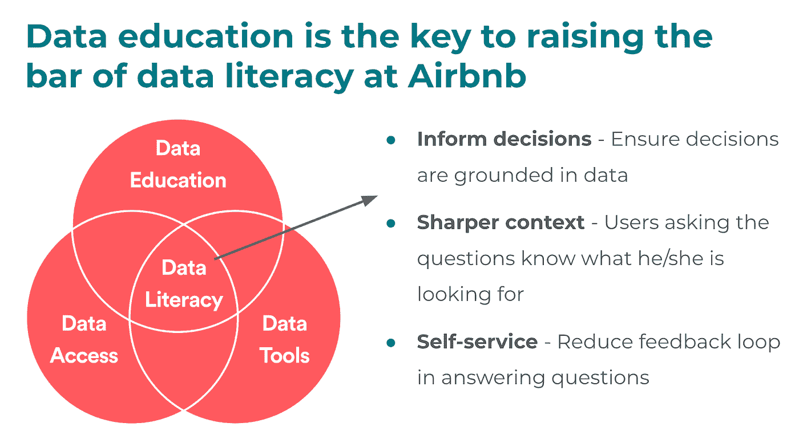
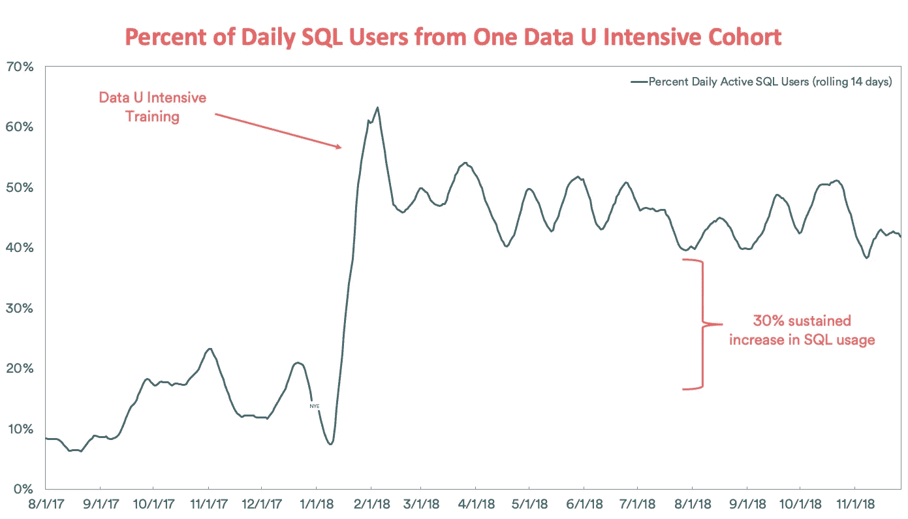

# Airbnb 如何通过“数据密集型”培训提高数据素养

> 原文：<https://medium.com/airbnb-engineering/how-airbnb-is-boosting-data-literacy-with-data-u-intensive-training-a6399dd741a2?source=collection_archive---------3----------------------->

自从我们引入 Airbnb 的[数据大学](/airbnb-engineering/how-airbnb-democratizes-data-science-with-data-university-3eccc71e073a)以来，这个项目一直在继续发展壮大。一个改进是增加了针对团队的培训，内容针对该团队的工作。在本帖中，我们将描述这一新增功能的影响，以及在实现过程中吸取的经验教训。

# 什么是数据大学？

数据大学是 Airbnb 的动态数据教育项目，其愿景是**让每位员工都能做出基于数据的决策**。Airbnb 的 55 名志愿者组成了一个跨越数据科学和工程组织的教师队伍，每年在全球教授 20 多门独特的课程。如今，我们提供三个级别的课程，从为 Airbnb 的数据知情决策提供基础的 100 级系列，到涵盖大规模数据的 300 级系列，包括 Airbnb 的端到端机器学习平台 [Bighead](https://twimlai.com/twiml-talk-198-bighead-airbnbs-machine-learning-platform-with-atul-kale/) 和 Airbnb 的自动化数据管道工具 [Airflow](/airbnb-engineering/airflow-a-workflow-management-platform-46318b977fd8) 。自 2016 年创办以来，已教授超过 400 门课程，课程注册人数超过 6000 人！Airbnb 的 4000 多名员工中，许多人都报名参加了不止一门课程。*所有课程都使用匿名数据教授，以确保用户隐私和安全。*

# 尝试新的模式

正如数字所表明的那样，Data University 现有的项目结构已经成功地培训了许多员工，并提升了他们的数据素养。通常，员工可以报名参加每月提供的各种课程，并按照自己的进度完成课程。例如，如果他们想专注于 SQL，他们可以在一个月内参加三个 SQL 课程，或者分散到几个月内，每个月参加一个课程。每个员工都可以定制自己的学习路径！

然而，随着该计划的扩展，我们发现了该计划的两个不足之处:

1.  **根据独立业务部门的特定数据集和需求定制培训内容。**例如，Airbnb 的体验业务部门有自己独特的一组数据，因此使用适用于该部门日常工作的数据定制数据培训，使学生更容易掌握材料。
2.  **同队培养一大群数据冠军。**例如，一个大型的全球运营团队有许多特别的数据请求，他们将受益于更多的数据专家来补充嵌入式数据科学团队。

为了解决这些问题，我们试行了一个数据大学的**团队专用版本，** Data U Intensive，由与每个团队合作的嵌入式数据科学家教授。该计划涵盖了几个数据基础类，SQL 和超集类，并包括每个团队特定的数据表和仪表板的概述。这些课程在 2-3 天内以压缩的形式授课，这使得参与者可以明确他们的时间表，只专注于数据大学。连续组织课程也让其他办公室的同事有机会飞过来参加。

[Pierre Lafortune](https://www.linkedin.com/in/pierrelafortune/) teaching Data U Intensive for the Experiences Team in Paris, France

# 三重影响

**对团队的好处:**

训练一个现有的、有凝聚力的团队为参与者创造了一个更舒适的环境，增加了他们的信心。这使得课堂更加活跃，参与者在每堂课之前、之中和之后都进行了更多与数据相关的对话。使用特定于团队的数据和仪表板来解决团队相关问题，也有助于参与者设想如何在日常工作中使用数据，并激励他们关注这些材料。

来自数据密集型参与者的反馈:

> “Data U Intensive 创造了一个安全的提问空间，因为我正在与我已经认识的队友和导师一起学习。我知道**我和我的队友是从同一个地方开始的，所以我很乐意提问并要求澄清**。我以前用过 Data U，但它从未真正适合我。与来自相似背景和相似职能的人共处一室很有帮助。”

此外，这也是团队领导展示对员工职业发展投资的绝佳方式。为整个团队提供量身定制的数据培训表明，我们致力于帮助员工提高技能，让他们能够做出数据驱动的决策。

**对数据科学的好处:**

当数据科学家支持的团队经历数据密集型任务时，他们发现临时请求减少了 50%。当业务合作伙伴可以使用基本的 SQL 查询和仪表板回答自己的问题时，数据科学家就可以腾出大量时间来从事影响更大的项目，而这些项目对于合作伙伴团队的战略和方向至关重要。

另外，这是数据科学家授课的绝佳机会！

**对业务的好处:**

随着越来越多的人熟悉数据的生成、使用和应用，团队越来越能够做出基于数据的决策。培训后，这些团队的员工建立了自己的仪表板，并使用数据开发了本地化的解决方案，而数据科学永远不会有带宽来创建这些解决方案。该计划的参与者感到自己有能力探索数据，并使用数据工具开始衡量他们的工作，这增加了他们的影响和规模。

到目前为止，我们已经在两个主要团队中试验了这种形式:经验和公共政策。在 Airbnb 数据科学主管 Elena Grewal 进行的后续调查中，这两个团队都在 Airbnb 数据驱动团队中位列****(仅次于数据科学和产品经理！).每个团队都有超过 80%的成员定期查看数据和使用数据工具，大多数人表示他们现在使用数据进行大多数决策。****

****这两个团队在创建自助服务数据仪表板方面投入了大量资金，并在 Data U 密集型培训期间审查了这些工具。处理经验和公共政策的小型数据科学团队能够通过对数据工具和培训进行优先排序来扩展数据驱动的决策。****

********

# ****是什么让数据密集型企业取得了成功？****

****这两个团队之间有一些相似之处，我们认为这有助于这种模式的成功。首先，相对于他们服务的大量利益相关者，每个团队都有一个小的数据科学团队。在 Airbnb，这种情况经常发生在全球运营团队，他们还面临着时区变化导致工作时间重叠有限的额外挑战。同时在同一个团队中训练许多人，可以让队友在课程结束后继续一起练习和学习，并互相帮助。****

****其次，每个团队的领导层都致力于将数据培训作为优先事项。这是这种形式成功的关键。领导层必须支持团队全力投入和参与该计划，使其取得成功，因为这是一项为期数天的承诺。****

****最后，这些团队通过使用团队特定数据的团队相关例子学习得最好。这样做让班级感到有归属感，并让参与者在一周内保持参与。关注员工在回到正常岗位后如何立即使用这些工具和技能，让他们在培训结束后能够坚持下去。****

****我们希望我们的经验可以帮助其他公司扩大数据教育，使数据访问民主化，提高每个人的数据素养。****

********

****[Mitra Akhtari](https://twitter.com/mitra_akh) teaching Data U Intensive for the Public Policy Team in New York City, New York****

****特别感谢 [Mitra Akhtari](https://twitter.com/mitra_akh) 、 [Ellen Huynh](https://www.linkedin.com/in/ellen-huynh/) 、 [Pauline Glikman](https://www.linkedin.com/in/pauline-glikman-44b7bb16/) 和 [Pierre Lafortune](https://www.linkedin.com/in/pierrelafortune/) 教授数据密集型课程，并感谢你们对这篇文章的帮助！****