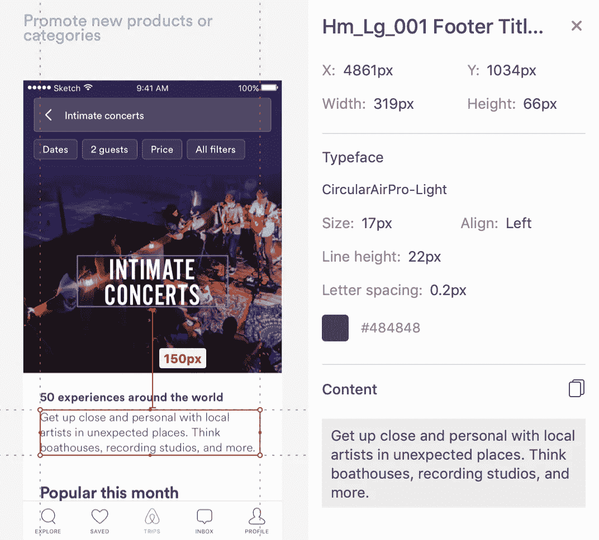
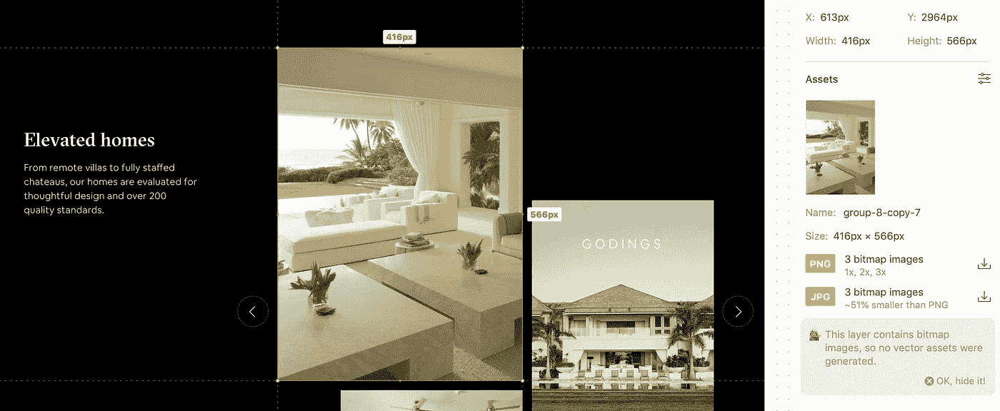

# Airbnb 如何通过 GraphQL 和 Apollo 以 10 倍的速度发展

> 原文：<https://medium.com/airbnb-engineering/how-airbnb-is-moving-10x-faster-at-scale-with-graphql-and-apollo-aa4ec92d69e2?source=collection_archive---------0----------------------->

## 揭秘我的 GraphQL 峰会演讲

上个月，我有机会在 GraphQL 峰会上发表了一篇涉及大量实时编码的演讲(如果您赶时间，主题介绍将在 6:00 分钟后结束！).看看这个:

从我在随后几天的会议中收集到的反馈来看，好消息是人们显然很高兴看到产品被如此快速地制造出来。人们带着对未来的憧憬离开了(任务完成！).坏消息是，我没有时间解释这一切是如何工作的，许多人以为 Airbnb 已经投入了多年的工程师时间来构建无懈可击的基础设施来支持 GraphQL。

事实与真相相去甚远！事实上，演示中 90%的繁重工作都是由 Apollo 的 CLI 工具管理的。

所以我承诺通过写一篇博客解释我们在做什么来补救这种情况:

事实上，我希望在这里包括一些我们用来实现这种开发体验的代码，您将会看到，在开源的 Apollo 工具和您的一点努力之间，将所有这些连接起来实际上是一组可管理的任务。

同样值得注意的是，我们还处于 GraphQL 之旅的早期。还有很多东西需要学习，例如，我们讨论的通过 CI 管理的一些东西仍在开发中。随着我们了解的越来越多，我会继续更新这篇文章，这样我们最好的知识就会被反映出来。

## 后端驱动 UI 的 GraphQL 联合

演讲开始时产品的现有状态预先假定我们已经建立了一个系统，在这个系统中，一个非常动态的页面是基于一个查询构建的，这个查询将返回一组可能的“部分”这些部分是响应性的，并且完整地定义了 UI。

管理它的中心文件是一个生成的文件(稍后，我们将讨论如何生成它),看起来像这样:

由于可能的部分列表相当大(今天大约有 50 个搜索部分)，它还假设我们有一个合理的机制来通过服务器渲染来延迟加载组件，这是另一篇文章的主题。可以说，我们不需要将所有可能的部分打包成一个巨大的包来预先考虑所有的事情。

每个部分组件都定义了自己的查询片段，与部分的组件代码放在一起。看起来像这样:

这是 Airbnb 后端驱动 UI 的总体思路。它被用在很多地方，包括搜索、旅行计划、主机工具和各种登录页面。我们以此为起点，然后在演示中展示如何(1)制作和更新现有部分，以及(2)添加新部分。

## 使用 Playground 探索您的模式

在构建产品时，您希望能够探索您的模式，发现字段名并测试对实时开发数据的潜在查询。我们今天通过 [GraphQL 操场](https://github.com/prisma/graphql-playground)、我们在 [Prisma](https://www.prisma.io/) 的朋友们的工作实现了这个目标。这些工具是阿波罗服务器的标准配置。

在我们的例子中，后端服务主要是用 Java 编写的，它们的模式由我们的 Apollo Server 缝合在一起，我们称之为 Niobe。目前，由于 Apollo Gateway 和 Schema Composition 还没有上线，我们所有的后端服务都是按服务命名的。这就是为什么探索操场要从服务名称列表开始。树的下一层是服务方法。在这种情况下，`getJourney()`。正如我在演讲中提到的，模式合成，一个由阿波罗团队提出的新概念，应该能帮助我们建立一个更合理的模式模型。在接下来的几个月里会有更多。

## 用阿波罗插件在 VS 代码中查看您的模式

我想在演讲中展示的乐趣之一是，在构建我们的产品时，有这么多有用的工具触手可及。这包括访问 VS 代码中的 Git，以及运行经常需要的命令的集成终端和任务。

当然，我们也为 GraphQL 和 Apollo 展示了一些有趣的东西！大多数人没有看到的部分是新的[阿波罗 GraphQL VS 代码扩展](https://marketplace.visualstudio.com/items?itemName=apollographql.vscode-apollo)。没有必要我从他们的营销网站上复制所有有趣的功能(有很多！)，但我将详细说明一个特性:**模式标签**。

如果您要对正在处理的模式进行 lint 查询，您总是会得到“哪个模式”的决定默认的可能是你的生产模式(“当前的”，按照惯例)，但是正如我们在演示中讨论的，如果你需要迭代和探索新的想法，你需要灵活地瞄准一个临时的模式。

由于我们使用的是 Apollo Engine，使用标签发布多个模式让我们有了这种灵活性，并且多个工程师可以在一个提议的模式上进行协作。一旦为服务提议的模式改变被上游合并，并且这些改变在当前的生产模式中自然地向下流动，我们就可以在 VS 代码中翻转回“当前”模式。很酷。

## 自动生成类型

Codegen 的目标是从强类型安全中获益，而不必手动创建 TypeScript 类型或 React PropTypes。这很重要，因为我们的查询片段分布在使用它们的组件中。这就是为什么对查询片段进行一行更改会导致 6–7 个文件被更新；因为相同的片段出现在查询层次结构中的许多地方——与组件层次结构并行。

这部分只是 Apollo CLI 功能。我们正在开发一个特别奇特的文件监视器(名字叫做“**索隆**”，很明显)，但是现在根据需要运行`apollo client:codegen --target=typescript --watch --queries=frontend/luxury-guest/**/*.{ts,tsx}`一点也不麻烦。能够在 rebases 期间关闭 codegen 是很好的，我通常会将我的范围过滤到我正在工作的项目。

我最喜欢的部分是，因为我们将片段与组件放在一起，所以当我们在组件层次结构中向上移动时，更改单个文件会导致查询中的许多文件被更新。这意味着在靠近 route 组件的树的更高处，我们可以看到统一的查询以及它可以通过的所有各种类型的数据。

一点魔法都没有。只有阿波罗 CLI。

## 用故事书隔离你的用户界面变化

我们用来编辑 UI 的工具是 [**故事书**](https://storybook.js.org/) 。这是一个完美的地方，以确保您的工作符合断点像素的设计。你可以快速热模块重载和一些复选框来启用/禁用浏览器功能，如 Flexbox。

我对 Storybook 应用的唯一技巧是用我们从 API 中提取的模拟数据加载故事。如果您的模拟数据确实涵盖了您的 UI 的所有各种可能的状态，那么您就可以开始了。除此之外，如果您想要考虑其他状态，比如加载或错误状态，您可以手动添加它们。

这是故事书的症结所在。这个文件完全由 Yeoman 生成(将在下面讨论)，默认情况下，它提供了 Alps Journey 中的示例。`getSectionsFromJourney()`只过滤部分。

您会注意到的另一个漏洞是，我添加了一对 div 来垂直地阻挡我的组件，因为 Storybook 在组件周围呈现空白。这对于带边框的按钮或用户界面来说很好，但是很难准确地说出组件的开始和结束位置，所以我把它们放在了那里。

既然我们在讨论所有这些神奇的工具是如何很好地协同工作来帮助你提高工作效率的，我能不能说与 *Zeplin 或 Figma 一起使用 UI，与 Storybook* 一起工作是一件多么愉快的事情。以这种抽象的方式深入研究 UI，可以一次一个断点地消除这个疯狂世界的所有混乱，在那个安静的领域中，每次都可以精确到像素。

## 自动检索模拟数据

为了给 Storybook 和我们的单元测试提供真实的模拟数据，我们希望直接从我们的共享开发环境中提取模拟数据。与 codegen 一样，即使查询片段中的一个小变化也会触发模拟数据中的许多小变化。这里，类似地，困难的部分完全由 Apollo CLI 解决，您可以立即用自己的代码将它缝合在一起。

第一步只是运行`apollo client:extract frontend/luxury-guest/apollo-manifest.json`，您将拥有一个清单文件，其中包含来自您的产品代码的所有查询。您可能注意到的一件事是，该命令是这个“豪华客人”项目的命名空间，因为我不想刷新所有可能的团队的所有可能的模拟数据。

这个命令很可爱，因为我的查询都分布在许多 TypeScript 文件中，但是这个命令将在源代码上执行并组合所有的导入。我不必在 babel/webpack 输出上运行它。

我们随后添加的作品短小而机械:

我们目前正与 Apollo 团队合作，将这一逻辑提取到 Apollo CLI 中。我可以想象一个世界，在那里你唯一需要指定的是你想要的例子的数组，把它们和一个查询放在一个文件夹中会自动按需编码模拟。想象一下这样指定您需要的模拟:

如果你对如何使用它有一些想法，请不要犹豫联系我们！

## 使用 Happo 将屏幕截图测试添加到代码审查中

[**Happo**](https://happo.io/) 是直截了当的救命恩人。这是我用过的唯一一个截图测试工具，所以我还没有成熟到可以和其他工具进行比较，如果有的话，但是基本的想法是你推送代码，它会关闭并渲染你的 PR 中的所有组件，与 master 上的版本进行比较。

这意味着如果你编辑一个像`<Input />`这样的组件，它会显示对使用输入的组件的影响，包括你不小心修改的*搜索栏*。它。是。太棒了。

有多少次你认为你的改变被包含了，却发现十个其他团队开始使用你构建的东西，而你的改变破坏了十个中的三个？没有 Happo，你可能不知道。

直到最近，Happo 的唯一缺点是我们的故事书变体(截图测试过程的输入)并不总是充分反映可靠的数据。既然 Storybook 利用了 API 数据，我们可以更有信心了。另外，正如我们的演示所探索的，它是自动的。如果您向查询中添加一个字段，然后添加组件，Happo 会自动将差异发布到您的 PR 中，让坐在您旁边的工程师、设计师和产品经理看到您所做更改的视觉效果。

## 用约曼生成新文件

如果您需要多次搭建一堆文件，您应该构建一个生成器。它会把你变成你的军队。听完演讲后，我震惊地发现，很多人以为我们有一支基础设施工程师队伍在为我在视频中展示的东西工作。除了 AST 转换(我将在下面介绍)，这只是三个模板文件和这个小东西:

你可以想象在 2-3 分钟内为一个只持续一个下午的项目创建类似上面的东西。约曼发电机不需要等待基础设施团队或大规模的多季度项目。

## 使用 AST Explorer 了解如何编辑现有文件

对于约曼生成器来说，棘手的部分是编辑*现有的*文件。但是有了抽象语法树(AST)转换，这个任务就简单多了。

下面是我们如何实现 Sections.tsx 的预期转换，我们将在本文的顶部讨论:

`_updateFile`是使用 Babel 应用 AST 转换的样板文件。作品的关键是`_addToSectionMapping`，你看:

1.  在程序级别，它插入一个新的导入声明。
2.  在两个对象表达式中，具有多个属性的一个是我们的部分映射，我们将在那里插入一个键/值对。
3.  带标签的模板文字是我们的 gql 片段，我们想在那里插入两行，第一行是成员表达式，第二行是一组“准”表达式中的一个。(嗯……)

如果执行转换的代码看起来令人生畏，我只能说对我来说也是如此。在写这个转换之前，我没有遇到过准，公平地说，我发现它们有点令人困惑。

好消息是，AST Explorer 使得解决这类问题变得很容易。这是[在探索者](https://astexplorer.net/#/gist/e675b0068a8b74098c213b8065d7583c/dac289f77e481e68fdff052392aa789ee05d4e78)中同样的转变。在这四个窗格中，左上角包含源文件，右上角包含已解析的树，左下角包含建议的转换，右下角包含转换后的结果。

查看经过解析的树会立即告诉您用 Babel 术语编写的代码的结构(您知道这是一个带标记的模板文字，对吗？)，这就为您提供了您所需要的东西来弄清楚如何应用转换并测试它们。

AST 转换在 Codemods 中也起着至关重要的作用。请查看我的朋友[乔·伦乔尼](/@lencioni)关于此事的帖子。

## 从 Zeplin 或 Figma 中提取模拟内容

Zeplin 和 Figma 都允许工程师直接提取内容以促进产品开发。

在上图的例子中，提取整个段落的副本就像在 Zeplin 中选择内容并点击侧边栏内容部分的“复制”图标一样简单。

在 Zeplin 的情况下，可以通过选择并点击侧边栏资产部分的“下载”图标来提取图像。

## 自动照片处理…通过建立媒体松鼠？

照片处理管道肯定是 Airbnb 特有的东西。我想强调的部分实际上是[布里干酪](https://twitter.com/briebunge?lang=en)在创建“媒体松鼠”来包装现有 API 端点方面的贡献。没有 Media Squirrel，我们无法将机器上的原始图像转换为包含图像处理管道中的内容的 JSON 对象，更不用说使用静态 URL 作为图像源了。

媒体松鼠的建议是，当你需要一些很多人都需要的常规工具时，不要犹豫，创建一个每个人都可以使用的有用工具。这是 Airbnb 滑稽文化的一部分，也是我非常珍视的一个习惯。

## 在 Apollo 服务器中截取模式和数据

就最终的 API 而言，这一部分仍在进行中。我们想要做的关键事情是(a)截取一个远程模式并修改它，以及(b)截取一个远程响应并修改它。原因是，虽然远程服务是事实的来源，但我们希望能够在上游服务中的模式变更等正式化之前迭代产品。

这是演示中唯一的地方，我们得到了一点厚脸皮，并与 API 的自由。对于 Apollo 近期路线图中的模式组合和分布式执行，我们不想猜测每件事将如何精确地工作，所以我们只是提出了基本的概念。

实际上，模式组合应该让我们能够定义一个类型，并按照以下方式做一些事情:

注意:在这种情况下，模式知道 EditorialContent 是一个联合，因此通过扩展它，我们实际上是要求它知道另一种可能的类型。

修改 Berzerker 响应的代码如下所示:

这个想法是对你在 [Apollo 服务器模拟 API](https://www.apollographql.com/docs/apollo-server/features/mocking.html#Using-MockList-in-resolvers) 中发现的东西的一种发挥。这里，模拟并没有填补 API 中的任何空白，而是实际上保留了所有空白，并根据您提供的内容主动覆盖内容。这更有可能是我们想要的那种嘲弄的 API。

# 最后

比这些技巧中的任何一个都更重要的是更广泛的一点，即异常快速地移动并尽可能多地自动化该过程，尤其是围绕样板文件、类型和文件创建。

Apollo CLI 负责所有特定于 Apollo 的领域，这使您能够以对您的用例有意义的方式连接这些实用程序。

其中一些用例，比如类型的 codegen，是通用的，并且最终成为你的整体基础设施的一部分。但是它们中的许多就像你用它们制造的部件一样是一次性的。没有一个是产品工程师在等待基础设施工程师为他们做些什么！

所以我希望这篇文章能解释你在视频中所看到的，我也希望你有机会在日常工作中应用这些技巧。

*很自然，如果你喜欢阅读这本书，并想以同样的方式度过你的日子，我们一直在寻找有才华、有好奇心的人加入到* [*团队*](https://www.airbnb.com/careers/departments/engineering) *。或者，如果你只是想谈谈工作，可以随时在 twitter 上联系我们。*