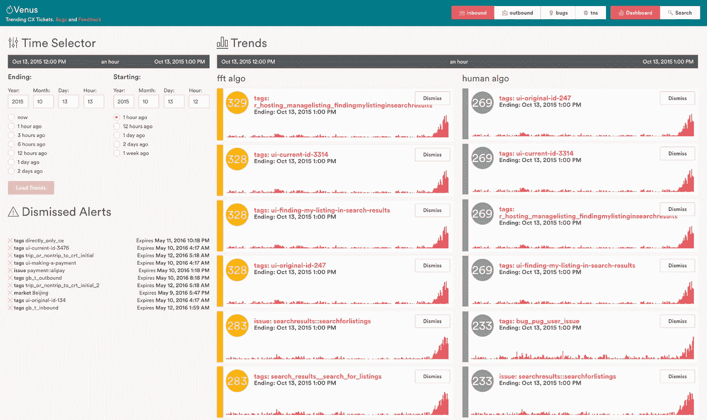
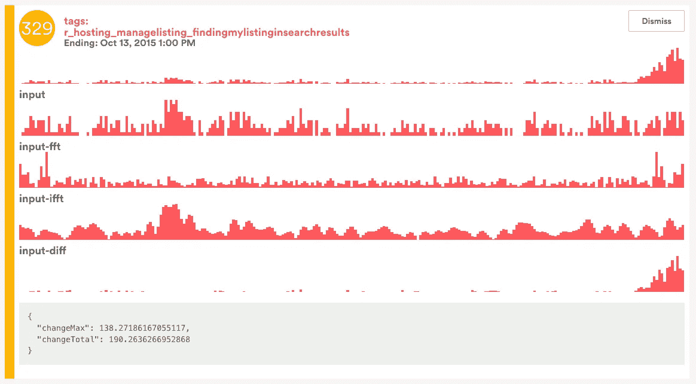
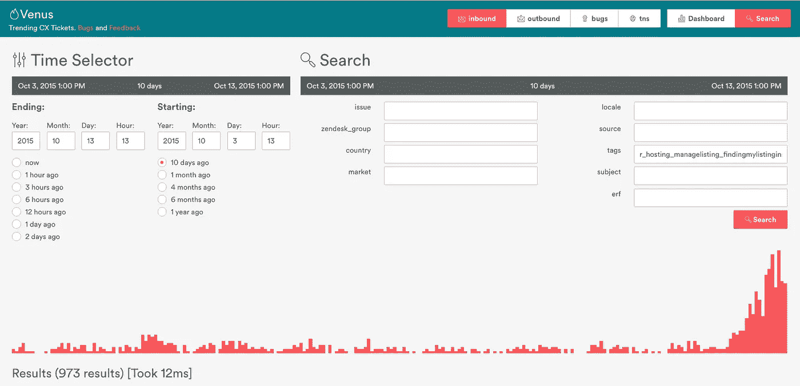

# Airbnb 如何大规模监控客户问题

> 原文：<https://medium.com/airbnb-engineering/how-airbnb-manages-to-monitor-customer-issues-at-scale-b883301ca461?source=collection_archive---------0----------------------->

由[阿尔文 Sng](https://www.linkedin.com/in/alvinsng) & [西蒙哈契](https://www.linkedin.com/in/simon-hachey-680b8391)

我们的故事从一个问题开始:

> *你现在如何从你的客户那里发现新的、不断增长的问题？*

对于一个典型的人来说，这似乎是一个每个公司都应该能够回答的非常简单的问题。然而，我们发现事情没那么简单。

当然，我们的数据库中存储了客户问题的数据，但是我们没有很好的方法来回答这个问题。我们没有办法发现正在出现的趋势性问题，并且我们缺乏实时查看这些问题的能力。我们发现的大多数趋势都是在特定的基础上发现的，这意味着当我们发现一个趋势时，采取行动修复它已经太晚了。考虑到这一点，我们开始设计一个解决方案。

提供一些背景资料，自 Airbnb 成立以来，我们已经接待了 8000 万名游客，而且我们还在快速增长。随着我们的快速发展，我们的工程团队正在寻找解决新出现的挑战性问题的方法。Airbnb 的运营很大一部分依赖于客户服务代理来处理我们的主人和客人提出的大量问题——查看由 [Emre Ozdemir](https://medium.com/u/60677e7494c8?source=post_page-----b883301ca461--------------------------------) 撰写的[上一篇文章](/airbnb-engineering/life-of-a-ticket-903790ed5d53#.736k8ja30)。我们面临的挑战之一是理解如此大量的票证，并实时检测趋势或意外问题。我们需要一种方法来监控并在我们看到越来越多的人就某个问题打电话给我们时发出警报。

# 我们建造的东西

我们构建了一个基于 web 的服务，它可以计算我们所有票据的趋势，并直观地显示历史上任何给定时间的主要趋势。它考虑票据的几个不同属性，如问题类型、浏览器版本、用户国家/地区、主题行、来源等。利用这些数据，它分析所有票据中每个属性的时间序列，并使用算法对它们进行排序，以检测峰值或趋势。我们实际上同时运行两种不同的算法来进行改进，同时仍然有一个先前的基线来进行比较。

# 我们是如何做到的

**基础设施**

达到这一规模所需的基础设施包括几个不同的部分。首先，我们有一个数据存储，门票将在这里存储，并为我们的数据处理快速查询。我们进行了弹性搜索来处理这个问题。接下来，我们需要运行一个 web 服务，该服务可以接收新票据数据的请求。这成为我们的 Node.js 应用程序，为我们的 web 应用程序提供服务，并处理传入的票证。

我们还运行了一个独立的作业实例，该实例不断计算票证趋势。它将向 Elasticsearch 实例查询机票数据，并将结果存储到 Redis 实例中。Redis 为我们的 Node.js 应用程序维护了一个票证趋势结果缓存，以便在 web 上呈现。整个前端都内置在 React 中，因此很容易开发丰富的 UI 来显示数据。

**数据存储器**

我们决定在创建门票时，将所有门票实时流入 Elasticsearch 集群。然后，我们定期运行的批处理作业会使用这些数据来计算票证趋势。将门票存储在 Elasticsearch 中使得在我们的数据集上扩展和执行聚集查询变得容易。票证的字段根据存储的数据类型进行索引。

**工作人员**

我们的工作人员的角色是查询我们的数据存储并计算每组票据的趋势分数。我们在一个独立于 web workers 的实例上这样做，因为我们不希望长时间的处理延迟了为新票据数据的传入 API 请求提供服务的延迟。产生的趋势数据然后被发送到 Redis，它允许我们的其他 web 实例获取这些数据。

**我们如何发现趋势**

趋势检测是实现这一切的核心。我们首先在 Elasticsearch 中运行一个多重搜索查询，以获得一个时间序列，其中包含我们希望考虑趋势的每个门票属性的门票计数，在我们希望考虑的时间结束。然后，我们将我们的评分模型应用于每个时间序列，对结果进行排序，并返回所有高于最小阈值的趋势属性。这些结果成为那个时期的趋势。

评分模型的工作是调整周期性(例如，计数的每日波动)，去除噪声并平滑图表，然后决定是否有峰值。为了平滑和调整周期性趋势，我们使用傅立叶变换将图形变换到频域，找到峰值频率，并丢弃除了峰值附近频带中的频率之外的所有其他频率。这产生了我们的票计数的周期分量的平滑图(如输入-ifft 所示)。从我们的原始图表中减去这个，我们可以得到我们的图表偏离其期望值的估计值。最终分数是通过查看最终调整图中的一些因素来确定的，如最大值和总票证量随时间的变化。

在计算了每小时每个票证字段的所有分数后，我们将存储的最高分数排序到 Redis 中，供前端使用。

**网络用户界面**

一旦我们的计算数据在 Redis 中，我们显示它变得非常快。我们增加了查看任何时间点的过去趋势以及查看更长时间范围内最热门项目的能力。

**故事**

自从发布以来，我们的仪表板已经在快速检测问题方面产生了影响。例如，我们注意到用户报告说他们在搜索中看不到他们的列表。新用户在第一次使用该平台时经常会遇到这类问题，所以我们的客户服务代理并没有太在意。此外，由于这不是一个没有返回列表的完全失败(而是一个微妙的边缘情况)，所以对于工程团队来说，这不是一个直接的问题。但是，因为我们看到这是一个票证高峰，所以我们确信存在一个问题，需要解决。我们的工程师很快解决了这个问题，过了一会儿，我们观察到我们的工具中相应的标签下降，向我们保证这个问题实际上已经解决了。如果没有这个仪表板，这个事件可能会持续几天甚至几周，给我们的代理和用户带来更大的压力。

**我们学到了什么**

我们在 Airbnb 使用这个仪表盘已经超过六个月了，发现了一些原本很难发现的东西。我们已经能够捕捉许多峰值，从细微的错误到可能变大的小问题。我们的票证控制面板不会取代我们现有的停机和系统错误监控系统，而是用作问题的总括。

这个新的票务监控系统已经被证明是一个非常有价值的工具，我们相信每个大公司都应该拥有它。它通过优先解决最紧迫的问题来减少用户的挫折感。我们估计，这个票证控制面板已经能够将我们的总票证量减少 3%。有时候，看到一个两人的黑客马拉松项目最终如何为 Airbnb 客户节省大量时间，并让事情迅速回到正轨，真是疯狂。

如果您有任何问题或意见，请在下面的空白处留下。

## 在 airbnb.io 查看我们所有的开源项目，并在 Twitter 上关注我们:[@ Airbnb eng](https://twitter.com/AirbnbEng)+[@ Airbnb data](https://twitter.com/AirbnbData)