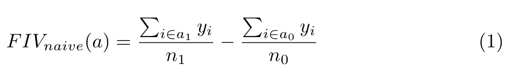
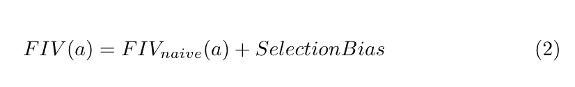
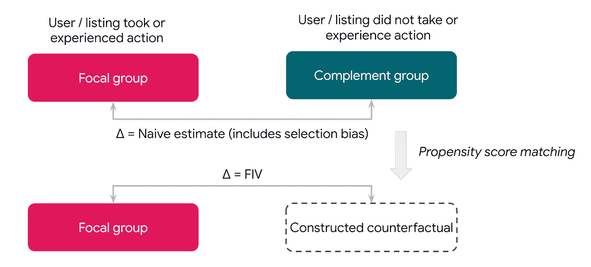
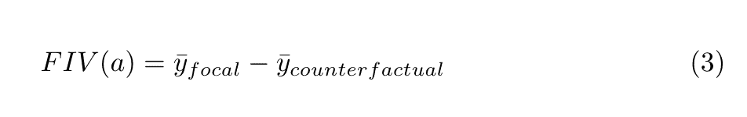
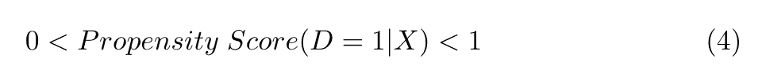
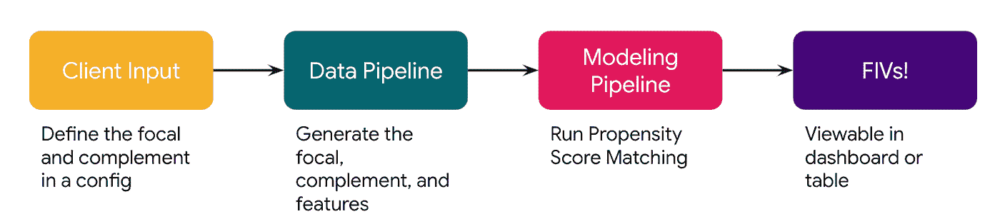
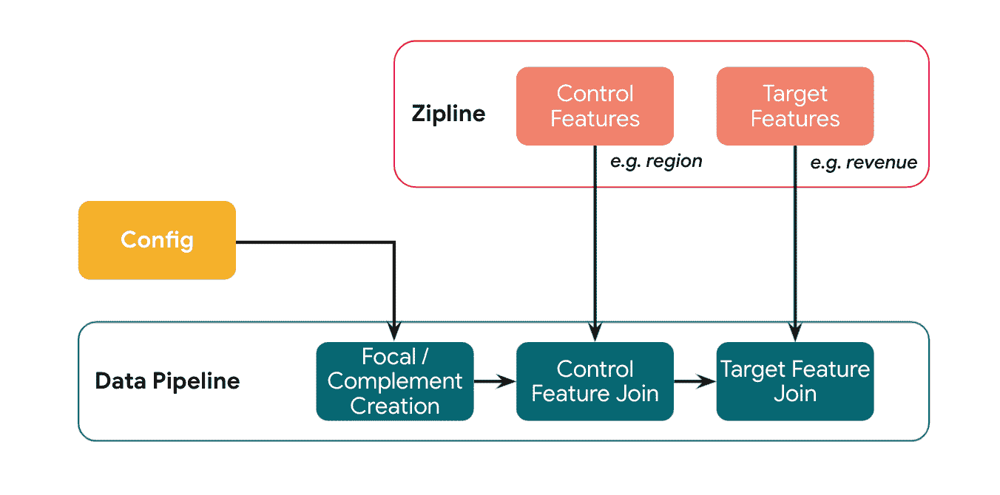
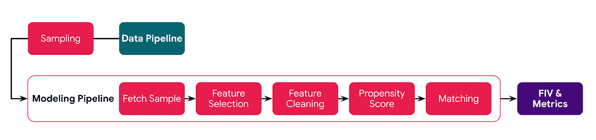
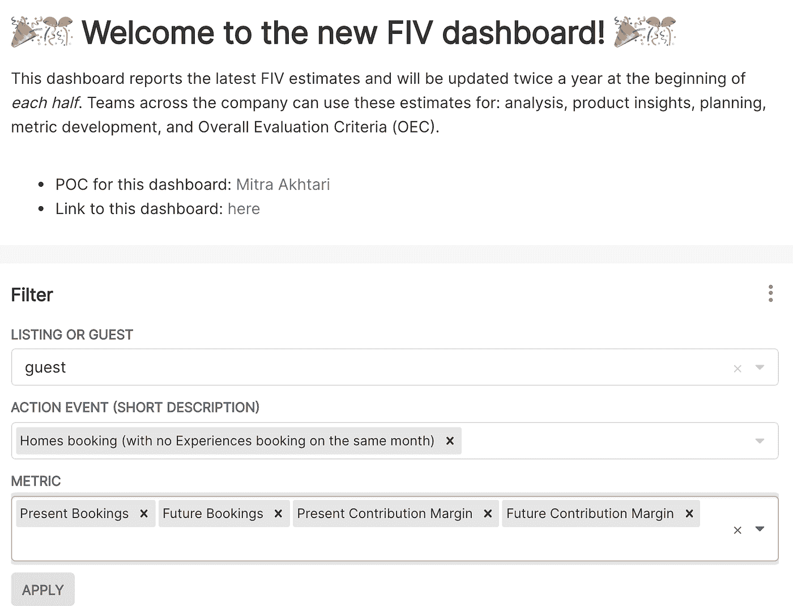

# Airbnb 如何衡量未来价值以标准化权衡

> 原文：<https://medium.com/airbnb-engineering/how-airbnb-measures-future-value-to-standardize-tradeoffs-3aa99a941ba5?source=collection_archive---------0----------------------->

## 倾向得分匹配模型推动我们如何优化长期决策

由[麦卓](https://www.linkedin.com/in/mitra-akhtari/)，[珍妮](https://www.linkedin.com/in/jennychen96/)，[阿米利亚](https://www.linkedin.com/in/amelialemionet)，[丹阮](https://www.linkedin.com/in/dan-nguyen-b8817a34/)，[哈桑奥贝德](https://www.linkedin.com/in/hassan-obeid/)，[云山朱](https://www.linkedin.com/in/yunshanz/)

在 Airbnb，我们有一个[愿景](https://news.airbnb.com/brian-cheskys-open-letter-to-the-airbnb-community-about-building-a-21st-century-company/)通过在无限的时间范围内运营并平衡所有利益相关者的利益，建立一个 21 世纪的公司。为了有效地做到这一点，我们需要能够用一种通用的货币来比较在我们的平台上发生的行为和事件的短期和长期价值。这些动作可以是客人预订房间或主人将便利设施添加到他们的列表中，这里仅举两个例子。

虽然随机实验测量了其中一些行为的初始影响，但由于道德、法律或用户体验方面的考虑，其他行为(如取消)很难使用实验来评估。实验中的指标也很难解释，尤其是当实验影响相反的指标时(例如，预订量增加，但取消量也增加)。此外，不管我们是否有能力评估 A/B 测试的因果影响，[实验通常只运行很短的时间](/airbnb-engineering/experiments-at-airbnb-e2db3abf39e7)，不允许我们量化长期的影响。

那么我们建造了什么来解决这个问题呢？

# **引入未来增量价值(FIV)**

我们对发生在 Airbnb 上的行为或事件的长期因果效应或“未来增量价值”(FIV)感兴趣。我们将“长期”定义为 1 年，尽管我们的框架可以将时间段调整为短至 30 天或长至 2 年。

举一个具体的例子，假设我们想估计一个客人预订的长期影响。将一个月内 *n1* 预约用户数记为 *i ∈a1* ，将该时间段内 *n0* 未预约用户数记为 *i∈a0* 。在接下来的一年中，这些用户中的每一个都产生由 *y* 表示的收入(或任何其他感兴趣的结果)。计算预订影响的简单方法是简单地查看预订用户和未预订用户之间的平均差异:

然而，这两类用户是非常不同的:那些预订的人是“选择”这样做的。这种选择偏差掩盖了行动的真正因果关系，*【FIV(a)】*。

我们的目标是从天真估计中排除偏倚，以识别 *FIV(a)* 。

# **FIV 背后的科学**

为了在估计一个动作的 FIV 时最小化选择偏差，我们需要比较来自用户或列表的观察，这些用户或列表除了他们是否采取或经历了一个动作之外，在各方面都是相似的。我们为这个问题选择的记录良好的准实验方法是[倾向得分匹配](https://academic.oup.com/biomet/article/70/1/41/240879?login=true) (PSM)。我们首先将用户或列表分成两组:在给定时间范围内采取行动的用户的观察(“焦点”)和没有采取行动的用户的观察(“补充”)。使用 PSM，我们构建了一个“反事实”组，一个尽可能匹配焦点特征的补充子集，只是这些用户或列表没有采取行动。假设是“分配”成焦点对反事实和随机一样好。

*Figure 1\. Overview of methodology behind FIV*

我们从朴素方法中消除偏差的具体步骤是:

1.  *生成倾向得分:*使用一组描述用户或列表的属性(例如，过去搜索的次数)的预处理或控制特征，我们构建二进制的、基于树的分类器来预测用户或列表采取行动的概率。这里的输出是每个观察的倾向分数。
2.  *为共同支持进行修整:*我们从数据集中移除任何在倾向得分方面没有“匹配双胞胎”的观察结果。在将倾向分数的分布分成桶之后，我们丢弃桶中的观察值，其中焦点或补充几乎没有代表性。
3.  *匹配相似观察:*为了创建反事实，我们使用倾向得分来将焦点中的每个观察匹配到补充中的对应部分。可以使用各种[匹配策略](https://en.wikipedia.org/wiki/Nearest_neighbor_search)，例如在箱中或通过最近邻居进行匹配。
4.  *结果:*为了得到 FIV，我们计算焦点中结果或目标特征的平均值减去反事实中的平均值。

## 估价

在有监督的机器学习问题中，随着更多的数据变得可用并且未来的结果被实现，模型或者被验证或者被修改。FIV 的情况并非如此。上面的步骤给了我们一个行动的增量影响的估计，但是“真实的”增量影响从来没有被揭示。在这个世界上，我们如何评价我们的模式是否成功？

*共同支持度:*使用 PSM 进行因果推断的假设之一是“共同支持度”。

其中 *D = 1* 表示焦点组中的观察值，而 *X* 是控制特征。这种假设排除了“完全可预测性”的可能性，以保证具有相同 *X* 值的观察值具有属于两个组的正概率，因此可以匹配在一起以提供有效的比较。绘制焦点组和补充组的倾向分数的分布允许对该假设进行视觉检查。有趣的是，在使用 PSM 进行因果推断的情况下，高曲线下面积(AUC)是大多数预测模型的理想特征，这意味着该模型能够很好地区分焦点和补充观察，从而降低了我们的匹配质量。在这种情况下，我们评估这些控制特征是否是影响输出指标的混杂因素，并消除它们。

*匹配评估:*如果焦点中关键特征的分布与反事实中关键特征的分布紧密匹配，则认为观察结果“相似”。但是多近才算够近呢？为了对此进行量化，我们计算了三个指标来评估匹配的质量，如 [Rubin (2001)](http://sekhon.berkeley.edu/papers/other/Rubin2001.pdf) 所述。这些指标确定倾向得分和关键控制特征在焦点组和反事实组中是否有相似的分布。此外，我们目前正在研究是否应用额外的回归调整来纠正关键控制功能中任何剩余的不平衡。例如，在匹配阶段之后，我们可以运行回归，直接控制我们想要几乎精确匹配的关键特征。

过去的实验:在全公司范围内，我们进行了一些实验，以测试关于如何改善用户体验的各种假设，这些假设可能会带来积极的结果，如预订量的显著增加。由于实验中治疗分配的随机化，这些实验产生了客人进行没有选择偏差的预订的可能性的变化源。通过跟踪和比较这些实验的对照组和治疗组中的用户，我们观察到了“预订的长期影响”，我们可以将其与 FIV 对“客人预订”的估计进行比较。虽然 FIV 估计值是一个全球平均值，并且实验通常估计[局部平均治疗效果](https://www.aeaweb.org/articles?id=10.1257/000282806776157641)，我们仍然可以使用实验基准作为一个重要的肠道检查。

# **为 Airbnb 改编 FIV**

虽然 PSM 是一种成熟的因果推理方法，但我们还必须解决几个额外的挑战，包括 Airbnb 在双边市场中运营的事实。因此，FIV 平台必须支持从客户和列表角度进行计算。客人 FIV 根据客人在经历一个动作后在 Airbnb 上产生的活动来估计动作的影响，而列出 FIV 则是从列表的角度来看。我们仍在开发“主机级”FIV。这样做的一个挑战将是样本量:我们的独立主机比列表少。

为了得出一个行动的“平台”或总 FIV，由于重复计算，我们不能简单地将客人和列表 fiv 相加。我们简化了这个问题，只计算客户方或上市方的价值，这取决于我们认为哪些机制驱动了大部分长期影响。

我们双边市场的另一个特点是自相残杀，特别是在供应方面:如果一个房源获得了更多的预订，这种增长的一部分会从类似的房源中夺走预订。为了得出一项行动的真实“增量”值，我们根据我们对实验数据中同类相食程度的理解，将同类相食折减用于列出 FIV 估计值。

# **为 FIV 供电的平台**

FIV 是一个数据产品，它的客户是 Airbnb 内部的其他团队。我们提供易于使用的平台来组织、计算和分析大规模行动和 fiv。作为其中的一部分，我们构建了一些组件，这些组件接收来自客户端的输入，构建和存储必要的数据，生产 PSM 模型，计算 fiv，并输出结果。通过[气流](https://airflow.apache.org/docs/apache-airflow/2.0.1/)协调的机器对客户来说是不可见的，看起来如下:

*Figure 2\. Overview of FIV Platform*

## 客户输入

用例从与客户团队的对话开始，以理解他们期望的评估的业务上下文和技术组件。编制有效和有用的 FIV 估计数的一个组成部分是建立定义明确的重点小组和补充小组。此外，也有 FIV 工具不适用的情况，如观测数据有限(如新特征)或小组规模较小(如特定的漏斗或杠杆)。

客户提交定义其焦点和补充组的配置文件，这基本上是客户为了使用 FIV 平台所做的唯一任务。下面是“客人预订”的 FIV 配置:一个在我们网站上预订房屋的访客(焦点)与一个没有预订房屋的访客(补充)。

Figure 3\. Example of an FIV config that would be submitted by a client

*群组*确定了要考虑的最大用户集合(在这种情况下，Airbnb 平台的所有访问者)，其中一些被 *filter_query* 从考虑中移除(在这种情况下，也预订了 Airbnb 体验的用户被移除)。从剩余的用户集中， *action_event_query* 将用户分配给焦点，剩余的用户自动分配给补充用户。

在客户端的配置被审查之后，它被合并到 FIV 存储库中，并被自动接收到我们的管道中。我们为每个唯一的配置分配一个版本，以便在存储历史结果的同时允许迭代。

我们将平台设计得尽可能易于使用。不需要建模、推理或复杂编码的特殊知识。客户只需要提供一组查询来定义他们的组，剩下的就交给我们了！

## 数据管道

配置触发一个管道来构造焦点和补充，将它们与控制和目标特征连接起来，并将其存储在数据仓库中。控制特征稍后将作为倾向得分模型的输入，而目标特征将是计算 FIV 的结果。目标功能允许我们将 Airbnb 的不同上下文和部分的操作转换为“通用货币”。这是 FIV 的超能力之一！

利用 [Zipline](https://databricks.com/session/zipline-airbnbs-machine-learning-data-management-platform) 作为我们的功能管理系统，我们目前有大约 1000 个跨客人和列表的控制功能，如地区、取消或过去的搜索。虽然我们有能力根据众多目标特性计算 FIV，但我们有几个目标特性可以提供标准化的输出，如收入、成本和预订。

*Figure 4\. Steps to compute the raw data needed for FIV, after taking in client input*

这个版本的配置也用于自动回填，大大减少了人工错误和干预。对版本进行多重检查，以确保生成的数据始终与最新的配置保持一致。

## 建模管道

因为焦点组和补充组可能非常大，并且在建模中使用的成本很高，所以我们向下采样并使用总观察值的子集。为了考虑采样噪声，我们从数据管道的输出中提取多个样本，并将每个采样周期送入建模管道。采样提高了我们的 SLA，确保每个组都有相同的基数，并允许我们了解采样噪声。离群值也被删除，以限制我们的估计噪音。

PSM 模型建立在 Airbnb 的机器学习平台 [Bighead](https://ieeexplore.ieee.org/document/8964147) 之上。在获取采样数据之后，我们执行特征选择，清理特征，并运行 PSM 以根据每个目标特征生成 fiv，然后最终将结果写入数据仓库。除了 fiv 本身，我们还收集和存储评估指标以及功能重要性和运行时间等指标。

*Figure 5\. Modeling steps needed to compute FIV, after the raw data has been generated*

在建模管道的顶部，我们已经建立了对行动进行优先级排序和对我们启动的任务数量进行速率限制的能力，从而为我们提供了正在使用的资源的宏观视图。

## FIVs！

接下来，我们将 fiv 放入一个[超集](/airbnb-engineering/supercharging-apache-superset-b1a2393278bd)仪表板，以便客户轻松访问。FIV 点估计和置信区间(由 [bootstrapping](https://ocw.mit.edu/courses/mathematics/18-05-introduction-to-probability-and-statistics-spring-2014/readings/MIT18_05S14_Reading24.pdf) 估计)基于过去 6 个月的可用数据，以平滑季节性或月水平的波动。我们区分行动本身产生的价值(下面标记为“现在”)和行动的剩余下游价值(“未来”)。

*Figure 6\. Snapshot of the dashboard as seen by clients*

# **作为产品的 FIV**

Airbnb 的双边市场创造了有趣但复杂的权衡。为了用一种通用货币量化这些权衡，尤其是在实验不可能的时候，我们建立了 FIV 框架。这使得团队能够做出标准化的、基于数据的优先化决策，这些决策考虑了当前*和*的长期回报。

目前，我们已经扩展到与整个公司的所有团队*合作(需求方、供应方、支付和客户支持等平台团队，甚至是公司最近的团队【Airbnb.org】T2 团队)，并从客人和列表的角度计算了 150 多个 FIV 行动事件。用例包括投资回报计算(“完美”住宿的货币价值是多少？)来确定不一定能立即产生产出指标的访客外联电子邮件的长期价值。我们还在[实验](/airbnb-engineering/designing-experimentation-guardrails-ed6a976ec669)中使用 FIV 来告知[总体评估标准](https://www.linkedin.com/pulse/overall-evaluation-criterion-oec-ronny-kohavi/)(当权衡增加的预订和取消时，我们使用什么权重？)并对不同的列表杠杆进行排序，以了解应该优先考虑什么(什么功能或设施对主人来说最有用？).*

在缺乏集中式、可扩展的 FIV 平台的情况下，每个团队都需要创建自己的框架、方法和管道来评估和权衡长期价值，这将是低效的，并为错误和不一致留下空间。我们已经将这个复杂的问题归结为本质上编写两个查询，其他所有事情都由我们的机器在幕后完成。

然而，我们的工作还没有完成——我们计划继续改善工作流程体验并探索新的模型，以提高我们的估计。FIV 在 Airbnb 的未来是光明的！

# **致谢**

FIV 是一个跨越多个团队和多年的努力。我们要特别感谢 [Diana Chen](https://www.linkedin.com/in/diana-chen-42332939/) 和[Xu](https://www.linkedin.com/in/xuyuhe/)为的发展做出的贡献，以及加入并信任的团队。