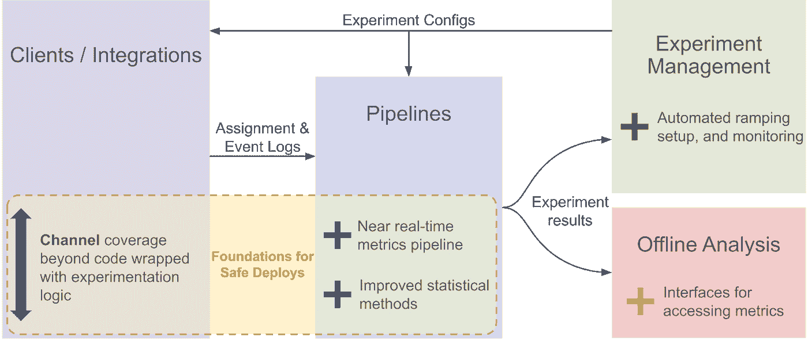
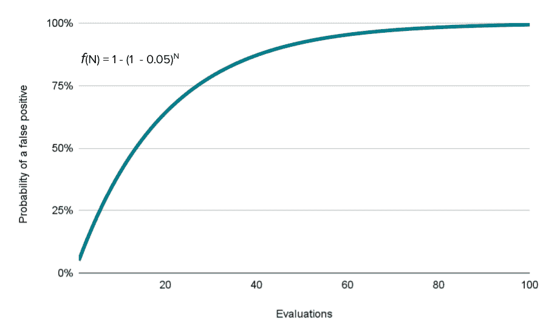
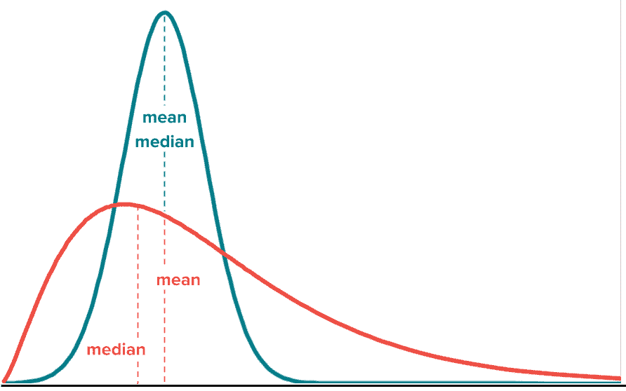
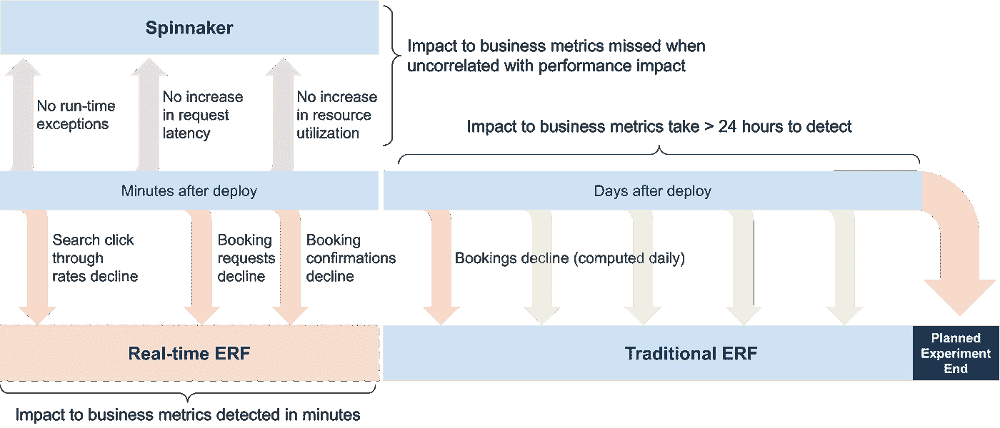

# Airbnb 如何保护生产中的变化

> 原文：<https://medium.com/airbnb-engineering/how-airbnb-safeguards-changes-in-production-9fc9024f3446?source=collection_archive---------1----------------------->

## 第一部分:Airbnb 实验平台的演变

作者:，[托比·毛](https://www.linkedin.com/in/toby-mao/)，[扎克·罗贝尔-比格尔曼](https://www.linkedin.com/in/zack-loebel-begelman-85407698/)

# 介绍

随着 Airbnb 发展成为一家拥有 1200 多名开发人员的公司，推动我们产品变化的平台和渠道的数量——以及我们投入生产的日常变化的数量——也大幅增长。面对这种增长，我们需要不断扩展我们的能力，以便在错误进入生产之前检测到它们。然而，错误不可避免地会错过生产前的验证，因此我们也在机制上进行大量投资，以便在错误进入生产时快速检测错误。在这篇博文中，我们将讨论一个保护生产变化的系统的动机和基础，我们称之为安全部署。接下来的两篇文章将详细介绍我们如何将技术架构应用到传统的 A/B 测试和代码部署中。

# 持续交付和超越

Airbnb 的持续交付团队最近写了关于[我们采用 Spinnaker](/airbnb-engineering/continuous-delivery-at-airbnb-6ac042bc7876) 的文章，Spinnaker 是一款现代 CI/CD 管弦乐器。Spinnaker 在部署期间支持[自动金丝雀分析(ACA)](https://spinnaker.io/docs/guides/user/canary/) ，根据请求分割微服务流量，以比较代码版本，查看性能、错误率或其他关键指标是否受到负面影响。如果新版本的指标下降，Spinnaker 会自动回滚部署，从而显著减少修复错误推送的时间。

Airbnb 的 ACA 确实在部署过程的早期发现了大量错误。但是，它有一些限制:

*   **通道:** Spinnaker 的 ACA 测试针对微服务的变化。然而，微服务更新并不是唯一可以推送到生产中的错误来源。例如，Android 和 iOS 应用通过各自的应用商店遵循发布流程。Airbnb 的许多“生产推送”可能根本不涉及新代码，并通过配置更改严格应用。这些变化包括营销活动或用 Airbnb 的[内部内容管理系统](/airbnb-engineering/airbnbs-promotions-and-communications-platform-6266f1ffe2bd)创建的网站内容。虽然看起来是良性的，但通过这些系统推动可能会产生巨大的影响。例如，当营销活动被错误地应用于除一个国家之外的所有国家，而不是针对某个特定国家的原始意图时，就曾引发过一次事故。这个简单的错误导致全球几乎所有用户的搜索结果都是空的，并且需要一个多小时来识别和恢复。
*   **端到端业务度量:** Spinnaker 的 ACA 由本地系统度量驱动，比如微服务的本地性能和错误率；而不是端到端的业务指标，比如搜索点击率和预订率。虽然基于本地系统指标的回滚是有价值的，但还不够，因为我们一些代价最大的错误会影响端到端业务指标，但不会影响本地系统指标。例如，在 2020 年，一个简单的前端更改被部署到生产中，而没有在不支持所用 CSS 的特定浏览器上进行测试，从而阻止用户在该浏览器上预订旅行。这对系统指标没有影响，但是直接影响了业务指标。

    不幸的是，向 Spinnaker 的 ACA 系统添加业务指标是不可能的，因为 Spinnaker 根据请求随机分配流量，因此同一个用户可能会暴露于多个变量。然而，业务度量通常是基于用户的，并且要求每个用户有一个固定的变量分配。更重要的是，这是不可能的，因为业务指标需要端到端地测量，当两个微服务同时进行 ACA 时，Spinnaker 无法区分这两个服务对端到端业务指标的各自影响。
*   **粒度:** Spinnaker 的 ACA 测试是在整个微服务的层面上进行的。然而，在一个微服务中，经常会同时处理两个特性。当 ACA 失败时，很难判断是哪个特性导致了失败。

虽然我们非常依赖 Spinnaker 在 Airbnb 的 ACA，但很明显，在情况需要时，有机会补充它并解决上述限制。

# 实验报告框架

长期以来，A/B 测试一直是 Airbnb 产品开发中的一个固定项目。虽然在反事实分析中与 ACA 有一些相同的性质，但是 A/B 测试已经集中于确定一个新的特性是否改善业务结果，而不是确定该特性是否导致系统回归。多年来，Airbnb 开发了我们的实验报告框架(ERF ),在六个平台上运行数百个并发 A/B 实验，以确定新功能是否会产生积极影响。

ERF 解决了上面列出的 ACA 的局限性:

*   **Channels:** 对于每个新平台，都引入了一个 ERF 客户端来支持其上的 A/B 测试。这包括移动、web 和后端微服务。还引入了 API 来为配置系统提供一种将配置更改视为 A/B 测试的途径。
*   **端到端业务度量:** ERF 主要由端到端业务度量驱动*。在技术方面，它根据用户而不是请求进行随机化，并且它能够区分同时运行的数百个实验的影响。ERF 接入 Airbnb 的[中央指标系统](/airbnb-engineering/airbnb-metric-computation-with-minerva-part-2-9afe6695b486)来访问产品和业务团队定义的数千个业务指标和维度，以衡量对 Airbnb 整体而言最重要的是什么。*
*   ***粒度:【Spinnaker 的 ACA 在整个微服务的级别上运行其实验，ERF 则基于嵌入代码中的基本特性标志来运行其实验。因此，如果在同一个微服务中同时开发多个特性，ERF 可以确定哪个特性会影响业务指标。***

*ERF 的上述特征解决了 ACA 的局限性，但是 ERF 也有它自己的局限性:它是一个生成交互式报告的日常批处理系统，供人类决策者使用。为了解决 Spinnaker 的 ACA 的局限性，ERF 需要发展成一个接近实时的系统，可以直接控制部署过程，而无需人工干预。*

**

*Figure 1: Areas of the ERF Platform augmented to support near real-time experimentation*

*这种演变对 ERF 背后的数据科学及其软件架构都有影响。我们在这篇文章中描述了前者，并将在本系列的下一篇文章中描述后者。*

# *实时 ERF——数据科学*

*固体数据科学的基础是固体数据工程。在数据工程方面，我们需要重新审视实时计算的业务指标的定义。batch ERF 系统计算的指标是为准确性而设计的，可以利用复杂的连接和预处理来实现这一点。接近实时的指标没有这种优势，需要简化以满足低延迟要求。*

*我们不仅必须建立新的度量标准，而且我们知道我们还必须建立新的统计测试。安全部署系统不能有噪音，否则人们会停止使用它。像 T-Test 这样的传统方法会遇到各种各样的问题，这些问题在实时系统中实现时会非常棘手。两个特别的问题是由于(1) [偷看](http://library.usc.edu.ph/ACM/KKD%202017/pdfs/p1517.pdf)(在预定的时间量之前查看)和(2)严重扭曲的数据导致的假阳性。*

*当监控一个指标是否实时改变时，用户希望在模型确信这是真的时得到通知。然而，天真地这样做导致了第一个问题，偷看。在传统的 A/B 测试中，统计测试仅在预定时间后应用一次，因为有可能重要的结果是由于随机性而不是实际效果。对于实时 ERF，我们不只是进行一次测试，因为，根据我们等待测试的时间，我们可能会花费太长时间来检测一些错误，或者错过其他需要更长时间才能发现的错误。相反，我们希望每 5 分钟检查(查看)一次模型，以便我们能够快速做出反应。在 p 值为 0.05 的情况下运行 100 次 A/A 比较，可以预期有大约 5 个实际上是假阳性的重要结果。我们可以将这个问题转化为多次计算同一数据集的 p 值。每次评估都有 5%的假阳性几率，因此多次评估后，出现一次或多次假阳性的几率接近 100%。*

**

*Figure 2: Increasing evaluations inevitably lead to false positives*

*为了在没有噪声的情况下平衡早期检测，我们利用[顺序分析](https://en.wikipedia.org/wiki/Sequential_analysis)。顺序方法不假设固定的样本大小(即，检查一次模型)，并允许我们持续监控指标，而不用担心由于窥视而导致的假阳性。校正假阳性([类型 1 错误](https://en.wikipedia.org/wiki/Type_I_and_type_II_errors#Type_I_error))的一种方法是应用 [Bonferroni 校正](https://en.wikipedia.org/wiki/Bonferroni_correction)。如果您对模型进行四次统计显著性检查，并希望保证 5%的总体假阳性率，则需要将 p 值除以 4，这意味着只有 p 值等于或低于 1.25%的结果才有效。但是，这样做太保守了，因为每个检查都是依赖的。它们是相互依赖的，因为每次检查都有相同的数据基础，只是随着时间的推移增加了额外的观察。顺序模型考虑了这种依赖性，同时保证比 Bonferroni 更有效的假阳性率。我们使用两种不同的序列模型，SSRM ( [序列样本比率不匹配](https://arxiv.org/abs/2011.03567))用于计数指标，而[序列分位数](https://arxiv.org/abs/1906.09712) (Howard，Ramdas)用于分位数指标。*

*为了保持稳健，我们需要解决的第二个问题是处理有偏差的数据。像延迟这样的性能指标可能有非常大的尾部。假设正态分布的模型不会有效，因为中心极限定理不会生效。通过应用顺序分位数，我们可以忽略关于指标分布的假设，直接测量任意分位数之间的差异。*

**

*Figure 3: Metrics may have non-normal distributions*

*最后，许多重要的措施不是独立的。延迟和印象等指标具有用户内部相关性，因此数据中的每个事件都不能被视为独立的单元。为了抵消偏差，在评估统计模型之前，我们首先将所有度量聚合到用户指标中。*

# *结论*

*有了近乎实时地评估业务指标的统计方法，我们现在可以检测到 Spinnaker 看不到的问题，或者需要太多准备时间来依赖传统的 ERF 实验的问题。*

**

*Figure 4: How Real-time ERF fits between Spinnaker and Traditional ERF*

*实施新创建的近实时指标和统计方法需要进一步的工程设计，但更具挑战性的是，它需要改变 Airbnb 的实验文化。在接下来的帖子中，我们将详细介绍我们的近实时指标管道是如何构建的，这些指标如何推动自动化决策制定，以及我们如何推动整个公司的采用。*

*有兴趣在 Airbnb 工作吗？查看这些开放的角色:*

*[度量基础设施高级软件工程师](https://careers.airbnb.com/positions/4262326/)*

*[实时流处理平台软件工程师](https://careers.airbnb.com/positions/4216371/)*

*[软件工程师— ML Ops 平台](https://careers.airbnb.com/positions/2403782/)*

*[云基础设施软件工程师](https://careers.airbnb.com/positions/2410642/)*

# *增值*

*感谢[阿德里安·库恩](https://www.linkedin.com/in/adriankuhn/)、[亚历克斯·邓](https://www.linkedin.com/in/alex-shaojie-deng-b572347/)、[安托万·克鲁](https://www.linkedin.com/in/antoinecreux/)、[埃里克·艾弗森](https://www.linkedin.com/in/erikriverson/)、[乔治·李](https://www.linkedin.com/in/george-l-9b946655/)、[克里希纳·布帕蒂拉朱](https://www.linkedin.com/in/krishna-bhupatiraju-1ba1a524/)、[普雷蒂·拉马萨米](https://www.linkedin.com/in/preetiramasamy/)、[雷米·斯塔塔](https://www.linkedin.com/in/rstata/)、里德·安德森[罗尼·科哈维](https://www.linkedin.com/in/ronnyk/)、[邵谢](https://www.linkedin.com/in/shao-xie-0b84b64/)*