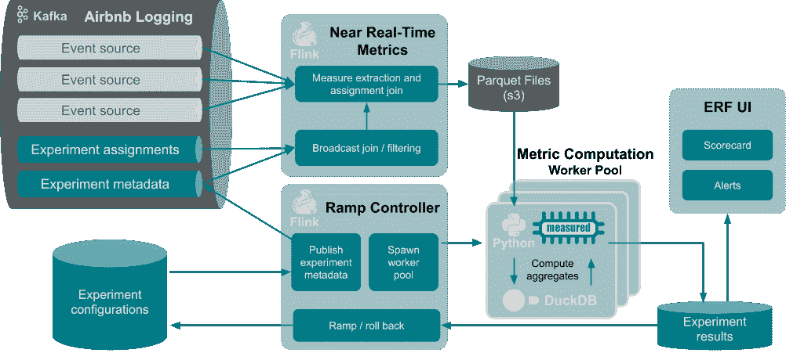
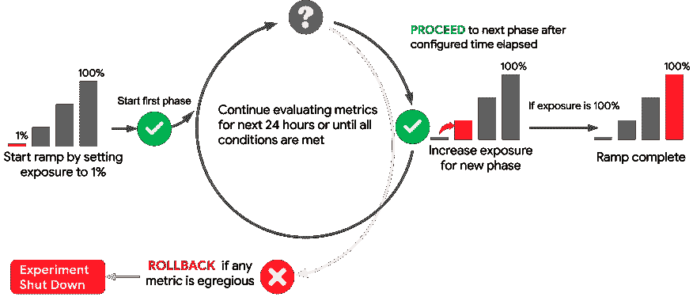
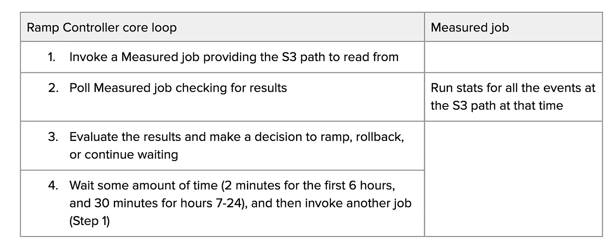
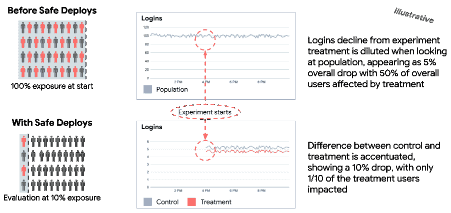
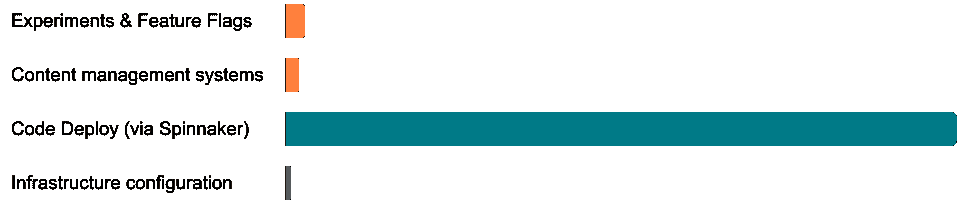

# Airbnb 如何保护生产中的变化

> 原文：<https://medium.com/airbnb-engineering/how-airbnb-safeguards-changes-in-production-c83e94bfc52?source=collection_archive---------1----------------------->

# 第二部分:近实时实验

作者:[迈克·林](https://www.linkedin.com/in/michaelcl/)，[普雷蒂·拉马萨米](https://www.linkedin.com/in/preetiramasamy/)，[托比·毛](https://www.linkedin.com/in/toby-mao/)，[扎克·罗贝尔-贝格尔曼](https://www.linkedin.com/in/zack-loebel-begelman-85407698/)

在我们的第一篇帖子[中，我们讨论了对近乎实时的安全部署系统的需求，以及一些支持其决策的统计数据。在本帖中，我们将介绍 Safe 部署的各种组件背后的架构和工程选择。](/airbnb-engineering/how-airbnb-safeguards-changes-in-production-9fc9024f3446)

设计一个接近实时的实验系统需要在速度、精度、成本和弹性之间做出明确的权衡。早期的决定是将接近实时的结果限制在实验的前 24 小时——有足够的时间来捕捉任何主要问题，并过渡到使用来自批处理管道的综合结果。想法是一旦批量结果可用，实验者将不再需要实时结果。以下部分描述了在 Safe 部署系统的每个组件中的附加设计决策。

# 高级设计

外管局部署系统的技术范围由 3 个主要部分组成:

1.  **Ramp Controller** ，一个 [Flink](https://flink.apache.org/) 作业，作为集中协调器，通过 Kafka 向 NRT 提供实验配置，并通过 HTTP 调用 Measured 调用统计计算。
2.  **近实时(NRT)管道**，另一个 Flink 作业，提取度量，用分配信息(治疗和主题信息)连接和丰富那些度量，并将丰富的度量存储到 S3。
3.  **Measured** ，这是一个 python 库(通过 Python HTTP 服务器和 worker pool 调用),它使用来自 S3 的丰富的度量，聚合它们，并运行 stats 来确定任何变化是否显著。

Fig 1: Architecture Diagram of the Safe Deploy system

# 斜坡控制器

斜坡控制器根据测量结果执行自动实验斜坡。它分阶段增加实验曝光，慢慢曝光更多的受试者，并在每个阶段监测指标影响。如果观察到任何异常负面的指标，斜坡控制器将立即关闭实验，以最小化不良变化的影响。它支持多种斜坡算法，但大多数用户使用简单的基于时间的算法。

Figure 2: Ramping process

Ramp Controller 被设计成无状态的，并且对任何作业失败都有弹性。在实验开始的几秒钟内，它向卡夫卡发布元数据，触发 NRT 开始加入该实验的事件。元数据包括 NRT 将写入的 S3 中的路径。此时，斜坡控制器的核心循环将开始:

结果是在实验的前 24 小时内计算出来的，随着新文件发布到 S3，会消耗新的指标。当百分比变化小于-20%且调整后的 p 值小于或等于 0.01 时，该指标被标记为异常。通过利用度量计算的测量框架，我们可以获得定制的聚合、更丰富的统计模型、计算性能度量的能力以及度量的维度缩减。

在克服了扩展管道和调整决策方面的这些技术挑战后，我们准备与实验负责人一起审查系统并推动采用。

# 近实时(NRT)管道

我们使用 Apache Flink 在 Java 和 Scala 中构建了新的 NRT 管道。它从大量 Kafka 流中读取:包含基于原始用户的事件(印象、预订请求等)的事件流。)、渐变控制器发出的包含实验元数据的流，以及包含为所有实验发出的原始分配事件的流，这些实验也由批处理管道使用。

此前，Airbnb 曾试图为所有的实验任务建立一个在线数据存储，但这没有规模，最终被关闭。通过缩小范围，特别是将 NRT 管道限制在实验的前 24 小时，我们能够存储赋值的有界子集。使用实验元数据的[广播连接](https://nightlies.apache.org/flink/flink-docs-master/docs/dev/datastream/fault-tolerance/broadcast_state/)让我们过滤任务事件，Flink 使[老化数据](https://nightlies.apache.org/flink/flink-docs-master/docs/dev/datastream/fault-tolerance/state/#state-time-to-live-ttl)变得微不足道。

提取内容被写入一个独立的库中，以便测量定义可以在批处理和流式传输中重用。为了提高性能，度量提取使用基于 json 字段的存在和值的倒排索引来确定首先提取哪些事件，然后只对相关事件运行提取。我们不仅从每个事件中提取度量，还提取维度。因为我们希望限制这项工作的复杂性，所以我们只支持来自同一个事件的维度作为度量本身。

我们的第一个困难是如何处理无序出现的度量和任务。当将分配事件连接到度量时，我们希望数据在不同的时间过期，并且分配数据应该存储整整 24 小时。因为测量事件的数量意味着我们不能将它们保留 24 小时，所以我们在 5 分钟后保留一个短的缓冲区丢弃测量。实现这个目标所需的外部连接需要使用[键控协同流程 api](https://nightlies.apache.org/flink/flink-docs-master/api/java/org/apache/flink/streaming/api/functions/co/KeyedCoProcessFunction.html) 构建一个自定义连接。

一旦数据被连接，我们就在 Flink 内部缓冲它，以减少小实验的文件总数。我们编写了一个简单的键控过程 stage，它根据我们想要输出多少并发文件的时间戳来散列事件。因为 Flink 要求密钥机制是确定性的，所以我们在时间戳上散列是很重要的。基于事件计数和时间缓冲事件，一旦分区达到基于事件或基于时间的阈值，就发出缓冲列表。这个阶段允许我们对输出的文件数量进行更精细的控制。

我们利用 Flink 内置的支持拼花和 S3 的[作为文件接收器](https://nightlies.apache.org/flink/flink-docs-release-1.15/docs/connectors/datastream/filesystem/#parquet-format)来写文件。为了提供恰好一次的语义，Flink 将只在出现检查点时写文件。由 NRT 流水线输出的文件被斜坡控制器用来做出决定。为了保持低延迟，我们每 5 分钟检查一次。

# 衡量过的

Measured 是一个定义和计算指标的框架。它包括一个 Scala 库，用于从 NRT 管道利用的原始事件中提取度量和维度，以及一个 Python 库，用于定义度量(基于这些度量)、统计模型和可视化。本节重点介绍 Python 库，以及如何使用它来计算指标。

为了提供跨平台的一致结果，我们运行与用户通过 Python HTTP 作业服务器和工作池运行的相同的测量作业。NRT 度量评估就是其中之一，它使用 Python 工作池从 S3 下载事件文件。一旦文件被下载，这个任务就利用 [duckdb](https://duckdb.org/) 的[拼花阅读器功能](https://duckdb.org/docs/data/parquet)聚集到用户级别。一旦我们有了一个本地用户集合，这项工作就会评估第一篇文章中讨论的各种顺序模型。作业完成后，这些评估的结果存储在 MySQL 数据库中，供 UI 或 Ramp 控制器通过 HTTP 检索。

# 采用

安全部署的完整愿景包括保护生产中的任何变化。然而，为了获得经验和信任，我们最初将精力集中在 A/B 测试上。我们知道，像任何异常检测系统一样，Safe 部署，尤其是自动执行补救步骤的系统，在采用时会面临某些挑战，包括:

*   对 NRT 指标的信任度与现有的批量指标相似，但不完全相同
*   实验升温和停止过程中控制权的放弃
*   假阳性可能会因强制重启而减慢实验速度

在 Safe 部署之前，近四分之一的 Airbnb 团队有一个手动过程来增加实验。这包括增加实验的曝光度，手动验证性能指标，并重复直到达到目标曝光度。这往往掩盖了显著但不明显的负面影响。

Figure 3: Illustration of how a controlled experiment provides greater sensitivity

我们将 Safe 部署作为现有过程的补充，提高了检测负面影响的灵敏度，同时仍然允许实验人员根据自己的监控随时停止实验。我们还不断改进用于减少假阳性和假阴性的统计方法。自一年前默认启用 Safe 部署以来，它已被用于超过 85%的实验启动，并帮助防止了数十起事件，及早标记了错误配置，最大限度地减少了对 Airbnb 业务的负面影响和补救工作中浪费的工程资源。

# 冰山一角

保护实验是减少 Airbnb 事件的一个重要步骤，然而，完整的愿景包括来自其他渠道的变化。不同通道的变化分布如图 4 所示。

Figure 4: Distribution of changes pushed to production by channel

我们以不同的方式处理每个剩余的渠道:

*   特征标志与实验相统一，以获得安全部署能力
*   为内容管理系统提供了 API，用于以编程方式创建与内容更改相关的实验，并通过安全部署进行升级
*   代码部署通过 Spinnaker 运行安全部署以及预先存在的自动金丝雀分析与每个部署

(我们认为基础架构配置超出了范围，因为这些较低级别的更改需要完全不同的方法来解决。)

使用 Spinnaker 部署的代码占了生产中绝大部分的变更，需要大量的工作才能实现。本系列的下一篇文章将介绍我们如何通过改变 Spinnaker 的流量路由、服务配置和动态创建的配置来实现这一点。

有兴趣在 Airbnb 工作吗？查看我们的[空缺职位](https://careers.airbnb.com/)。

# 承认

只有通过 Airbnb 基础设施和数据科学团队的共同努力，安全部署才成为可能。我们要感谢[陆经纬](https://www.linkedin.com/in/jingwei-lu-5701222/)、[魏浩](https://www.linkedin.com/in/wei-hou-93a069a4/)以及溪流基础设施团队的其他成员，他们帮助实施并随后扩大了 NRT 管道的规模。此外，感谢坎迪斯·张、【埃里克·艾弗森、、[李敏勇、](https://www.linkedin.com/in/minyong-lee-1a302466/)、里德·安德森、[尚特·托伦西安](https://www.linkedin.com/in/shant-torosean-606aa354/)、[塔蒂亚娜·希法拉](https://www.linkedin.com/in/tatiana-xifara/)以及许多帮助构建指标并验证其正确性的数据科学家。还要感谢 [Kate Odnus](https://www.linkedin.com/in/kodnous/) 、 [Kedar Bellare](https://www.linkedin.com/in/kedar-bellare-3048128a/) 和 [Phil MacCart](https://www.linkedin.com/in/pmaccart/) ，他们是早期采用者，为我们提供了宝贵的反馈。此外还有[亚当·科洛斯基](https://www.linkedin.com/in/kocolosk/)、[雷米·斯塔塔](https://www.linkedin.com/in/rstata/)和[罗尼·科哈维](https://www.linkedin.com/in/ronnyk/)在全公司范围内的努力。我们还要感谢为 Safe 部署做出贡献的应急准备小组的其他成员:[阿德里安·库恩](https://www.linkedin.com/in/adriankuhn/)、[安托万·克鲁](https://www.linkedin.com/in/antoinecreux/)、[乔治·李](https://www.linkedin.com/in/george-l-9b946655/)、[克里希纳·布帕蒂拉朱](https://www.linkedin.com/in/krishna-bhupatiraju-1ba1a524/)、[邵燮](https://www.linkedin.com/in/shao-xie-0b84b64/)和[文森特·陈](https://www.linkedin.com/in/vincent-chan-70080423/)。

> 所有产品名称、徽标和品牌都是其各自所有者的财产。本网站中使用的所有公司、产品和服务名称仅用于识别目的。使用这些名称、标志和品牌并不意味着认可。