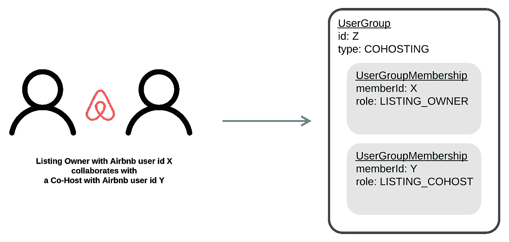
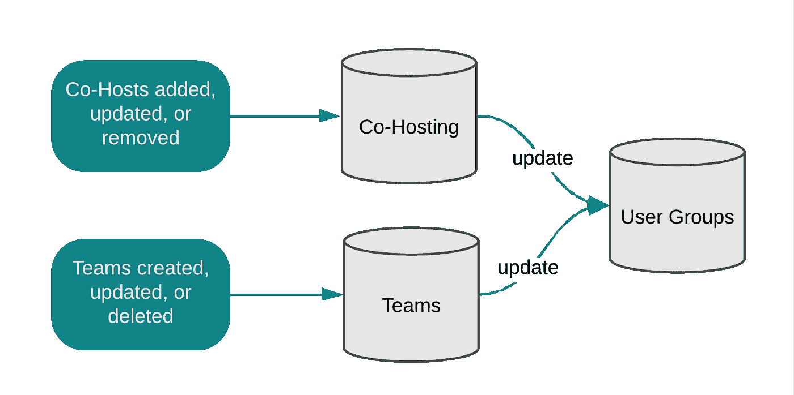
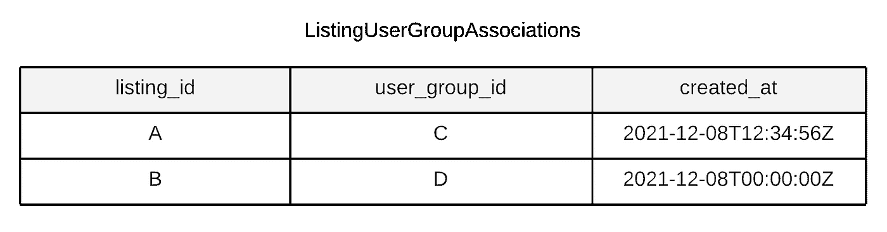
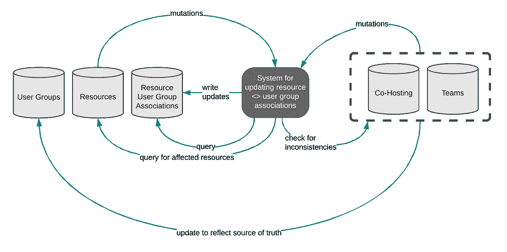
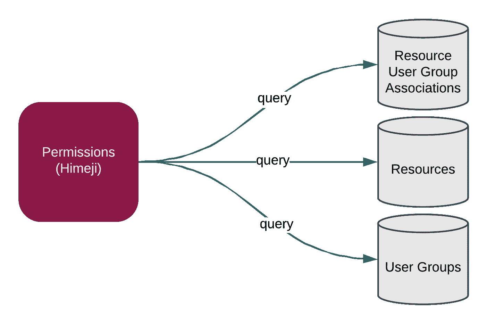
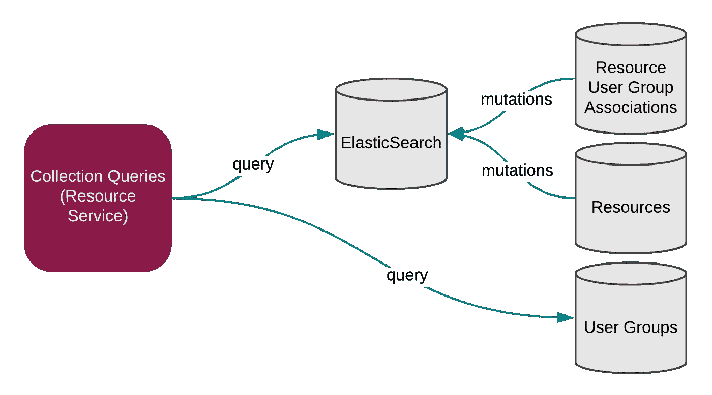

# Airbnb 如何支持联合托管

> 原文：<https://medium.com/airbnb-engineering/how-airbnb-supports-co-hosting-edfb11d88575?source=collection_archive---------1----------------------->

深入探究 Airbnb 的协作托管基础设施

作者:[安吉丽娜·拉奥](https://www.linkedin.com/in/angelinerao/)


# 介绍

Airbnb 的使命是让主人能够提供独一无二的住宿，让客人能够以更真实、更互联的方式体验世界。有时主机由一个人处理，但在许多情况下，主机是一个团队的努力。主人通常会与另一个信任的人分担责任，比如家庭成员或邻居。这些受信任的合作伙伴是 Airbnb 平台上的共同主持人，他们被授权访问主持人的列表、预订和与客人的消息传递。

共同主持只是主持人协作的一种形式。随着托管成为主流，托管的规模也在增长；事实上，现在很多人把 Airbnb 上的主机作为他们的首要职业。从经营自己企业的东道主企业家，到老牌酒店公司的东道主，这些类型的东道主通过 Airbnb 上的团队进行合作。在团队中，托管团队成员被授予与其真实世界托管职责相对应的角色(例如，访客经理)，并具有一组相应的权限(例如，被允许向访客发送消息)。

随着协作主机数量的增长和新协作形式的引入，支持它们的工程工作变得越来越复杂。考虑到这一挑战，Airbnb 开发了一个单一的公共基础设施，可以支持所有当前和未来的 Airbnb 协作产品。该解决方案现在适用于所有内部团队。

在这篇博文中，我们将介绍 Airbnb 协作托管的统一架构，以及我们如何使用这种共享基础设施来简化为主机构建产品的过程。在下一节中，我们将说明为什么在没有共享基础设施的情况下支持协作主机很快变得难以处理。然后，我们将浏览 Airbnb 的协作托管架构。最后，我们将讨论这个基础设施如何支持产品工程师的需求。

# 背景和动机

在我们进入协作主机之前，让我们考虑一下单主机模型。因为只有一个人与每个列表相关联，所以这些数据可以很容易地存储在我们的列表数据库中的一个`host_id`列中。然后，我们可以执行一次检查，判断用户是否有权限对列表执行操作。这可能如下所示:

```
if (isListingHost) {
     // Take action on listing
}
```

当 Airbnb 推出其第一款合作托管产品 Co-Hosting 时，我们使用了这些类型的比较，就像我们对单主机模型所做的那样。

在我们的业务逻辑中，我们需要经常回答三种类型的关于人与资源(例如，列表、预订、审核)关系的问题:

1.  **权限**:给定一个人和一个资源，这个人可以对这个资源采取行动`X`吗？这个问题的答案有助于我们确保人们只在 Airbnb 上采取明确允许他们采取的行动。例如，我们不能允许某人编辑无关主机列表上的价格。
2.  **集合查询**:给定一个人，他可以访问哪些资源？例如，这个问题的答案有助于我们确定在一个人的 Airbnb 收件箱中显示哪些消息线索。
3.  **要显示和通知的主机**:给定一个资源，应该向来宾显示谁，以及应该向谁通知该资源的更新？例如，这个问题的答案有助于我们确定谁应该显示为这个列表的主机。

在联合托管之后，我们很快发现，执行我们为单主机模型所做的比较类型，并不能很好地扩展到协作和更复杂的用例。

*   不断添加特定于单一类型协作主机的逻辑会导致代码难以处理。例如，权限检查可能如下所示:

```
if (isListingHost || 
    isListingCoHost || 
    isListingTeamMember ||  
    isListingCollabHost1 || 
    isListingCollabHost2 || 
    ...) {
     // Take action on listing
}
```

*   构建新功能的工程师需要了解所有现有类型的协作主机，并决定协作主机应该如何与该功能交互(例如，哪些类型的团队成员应该可以访问该功能？).如果工程师没有包括每个用例，该功能将不会对所有主机可用。

如果没有任何一种统一的框架，主机产品开发很快就会变成一个费力的过程。

今天，由于我们的协作主机基础设施，产品工程师不需要担心特定类型的协作主机。他们只需要知道三件事，我们将在本帖中一一介绍:

1.  权限，查询姬路。
2.  对于集合查询，请使用资源的专用服务。
3.  对于要显示或通知的主机，请使用协作主机 API。

# 协作托管核心架构

我们使用用户组作为数据模型来表示任何一组人。用户组由 id、组类型(如`COHOSTING`、`TEAM`)和用户组成员列表定义。

用户组中的每个成员都由他们的 Airbnb 用户 id 和用户组角色定义，这使我们能够区分用户组中不同类型的成员。例如，如果一个主机(列表所有者)有一个联合主机，那么相应的用户组将是一个类型为`COHOSTING`的用户组，它有两个成员:主机，角色为`LISTING_OWNER`，联合主机，角色为`LISTING_COHOST`。



*A Host and their Co-Host represented in the user group data model*

这个模型也可以扩展到托管团队。我们支持几个特定于团队的角色，这些角色基于托管团队通常如何划分团队成员之间的职责，例如`LISTING_MANAGER`角色、`FINANCE_MANAGER`角色和`GUEST_MANAGER`角色。

在联合主持人或团队的创建和删除流程中，相应的用户组会相应地更新。



Updates in product will trigger changes in both the source of truth (Co-Hosting or Teams) and the corresponding user groups

## **资源< >用户组关联**

既然我们有了任何协作主机组的模型，我们希望将每个组与组的相应资源相关联。这样，当我们试图回答一个人是否与给定资源有关系的问题时，无论具体的合作关系如何，都有一个单一的来源可以给我们答案。我们通过存储 Airbnb 资源 id、用户组 id 和创建关联时的时间戳来跟踪这些资源<>用户组关联。



*Example ListingUserGroupAssociations table showing that listing A has been associated with user group C and listing B has been associated with user group D*

有两种情况需要更新资源<>用户组关联:

1.  当协作托管关系更新时。例如，当创建一个托管团队时，团队创建者的所有资源都与团队对应的用户组相关联
2.  当协作主机资源被更新时。例如，当一个客人在一个联合托管的列表上预订一个预订时，我们需要将联合托管用户组与新的预订相关联，以便列表的联合托管可以帮助列表所有者进行托管。

如果响应这些事件的更新没有及时发生，产品体验可能会过时。例如，如果一个主机将一个联合主机添加到一个列表中，但是底层关联没有被更新，则该联合主机将不能访问该列表及其预订。

在 Airbnb 这种规模的企业中，保持资源<>用户组关联的更新是一项挑战。事态在不断变化，有时变化很快；主机可能会创建一个托管团队，然后改变主意，立即删除它。因此，确实会出现竞态条件。

在本节的其余部分，我们将介绍 Airbnb 的可扩展系统，以保持资源<>用户组关联在竞争条件下保持最新。在接下来的部分，我们将详细介绍 Airbnb 如何在产品开发期间利用这些资源<>用户组关联。

**一种实现精准资源<用户组关联>的系统**



*The system that keeps resource <> user group associations updated*

当任何资源发生变化时，我们的系统会立即采取行动，获取受影响的资源来执行关联更新。因为可能有成千上万的资源需要获取，我们使用内部作业队列和调度系统将工作分解成作业，以避免超时和并行处理。对于所有受影响的资源，我们会将其用户组关联与 Airbnb 的当前状态进行比较，并在需要时更新关联。

并行处理更新的副作用是，可能会有竞争条件，导致真实来源和相应用户组关联之间的不一致。例如，如果主机创建了一个团队，然后立即删除了该团队，则生成的作业将并行执行，下游的“创建”作业可能会在“删除”作业之后执行。

为了解决引入的任何不一致，系统接下来将获取现在更新的资源<>用户组关联，并将它们与事实的来源进行比较。如果有任何不匹配，它会使用保证最终一致性的弹性排队系统来修复它们。

该系统的设计有两个显著的好处:

*   **优化性能**:首先执行预期的更新，然后追溯性地修复不一致，这使得绝大多数处理可以分批并行进行。这导致了比立即逐个处理资源更便宜的操作，尽管后一种方法将消除修复不一致的步骤的需要。
*   **幂等**:每个资源更新事件都会触发关联的重新计算，这与更新的具体类型无关。因此，我们不需要担心以错误的顺序接收两个相反的事件，如创建和删除。因此，我们可以保证我们的系统更新是幂等的。

# 产品开发中的协作托管基础设施

现在我们已经有了一个系统来实现准确的用户组<>资源关联，让我们重新讨论工程师在开发过程中需要回答的三种类型的人与资源关系问题。

## **1。权限**

例如，当检查用户是否可以编辑某个列表的定价时，我们现在将通过检查用户用户组的列表关联，知道该人员是否与该列表存在任何协作关系。例如，我们可以发现该用户是与此列表关联的用户组中的`LISTING_MANAGER`团队成员。

然后，最后一部分是定义角色如何映射到动作——例如，我们可能决定拥有`LISTING_COHOST`或`LISTING_MANAGER`角色的用户可以对与他们的用户组相关联的列表执行`EDIT_PRICING`动作。在 Airbnb，这种映射发生在姬路所定义的配置中，我们的中央授权框架在之前的博文中描述过。给定一个用户、一个资源和一个动作，姬路会计算该用户是否被允许对该资源采取动作。



Architecture diagram for Himeji

## **2。集合查询**

要获取一个人可以访问的资源，我们只需通过该人的 Airbnb 用户 id 和用户组 id(该人拥有允许的用户组角色)进行一次查询。我们使用 ElasticSearch 通过将资源数据源与资源<>用户组关联表连接起来，使资源可以通过用户组 id 进行搜索。这样，每个资源的 ElasticSearch 文档都有与之相关的用户组 id 列表。

然后，每个资源的指定数据服务服务于一个端点(例如，`getListingsByFilters`)，该端点允许产品工程师传递一个参数(例如，`includeCollaborativeHosting=true`)来指示资源应该由该人的用户 id 和用户组 id 来获取。



Architecture diagram for collection queries

注意，与上面类似，我们不需要知道任何关于联合主持或团队的知识来回答这类问题。

## **3。确定显示和通知哪些主机**

向来宾显示或通知更新的用户不一定与拥有相应权限的用户相同。例如，有共同主持人的主持人可能不希望接收关于客人消息的通知，但是他们仍然希望访问他们的 Airbnb 收件箱。

正如我们之前看到的，对产品团队来说，跟踪每种类型的协作的定制逻辑会变得很费力。为了解决这个问题，我们构建了一个协作托管 API，它考虑了所有协作用例，具有端点，如`getManagersToNotifyForReservation`和`getManagersToDisplay`。在引擎盖下，我们查询每个协作主机用例的真实来源，并汇总结果。这个 API 抽象了协作主机的细节，同时仍然为产品工程师提供他们需要的信息。

在命名 API 端点时，我们旨在明确地陈述端点的目标，以减少工程师可能误用 API 响应的机会。例如，返回预订通知的用户的端点被命名为`getManagersToNotifyForReservation`，而不是`getReservationManagers`，这可能会被误认为是获取可以修改预订的用户列表的权限端点。

## **合作主持剧本**

有了关于协作主机如何跨用例工作的清晰结构，我们可以在现有框架内为新产品开发建立简明的步骤。

**推出新型协作主机**

当引入一个新的协作托管用例时，将它集成到 Airbnb 只需要几个关键的更改就可以实现:

*   将您的用例更新/添加到姬路配置以获得权限
*   更新资源<>用户组关联系统以包含您的用例
*   在考虑通知或显示时，更新协作托管 API 端点，以结合新用例中的逻辑

**推出 Airbnb 新功能**

当 Airbnb 推出新功能时，只需几个步骤就能将其发布到所有主机。假设 Airbnb 正在开发新产品。新产品将引入一种新的资源类型，belos。我们需要:

*   通过将 belo 添加到用户组<>资源关联系统来设置 belo <>用户组关联
*   使用这些 belo <>用户组关联为 belo 创建搜索索引，以便我们可以通过用户组 id 获取 belo
*   如果需要，添加一个新端点来通知和显示 belos 的用户

# 结论

Airbnb 开发了一个协作托管基础设施，支持所有类型的主机。这使得构建产品更加容易，因为工程师只需要知道一个涵盖所有主机用例的中心框架。合作托管是 Airbnb 上许多主机成功的关键。在为所有主机构建时，无缝的开发人员体验使我们能够让主机为客人提供良好的住宿。

如果你对这类工作感兴趣，可以看看我们的相关职位:

*   [资深安卓软件工程师，主持](https://careers.airbnb.com/positions/2921989/)
*   [高级 iOS 软件工程师，主持](https://careers.airbnb.com/positions/2809890/)

…以及 Airbnb 职业生涯中的更多内容！

# 感谢

只有多年来许多不可思议的、有使命感的人的努力，协作主机才有可能实现。特别鸣谢莫以朗、、沈伊芙林、、亚伦.荷尔松格、关、苏士伟、姚、江俊杰、梅森、郑佩琪、、张、罗、倪静怡、菲格罗亚、江查理、张素淑、高肯、马考斯卡、泰等。

所有产品名称、标识和品牌都是其各自所有者的财产。本网站中使用的所有公司、产品和服务名称仅用于识别目的。使用这些名称、标志和品牌并不意味着认可。