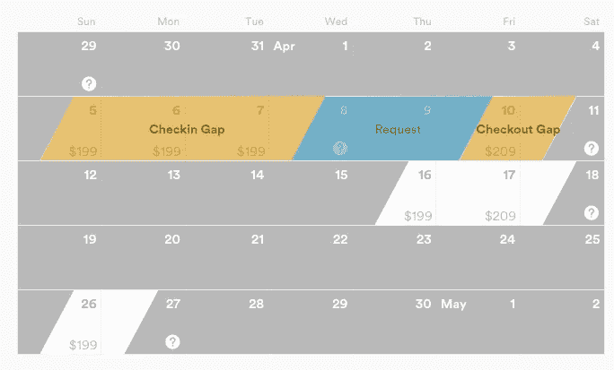
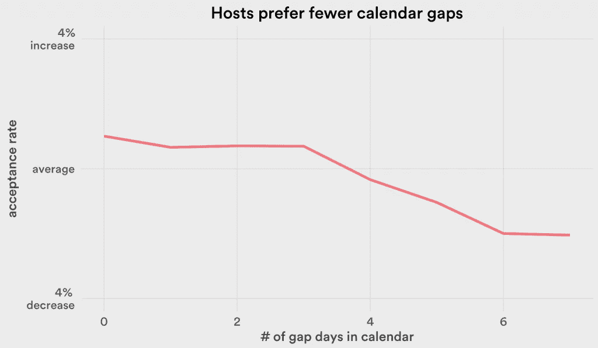
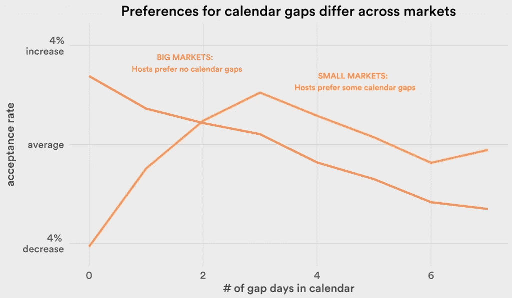
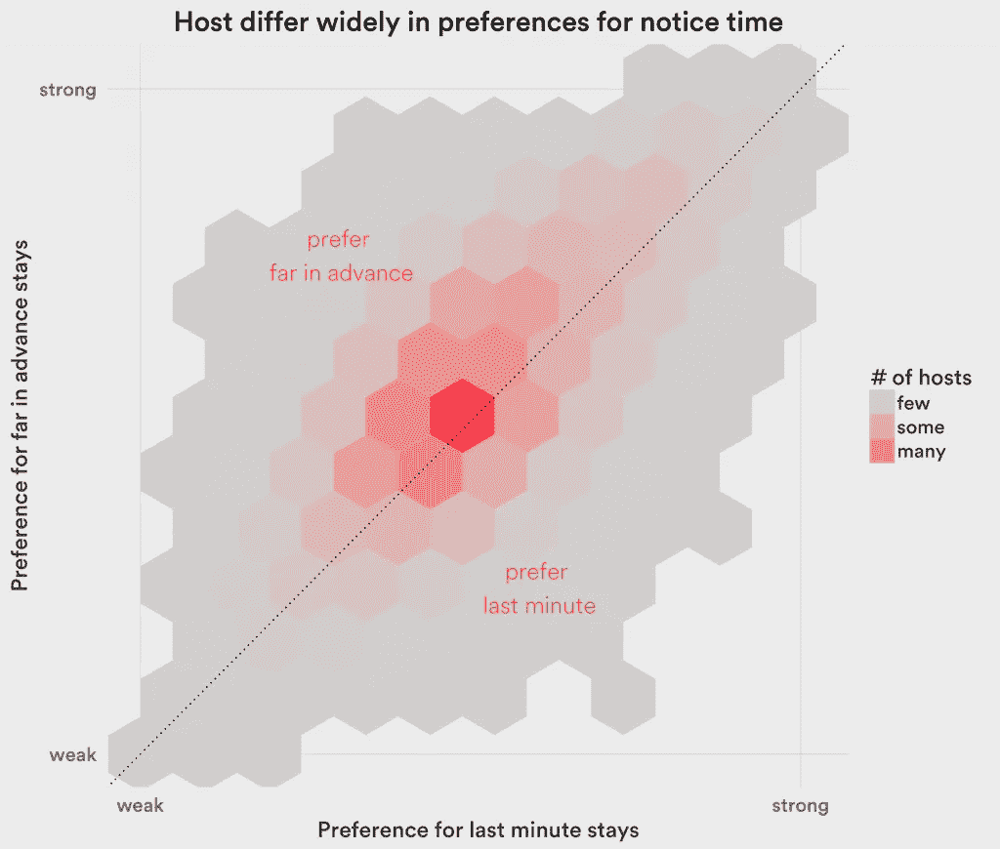
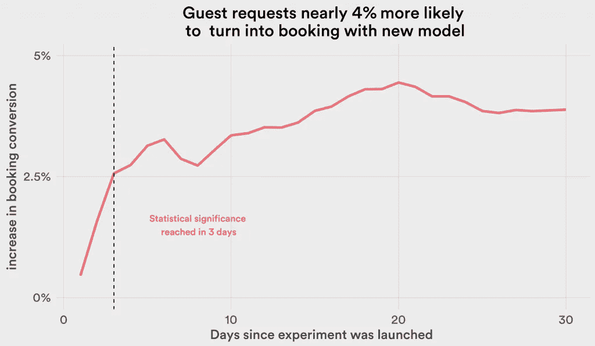

# Airbnb 如何使用机器学习来检测主机偏好

> 原文：<https://medium.com/airbnb-engineering/how-airbnb-uses-machine-learning-to-detect-host-preferences-18ce07150fa3?source=collection_archive---------1----------------------->

通过[栏 Ifrach](https://www.linkedin.com/in/bar-ifrach-71507657)

在 Airbnb，我们努力为寻找住宿的人(客人)和寻找出租房屋的人(主人)牵线搭桥。客人主动联系他们希望入住的房源的主人，但是只有当主人也希望接纳客人时，匹配才成功。

2012 年，我第一次从一个朋友那里听说了 Airbnb。在我们从研究生院放假回家的时候，他在网站上提供了他的漂亮公寓。他的主要目标是在他离开的 1-2 周内尽可能多的预订住宿。我的朋友会接受或拒绝请求，这取决于请求是否有助于他最大限度地利用自己的空间。

大约两年后，我加入了 Airbnb，成为一名数据科学家。我想起了我朋友的行为，很好奇是什么影响了房东接受住宿请求的决定，以及 Airbnb 如何增加平台上的接受率和匹配率。

最初的一个小研究项目导致了一个机器学习模型的开发，该模型根据我们的主人过去的行为来学习他们对住宿请求的偏好。对于客人在 Airbnb 的搜索引擎上输入的每个搜索查询，我们的模型都会计算相关主机想要满足客人请求的可能性。然后，我们可能会在搜索结果中更突出地显示匹配项。在我们的 A/B 测试中，该模型显示预订转化率增加了约 3.75%，导致 Airbnb 上有更多匹配。在这篇博文中，我概述了将我们带到这个模型的过程。

# 是什么影响了东道主的接纳决定？

我通过检查其他主持人是否像我朋友一样最大限度地提高了他们的占用率，开始了我对主持人接受度的研究。每个住宿请求都在日历中的一个序列或可用天数窗口中，如下面显示的日历中的 4 月 5 日至 10 日。窗口周围的灰色日子要么被主持人屏蔽了，要么已经被预定了。如果申请被接受和预订，申请可能会在入住日期之前(入住间隔期—4 月 5 日至 7 日)和/或退房之后(退房间隔期—4 月 10 日)留给东道主一个子窗口。

希望拥有高入住率的主人会尽量避免这种差距。事实上，当我绘制了主机接受入住和退房时间间隔之和的趋势图(上例中为 3+1= 4)时，我发现了我期望看到的效果:主机更有可能接受符合其日历的请求，并最大限度地减少时间间隔。

但是，是否所有的主人都试图最大限度地提高入住率，并更喜欢短暂的入住？也许有些主人对最大化他们的占用率不感兴趣，宁愿偶尔主持。也许大市场的主机，比如我的朋友，与小市场的主机不同。

事实上，当我分别查看大型和小型市场的上市公司时，我发现它们的表现截然不同。大市场的主人非常关心他们的入住率——一个没有空档的请求比一个有 7 个空档夜的请求被接受的可能性高 6%。对于小市场，我发现了相反的效果；主机更喜欢在请求之间有少量的夜晚。因此，不同市场的东道主有不同的偏好，但似乎即使在一个市场内，东道主也可能偏好不同的住宿。

当我根据住宿请求的其他特征来观察主人接受的倾向时，一个类似的故事出现了。例如，平均而言，Airbnb 的主人更喜欢提前至少一周的住宿请求，而不是最后一刻的请求。但是也许有些主人更喜欢临时通知？

下图显示了最后一分钟入住(少于 7 天)与提前入住(多于 7 天)的住宿者偏好的差异。事实上，偏好的分散揭示了一些喜欢最后一分钟停留的主持人比那些提前很久停留的主持人——右下方的主持人——更好，尽管平均来说主持人更喜欢更长时间的通知。我发现，东道主倾向于接受其他旅行特征，如客人数量、是否是周末旅行等，也有类似的差异。

所有这些发现都指向同一个结论:如果我们能够在搜索结果中宣传更有可能接受该搜索查询所产生的住宿请求的主人，我们将会看到更快乐的客人和主人，以及更多变成有趣的假期(或富有成效的商务旅行)的匹配。

换句话说，我们可以个性化我们的搜索结果，但不是以你期望的方式。通常，个性化搜索结果会推荐符合搜索者(客人)独特偏好的结果。在像 Airbnb 这样的双边市场中，我们还希望根据主机的偏好来个性化搜索，这些主机的列表将出现在搜索结果中。

# 如何对主机偏好建模？

受到我的发现的鼓舞，我与另一位数据科学家和一位软件工程师合作，创建了一个个性化的搜索信号。我们开始将主人之前的接受和拒绝决定与旅行的以下特征联系起来:入住日期、退房日期和客人数量。通过将主人偏好添加到我们现有的获取客人偏好的排名模型中，我们希望能够实现更多更好的匹配。

乍一看，这似乎是[协同过滤](http://en.wikipedia.org/wiki/Collaborative_filtering)的完美案例——我们有用户(主机)和项目(旅行)，我们希望通过结合历史评分(接受/拒绝)和来自类似主机的统计学习来了解对这些项目的偏好。然而，由于两个原因，该应用程序并不完全适合协作过滤框架。

*   首先，没有两次旅行是完全相同的，因为在每次住宿请求的背后，都有不同的客人与独特的人类互动，影响着主人的接受决定。这导致接受/拒绝标签比例如许多协作过滤应用中的电影或宋立科的评级更嘈杂。
*   更进一步说，一个主人可能在不同的时间点收到不同客人的同一次旅行的多个住宿请求，并给予这些请求冲突的投票。主人可能接受 4 次中有 2 次在星期二开始的最后一分钟的停留，并且仍然不清楚主人是否喜欢这样的停留。

考虑到这几点，我们决定将这个问题转化为类似于协同过滤的东西。我们对同一趟旅行使用了多重回答，以减少来自主客互动中潜在因素的噪音。为此，我们单独考虑了主机对某个行程特征的平均响应。我们没有考虑旅行长度、客人聚会规模、日历间隙大小等因素的组合，而是单独考虑了这些旅行特征中的每一个。

通过这种更粗糙的偏好结构，我们能够解决数据中的一些干扰，以及同一趟旅行的潜在冲突标签。我们使用每个出行特征的平均接受率作为偏好的代表。我们的数据集仍然相对稀疏。平均而言，对于每一种旅行特征，我们无法确定约 26%的东道主的偏好，因为他们从未收到过符合这些旅行特征的住宿请求。作为一种插补方法，我们使用权重函数来平滑偏好，对于每个出行特征，该权重函数将该区域中的宿主偏好中值与宿主偏好进行平均。当主机没有数据点时，中值首选项的权重为 1，主机拥有的数据点越多，权重单调地变为 0。

使用这些新定义的偏好，我们使用 L-2 正则化逻辑回归创建了宿主接受度的预测。本质上，我们将不同出行特征的偏好组合成一个单一的接受概率预测。每个出行特征的偏好对接纳决策的权重是逻辑回归得出的系数。为了改进预测，我们在逻辑回归中包括了一些更多的地理和主机特定特征。

该流程图总结了建模技术。

我们使用 Hive 上的用户生成函数(UDF)在集群上的主机段上运行了这个模型。UDF 是用 Python 写的；它的输入是住宿请求、东道主对这些请求的回应以及其他一些东道主特征。根据传递给它的标志，UDF 或者为不同的出行特征建立偏好，或者使用 scikit-learn 训练逻辑回归模型。

我们对该模型的主要离线评估指标是均方误差(MSE ),这在我们更关心预测概率而不是分类的情况下更合适。在我们对该模型的离线评估中，我们能够获得比之前捕获主机接受概率的模型低 10%的 MSE。这是一个有希望的结果。但是，我们仍然需要在我们的网站上测试模型的性能。

# 对模型进行实验

为了测试模型的在线性能，我们启动了一项实验，在我们的排名算法中，使用主机接受的预测概率作为重要权重，该算法还包括许多其他捕捉客人偏好的功能。每当治疗组中的客人输入搜索查询，我们的模型就会预测所有相关主机的接受概率，并影响列表呈现给客人的顺序，匹配可能性越大，排名越高。

我们通过查看多个指标来评估该实验，但最重要的指标是请求住宿的客人获得预订的可能性(预订转换)。我们发现我们的预订转换率提高了 3.75%，客人和主人之间成功匹配的数量也显著增加。

在完成最初的实验后，我们又做了一些优化，将转化率提高了大约 1%,然后对 100%的用户进行了实验。对于我们第一个成熟的个性化搜索信号来说，这是一个令人兴奋的结果，也是我们成功的重要因素。

# 结论

首先，这个项目告诉我们，在双边市场中，个性化对买方和卖方都是有效的。

第二，该项目告诉我们，有时你必须卷起袖子，建立一个为自己的应用量身定制的机器学习模型。在这种情况下，应用程序不太适合协同过滤，并且具有主机固定效应的[多级模型](http://en.wikipedia.org/wiki/Multilevel_model)计算要求太高，不适合稀疏数据集。虽然构建我们自己的模型需要更多的时间，但这是一次有趣的学习经历。

最后，没有斯潘塞·德·马尔斯和卢卡斯·久尔津斯基的出色工作，这个项目就不会成功。

## 在 [airbnb.io](http://airbnb.io) 查看我们所有的开源项目，并在 Twitter 上关注我们:[@ Airbnb eng](https://twitter.com/AirbnbEng)+[@ Airbnb data](https://twitter.com/AirbnbData)

*原载于 2015 年 4 月 14 日*[*【nerds.airbnb.com】*](http://nerds.airbnb.com/host-preferences/)*。*