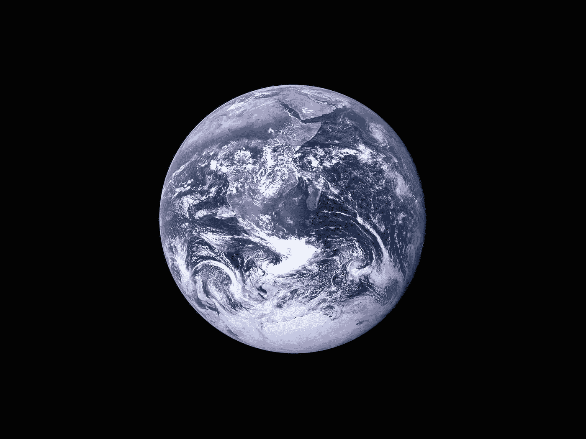

# 我们如何以及为什么成为产品人

> 原文：<https://medium.com/globant/how-and-why-we-become-product-people-87ee91bec256?source=collection_archive---------1----------------------->

Photo by [Jexo](https://unsplash.com/@jexo?utm_source=unsplash&utm_medium=referral&utm_content=creditCopyText) on [Unsplash](https://unsplash.com/s/photos/product-management?utm_source=unsplash&utm_medium=referral&utm_content=creditCopyText)

我首先要说的是，我作为产品经理的第一天是在不知道我是一个产品经理的情况下度过的。

我在一个面向项目的组织中工作，确信基于交付团队、垂直结构、一点点数据驱动和大量的 HiPPO ( *又名房间里收入最高的人*)的有组织的技术领域的成功。我担任过类似于我们今天所知的**产品负责人**或**副产品经理**的职位，是一个业务部门成员，不是公司的核心，但却是盈利和 EBITDA 的创造者。对我作为产品经理的职业生涯来说，没有什么是微不足道的。

我们已经处理了**各种结构性问题**，硬编码查询，等待登录页面的时间很长，不是很有用，代销商注册是 100%手动的，我们服务台的呼叫量随着员工人数的增加而增加，业务也在增长。此外，竞争对手提供的**解决方案**在**性能、功能和可扩展性**方面更胜一筹。

在与一名*技术负责人*、几名*开发人员*、一名*产品设计师*和一名 *QA* 一起工作了三四个月后，我们在凌晨四点将 **MVP** 投入生产。我很累，但很开心。第二天 CTO 告诉我，明显夸大其词，*“我恭喜你；我这辈子都没见过这样的队伍。”*

时间流逝，我们继续**进化那个产品**；我们建立了**满意度调查**，对内部和外部用户进行了**采访**，**测量了**一个分析工具的流量、浏览最多的页面、注册页面的跳出率。我们和*吉拉*一起工作，我们有我们的**冲刺**，我们做**回顾**，每天，在不超过 10 分钟的会议中，我们分享我们当天的目标。我们不知道我们在做产品管理，我们甚至不知道它是什么，我们也不知道像 T42、网飞、亚马逊这样的公司在几年前已经采用了这种方法。马蒂·卡甘对我们所有人来说都是陌生人，就像关注产品和欧洲工商管理学院一样。

两年后，公司决定聘请一家专门从事我们行业和电子商务的咨询公司。他们说的前两个字是:*“产品管理。”因此，在他们那里的一年半是我的产品 MBA。*

他们教会了我**战略**、**产品愿景**、敏捷和**自治团队**，以数据为基础做出决策，了解竞争和行业，非常了解自己的产品，组建可扩展的团队结构**，以客户为中心**，从解决方案中分离**问题，迭代、调查和**测量**，开发**学习**，改进和**我还学到了指导、领导和协作。他们给我提供了该学科的主要参考书目。当他们完成工作后，他们对我也很慷慨。我也是在不知情的情况下，开始了我作为*产品负责人的阶段。*

他们工作的一部分是雇佣一些人来领导这种转变，一些有经验的人和产品及其文化的伟大推动者。所以我认为他们选择了他们能选择的最好的人。

如果这些顾问是我的 MBA，那么与 Nacho Bassino 共事的这些年就是我的博士学位。我们共同帮助在 3 年内实现令人难以置信的转变。这篇文章的目的不是要谈论这个或者这个时候得到的结果；我一定会把它留给下一次。

**我们每天都影响着数百万用户的生活**；我们喜欢这一点，搜索数据来帮助我们**解决复杂的问题，学习、测试、衡量和改进**每天与团队和利益相关者合作，并与由*产品经理、产品设计师、敏捷教练、开发人员和布道者、朋友和畅销书作家*组成的社区联系。我们生活在一个复杂的世界，自 2020 年 3 月以来更是如此，但每天推出的产品的种类和质量让全球变得更加美好，令人难以置信。

Photo by [NASA](https://unsplash.com/@nasa?utm_source=unsplash&utm_medium=referral&utm_content=creditCopyText) on [Unsplash](https://unsplash.com/s/photos/earth?utm_source=unsplash&utm_medium=referral&utm_content=creditCopyText)