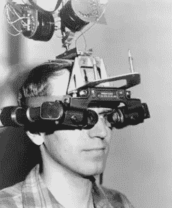
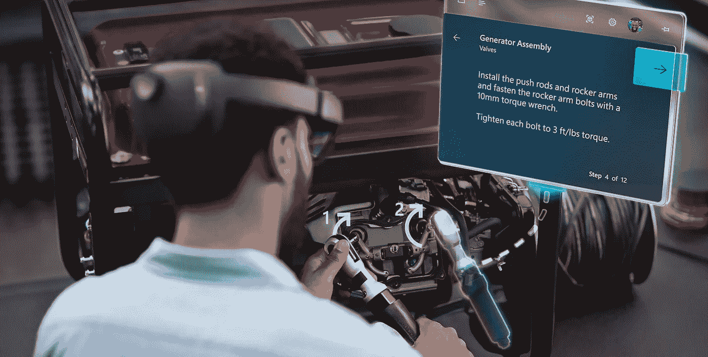
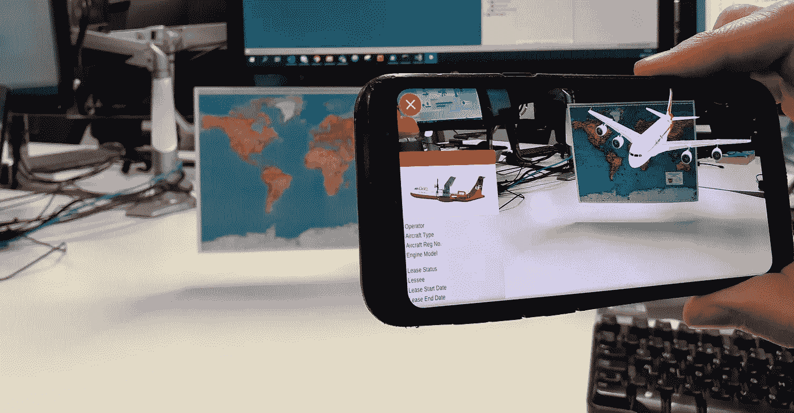

# 增强现实将如何塑造我们的日常生活

> 原文：<https://medium.com/version-1/how-augmented-reality-will-shape-our-everyday-life-714402187952?source=collection_archive---------2----------------------->

**我是都柏林的计算机科学毕业生，通过他们的** [**加速**](https://www.version1.com/careers/accelerate/) **计划于 2019 年加入了 Version 1。我目前是** [**创新实验室**](https://www.version1.com/innovation/) **团队的一员，从事大胆的前沿技术工作。这对于一个年轻的软件开发人员来说非常令人兴奋，因为它让我能够探索虚拟和增强现实等有趣的技术。对于这篇文章，我将重点关注增强现实(AR)。**

# 那么什么是增强现实呢？

AR 使用深度传感器、相机和运动传感器来创建叠加图像，从而实现交互式体验，其中真实世界通过计算机生成和叠加的对象和信息得到增强。这提供了观察周围世界的新方法，使您能够根据当前环境访问相关数据。

增强现实被认为是一种新的创新技术，但对增强现实的首次介绍始于 1968 年，当时一位哈佛大学的教授创造了一种名为达摩克利斯之剑的头戴式显示器。为了这种体验，用户的头被安全地固定在设备上&显示计算机生成的图形。这在当时是真正的创新！

The Sword of Damocles ([Source](https://commons.wikimedia.org/wiki/File:Headsight.jpg))

过去，AR 市场由谷歌眼镜、Magic Leap 和微软 HoloLens 等专注于商业的解决方案主导。2016 年，当任天堂发布应用程序 Pokemon Go 和普通消费者对该技术的看法被永远改变时，AR 在消费市场的受欢迎程度爆发了。

然而，作为版本 1 创新实验室的一员，我一直在探索这项技术如何为我们客户的业务增加价值。我的研究让我深入了解了 AR 世界，它带来的好处以及它将如何塑造我们的日常生活。

# 增强现实的好处和用途

不再只是在科幻电影中看到，AR 是由消费者和行业需求驱动的。这项新兴技术注定会极大地改变我们解决问题和与世界互动的方式。这包括制造、零售、电子商务、教育、医药、时尚、健康和美容、飞机和汽车修理和维护、远程协助、培训等等。举几个例子来说明这一点:

## 制造业

AR 旨在通过减少生产停工期、快速识别问题并保持所有服务和流程正常运行来保持高效运营。工程师可以看到螺栓、电缆、零件号的渲染图，以及如何组装、维修和检查特定组件的说明。最重要的是，在需要的时候可以召集专家，他们可以看到工程师通过全息透镜看到的东西，从而检查问题并提供帮助。

[Microsoft HoloLens](https://www.microsoft.com/en-us/hololens) in the Manufacturing Industry

## 员工培训

无论您是要使用新的软件系统、使用新的设备还是展示新的治疗方法，AR 体验都可以为员工提供更具互动性的学习体验。

如果你是一个新加入者，在短时间内有很多东西要学。你可能会得到关于系统、最佳实践和流程的厚厚的手册，让你跟上业务运作的速度。想象一下，给你一个应用程序来下载，并让这个资源随时可用，以身临其境的方式教你新工作。企业没有理由不自动化入职体验——既节省了时间，又节省了资金。

无论是行业还是工作，增强现实都可以帮助自动化员工培训，提高流程效率，从而降低成本。

## 消费者使用

我之前提到过 Pokemon Go，以及它如何在 2016 年改变了人们对 AR 的看法。开发人员意识到这种未来技术可以很容易地与日常生活相结合，这导致了 AR 应用程序的开发激增。这些很酷的创新应用程序被集成到日常使用中，大多数消费者甚至不会知道——例如，Snapchat 的面部过滤器都是由 AR 驱动的，但你的普通消费者可能不会意识到。

我偶然发现并期待使用的一个有趣的应用程序是 Neon AR。Neon AR 是一种使用地理定位实时找到朋友的新方法。用户互相添加，然后在走失的时候互相定位。请查看下面 Neon AR 的视频:

[Neon](https://www.neon.fyi/) AR in [action](https://twitter.com/neonapp?lang=en)

一款出色的轻量级应用程序，可以改变我们在迷路时找到人的方式——Neon AR 是 AR 如何整合和塑造我们日常生活的一个简单例子。

# 案例研究:福特

传统上，粘土模型用于帮助做出数以千计的关于福特汽车制造的设计决策。这些决策通常是在与工程和管理合作伙伴的密切合作下做出的。这是一个耗时且昂贵的过程。福特正在全公司范围内实施现代工作场所的数字化转型，以提高效率。设计将成为福特的重要差异化因素，微软 HoloLens 将是脱颖而出的关键。

[Microsoft HoloLens](https://www.microsoft.com/en-us/hololens) & [Ford](https://www.ford.ie/)

虽然在设计过程中仍将使用粘土模型，但在按比例制作粘土模型之前，可以尽早做出设计决定。通过 HoloLens，福特设计师将 3D 全息图与粘土模型和实物生产车辆进行数字混合。这使得设计师可以更快地进行实验，而不必用粘土实际构建每个设计原型，这可能会限制较长步骤的创造力。

> “微软 HoloLens 允许整个团队一起协作、分享和研究想法。这是令人兴奋的，因为它帮助我们的设计师和工程师有效地沟通，并通过混合虚拟和物理模型在过程中更早地预见未来。这为原型的创建和更改提供了极大的自由度和效率。”

这项新技术让福特可以更自由、更快速地进行创造和迭代。他们还设想了在车辆开发的多个领域使用 HoloLens 的潜力，包括早期产品创造、设计过程和设计的后期工程研究。

# 增强现实&创新实验室

创新实验室对前沿的、颠覆性的技术感兴趣，AR 就属于这一类。客户范围从电信到制药再到零售，创新实验室相信通过 AR 可以为我们客户的业务增加巨大的价值。

最近的一个例子是 [DAE Capital](https://www.version1.com/nw-dgt-inn-virtual-augmented-reality/#utm_source=linkedin&utm_medium=social&utm_campaign=nw-dgt-inn-virtual-augmented-reality) ，一家处于飞机租赁前沿的全球性企业。创新实验室与 DAE 合作，通过 AR 将他们的数据变为现实。

Planes augmented upon a physical map

虽然这只是一个例子，但它让我们深入了解了第 1 版&创新实验室将如何使用这项技术为他们的客户带来价值。

*创新实验室自 2018 年年中开始运营，有一个全职的专门团队探索前沿技术。我们已经提供了许多成功的 POV，并渴望与我们的客户合作，帮助他们探索可能会改变其业务的下一代技术。点击此处* *了解更多关于创新的信息。*