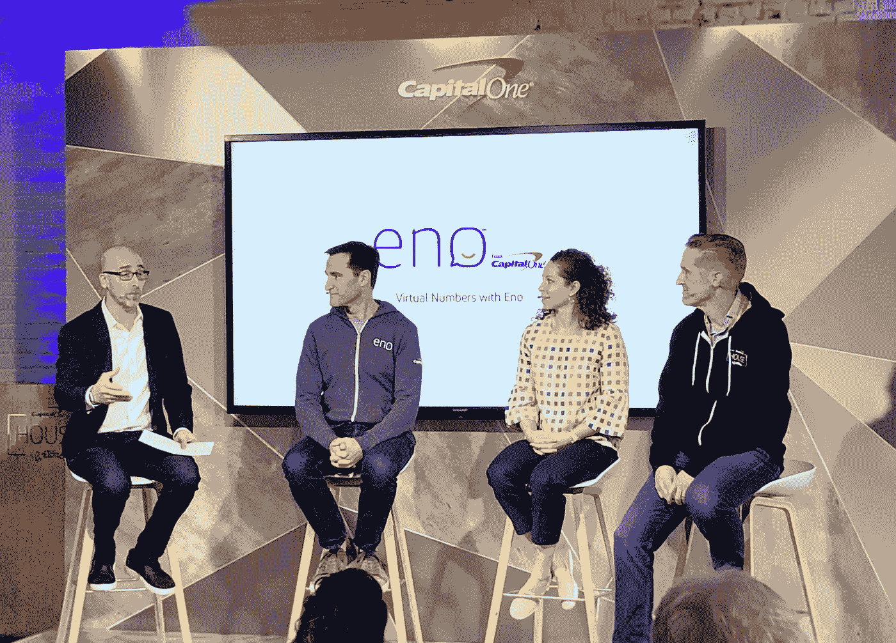

# Capital One 智能助手如何让网上购物变得更简单、更安全

> 原文：<https://medium.com/capital-one-tech/how-capital-ones-intelligent-assistant-is-making-online-shopping-easier-and-safer-5d7dbdefd603?source=collection_archive---------0----------------------->

*支付部高级副总裁 Tom Poole&数字身份，Capital One*

如今，消费者购物和支付的方式比以往任何时候都多，但随着网上购物越来越方便，也出现了如何最好地控制和保护您的在线财务信息的新问题。

当我们审视这一挑战时，我们发现我们的客户面临的一个紧迫问题是，当您的卡过期、丢失或被盗，或者在线受损时，会有一个巨大的“重置”时刻。当你被要求花几个小时来更新你的数字时，那就变成了这一时刻。你的信用卡当然有防欺诈保护，但处理“重置”时刻是一个巨大的麻烦。

如果你像我一样，你很难记住你在网上存储信用卡号码的所有地方——从亚马逊到网飞到 Spotify，再到去年你在寻找完美的情人节礼物时偶然发现的出售手工巧克力的小商家。很难掌控这一切。

事实上，在我们最近进行的一项消费者调查中，60%的美国人表示，他们不确定自己是否能识别在线存储信用卡信息的所有位置。除此之外，还要考虑安全问题——鉴于安全漏洞似乎永无止境，超过 80%的美国人表示担心自己在线保护信用卡信息的能力也就不足为奇了。

这些是压在我们身上的无声的焦虑，导致我们在网上购物时犹豫不决——你发现自己怀疑自己是否真的想在那个小商家网站上存储你的信用卡信息，你不太确定自己是否可以信任，并想知道那些手工巧克力是否真的值得冒你的卡详细信息落入坏人手中的风险。我们发现，我们的客户实际上将他们的购物导向了几个他们知道并已经信任的网站，他们实际上避免尝试新产品或服务。

> 超过 1/3 的受访消费者表示，他们在过去一年里曾在不完全信任的网站上用信用卡购物。对于千禧一代，这个数字甚至更高，超过一半的人说他们最近在一个他们不完全信任的网站上购物。

电子商务可以而且应该变得更容易、更安全。这就是我们本周在 SXSW 互动节上预览的最新数字产品创新背后的动力。我们预览了新功能，以帮助我们的客户更好地控制和安全地进行在线购物。

## **从 Eno 引入虚拟号码**

去年在 SXSW 上，我们宣布推出 Capital One 的智能助手 Eno。自去年以来，我们一直在以新的方式扩展 Eno 的功能，以改善我们客户的金融生活，今天，我们宣布 Eno 已经扩展了其功能，以帮助我们的客户改善他们的在线购物体验。

有了 Eno，Capital One 持卡人现在可以[在线购物，而无需使用他们的真实信用卡号码](https://www.capitalone.com/applications/eno/virtualnumbers/)——让客户能够更好地控制他们的信用卡信息存储在哪里，并在信用卡丢失或被盗时消除麻烦和人工操作。

## 它是如何工作的

Eno 可以立即为您的 Capital One 信用卡提供独一无二的商户专用虚拟卡号。您的虚拟卡号将被保存，以用于正在进行的和未来的支付，所有费用将像往常一样显示在您的账单上。

Eno 的单一事实来源是一个全面的控制面板，客户可以在其中查看和管理他们的整个虚拟号码组合，这使得了解和管理在线使用和存储卡的任何地方都变得很容易。

通过控制面板，您可以锁定和解锁特定商户的虚拟号码，而不会影响您的实际信用卡。

## 从 Eno 构建虚拟号码

将虚拟号码带入现实生活的最大技术挑战之一是在商家端实现无缝连接。电子商务网站通常有敏感的触发器，可以取消看起来不像来自真实的实体信用卡的交易。该团队必须绝对确保虚拟卡号无法从物理信用卡号中识别出来，至少在商家看来是如此。

对于零售商来说，改变他们的系统以适应一种完全不同的格式确实是一个挑战。我们知道，如果这将得到广泛采用，消费者必须能够使用它就像一个正常的号码。

测试之后，Eno 将扩展到其他平台，并添加更多功能，使您的在线购物更加轻松和安全，例如设置交易限额、特定商户卡的时间限制以及创建一次性使用的虚拟卡。

虚拟号码是 Eno 目前帮助 Capital One 客户的最新方式，可以随时随地满足他们的需求——在这种情况下，是在网上购物时。

所以，去买那些手工巧克力吧… Eno 会支持你的。

关于 Eno 虚拟号码的更多信息:[*【https://www.capitalone.com/applications/eno/virtualnumbers/】*](https://www.capitalone.com/applications/eno/virtualnumbers/)

*这些是作者的观点。除非本帖中另有说明，否则 Capital One 不属于所提及的任何公司，也不被其认可。使用或展示的所有商标和其他知识产权都是其各自所有者的所有权。本文为 2018 首都一。*